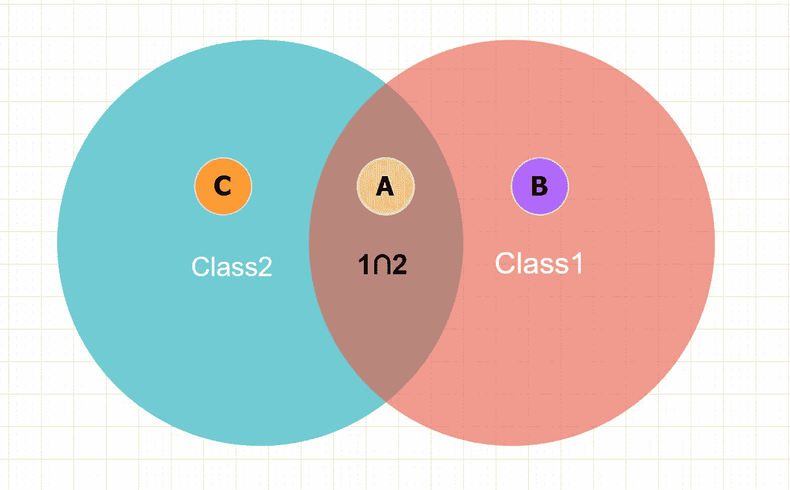
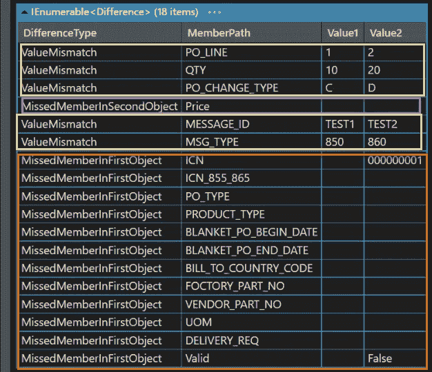

# 如何比较两个类对象？

> 原文：<https://medium.com/geekculture/how-to-compare-two-class-objects-843d63448bde?source=collection_archive---------35----------------------->

## 不仅仅是比较平等，还有不同的部分



我们所经历的用于比较两个对象是否相等的方法被用于覆盖“对象”。等于”。这样我们就可以简单的定义自己的逻辑来比较两个对象是否相等？

```
// SomeClass.cs
public class SomeClass{    
    public string PropertyName1 {get; set;}
    // ... public override bool Equals(object obj){
        var other = obj as SomeClass;
        if (other == null){
            return false;
        }if(PropertyName1 != other.PropertyName1){
            return false;
        }
        return true;
    } }// in some function or block
var class1 = new SomeClass {PropertyName1 = "Name1"};
var class2 = new SomeClass {PropertyName1 = "Name2"};// should return false
var requal = class1.Equals(class2);
```

这个故事我们会讲得更深入。我们想讨论如何比较两种不同类型的物体，并找出它们之间的区别。假设我们有下面的类:

```
public class *ClassBase* {
   public string **MESSAGE_ID** { get; set; } public string **MSG_TYPE** { get; set; } public string **PO_NO** { get; set; } public DateTime **CREATE_TIME** { get; set; }
}// we have class1 inherit ClassBase
public class *Class1* : ClassBase {
   public string **PO_LINE** { get; set; } public string **GPN** { get; set; } public string **QTY** { get; set; } public string **PO_CHANGE_TYPE** { get; set; } public string Price { get; set; }
}// we have class2 inherit ClassBase
public class *Class2* : ClassBase {
    public string ICN { get; set; } public string ICN_855_865 { get; set; } public string **PO_TYPE** { get; set; } public string PRODUCT_TYPE { get; set; } public string BLANKET_PO_BEGIN_DATE { get; set; } public string BLANKET_PO_END_DATE { get; set; } public string BILL_TO_COUNTRY_CODE { get; set; } public string **PO_CHANGE_TYPE** { get; set; } public string **PO_LINE** { get; set; } public string **GPN** { get; set; } public string FOCTORY_PART_NO { get; set; } public string VENDOR_PART_NO { get; set; } public string **QTY** { get; set; } public string UOM { get; set; } public string DELIVERY_REQ { get; set; } public bool Valid { get; set; }
}
```

> 我们将交集属性标记为**粗体**字体**。**

到目前为止，我们最关心的是那些交叉路口是相同的还是不同的？我们可以通过第三方库的以下示例代码简单地比较这两个实例:[对象比较器](https://github.com/ValeraT1982/ObjectsComparer)。

```
// declare and initial class1
var class1 = new Class1 () {
    PO_LINE = "1",
    MESSAGE_ID = "TEST1",
    PO_NO = "12345678",
    GPN = "ABC-123456",
    QTY = "10",
    PO_CHANGE_TYPE = "C",
    MSG_TYPE = "850"
};// declare and initial class2
var class2 = new Class2 () {
    PO_LINE = "2",
    MESSAGE_ID = "TEST2",
    PO_NO = "12345678",
    GPN = "ABC-123456",
    QTY = "20",
    PO_CHANGE_TYPE = "D",
    MSG_TYPE = "860",
    ICN = "000000001"
};// convert to expando object
var expandObj1 = JsonConvert.DeserializeObject<ExpandoObject> (JsonConvert.SerializeObject (class1));
var expandObj2 = JsonConvert.DeserializeObject<ExpandoObject> (JsonConvert.SerializeObject (class2));var comparer = new ObjectsComparer.Comparer (new ComparisonSettings {
    // null and empty error lists are equal
    EmptyAndNullEnumerablesEqual = true
});IEnumerable<Difference> differences;// compare and find the differences
var equal = comparer.Compare (expandObj1, expandObj2, out differences);
```

结果如下所示:



Result of Difference

```
Difference Result
------------------------------------------
🗝️ Intersection but value not consistency -> (A) [Yellow Block]
🗝️ Member(s) only in class1 -> (B) [Purple Block]
🗝️ Member(s) only in class2 -> (C) [Orange Block]
```

> 这里的关键点是，我们将这两个对象转换成“ExpandoObject ”,这样库将为我们处理剩下的比较过程。

# 参考

*   [https://github.com/ValeraT1982/ObjectsComparer](https://github.com/ValeraT1982/ObjectsComparer)
*   [https://docs . Microsoft . com/en-us/dot net/API/system . dynamic . expand object？view=net-5.0](https://docs.microsoft.com/en-us/dotnet/api/system.dynamic.expandoobject?view=net-5.0)
*   [https://grant winney . com/how-to-compare-two-objects-testing-for-equality-in-c/](https://grantwinney.com/how-to-compare-two-objects-testing-for-equality-in-c/)