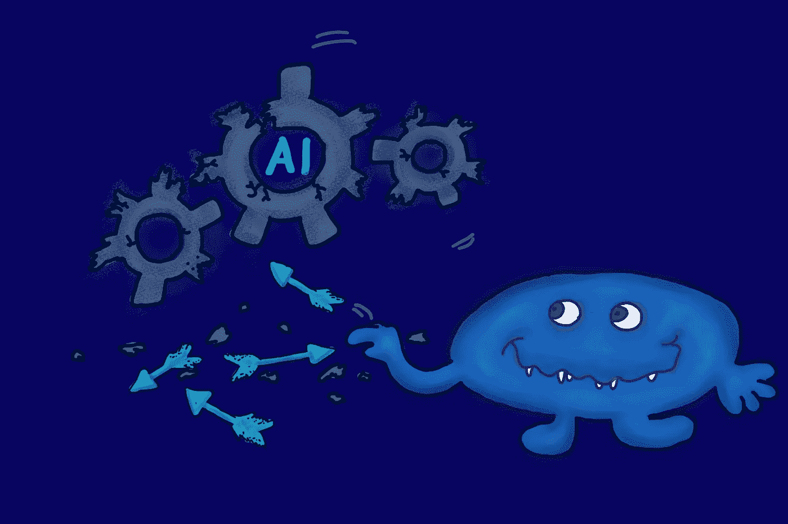

# 如何彻底搞乱你的机器学习模型

> 原文：<https://medium.com/geekculture/how-to-completely-mess-up-your-machine-learning-model-996fcc8ad56f?source=collection_archive---------11----------------------->

## 特征冲突！数据中毒！后门攻击！还有更多…

AI can be broken, if you know how to do it.

近年来，人工智能系统变得如此复杂，以至于越来越难获得对它们弱点的概述。

但是这样的概述是必要的。