# 如何从博彩公司的赔率计算足球隐含概率

> 原文：<https://medium.com/geekculture/how-to-compute-football-implied-probabilities-from-bookmakers-odds-bbb33ccf7c1d?source=collection_archive---------1----------------------->

## 分析变得简单

## 比较评论

# 介绍

当我们对赌博感兴趣时，总会有处理概率的时候。这些概率可以从使用数据分析的数学模型中推导出来，或者我们可以直接从博彩公司的赔率中推断出来。今天我们正在对后者进行研究。

# 奇怪市场的动态

让我们退一步回到基础。赔率反映了投注者对一项赛事可能愿意下注的价格。由于股票市场，这个价格主要是由供求关系决定的。当他们在一个事件上有足够的赌注(即流动性)时，我们可以假设赔率包含了使价格公平的所有可用信息(受伤的球员、天气、球队形式等等)。

在市场价格之上，还有庄家的利润。没有保证金，赌博将是一场零和游戏，**输家向赢家付钱，**钱从一个口袋流到另一个口袋。但这个理想世界并不存在，博彩公司从中分一杯羹**。**因此**赔率实际上是市场公平价格减去庄家保证金**。

## 庄家均衡

为了理解这一点，让我们用一个简单的例子:扔一枚公平的硬币。这个实验有两个结果，尾巴或头。得到其中一个的几率是 50%，**这是事件**的真实概率。作为博彩公司，公平的赔率是多少？如果没有边距，答案是 2。事实上，如果你重复玩这个游戏，从长远来看，玩家和庄家都不会赚钱。

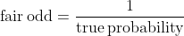

the fair odd equation

> 公平赔率是指没有一个参与者能长期赚钱的赔率。投资的钱被重新分配，输家付钱给赢家。

不幸的是，**真实的概率往往是未知的，必须估计**。这可以通过数学模型来实现，也可以通过引用市场来实现。让我们解释一下。

理论上，博彩公司总是要调整赔率，让输家付钱给赢家。**每种可能结果的下注金额必须相同**。这是博彩公司玩的一种称体重的游戏，赔率起着重量的作用。如果一个奇数是有吸引力的，更多的钱将会在它上面流动，反之亦然。

假设庄家不知道硬币概率是 50%，他开始引用头部 5 和尾部 1.25，没有保证金。作为一个赌客，如果你知道真实的概率(和公平的赔率)，你会赌正面，没有人会赌反面。

现在博彩公司面临一个问题。如果结果是正面，他将不得不从他的扑克中支付，因为没有人在尾部下注。为了避免这种情况，博彩公司需要改变赔率。

庄家要让尾巴更吸引人。例如头部为 1.33，尾部为 3。现在，下注者将继续跟进，庄家将再次调整。最终，**博彩公司的赔率将收敛到公平的赔率******2**，因为投注者因为知道真实概率而增加了更多信息。**

> **在体育博彩市场，没有人知道真实的概率，所以赔率是不断变化的。**

## **人群效应**

**现在我们明白了为什么庄家在调整报价，让我们再举一个硬币的例子。假设博彩公司知道两个事件的真实概率并报价 2。出于某种原因，赌客喜欢正面，2/3 的人赌正面，1/3 的人赌反面。博彩公司仍然需要调整，并将相应地改变赔率。最终，头部的赔率会收敛到 1.5，尾部的赔率会收敛到 3。使用公平奇数公式，我们获得了头部 66%的机会和尾部 33%的机会，与真实概率相差甚远。**

> **当市场具有流动性时，赔率并不反映真实的概率，但它们反映了在每种可能结果上下赌注的人的比例。通常，这些比例是真实事件概率的一个很好的估计。**

## ****余量调整****

**我们说过赌博是一个零和游戏，但这不是真的。博彩公司收取保证金，赌客毕竟在使用他们的服务。对他们来说最简单的方法就是稍微改变一下赔率。**

**回到硬币的例子，博彩公司可能会报头部 1.95 和尾部 1.95，略低于公平赔率。在这种情况下，输家仍然支付赢家，但略少于他们应该支付的，差额进入庄家的口袋。庄家也可以不同地调整他的保证金。因此，他可以对头部报 2 英镑，对尾部报 1.95 英镑，只要两边下注的比例相同，他仍然可以赚钱。**

> **保证金是不固定的，只有庄家知道什么是保证金的每一方的事件。**

## ****风险调整****

****保证金也代表博彩公司在赛事中面临的不确定性(风险)。如果没有足够的投注者(没有流动性)，博彩公司倾向于增加他们的保证金。如果所有的投注者都押在头上，无论博彩公司在尾上提供的赔率是多少，博彩公司都有损失很多钱的风险。早期投注者的赔率将为 2，而人群效应将使其最终收敛到 1。****

**为了弥补这一风险，博彩公司可以在赛事开始前以折扣价回购赔率。例如，任何买了 2 的赔率的投注者将被提供 1.5 的回购。在这种情况下，庄家将节省 0.5 英镑。[这就是 2016 年发生的事情，**莱切斯特**](https://www.independent.co.uk/sport/football/premier-league/leicester-win-premier-league-odds-bookmakers-lose-over-ps25m-lucky-punters-bag-ps100-000-pay-out-a7010726.html) 赢得了英国锦标赛。**

## **为什么博彩公司没有相同的赔率？**

**这是一个现在要回答的简单问题。每个博彩公司对每个事件的结果都有不同的赌注，并有不同的保证金。因此，几率是不同的。但是在每个人都可以接触到任何博彩公司的情况下，差异将会消失，因为投注者总是追求最高的赔率。赔率最高的博彩公司将不得不调整，他们之间的赔率最终将变得相似。**

# ****隐含的概率是什么？****

**到目前为止，我们已经看到了事件的真实概率如何与赔率相关联，以及赔率为什么会变化。理解隐含概率不同于真实概率是很重要的。隐含概率是市场认为真实概率是什么，所以**是对真实概率**的估计。**

**隐含概率来源于给定差额的赔率。具体来说，我们有**

**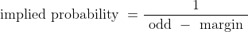**

**the implied probability equation**

> **由于保证金和流动性因庄家而异，隐含概率也是如此。谈论特定博彩公司隐含的概率而不是作为一个一般概念是有意义的**

**但这并不是那么容易找到的。实际上，裕量是未知的，并且对于每个结果可能是不同的，正如我们在尾数示例中所看到的。只有庄家知道其隐含的概率，因为他可以删除其保证金。**

**对于我们其他人来说，我们只需要确保**所有可能结果的隐含概率之和是 1。**问题是有一千种方法可以做到这一点，比如对赌注下在哪里或利润如何在结果中分配做出不同的假设。在下文中，我们将介绍四种计算隐含概率的方法。**

## **乘法方法**

**乘法可能是最广为人知和最简单的方法。奇数的倒数被所有倒数的和简单地重新调整**

**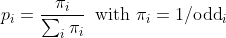**

**the multiplicative method**

## **加法方法**

**加法只是从每个反奇数中去掉相同的比例。这也很容易计算，但可能是错误的，因为很少有机会两个结果之间的差额相等**

**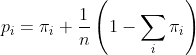**

**the additive method**

## **幂法**

**功效法使用功效系数来计算隐含概率**

**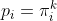**

**the power method**

**常数`k`是使用迭代方法找到的，例如隐含概率之和等于 1。**

## ****胫法****

**胫法不太流行，也更复杂。这也是一种基于校正项`*z*` 的迭代方法，该校正项对应于知情下注者的比例。**

**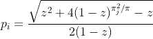**

**the Shin method**

**计算每种方法的代码可在 [Github](https://github.com/octosport/octopy) 上获得，计算器可在[这里](https://www.octosport.io/implied-probability)获得。**

# **基于真实数据的方法比较**

**本节使用从多个联赛中的几家博彩公司收集的 1x2 赔率来比较这四种方法。对于每组概率，我们将运行四种方法来寻找隐含的概率。**

****对数损失(ℓ)** 将测量概率的质量。越接近零越好。给定主场获胜、客场获胜、平局和比赛结果的隐含概率，给定比赛的对数损失由以下公式给出:**

**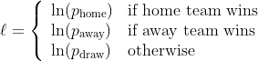**

**我们计算每种方法的平均对数损失，以确定哪种方法是最好的。**

## **数据**

**用于比较的数据相当简单。我们从 7 家博彩公司收集了赔率，自 2018 年 1 月 1 日以来，我们在 900 多场比赛中拥有最多的数据。博彩公司是 10Bet，1xbet，Betfair，Pinnacle，TitanBet，WilliamHill 和 Bet365。只有比赛开始前至少 45 分钟的赔率被保留，我们已经过滤了坏的数据点。我们只保存有每个博彩公司赔率数据的比赛。最后，我们的数据集中有 63861 组赔率平均分布在博彩公司之间。该数据集可应要求提供。**

## **总体结果**

**首先，让我们展示每种方法的平均日志丢失的总表。**

**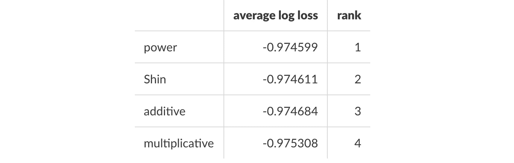**

**Ranking of the four methods**

**我们观察到这些方法彼此之间没有显著的不同。没有统计上的重大差异，但平均来说，乘法似乎是最不可预测的。**

**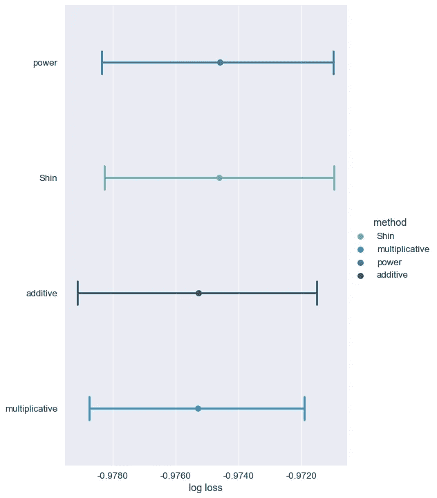**

**95% confidence interval for each method**

> **Clarke 等人(2017)发现乘法方法对其他运动的预测性也较低。**

**在预测能力方面，Shin 和 power 方法非常接近。**

## **每个书签的结果**

**查看结果的另一种方法是平均每个庄家的损失。我们有大约 10000 个匹配的庄家，所以我们可以比较他们。下表显示了结果**

**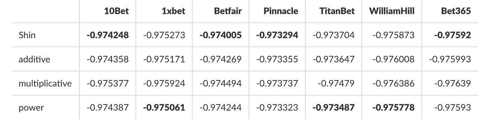**

**Best method per bookmaker**

**我们再次观察到，Shin 和 power 方法根据博彩公司给出了最佳结果:10Bet、Betfair、Pinnacle 和 bet365 使用 Shin 方法具有最佳预测结果，而 power 方法对于 1xbet、TitanBet 和 WilliamHill 具有最佳结果。**

> **结果表明，隐含的奇数方法是不同的，从一个博彩公司到另一个，这往往支持博彩公司的赔率是由不同的保证金和人群效应驱动的。**

## **每个最大奇数的结果**

**当比赛中没有明确的热门时，赔率往往更加均匀。在这些情况下，我们希望每种方法都能给出相似的结果。看看每场比赛的最大赔率就很容易看出是否有明确的最爱。为了看它是否对方法的选择有影响，我们进行了下面的实验。对于每场比赛，我们选择最大赔率。然后，我们根据 25%、50%和 75%的分位数分成 4 组。例如，第一个分位数包含最大奇数在范围 0(包括 3.45)内的所有匹配。对于每个组，我们计算日志损失的平均值，结果显示在下表中**

**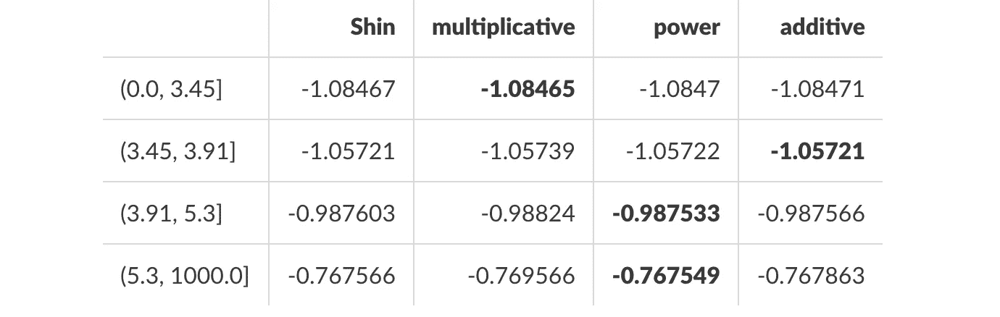**

**Best method per max odd quantile**

**当一场比赛的最大赔率低于 3.45(没有明显的最爱)时，所有方法都是等效的。使用像幂法或 Shin 法这样的迭代方法没有好处。每种结果的利润似乎是平均分配的。**

**在最后一个分位数，当赔率高于 5.3 时，使用幂或 Shin 方法比其他两种方法有优势，因为预测能力增加了近 1.5%。这似乎是合乎逻辑的，利润率将较低的最爱。事实上，假设最喜欢的赔率接近 1，差额可能接近 0，乘法和加法都是错误的。**

# **结论**

**理解报价市场是如何为体育运动服务的，对于运用数学分析是至关重要的。本文提出了四种从三种市场赔率推导隐含概率的方法。**

**实证分析表明，Shin 和 power 方法提供了最好的预测能力。根据庄家的不同，一种方法可能比另一种更好，但总的来说，乘法似乎是预测性较低的方法。**

**然而，即使我们的结果与 Clarke 等人(2017 年)的结果一致，也没有统计证据表明一种方法给出了最好的结果。可以探索其他市场，特别是那些有多种结果的市场，如比赛分数，但我们让另一篇文章来讨论。**

**每种方法都有一个计算器[在这里](https://www.octosport.io/implied-probability)。**

**[1] S. Clarke，S. Kovalchik 和 M. Ingram (2017)，调整博彩公司的赔率以允许过度投机，美国体育科学杂志 5(6):45。**