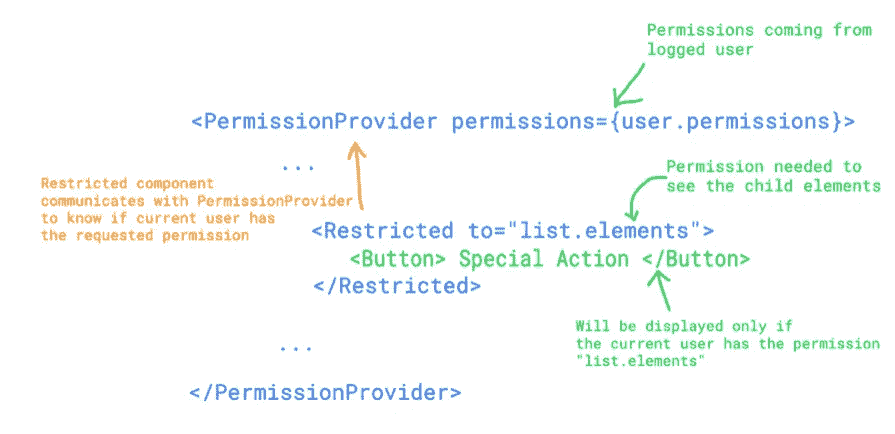
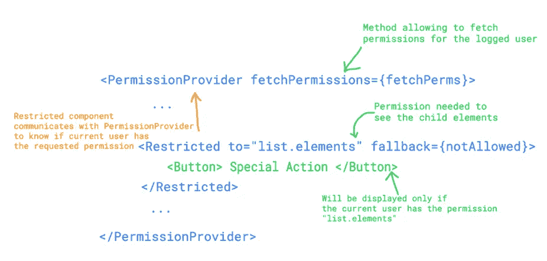

# 如何基于用户权限有条件地呈现 React UI

> 原文：<https://medium.com/geekculture/how-to-conditionally-render-react-ui-based-on-user-permissions-7b9a1c73ffe2?source=collection_archive---------1----------------------->

由于现代浏览器的强大功能，Web 应用程序变得越来越复杂。随着越来越多的应用出现了对用户进行认证和细分的需求。

事实上，不同的用户对应用程序有不同的权限，允许他们根据自己的配置文件/角色执行不同的操作。

在这篇文章中，我们将学习如何组织权限，以及如何根据当前用户的权限显示应用程序的一部分。

# TL；DR；

如果你是那种演示代码类型的开发人员，你可以在这里找到最终代码:[https://github.com/francois-roget/permission-provider-demo](https://github.com/francois-roget/permission-provider-demo)

# 这不是安全！

首先，我想强调的是，这种机制并不是为了阻止对服务器的未授权请求。更多的是用户体验的提升。

我们必须记住，浏览器上运行的任何 Javascript 代码都是本地的，最终用户完全可以读取。使用这种技术隐藏按钮或屏幕不会阻止任何人查看代码并发现 API 端点或应用程序的内部逻辑。

在采取任何行动之前，应该在服务器端检查对 API 的所有调用是否得到用户的许可。

# 如何组织您的权限

处理用户权限的更简单/诱人的方法是检查，例如，当前用户是否是“admin”。基于此，应用程序的不同部分将被允许或不被允许。

这样做将很快阻止您，因为新的请求肯定会到达，以改变(非)管理员用户可以看到的内容，或者创建另一种类型的用户，该用户可以比简单用户做得更多，但比管理员少。

处理权限的最佳方式是为应用程序中允许或限制的每个粒度操作创建一个权限。例如，您可以为以下各项定义单独的权限:

*   查看元素列表( *element.list*
*   添加一个元素( *element.add*
*   修改元素( *element.edit* )
*   移除元素( *element.delete* )

想法是将这些权限聚合到角色中，在角色中定义分配给该角色的用户可以做什么。例如，创建一个拥有所有权限的角色“admin”将是一个很好的起点。然后，您可以创建一个只有 *element.list* 权限的角色“查看者”和一个有 *element.list* 和 *element.add* 权限的角色“贡献者”。

*github 链接中的代码示例采用了一种更简单的方法，直接向用户分配个人权限。在您的实际应用程序中，请考虑将他们按角色分组。*

# 简单的用例

让我们想象一个简单的 CRUD 用例，其中登录的用户根据他们的角色有不同的可用操作:

*   查看者角色只能列出项目
*   参与者角色可以列出项目并添加新项目
*   管理员角色可以执行所有操作(列出项目、添加项目和删除项目)

# 最小可行产品

现在，让我们看看为了获得所需的特性，我们需要实现的最少代码。

首先，我们将使用 React 的上下文 API。该 api 允许开发人员创建由两个元素组成的上下文:

*   将保存数据的提供者
*   将使用提供者提供的数据的消费者

在这种情况下，在提供者和使用者之间传递的数据是一种允许使用者知道特定权限是否被授予当前用户的方法。

接下来，我们应该实现 PermissionProvider，它将保存检查用户权限的逻辑。这个 PermissionProvider 将接收用户的权限作为道具，并提供方法 *isAllowedTo* 的实现。

我们需要的最后一个组件是一个消费者，在我们的应用程序中，在我们需要有条件地呈现部分 UI 的每个地方使用。

使用这些组件，我们可以用 PermissionProvider 包围我们的应用程序，然后使用受限组件。

这允许只向具有正确权限的用户显示操作按钮。

# 提高

## 后备渲染器

为了给开发人员和 UI 设计人员提供更大的灵活性，如果用户没有特定的权限，可以显示一个替代的 UI 就太好了。为此，将向限制组件添加一个回退属性。

## 自定义挂钩

创建自定义挂钩将允许在更复杂的情况下使用权限。当我们需要一个基于用户许可的定制逻辑(不仅仅是渲染)时，这是很有用的。

这个自定义挂钩现在可以用在受限组件中。

# 更进一步

现在让我们考虑一个更复杂(真实世界)的用例，其中用户有很多权限，这些权限在登录时无法获取，或者权限只能通过域区域获取。

在这种情况下，权限获取和检查机制是异步的。供应商和消费者都必须考虑这种延迟。

为了使它异步，我们需要更新提供者以从 isAllowedTo 方法返回一个承诺。在异步权限获取的情况下，PermissionProvider 现在接收“获取权限的异步方法”而不是“权限列表”。

同时，可以在 PermissionProvider 级别缓存请求的权限，以加快 UI 的速度。

自定义挂钩得到更新

最后，消费者应该等待承诺的完成。问题是“获取权限时应该显示什么？”。消费者可以不呈现任何内容，也可以将加载组件作为参数传递。

# 就是这样，伙计们

我真的希望这篇文章能帮助你设计更友好的用户界面。你可以在这里找到所有的代码:[https://github.com/francois-roget/permission-provider-demo](https://github.com/francois-roget/permission-provider-demo)(看看不同阶段的标签)。