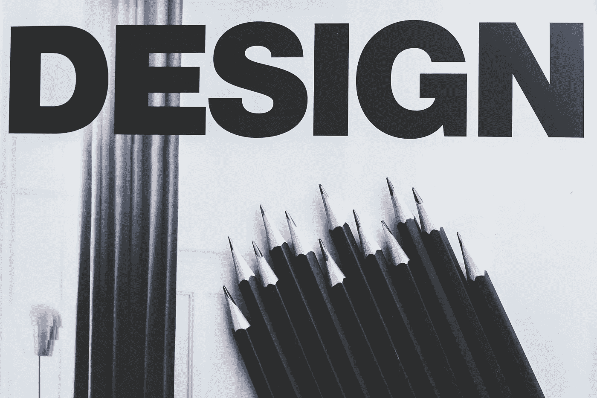

# 如何进行 UX 再设计？

> 原文：<https://medium.com/geekculture/how-to-conduct-ux-redesign-f1345cf6cacd?source=collection_archive---------10----------------------->

# 什么是 UX 重新设计？

在过去的几十年里，UX 设计的重要性大大增加了。每个组织都愿意花费合理的预算来改善产品的体验。结果是提高了用户满意度，增加了组织的收入。

用户体验的另一个方面是根据需要重新设计。如果你的产品在市场上表现良好，这并不意味着它将多年保持领先地位。事物瞬息万变，用户的需求也是如此。

随着用户界面、UX 以及技术的最新趋势，让你的产品保持最新是很重要的。为此，产品体验的重新设计是你应该考虑的一个重要因素。

UX 的重新设计包括在体验、视觉界面和功能集方面重新设计你的产品。UX 的重新设计有助于以不同的方式改善您的产品体验。它可以帮助增强客户体验，提高您的销售额，丰富您的产品功能集，增加新的用户角色，等等。

# 为什么需要重新设计 UX？

如果您的产品或业务符合以下任何条件，UX 就需要重新设计。

*   您的产品正在使用过时的用户界面/UX 趋势
*   分析显示产品使用量减少
*   用户体验和用户流量中的明显缺陷
*   收到用户的投诉
*   整合新的角色和他们的需求
*   为手机等附加设备设计
*   该公司更新了其品牌
*   你正在使用的技术已经过时了

如果在你的产品中发现了上述任何原因，那么是时候进行重新设计了。

# 如何进行 UX 再设计？

要进行 UX 的重新设计，你需要遵循一个流程，就像第一次设计产品时遵循的 [UX 设计流程](https://uxdworld.com/2019/04/23/user-experience-design-process/)。下面给出的步骤将帮助您完成一系列步骤，以进行成功且有利可图的重新设计。

## 1.找到你的目标

> "认识到需求是设计的首要条件."查尔斯·伊姆斯

第一步是决定你想从 UX 的重新设计中实现的目标。这将有助于您遵循流程中的正确步骤。UX 的重新设计可以实现不同的目标。

**修复 UX 问题:**你将修复 UX 的问题，这些问题要么是 UX 团队内部观察到的，要么是用户发现的。

**发展业务:**您希望通过产品添加更多功能和覆盖更多用户资料来丰富体验。

## 2.进行可用性测试

在进行实际的重新设计之前，测试现有的产品是必不可少的一步。这一步包括会见你的用户，和他们交谈，观察他们，和他们一起进行可用性测试。

决定你需要和你的用户一起测试的特性。这可以是整个产品，也可以是几个功能，取决于重新设计的目标。定义将要测试的任务，并在适当的环境中进行练习，包括一组合适的用户、必需的任务列表、必要的设备，如计算机、手机等。

观察用户，采访他们，并在测试过程中记下你的观察。以报告的形式收集这些数据，这将有助于您在流程中向前推进。记住，

> "基于数据的设计决策永远不会受到质疑."~萨迪亚·米哈斯

## 3.确定需要改进的地方

与所有利益相关者讨论和分析可用性测试中确定的结果，并确定需要改进的地方。由于您的产品已经在市场上使用，因此需要注意的是，您还可能通过网站和社交媒体渠道等其他渠道获得反馈。

仔细收集所有渠道的数据，并审查分析结果。这允许您基于真实数据决定重新设计过程中的下一步，从而帮助您解决用户的实际痛点。

讨论收集到的反馈的每一部分，并对 UX 重新设计过程中您要关注的领域进行优先排序。这实际上定义了重新设计的范围。

> "设计不是艺术，它是关于为现实问题精心设计解决方案."~马克·博尔顿

## 4.执行竞争分析

重新设计的一个关键步骤是对其他产品进行竞争分析。因为你的用户会分析你的产品，并在你的竞争对手中选择你，所以关注市场上其他类似的产品是很重要的。

浏览相似的特性，看看执行某项任务所遵循的标准是什么，提供某种体验的趋势是什么，以及实际上是什么使产品成功。

对市场和趋势的敏锐观察将帮助你找到自己的位置，从而决定你应该遵循的行为，以提高你在市场中的地位。

## 5.重新设计和测试

在达到这一步之前，你必须非常清楚 UX 重新设计的目标。您已经有了数据和确定的改进，是时候开始实际的重新设计了。

你需要遵循标准的设计流程来勾画你的想法，设计原型，获得用户反馈，并根据用户反馈做出设计决策。

使用敏捷方法来重新设计体验，并从一开始就让用户参与进来，以获得他们的反馈。不要在没有用户参与的情况下做出设计决定，因为这可能会导致你的设计在后期需要改变，这需要额外的努力和金钱。

> “当有人在没有与客户联系的情况下做出设计决策时，我会感到非常不舒服。”—丹·里曾泰勒

# 结论

UX 重新设计需要对流程进行适当的规划和实施。要进行成功的重新设计，需要考虑以下几点。

*   清楚地了解重新设计的目标，只有这样你才会达到预期的效果。
*   了解现有的产品和用户。找出重新设计时需要重点关注的痛点。
*   分析竞争产品和市场趋势，从中学习，让自己在竞争中立于不败之地。
*   遵循设计流程，让用户参与流程的所有阶段，以获得早期反馈，并在发布前重申设计。

# 学习 UX 设计

为了促进 UX 设计的学习，我们为您提供 **3 个月的免费会员资格**从交互设计基金会学习 UX 设计。点击下面的链接。

 [## 加入我们学习 UX 设计的 8 个理由

### 当你想学习和提升你的职业生涯时，你不应该在你的设计教育上冒任何风险。你的课程…

www.interaction-design.org](https://www.interaction-design.org/why-join-us?ep=saadia-minhas-2) 

# 阅读更多

*   [UX 可交付成果的最佳实践](https://medium.muz.li/best-practices-for-ux-deliverables-user-personas-user-flows-wireframes-and-prototypes-part-i-918dae65d1b9)
*   [三次点击规则和可用性](/usabilitygeek/3-click-rule-and-usability-e3c123e7e7d4)
*   [如何衡量你的 UX 设计技能？](https://medium.muz.li/how-to-measure-your-ux-design-skills-d77482939ead)
*   [UX 设计师的 8 个有用面试技巧](https://uxplanet.org/8-useful-interview-tips-for-ux-designers-b6d7d7d3636d)
*   [设计即沟通](https://blog.usejournal.com/design-is-communication-c36abd005804)

感谢阅读。

[**在**](https://uxdworld.com/subscribe/) **[**UX 世界**](https://uxdworld.com/subscribe/) 订阅** 更多相关文章。

如有任何问题，联系这里:[脸书](https://www.facebook.com/uxdesignworld/) | [YouTube](https://www.youtube.com/c/uxworld?sub_confirmation=1) | [推特](https://twitter.com/uxdesignworld)|[insta gram](https://www.instagram.com/uxdworld/)|[Linkedin](https://www.linkedin.com/company/uxdesignworld)