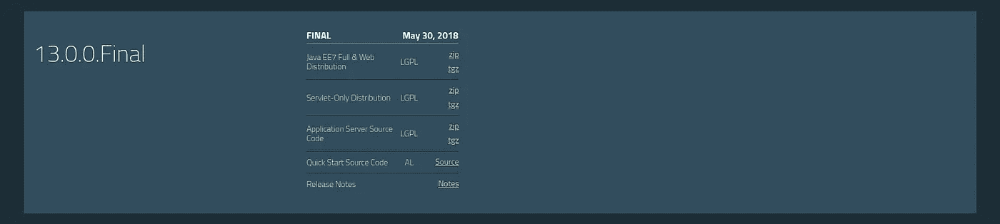
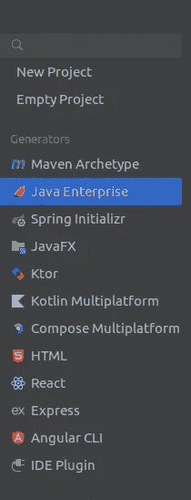
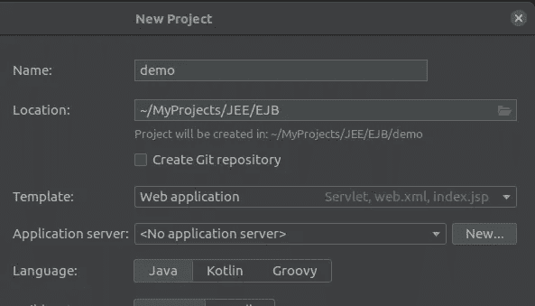
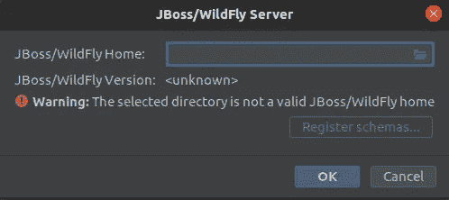
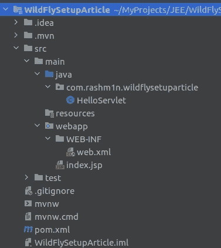
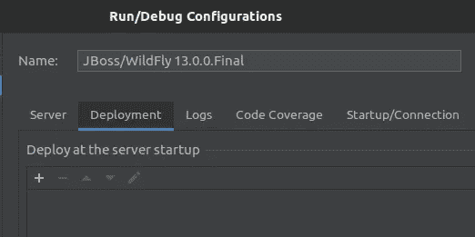
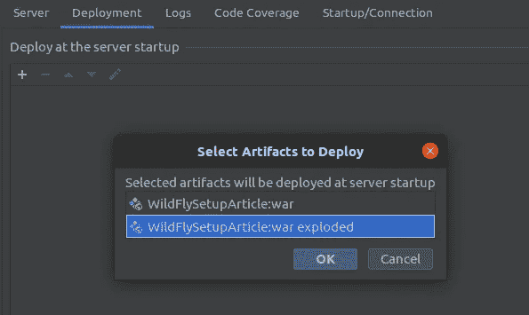

# 如何在 IntelliJ IDEA 中使用 Wildfly 应用服务器配置和部署 WebApps

> 原文：<https://medium.com/geekculture/how-to-configure-and-deploy-webapps-with-wildfly-application-server-in-intellij-idea-f104a6c2a0db?source=collection_archive---------0----------------------->


Photo by [Frame Harirak](https://unsplash.com/@framemily?utm_source=medium&utm_medium=referral) on [Unsplash](https://unsplash.com?utm_source=medium&utm_medium=referral)

在这篇短文中，我将讨论如何用 Intellij 思想下载和设置 Wildfly 应用服务器。请注意，你将需要这个的最终版本。

首先让我们通过其 [***网站***](https://www.wildfly.org/downloads/) 下载野花分布图。你可以下载任何你喜欢的版本，只要它支持你的 JDK 版本。我将在这里使用良好的旧 JDK 8，所以我会下载野火 13.0 最终压缩。



WildFly Website

下载后，将其提取到您的首选位置，并将完整路径复制到提取的文件夹。所以你的文件夹结构可能是这样的，

```
home/<user>/<location>/wildfly-13.0.0.Final
```

之后，打开 intelliJ IDEA Ultimate 并创建一个新项目，选择 **Java Enterprise。**



New Project -> Java Enterprise

在右侧窗格中，输入您的首选组、工件 id 和位置。为了方便起见，我将选择内置的模板 Web 应用程序作为模板。

在应用服务器菜单项中。选择新建，然后选择 JBOSS/Wildfly 服务器。



New Project -> Java Enterprise

并在下一个窗口中粘贴您的提取路径，intelliJ 将自动识别 Wildfly 版本。



JBOSS/Wildfly Server

然后单击下一步并创建。之后，您的新应用程序将启动并开始索引，这将需要几分钟时间。

因为您选择了一个模板，所以将会有一个 Hello World Servlet 应用程序样例，它将适合于演示这一点。



Generated Project Structure

然后点击运行->编辑配置，并从左侧窗格中选择 JBOS/Wildfly X.0.0 Final。


Run -> Edit Configurations

在这里，我将保留第一个选项卡上的默认设置，并导航到 Deployment 选项卡。



Deployment Tab

从菜单中单击加号并选择工件-> XXX:警告爆炸。



Selecting Artifact

然后单击确定并退出窗口。现在，您可以在 intelliJ 上运行您的示例 web 应用程序了。

为此，单击 Run-> Run JBOSS/wild fly xx . 0 . 0 . 0 Final，它将启动应用服务器，编译并构建您的应用程序，并在启动的应用服务器上部署生成的 WAR 文件！可以导航到 [http://localhost:8080/ <应用名称> /](http://localhost:8080/WildFlySetupArticle-1.0-SNAPSHOT/) 目录查看结果！

如此简单，您已经创建了一个新的应用服务器并将其绑定到 intelliJ IDEA Ultimate，现在可以轻松部署更复杂的企业 Java 应用程序了！

快乐编码，希望这篇文章对你有所帮助。如果您想了解更多关于 Java/Java EE 和 Web 应用程序开发的信息，请提供关注。

干杯！

[](https://www.linkedin.com/in/rashmin95/) [## Ravindu Rashmin -软件工程师- WSO2 | LinkedIn

### 在世界上最大的职业社区 LinkedIn 上查看 Ravindu Rashmin 的个人资料。Ravindu 列出了 7 个工作…

www.linkedin.com](https://www.linkedin.com/in/rashmin95/)