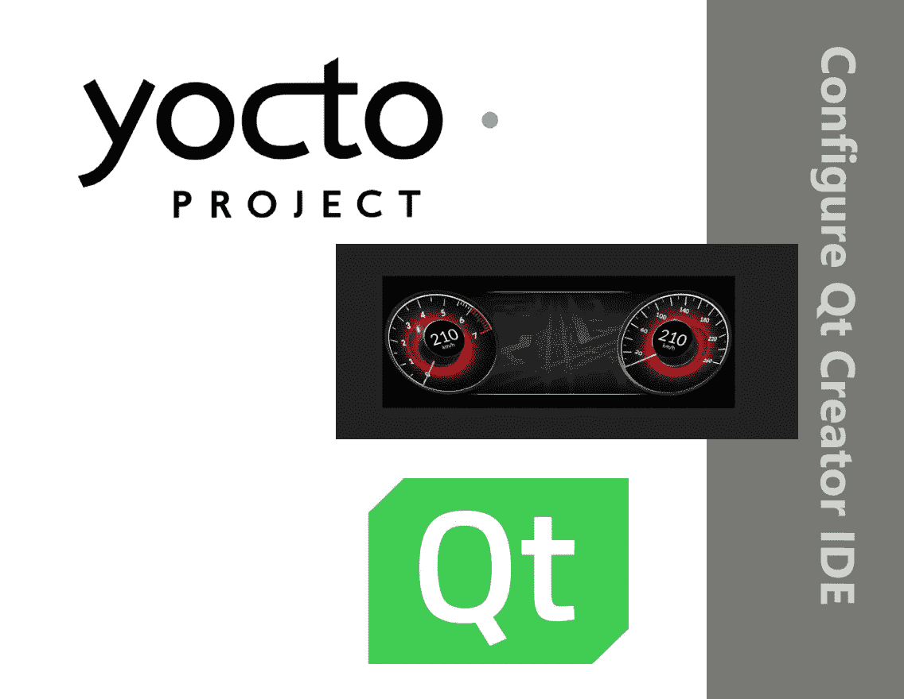

# 如何配置 Qt Creator 来构建您的应用程序并将其传输到运行嵌入式 Linux 发行版的嵌入式设备上

> 原文：<https://medium.com/geekculture/how-to-configure-qt-creator-to-build-and-transfer-your-application-to-the-embedded-device-running-4a1469495a20?source=collection_archive---------6----------------------->

一步一步的指南，帮助您如何配置 Qt Creator IDE 和构建，部署您的二进制到目标嵌入式设备

# 介绍