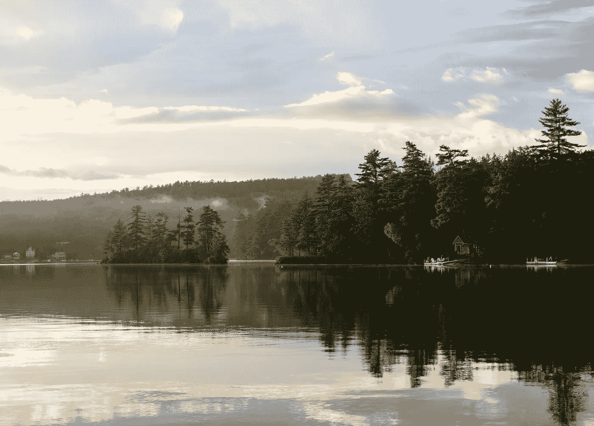

# 如何将 Azure 数据湖 Gen. 2 连接到 Azure 机器学习

> 原文：<https://medium.com/geekculture/how-to-connect-azure-data-lake-gen-2-to-azure-machine-learning-510c00115add?source=collection_archive---------3----------------------->

让你的第二代数据湖作为数据存储连接到你的 Azure 机器学习工作空间的快速教程。

Photo by [Jonathan Larson](https://unsplash.com/@jrlars?utm_source=unsplash&utm_medium=referral&utm_content=creditCopyText) on [Unsplash](https://unsplash.com/s/photos/lake-house?utm_source=unsplash&utm_medium=referral&utm_content=creditCopyText)

# 介绍

这篇短文的目的不是告诉读者数据湖策略对于数据存储的好处或深层技术，而是展示连接一个 [Azure](https://azure.microsoft.com/en-gb/services/storage/data-lake-storage/?ocid=AID3020565#features) …