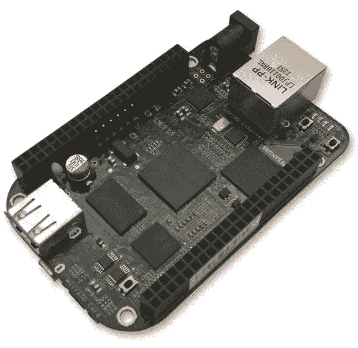

# 如何使用 USB 转 TTL 串行电缆将 BeagleBone Black 开发板连接到 PC

> 原文：<https://medium.com/geekculture/how-to-connect-beaglebone-black-development-board-to-pc-using-usb-to-ttl-serial-cable-2efdbb6d1b17?source=collection_archive---------0----------------------->

# 介绍

[**BeagleBone Black**](https://beagleboard.org/black) 是您开始嵌入式开发实践的绝佳板。这可能会成为一次漫长但有益的冒险的邀请。

BeagleBone Black 配置简单，易于使用，给你很多尝试的机会…