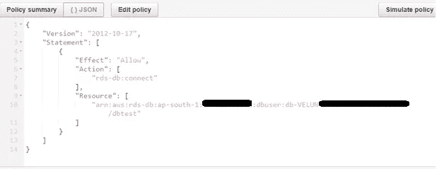
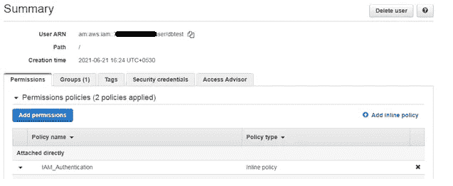
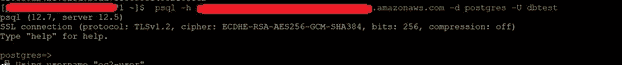

# 如何使用 IAM 认证连接数据库？

> 原文：<https://medium.com/geekculture/how-to-connect-database-using-iam-authentication-f6733868a976?source=collection_archive---------7----------------------->

在这里，我们将了解 IAM 认证的实现


*   使用 IAM 用户或角色凭据和身份验证令牌连接 RDS DB 实例或集群的 IAM 身份验证。
*   它比本机身份验证方法更安全
*   这些令牌是使用 AWS 访问密钥生成的。您不需要存储数据库用户凭证。
*   它的寿命只有 15 分钟，所以我们不需要强制重置密码。
*   如果我们使用 EC2 实例来连接 RDS 实例，那么我们可以使用您的 EC2 实例配置文件凭证来访问数据库。您不需要在实例中存储数据库密码

**S-1 在数据库实例上激活 IAM 数据库验证:**

*   打开亚马逊 RDS 控制台
*   选择**数据库**。
*   选择我们要修改的数据库实例。
*   选择**修改**
*   在**数据库认证**部分，选择**密码和 IAM 数据库认证**来启用 IAM 数据库认证
*   继续
*   选择**立即应用**

**S-2 创建一个使用 AWS 认证令牌的数据库用户帐户。**

*   创建用户“dbtest ”,并为该用户分配“rds_iam”角色(完成第一步后，我们可以看到 rds_iam 角色)


**S-3 添加将数据库用户映射到 IAM 角色的 IAM 策略。**

*   选择 IAM 服务
*   选择**策略**
*   选择创建策略" **IAM_Authentication** "



5\. Choose Next: Tags.

*   选择下一个:**复习**。
*   对于**名称**，输入一个策略名称。
*   选择**创建策略**。

S-4 将策略附加到 IAM 角色。

*   选择 **IAM**
*   从导航窗格中选择**角色**。
*   选择**创建角色“dbtest”并附加 IAM 策略**



**S-5 将 IAM 角色附加到 Amazon EC2 实例上**

*   选择 EC2
*   选择 ec2 机器，我们将通过该 Ec2 机器将 RDS DB 连接到该机器
*   选择实例，选择**动作**、**安全**，以及**修改 IAM 角色**。
*   选择要附加到实例的 IAM 角色，并选择**保存**。

**S-6 生成一个 AWS 认证令牌来标识 IAM 角色**

*   要导出 RDS 主机

```
export RDSHOST= psql-test-cpigussgckk-ap-south-1.rds.amazon.com 
```

*   生成 AWS 身份验证令牌

```
export PGPASSWORD="$(aws rds generate-db-auth-token --hostname $RDSHOST --port 5432--username dbtest)"
```

*   要查看密码

```
echo $PGPASSWORD
```

*   使用 psql 客户端连接数据库。

