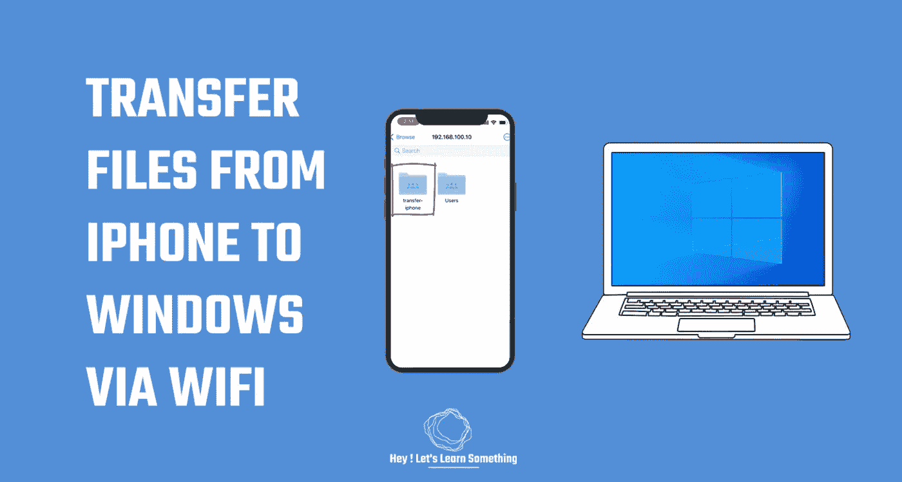

# 如何将 iPhone 连接到 Windows PC 传输文件和照片？

> 原文：<https://medium.com/geekculture/how-to-connect-iphone-to-windows-pc-to-transfer-files-and-photos-fa0222c18ab3?source=collection_archive---------16----------------------->

**仅使用 Wi-Fi，不需要任何应用程序**

您知道可以使用 Wi-fi 将 iPhone 连接到 Windows 电脑吗？完全不需要 iTunes 或任何其他第三方应用程序。只需连接到同一个 Wi-FI 网络，您就可以将 iPhone 连接到 Windows 电脑。这不是黑客或任何东西，但这是一个默认…