# 如何将 Strapi 连接到 PostgreSQL

> 原文：<https://medium.com/geekculture/how-to-connect-strapi-to-postgresql-7610d1c1c9a0?source=collection_archive---------37----------------------->


在本文中，我们将学习如何将 Strapi 连接到 PostgreSQL。默认情况下，Strapi 使用 SQLite 进行内容存储，并且 Strapi 不仅限于使用 SQLite 作为数据库，它还可以配置为使用其他数据库，如 [MongoDB](https://masteringbackend.com/posts/mongodb-tutorial-the-ultimate-guide) 、MySQL、MariaDB、PostgreSQL 等。

如何将一个 Strapi 实例连接到一个 Postgres 数据库经常令人困惑，许多来回总是与它相关联，但是在本文中，我将揭开所有这些背后的神秘面纱。我将用例子和图片展示我们如何配置一个 Strapi 实例来使用 Postgres 数据库。

我们还将学习如何:

*   在 Strapi 上创建集合。
*   在我们的机器上建立一个 Postgres 数据库。
*   如何在 Strapi 上手动添加 API 端点？
*   在 React 中创建一个银行管理应用程序来使用 Strapi API 端点。

# 斯特拉皮

[Strapi](https://strapi.io/) 是一个基于 Nodejs 的开源无头 CMS，用于设计 api 和管理内容。

Strapi 帮助我们非常快速地搭建我们的后端，构建 api 并从客户端使用 API。客户端可以是移动的、web 的、桌面的、cURL 的等等。

api 是从 Strapi UI 管理面板创建的。我们创建单一类型的集合。Strapi 中的集合映射到端点:

*   发布`/YOUR_COLLECTION_s`:创建新内容。
*   获取`/YOUR_COLLECTION_s`:获取所有内容。
*   获取`/YOUR_COLLECTION_s/:ID`:根据 ID 获取单个内容。
*   上传`/YOUR_COLLECTION_s/:ID`:编辑内容
*   删除`/YOUR_COLLECTION_s/:ID`:删除一个内容。

默认情况下，Strapi 为我们提供 RESTful APIs，但是我们也可以在 Strapi 中创建 GraphQL APIs。然后，我们可以在浏览器中使用 GraphQL Playground 来运行查询和变异。设置 Strapi 非常容易。我们只需运行下面的命令:

```
npx create-strapi-app strapi-api
    # OR
    yarn create strapi-api strapi-api
```

我们运行`yarn develop`命令在`localhost:1337`启动服务器。API 端点是从`localhost:1337` URL 消费的。此外，我们可以在`localhost:1337/admin`从同一个 URL 加载管理 UI。

Strapi 包含一个服务器和一个数据库。服务器托管 API，数据库用于存储应用程序的内容。Strapi 为其服务器使用了 [Koajs](https://koajs.com/) 框架。

要验证这一点，请转到`strapi-API/config/`文件夹。

我们将看到以下内容:

```
config/
            functions/
                responses/
                    404.js
                bootstrap.js
                cron.js
            database.js
            server.js
```

这是保存 Strapi 配置的地方。`404.js`文件用于返回自定义的 404 消息。

```
"use strict";

    module.exports = async (/* ctx */) => {
      // return ctx.notFound('My custom message 404');
    };
```

`cron.js`文件是我们可以在 Strapi 上设置 cron 作业的地方。这些作业根据我们输入的格式定期运行:`[SECOND (optional)] [MINUTE] [HOUR] [DAY OF MONTH] [MONTH OF YEAR] [DAY OF WEEK]`。

```
"use strict";

    module.exports = {};
```

`server.js`是我们配置 Strapi 服务器的地方。我们可以设置我们的主机、端口和身份验证。默认情况下，Strapi 在端口 1337 的`0.0.0.0`提供服务。我们可以在这个文件中更改它们。

```
module.exports = ({ env }) => ({
      host: env("HOST", "0.0.0.0"),
      port: env.int("PORT", 1337),
      admin: {
        auth: {
          secret: env("ADMIN_JWT_SECRET", "9c8eb554ab87ab3e95d1e32ca140e304"),
        },
      },
    });
```

`database.js`是配置要使用的数据库的地方。[数据库的客户端](https://masteringbackend.com/posts/top-10-database-clients-for-developers)，主机名，端口等。，都设置在这里。

```
module.exports = ({ env }) => ({
      defaultConnection: "default",
      connections: {
        default: {
          connector: "bookshelf",
          settings: {
            client: "sqlite",
            filename: env("DATABASE_FILENAME", ".tmp/data.db"),
          },
          options: {
            useNullAsDefault: true,
          },
        },
      },
    });
```

您可以在这里看到这些是 Strapi 的默认数据库设置。正如我们前面所说，它使用的是 SQLite 数据库。

*   `defaultConnection`是模型在查询数据库时使用的默认连接。默认值是默认值。您可以将其设置为 connections 对象中的任何属性键。
*   `connections`设置我们可以用来访问数据库的连接类型。我们有一个连接到 SQLite 数据库的默认连接。
*   `client`是创建连接的数据库客户机。
*   `filename`是数据库文件的路径。
*   这个`file`允许我们设置我们的 Strapi 应用程序使用 PostgreSQL、MySQL、SQLServer 或 MongoDB。

在下一节中，我们将安装 PostgreSQL 二进制文件。

# PostgresDB 设置

我们需要设置和安装 PostgreSQL。如果您的机器上没有安装 PostgreSQL，请转到[PostgreSQL 下载](https://www.postgresql.org/download/)并为您的机器下载二进制文件。

*   [Linux](https://www.postgresql.org/download/linux/)
*   [macOS](https://www.postgresql.org/download/macosx/)
*   [索拉里斯](https://www.postgresql.org/download/solaris/)
*   [窗户](https://www.postgresql.org/download/windows/)
*   [BSD](https://www.postgresql.org/download/bsd/)

安装后，启动 Postgres 服务器。请务必记住 Postgres 端口、用户名和密码，因为我们将使用它们将 Strapi 连接到 Postgres。

在 PostgreSQL 中创建一个数据库，将其命名为`bank`,因为我们将构建一个银行应用程序来进一步演示如何通过 Strapi 使用 PostgreSQL DB。

另外，如果您想从源代码构建 PostgreSQL，请从这里的[下载源代码并编译它。](https://www.postgresql.org/ftp/source/)

# 在 Strapi 中配置 PostgreSQL

为了配置我们的 Strapi 来使用我们的 PostgreSQL，我们将在我们的`strapi-api/config/database.js`文件中添加一些配置。

打开`strapi-api/config/database.js`，将下面的代码粘贴到文件中:

```
// strapi-api/config/database.js
    module.exports = ({ env }) => ({
      defaultConnection: "default",
      connections: {
        default: {
          connector: "bookshelf",
          settings: {
            client: "postgres",
            host: env("DATABASE_HOST", "localhost"),
            port: env.int("DATABASE_PORT", 5432),
            database: env("DATABASE_NAME", "bank"),
            username: env("DATABASE_USERNAME", "postgres"),
            password: env("DATABASE_PASSWORD", "0000"),
            schema: env("DATABASE_SCHEMA", "public"),
          },
          options: {},
        },
      },
    });
```

*   在`connections`对象中，我们只有一个`default`连接。
*   在这个`default`连接中，我们将`connector`设置为书架。
*   在`settings`中，我们将`client`设置为`Postgres`。这个客户机是 PostgresSQL 数据库客户机，用于创建到 DB 的连接。
*   `host`是我们设置为`localhost`的 PostgreSQL 服务器的主机名。
*   `port`设置为 5432，这是 PostgreSQL 服务器的默认端口。
*   `name`设置为 bank，这是我们在 PostgreSQL 服务器中创建的数据库的名称。
*   `password`是我们 PostgreSQL 服务器的密码。
*   `username`是我们的 PostgreSQL 的用户名。它被设置为`Postgres`，因为它是我们的 PostgreSQL 服务器的用户名。
*   `schema`是数据库模式，这里设置为`public`。该模式用于向公众公开数据库。

这样，我们的 Strapi 使用 PostgreSQL 来持久化我们的 api 内容。现在开始斯特拉皮。

```
yarn develop
```

Strapi 将在我们的浏览器上加载`localhost:1337/admin`。现在注册并点击`LET'S START`按钮，这将带你到管理面板。

# 打造我们的收藏

一切准备就绪。我们已经将我们的 Strapi 应用程序连接到 PostgreSQL。现在，我们开始建立我们的收藏。我们正在建立一个银行应用程序，这是一个银行管理应用程序，银行家将使用 Strapi 管理账户，数据库持久性将是 PostgreSQL。

下面就把我们银行 app 的核心功能写出来。

*   可以在应用程序中创建新帐户。
*   可以进行交易，即可以从一个用户向另一个用户汇款。

因此，我们将有两个模型:帐户和交易。

账户持有银行账户，交易持有已完成的交易。

客户模型:

```
Account {
        name
        balance
    }
```

`name`字段将保存账户持有人的姓名。`balance`将持有账户持有人的美元余额。

交易模式:

```
Transact {
        sender
        receiver
        amount
    }
```

`sender`字段保存转账账户持有人的姓名。`receiver`是受益者。`amount`是发送方发送给接收方的金额。

所以我们开始在我们的 Strapi 管理中创建集合。我们将从`Account`型号开始。

点击`Create First Content Type`按钮，输入“账户”作为收款名称。

现在我们为`account`集合添加字段:

*   点击`+ Add another field`按钮，选择`Text`并输入`name`，然后点击`+ Add another field`按钮添加另一个字段。
*   选择`Number`并在`Number format`上选择`float (ex. 3.3333333)`，然后输入`balance`并点击`Finish`按钮。
*   在出现的`Account`页面上，点击页面右上角的`Save`按钮。

我们生成`Transact`集合:

*   点击`+ Create new collection type`链接，会出现一个模态，输入`transact`。点击`+ Add another field`按钮。
*   添加字段:`sender`、`receiver`和`amount`。字段`sender`和`receiver`将是`Text`字段，而`amount`将是具有`float (ex. 3.333333)`数字格式的`Number`字段。
*   添加后，点击`Finish`按钮和`Save`按钮。

现在，我们已经创建了自己的系列。

# 业务逻辑

我们需要实现我们的业务逻辑。这个业务逻辑将是一个 API 端点，将资金从发送方转移到接收方。

逻辑是这样的:

*   从寄件人处扣除金额
*   将金额添加到接收方
*   添加交易以处理收款

我希望在`/transfer` API 中完成，这是一个 POST 方法。传输 HTTP 请求将如下所示:

```
http://localhost:1337/transfer
    Method: POST
    Body:
    {
        sender: nnamdi
        receiver: chidme
        amount:  10
    }
```

所以我们看到集合不能处理这个。这是一个单一端点。单一类型不适合我。我通常发现很难从 Strapi 管理面板创建单个 API 端点，所以我转到项目源代码来添加它。

Strapi 项目中的 api 保存在`api`文件夹中。因此，我们转到我们的`api`文件夹，我们将看到为我们的 API 创建的文件夹:`transact`和`account`。

```
strapi-api
        api/
            account/
                config/
                    routes.json
                controllers/
                    account.js
                models/
                services/
            transact/
            ...
```

`routes.json`文件包含 API 中包含的端点。

`controllers`文件夹包含用户可以用来在 API 中定制端点的文件。用户可以为一个端点应用他的逻辑。

这两件事是我们在创建我们的`transfer` API 时所需要的。因此，我们在`api`文件夹中创建一个`transfer`文件夹:

```
mkdir transfer
```

接下来，我们在`transfer`文件夹中创建`config`和`controllers`文件夹。

```
mkdir transfer/config transfer/controllers
```

在`config`文件夹中创建一个`routes.json`文件:

```
touch transfer/config/routes.json
```

在它里面，我们定义了一个`/transfer`端点和一个 POST HTTP 方法。然后，我们将让处理程序指向一个将从`controllers`导出的`index`函数。

```
{
      "routes": [
        {
          "method": "POST",
          "path": "/transfer",
          "handler": "Transfer.index",
          "config": {
            "policies": []
          }
        }
      ]
    }
```

在`controllers`文件夹中创建一个`transfer`文件。

```
touch transfer/controllers/transfer.js
```

这里，我们将导出一个`index`函数。这个函数将在发出`localhost:1337/transfer` HTTP 请求时被调用。该函数将处理该请求。在这里，我们将应用我们的业务逻辑，从一个帐户向另一个受益人帐户汇款。

参见下面的代码:

```
// strapi-api/api/transfer/controllers/transfer.js

    const { sanitizeEntity } = require("strapi-utils");

    module.exports = {
      async index(ctx) {
        const { sender, receiver, amount } = ctx.request.body;

        let entity;

        // deduct amount from sender
        // add amount to reciver
        // add the transaction to transact

        const senderAcc = await strapi.services.account.findOne({
          name: sender,
        });
        const receiverAcc = await strapi.services.account.findOne({
          name: receiver,
        });

        senderAcc.balance = parseFloat(senderAcc.balance) - parseFloat(amount);
        receiverAcc.balance = parseFloat(receiverAcc.balance) + parseFloat(amount);

        await strapi.services.account.update({ name: sender }, senderAcc);
        await strapi.services.account.update({ name: receiver }, receiverAcc);
        entity = await strapi.services.transact.create({
          sender,
          receiver,
          amount,
        });
        return sanitizeEntity(entity, { model: strapi.models.transact });
      },
    };
```

`ctx`固定`res`和`req`就像在 Expressjs 或 Koajs 中一样。`ctx`是一个包含属性和方法的对象，用于访问传入的消息和响应客户端。

看，我们从`ctx.request.body`中取回了`sender`、`receiver`和`amount`。注意我们有一个 strapi 对象。是的，它是一个在 Strapi 项目中是全局的 Strapi 对象。我们使用对象来访问不同的属性和方法。

这里我们用它来访问`.services`对象，它包含了访问数据库的方法。看里面的函数:`create`、`update`、`find`、`findOne`等。它们用于在数据库中创建数据、更新数据库、从数据库中检索值。

因此，我们检索了发送者的帐户详细信息以及接收者的帐户详细信息。然后，我们进行交易，从发送方的余额中减去`amount`，并添加接收方的余额。

接下来，我们用新值更新了数据库中发送方和接收方的余额。

然后，我们在`transact`表中创建了一个新的事务，最后，我们返回新事务的结果。

`sanitizeEntity`函数从模型及其关系中移除所有私有字段。保存文件，这将重启我们的 Strapi 服务器。你不会看到`transfer` API 出现在管理面板上，它是一个独立的 API，而不是一个集合类型。

# 允许访问

现在，我们将允许访问我们所有的 API。

点击侧边栏菜单上的`Settings`项，然后点击出现的第二个侧边栏菜单上的`Roles`项。在右侧部分，点击`Public`项目并向下滚动。您将看到所有的 API 及其处理程序。点击`Select all`复选框，并点击顶部的`Save`按钮。这将允许公众访问我们的 Strapi 项目中的所有 api:

*   账户
*   交易
*   转移

# 种子数据

现在，我们播种我们的数据。

点击侧边栏中的`Accounts`。点击`+ Add New Accounts`按钮。

添加数据:

```
name -> nnamdi
balance -> 2000000
```

点击`Save`按钮和`Publish`按钮。

添加其他数据:

```
name -> chidume
balance -> 1000000
```

点击`Save`按钮和`Publish`按钮。

查看我们的 PostgreSQL 用户界面，内容保存在 PostgreSQL 上:


# 构建我们的前端—银行管理

我们的前端将是一个银行管理应用程序。我们将使用 Nextjs 来构建应用程序。所以我们搭建了我们的项目。

```
yarn create next-app strapi-bank
```

我们的应用程序将有两个页面路径:

*   `/`
*   `/account/[id]`

索引`/`路径将显示系统上的所有账户。

`/account/[id]`路线将显示特定账户的详细信息。这是一个动态的路由，`id`可以容纳任何值，它是动态的，并且它将是一个帐户的唯一 id。

我们将有组件:

*   `Header`:这将呈现标题。
*   `AccountCard`:这个组件将在`/`路径中显示一些账户的详细信息。
*   `AddAccountDialog`:这是一个对话框，呈现我们将用于向系统添加新帐户的 UI。
*   `TransactionDialog`:这个对话框显示了将要进行交易的界面，从一个账户向另一个账户汇款。
*   `TransactionCard`:该组件将呈现用户的交易。
*   `Accounts`:这是`/`页面的页面组件。它显示了银行中的所有账户。
*   `Account`:这是`/account/[id]`页面的页面组件。

我们最终的应用程序将如下所示:

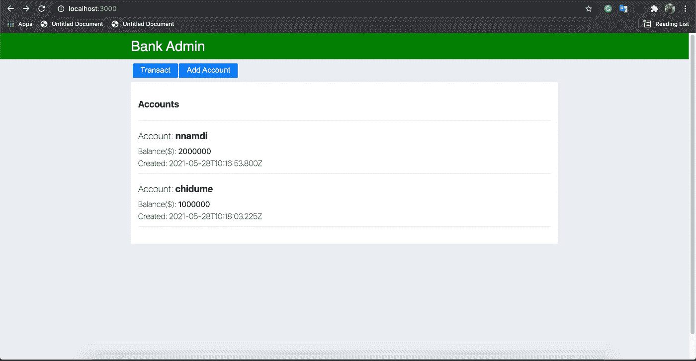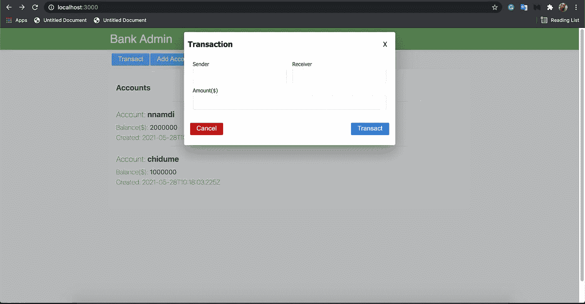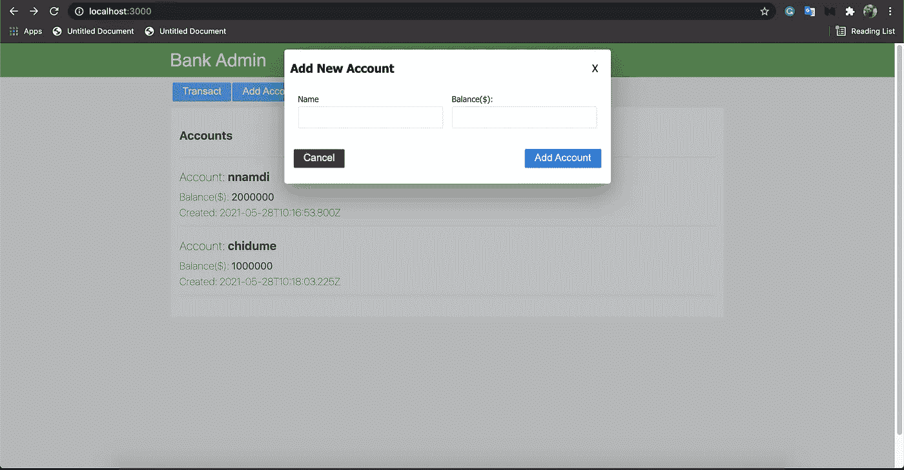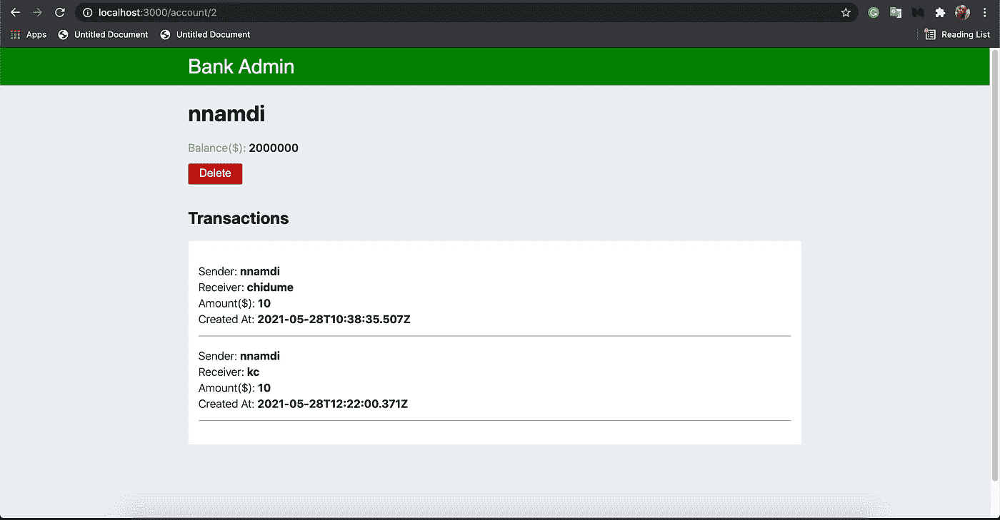

好，我们开始创建组件。

```
mkdir componentsmkdir components/TransactionCard
touch components/TransactionCard/index.js
touch components/TransactionCard/TransactionCard.module.cssmkdir components/TransactionDialog
touch components/TransactionDialog/index.jsmkdir components/AddAccountDialog
touch components/AddAccountDialog/index.jsmkdir components/AccountCard
touch components/AccountCard/index.js
touch components/AccountCard/AccountCard.module.cssmkdir components/Header
touch components/Header/index.js
touch components/Header/Header.module.csstouch styles/AccountView.module.css
mkdir pages/account
touch pages/account/[id].js
```

页眉

这将是一个简单的用户界面，它将显示文本`Bank Admin`。将以下代码粘贴在`components/Header/index.js`上:

```
import { header, headerName } from "./Header.module.css";

    export default function Header() {
      return (
        <section className={header}>
          <div className={headerName}>Bank Admin</div>
        </section>
      );
    }
```

AccountCard 这个组件将由`Accounts`组件呈现。它将显示一个帐户的迷你细节。

将以下代码粘贴到`components/AccountCard/index.js`中:

```
import styles from "./AccountCard.module.css";
    import Link from "next/link";

    export default function AccountCard({ account }) {
      const { id, name, balance, created_at } = account;

      return (
        <Link href={`account/${id}`}>
          <div className={styles.account}>
            <div className={styles.accountdetails}>
              <div className={styles.accountname}>
                <h3>
                  <span style={{ fontWeight: "100" }}>Account: </span>
                  {name}
                </h3>
              </div>
              <div className={styles.accountbalance}>
                <span>
                  <span style={{ fontWeight: "100" }}>Balance($): </span>
                  {balance}
                </span>
              </div>
              <div className={styles.accountcreated_at}>
                <span>Created: {created_at}</span>
              </div>
            </div>
          </div>
        </Link>
      );
    }
```

它在其`props`参数中接收`account`对象。接下来，我们从`account`对象中析构`id`、`name`、`balance`、`created_at`。是的，`id`和`created_at`是 Strapi 在每个模型内容中设置的字段。

因此，`AccountCard`组件呈现细节。

TransactionCard 该组件将呈现传递给它的特定事务。将显示发送的`sender`、`receiver`和`amount`。帐户页面组件呈现该组件以显示帐户用户完成的交易——借方和贷方。

将下面的代码粘贴到`components/TransactionCard/index.js`中:

```
import styles from "./TransactionCard.module.css";

    export default function TransactionCard({ transaction }) {
      const { sender, receiver, amount, created_at } = transaction;
      return (
        <div className={styles.transactionCard}>
          <div className={styles.transactionCardDetails}>
            <div className={styles.transactionCardName}>
              <h4>
                <span>Sender: </span>
                <span style={{ fontWeight: "bold" }}>{sender}</span>
              </h4>
            </div>
            <div className={styles.transactionCardName}>
              <h4>
                <span>Receiver: </span>
                <span style={{ fontWeight: "bold" }}>{receiver}</span>
              </h4>
            </div>
            <div className={styles.transactionCardName}>
              <h4>
                <span>Amount($): </span>
                <span style={{ fontWeight: "bold" }}>{amount}</span>
              </h4>
            </div>
            <div className={styles.transactionCardName}>
              <h4>
                <span>Created At: </span>
                <span style={{ fontWeight: "bold" }}>{created_at}</span>
              </h4>
            </div>
          </div>
        </div>
      );
    }
```

它在其 props 中接收一个`transaction`对象。字段`sender`、`receiver`、`amount`、`created_at`由`transaction`对象析构而来。然后这些由组件呈现。

Accounts 该组件在导航索引页面`/`时呈现。该组件将向 Strapi 后端发出 HTTP 请求，以检索帐户列表并呈现它们。

将以下代码粘贴到`pages/index.js`上:

```
import Head from "next/head";
    import styles from "../styles/Home.module.css";
    import Header from "../components/Header";
    import AccountCard from "../components/AccountCard";
    import { useEffect, useState } from "react";
    import axios from "axios";
    import TransactDialog from "../components/TransactDialog";
    import AddAccountDialog from "../components/AddAccountDialog";

    export default function Home() {
      const [accounts, setAccounts] = useState([]);
      const [showTransactModal, setShowTransactModal] = useState(false);
      const [showAddAccountModal, setShowAddAccountModal] = useState(false);

      useEffect(async () => {
        const data = await axios.get("http://localhost:1337/accounts");
        setAccounts(data?.data);
      }, []);

      return (
        <div className={styles.container}>
          <Head>
            <title>Bank Admin</title>
            <link rel="icon" href="/favicon.ico" />
          </Head>

          <main className={styles.main}>
            <div className={styles.breadcrumb}>
              <div>
                <span style={{ margin: "1px" }}>
                  <button onClick={() => setShowTransactModal(true)}>
                    Transact
                  </button>
                </span>
                <span style={{ margin: "1px" }}>
                  <button onClick={() => setShowAddAccountModal(true)}>
                    Add Account
                  </button>
                </span>
              </div>
            </div>

            <div className={styles.accountcontainer}>
              <div className={styles.youraccounts}>
                <h3>Accounts</h3>
              </div>
              <div>
                {accounts.map((account, i) => (
                  <AccountCard key={i} account={account} />
                ))}
              </div>
            </div>
            {showAddAccountModal ? (
              <AddAccountDialog
                closeModal={() => setShowAddAccountModal((pV) => !pV)}
              />
            ) : null}
            {showTransactModal ? (
              <TransactDialog
                closeModal={() => setShowTransactModal((pV) => !pV)}
              />
            ) : null}
          </main>
        </div>
      );
    }
```

我们有三个状态:`accounts`:保存从`/accounts`端点检索的账户的状态。`showTransactModal`:这是一个布尔状态，用于切换`TransactionModal`的可见性。`showAddAccountModal`:这也是一个布尔状态，用于显示和删除`AddAccountModal`。

`useEffect`回调调用`/accounts`端点，结果设置为`accounts`状态。

由`AccountCard`组件渲染`accounts`数组和每个账户，每个账户通过其`account`道具传递给`AccountCard`。

请注意，我们正在有条件地呈现`AddAccountDialog`和`TransactDialog`对话框组件。`Transact`按钮拨动`TransactDialog`按钮，`Add Account`按钮拨动`AddAccountDialog`。

请注意，我们通过`closeModal`道具向每个对话框传递一个函数。该函数将使对话框能够从它们的组件中自行关闭。

Account 这是在导航`/account/[id]`路线时呈现的页面组件。该组件显示帐户详细信息及其交易。我们也可以从那里删除一个帐户。

将以下代码粘贴到`pages/account/[id].js`中:

```
import styles from "../../styles/AccountView.module.css";
    import { useRouter } from "next/router";
    import TransactionCard from "../../components/TransactionCard";
    import axios from "axios";
    import { useEffect, useState } from "react";

    export default function Account() {
      const router = useRouter();
      const {
        query: { id },
      } = router;

      const [account, setAccount] = useState();
      const [transactions, setTransactions] = useState([]);
      useEffect(async () => {
        const AccountData = await axios.get("http://localhost:1337/accounts/" + id);
        var transactsData = await axios.get("http://localhost:1337/transacts");
        transactsData = transactsData?.data?.filter(
          (tD) =>
            tD.sender == AccountData?.data?.name ||
            tD.receiver == AccountData?.data?.name
        );
        console.log(transactsData);
        setAccount(AccountData?.data);
        setTransactions(transactsData);
      }, [id]);

      async function deleteAccount() {
        if (confirm("Do you really want to delete this account?")) {
          await axios.delete("http://localhost:1337/accounts/" + id);
          router.push("/");
        }
      }

      return (
        <div className={styles.accountviewcontainer}>
          <div className={styles.accountviewmain}>
            <div style={{ width: "100%" }}>
              <div className={styles.accountviewname}>
                <h1>{account?.name}</h1>
              </div>
              <div className={styles.accountviewminidet}>
                <div>
                  <span style={{ marginRight: "4px", color: "rgb(142 142 142)" }}>
                    Balance($):
                  </span>
                  <span style={{ fontWeight: "600" }}>{account?.balance}</span>
                </div>
                <div style={{ padding: "14px 0" }}>
                  <span>
                    <button onClick={deleteAccount} className="btn-danger">
                      Delete
                    </button>
                  </span>
                </div>
              </div>
              <div className={styles.accountviewtransactionscont}>
                <div className={styles.accountviewtransactions}>
                  <h2>Transactions</h2>
                </div>
                <div className={styles.accountviewtransactionslist}>
                  {!transactions || transactions?.length <= 0
                    ? "No transactions yet."
                    : transactions?.map((transaction, i) => (
                        <TransactionCard key={i} transaction={transaction} />
                      ))}
                </div>
              </div>
            </div>
          </div>
        </div>
      );
    }
```

该组件从 URL 中检索`id`。我们有州`account`和`transactions`，它们分别持有账户和交易。

`useEffect`钩子回调用`id`值调用`/accounts/" + id`端点，通过它的 id 获取账户。接下来，它调用`/transacts`端点来检索交易，并过滤掉当前帐户用户进行或接收的交易。结果设置在`transactions`状态，而账户详情设置在`account`状态。

然后，UI 会显示帐户详细信息及其交易。

有一个`Delete`按钮，点击后删除当前账户用户。它通过使用帐户 id 调用 DELETE HTTP 方法上的端点`/accounts/" + id`来实现这一点。这使得 Strapi 删除了帐户。

这个组件是一个对话框，我们用它来添加一个新的帐户。

将以下代码粘贴到`components/AddAccountDialog/index.js`中:

```
import { useState } from "react";
    import EpisodeCard from "../TransactionCard";
    import axios from "axios";

    export default function AddAccountDialog({ closeModal }) {
      const [disable, setDisable] = useState(false);

      async function addAccount() {
        setDisable(true);
        const accountName = window.accountName.value;
        const accountBalance = window.accountBalance.value;

        // add account
        await axios.post("http://localhost:1337/accounts", {
          name: accountName,
          balance: parseFloat(accountBalance),
        });
        setDisable(false);
        closeModal();
        location.reload();
      }

      return (
        <div className="modal">
          <div className="modal-backdrop" onClick={closeModal}></div>
          <div className="modal-content">
            <div className="modal-header">
              <h3>Add New Account</h3>
              <span
                style={{ padding: "10px", cursor: "pointer" }}
                onClick={closeModal}
              >
                X
              </span>
            </div>
            <div className="modal-body content">
              <div style={{ display: "flex", flexWrap: "wrap" }}>
                <div className="inputField">
                  <div className="label">
                    <label>Name</label>
                  </div>
                  <div>
                    <input id="accountName" type="text" />
                  </div>
                </div>
                <div className="inputField">
                  <div className="label">
                    <label>Balance($):</label>
                  </div>
                  <div>
                    <input id="accountBalance" type="text" />
                  </div>
                </div>
              </div>
            </div>
            <div className="modal-footer">
              <button
                disabled={disable}
                className="btn-danger"
                onClick={closeModal}
              >
                Cancel
              </button>
              <button disabled={disable} className="btn" onClick={addAccount}>
                Add Account
              </button>
            </div>
          </div>
        </div>
      );
    }
```

我们有输入框输入账户名称和它的初始存款余额。点击`Add Account`按钮调用`addAccount`功能。这个函数检索帐户名和余额，并通过 POST HTTP 使用有效负载:帐户名和余额调用`/accounts`端点。这将使用此有效负载创建一个新帐户。

TransactionDialog 这个组件是我们从一个帐户向另一个帐户汇款的地方。

将以下代码粘贴到`components/TransactionDialog/index.js`:

```
import { useState } from "react";
    import TransactionCard from "../TransactionCard";
    import axios from "axios";

    export default function TransactDialog({ closeModal }) {
      const [disable, setDisable] = useState(false);

      async function transact() {
        setDisable(true);
        const sender = window.sender.value;
        const receiver = window.receiver.value;
        const amount = window.amount.value;

        await axios.post("http://localhost:1337/transfer", {
          sender,
          receiver,
          amount,
        });

        setDisable(false);
        closeModal();
        location.reload();
      }

      return (
        <div className="modal">
          <div className="modal-backdrop" onClick={closeModal}></div>
          <div className="modal-content">
            <div className="modal-header">
              <h3>Transaction</h3>
              <span
                style={{ padding: "10px", cursor: "pointer" }}
                onClick={closeModal}
              >
                X
              </span>
            </div>
            <div className="modal-body content">
              <div style={{ display: "flex", flexWrap: "wrap" }}>
                <div className="inputField">
                  <div className="label">
                    <label>Sender</label>
                  </div>
                  <div>
                    <input id="sender" type="text" />
                  </div>
                </div>
                <div className="inputField">
                  <div className="label">
                    <label>Receiver</label>
                  </div>
                  <div>
                    <input id="receiver" type="text" />
                  </div>
                </div>
                <div className="inputField">
                  <div className="label">
                    <label>Amount($)</label>
                  </div>
                  <div>
                    <input id="number" id="amount" type="text" />
                  </div>
                </div>
              </div>
            </div>
            <div className="modal-footer">
              <button
                disabled={disable}
                className="btn-danger"
                onClick={closeModal}
              >
                Cancel
              </button>
              <button disabled={disable} className="btn" onClick={transact}>
                Transact
              </button>
            </div>
          </div>
        </div>
      );
    }
```

输入框收集汇款人和收款人的姓名以及汇款金额。

`transact`功能完成这项工作。它从输入框中检索发送者、接收者和金额值，然后通过 HTTP POST 调用端点`/transfer`,将发送者、接收者和金额作为有效负载传入。然后`/transfer`端点将`amount`从`sender`转移到`receiver`。

我们已经完成了组件的构建，让我们测试一下。

# 试验

添加新帐户

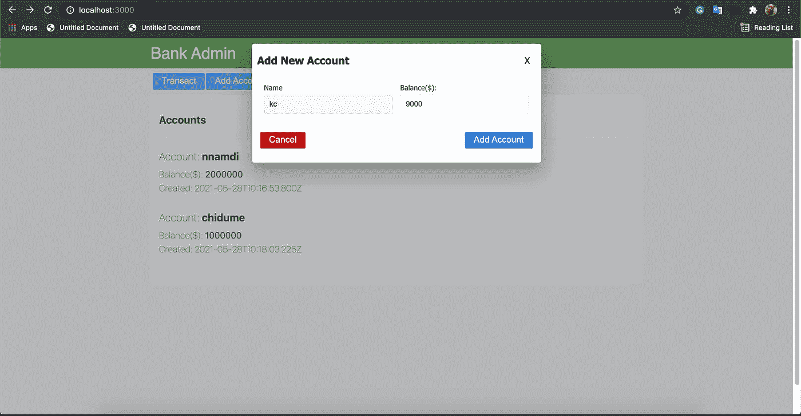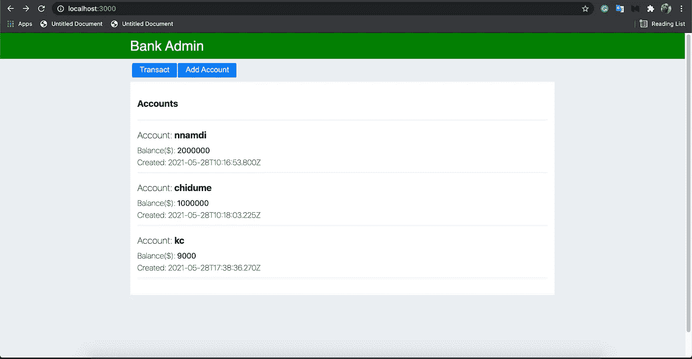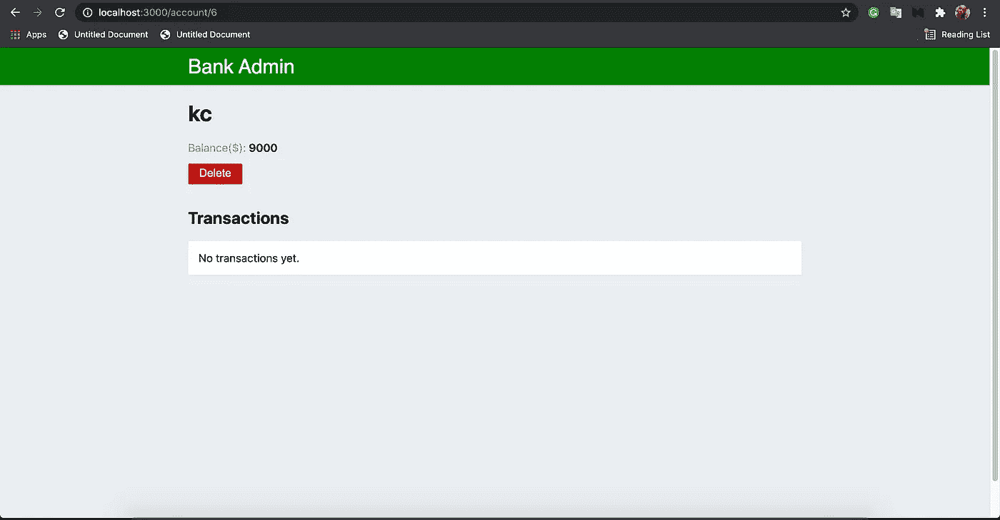

做一些交易

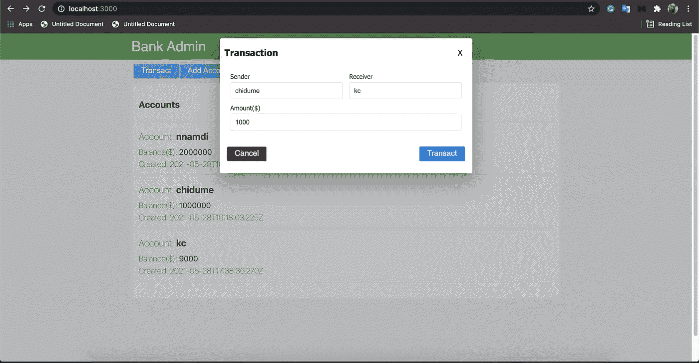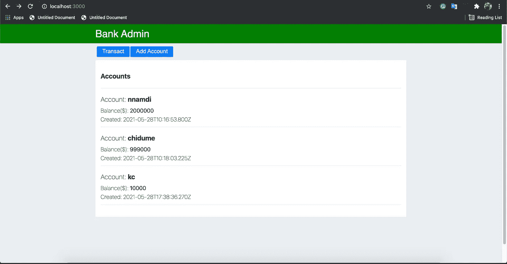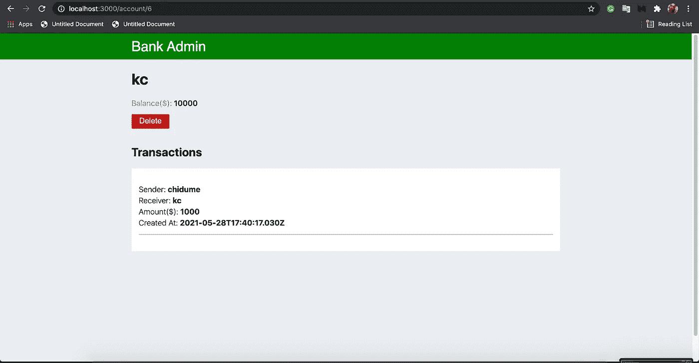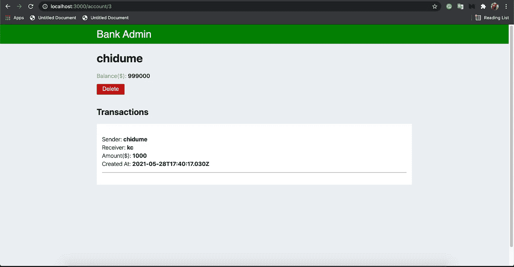

删除账户

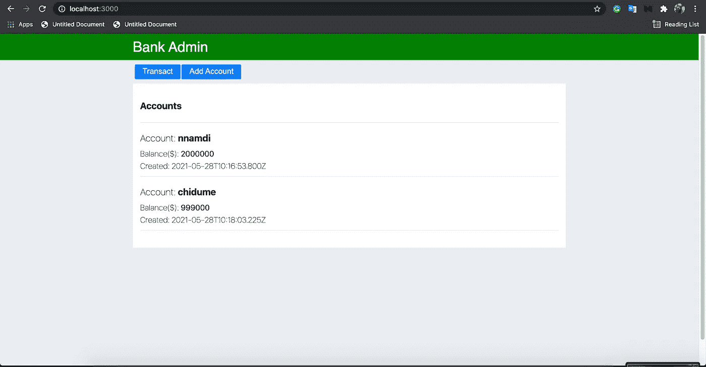

# 源代码

*   [前端代码](https://github.com/strapi-prjs/strapi-postgresql-bank)
*   [后端代码](https://github.com/strapi-prjs/strapi-postgresql-api)

# 结论

斯特拉皮太棒了！太棒了。您可以看到我们是如何将 PostgreSQL 无缝集成到我们的 Strapi 项目中的。

我们从介绍 Strapi 和它给软件开发带来的好处开始。后来，我们了解了它用于数据持久性的默认 DB。

接下来，我们介绍了 PostgreSQL 并展示了在哪里下载和安装它。我们学习了如何配置一个 Strapi 项目，以使用 PostgreSQL 作为数据库来存储其应用程序内容。

我们进一步构建了一个银行应用程序来演示如何在 Strapi 中最充分地使用 PostgreSQL。

总是考虑在你的项目中使用 Strapi。它简单明了，高度可配置。