# 如何使用移动热点连接到 Raspberry Pi

> 原文：<https://medium.com/geekculture/how-to-connect-to-the-raspberry-pi-using-mobile-hotspot-2362a6b02efc?source=collection_archive---------1----------------------->

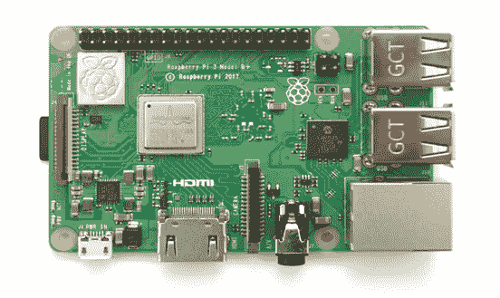

> 欢迎回到另一篇文章。在我之前的[文章](/geekculture/how-to-blink-led-using-raspberry-pi-8351b06348d7)中，我说过每次设置路由器来连接 Raspberry Pi 并不酷。所以我决定发表一篇新文章，这篇文章将更容易执行，也更方便。在这种方法中，您只需要您的 PC 来投射 Pi 屏幕，并在每次需要时给 Pi 加电。不需要互联网和路由器。但是这种方法只适用于新版的 Raspberry Pi，因为他们内置了 WI-Fi 芯片，而我们只使用 Wi-Fi。但是，您可以在 WiFi 加密狗的帮助下使用旧版本的 Pi。

让我们从设置移动热点开始。

## 第一步

*   打开您的手机设置。打开移动热点。无需激活移动数据或 wifi

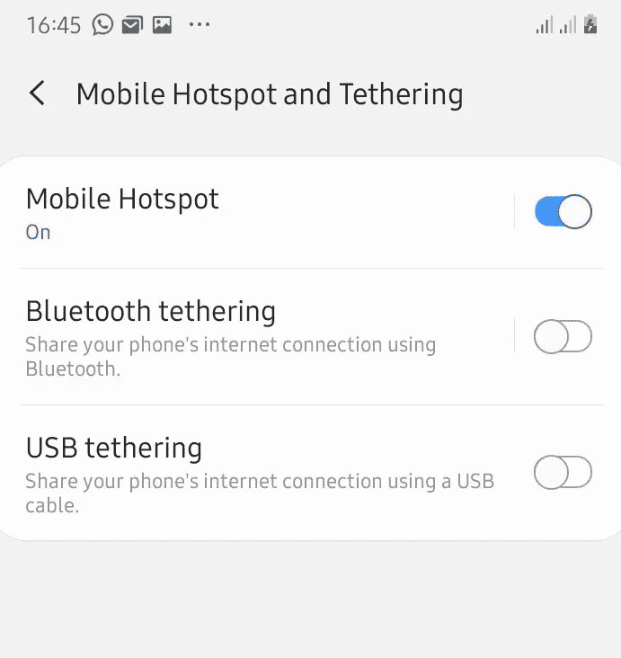

*   记下热点的名称和密码

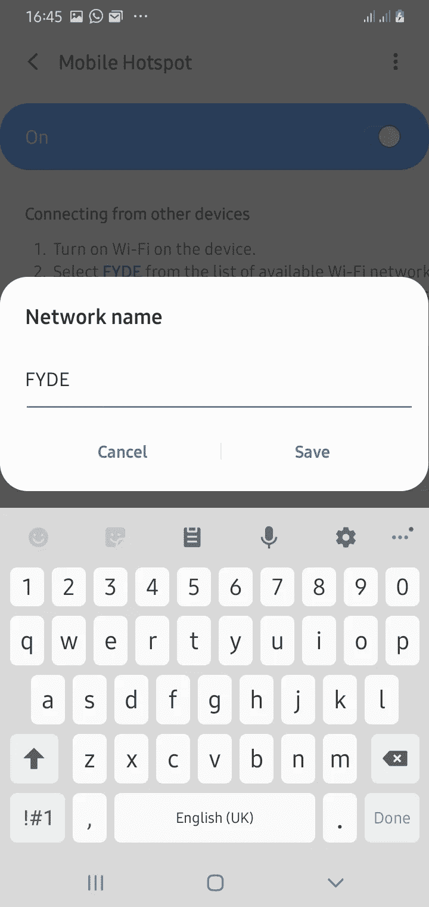

*   保持热点开启。

## 第二步:

*   登录您的树莓派。这是我们在上一篇文章中使用路由器时得到的 IP 地址。

*   输入用户名和密码，默认分别为' **pi** 和 **raspberry'** 。
*   运行命令“sudo apt update”和“sudo apt upgrade”。开机后升级更新 Raspbian OS 是一个很好的做法。

## 第三步:

在树莓 Pi 中设置 Wi-Fi 设置。

*   运行此命令“iwlist wlan0 scan ”,然后按 enter 键。它将列出周围可用的 wifi 网络及其 SSID 和其他详细信息。

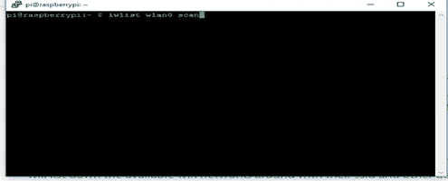

你应该找到你的热点名称。如果没有列出，重启 Raspberry Pi 并再次运行代码。

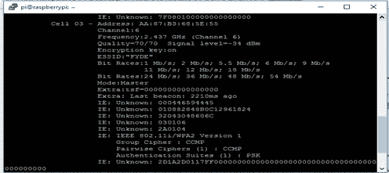

我们可以看到我的热点的名称“FYDE”

现在，让我们键入 **SSID** 和 **PSK** ，它们分别是热点名称和密码。

*   运行“sudo raspi-config”

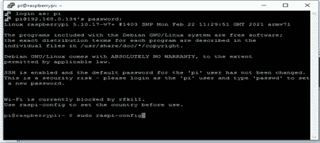

*   导航至系统选项

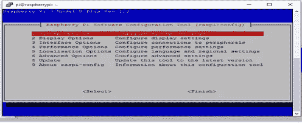

*   然后点击**无线局域网**

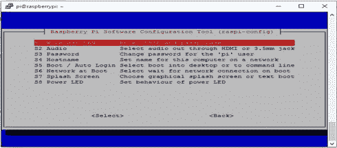

*   输入 **SSID** 和 **PSK**

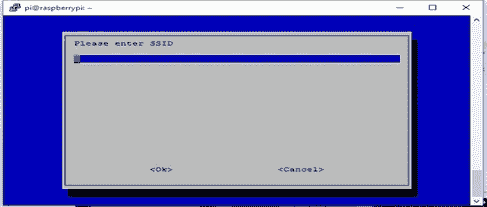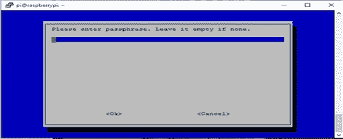

接下来，关闭树莓派

第四步:

现在，让我们找到移动热点提供的 IP 地址

*   打开 Raspberry Pi 并确保移动热点已打开。
*   检查连接设备。将会有一个名为“**raspberrypi”**的新用户。

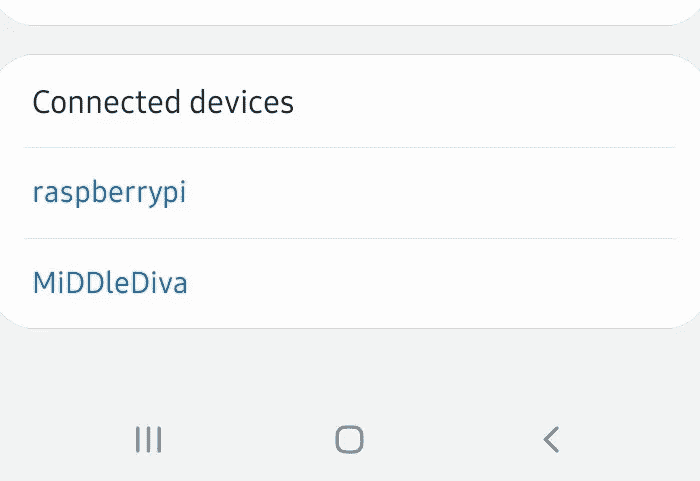

*   点击“ **raspberryPi** ”获取 IP 地址，但这将与之前的不同。

注意:大部分手机会直接显示 IP 地址。如果 IP 地址没有出现，那么从 PC 登录到 Putty，键入“ifconfig”

**第五步:**

最后，让我们使用这个新的 IP 地址进行连接，以确保设置正确。

*   重启树莓派。使用新的 IP 地址 SSH 到 Pi
*   输入用户名和密码，分别为 **pi** 和 **raspberry** 。

搞定了。

很简单，对吧？

你可以看到我们没有启用移动数据。所以，当我们下一步想做树莓派的时候，我们只需要派，一个电源，个人电脑，当然还有你的手机。

注:在打开 Raspberry Pi 之前，请确保您的移动热点已打开。

如果你对尝试新的 IP 地址很好奇，我也是😊。查看我的下一篇文章，我们将使用 [PIR 运动传感器来检测运动](/geekculture/detecting-motions-using-pir-motion-sensor-with-raspberry-pi-98f88f9d5ffe)。那里见！