# 如何用 Tableau 构造帕累托图

> 原文：<https://medium.com/geekculture/how-to-construct-pareto-chart-using-tableau-695680ee9f08?source=collection_archive---------53----------------------->

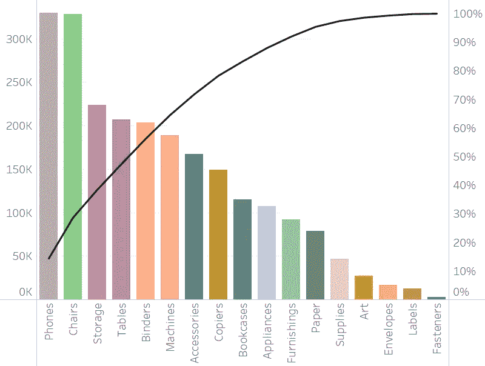

很多时候，我们需要根据业务需求在 Tableau 中创建某种类型的图表，但是该图表可能不是内置图表的一部分。这并不意味着它不能被创造。有几种类型的图表不是 Tableau 内置的，但可以很容易地定制，Pareto 就是其中之一。

在我们进一步讨论之前，让我们先试着理解什么是帕累托图。这是一个图表，用于识别造成 80%影响的一系列原因。它基于 80-20 原则，即 80%的结果是由 20%的原因造成的。

我将使用 Tableau 附带的“样本超市”数据集的订单表。在我开始之前，让我解释一下这个场景。

*占总销售额 80%的子类别有哪些？*

帕累托图具有以下属性:

*   它应该将数据按降序排列成一个条形
*   它应该以一条线的形式显示累计百分比

现在让我们从构建图表开始:

**步骤 1:** 将子类别拖到列中，将销售额拖到行中

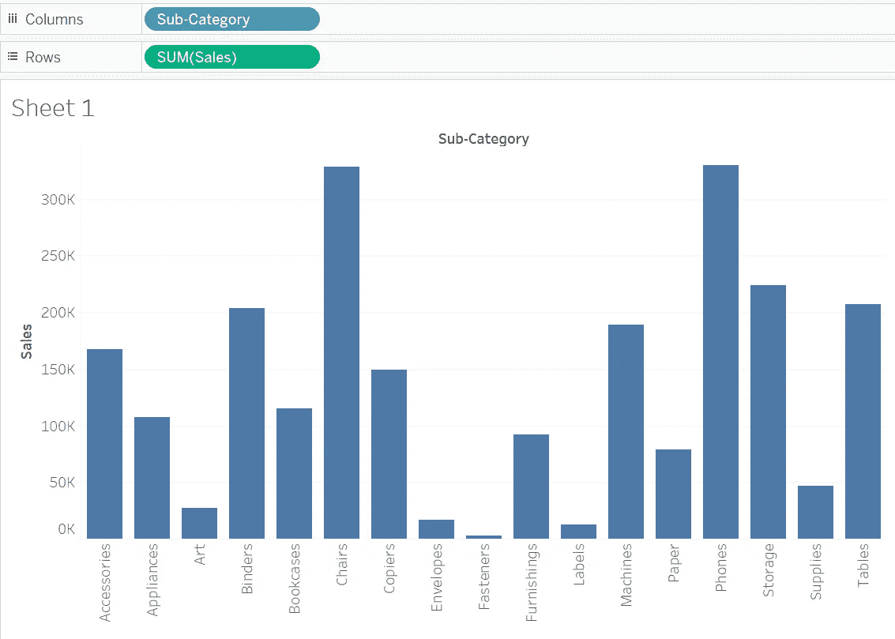

**第二步:**按降序排列条形

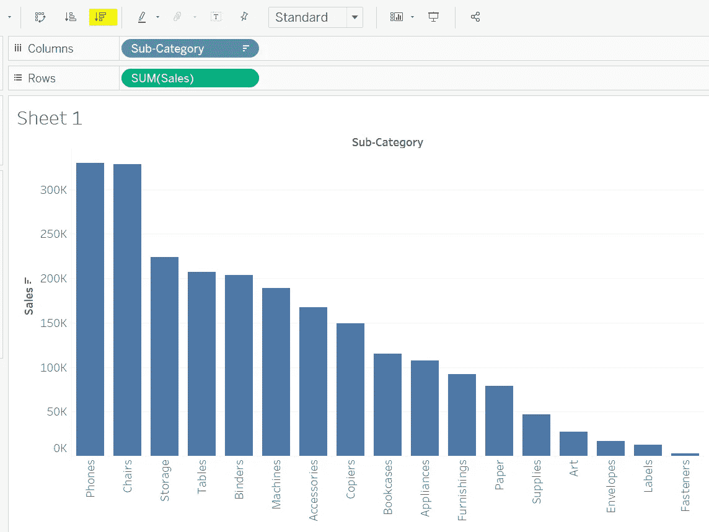

第三步:再次将销售额拖到行中

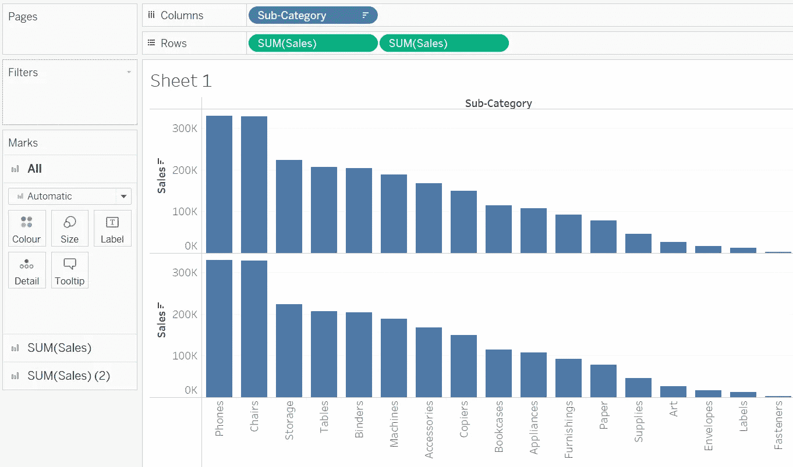

**步骤 4:** 将 Marks 卡中第二个销售字段的图表类型转换为线条

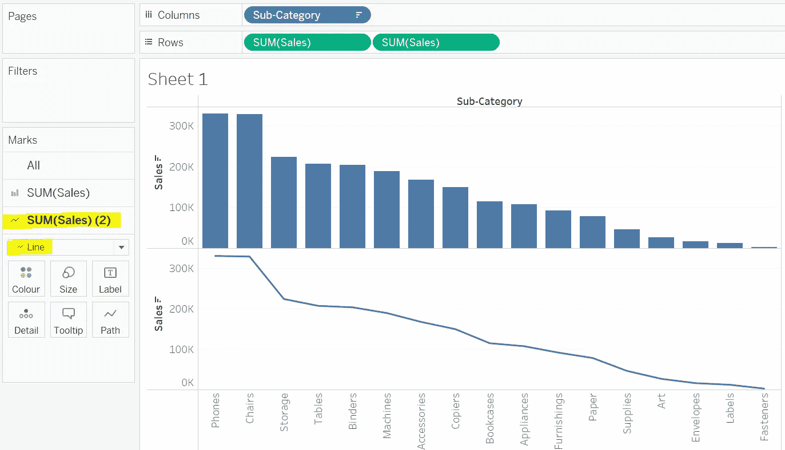

**第五步:**将折线图做成双轴

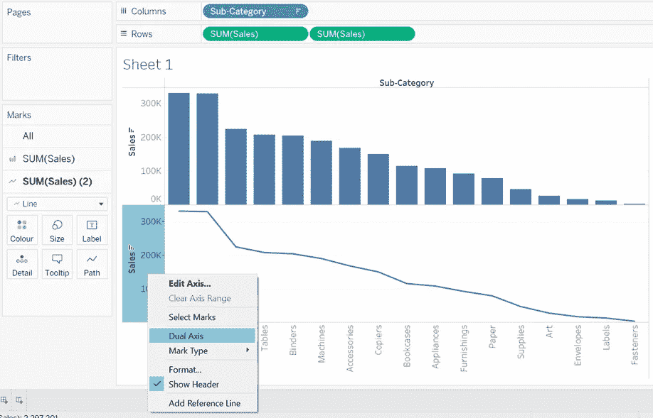

做了双轴后，可能会出现杠变圆的情况。这不是问题，只需将图表类型从 Marks 卡改回条形图即可

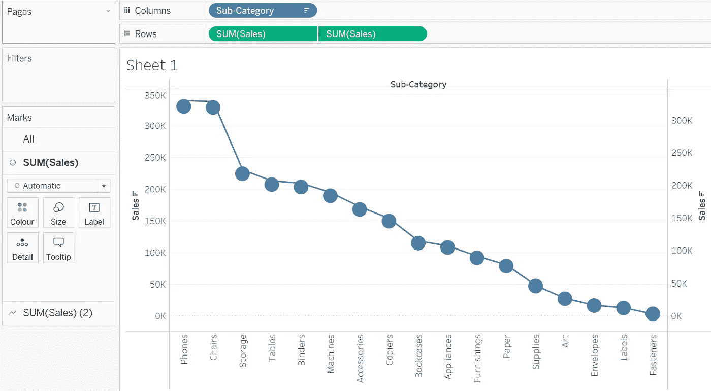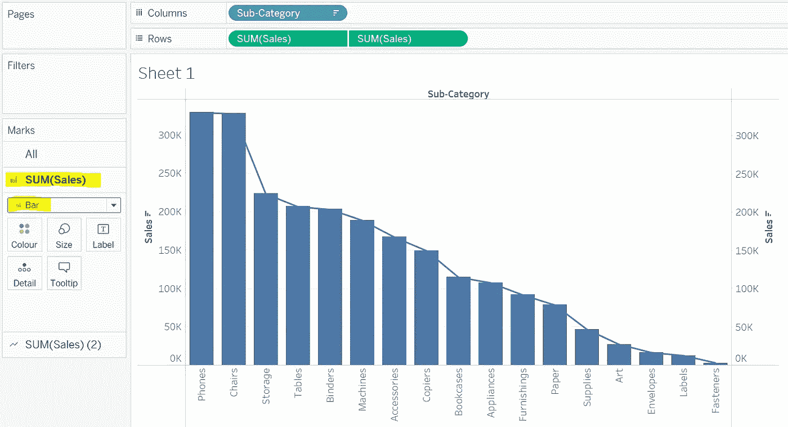

**步骤 6:** 在第二个 SUM(Sales)字段中，使用选项菜单执行“快速表格计算→运行合计”

**步骤 7:** 使用“第二总和(销售额)”字段选项菜单中的“编辑表格计算”

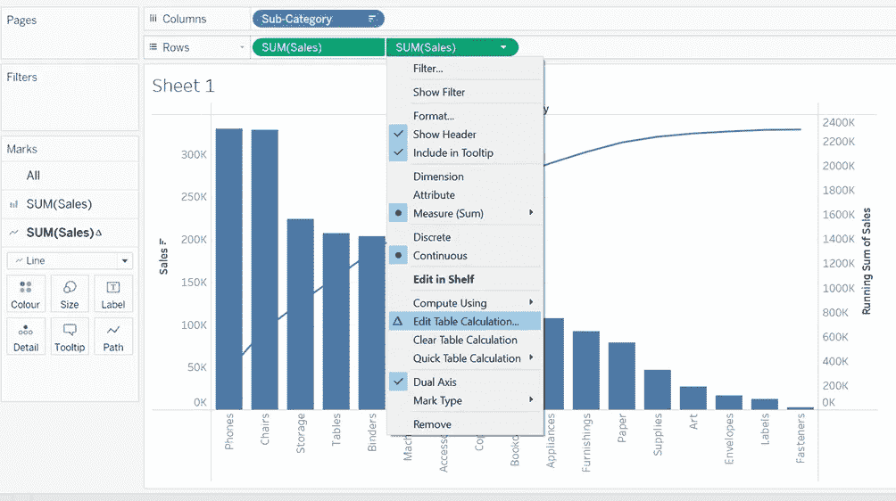

在**编辑表格计算**窗口中，点击**添加辅助计算**并将**辅助计算类型**更改为**总百分比。**

启用显示选项来显示数值并调整字体，Pareto 就准备好了！！！！

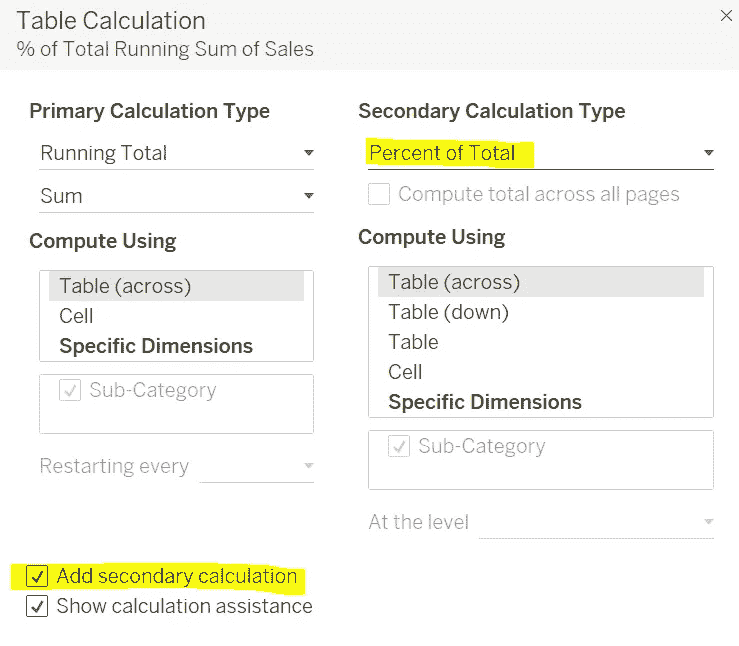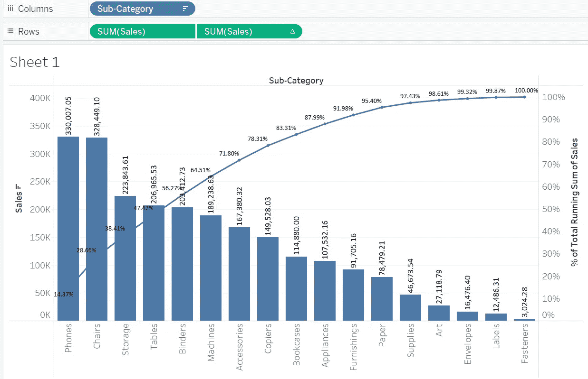

**步骤 8** :右键点击右手轴，添加参考线

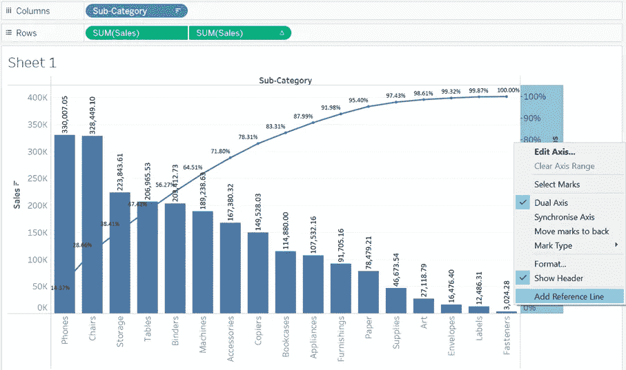

在下一个屏幕中，将 SUM 选项更改为 Constant，并将值添加为 0.8

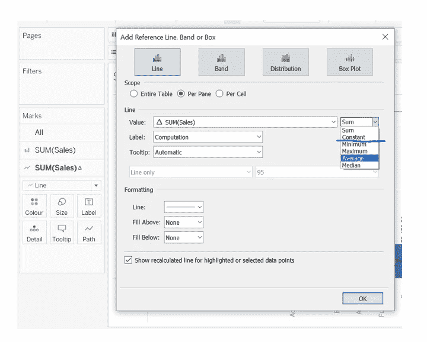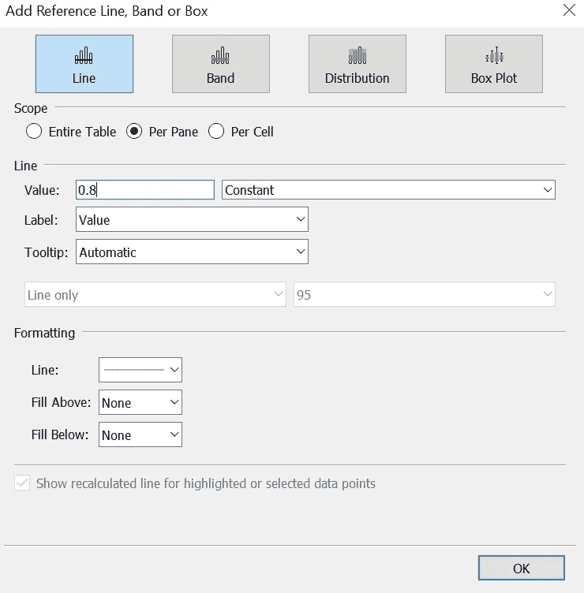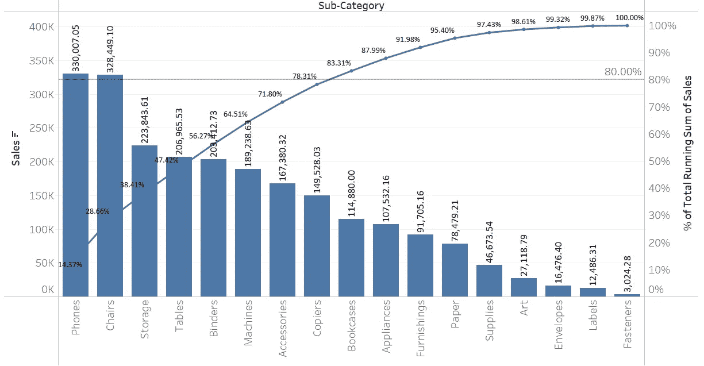

瞧啊。帕累托准备好了。