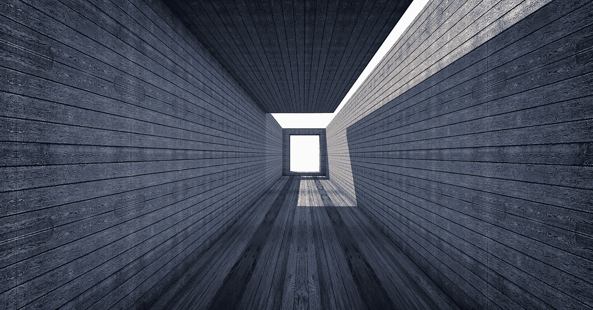
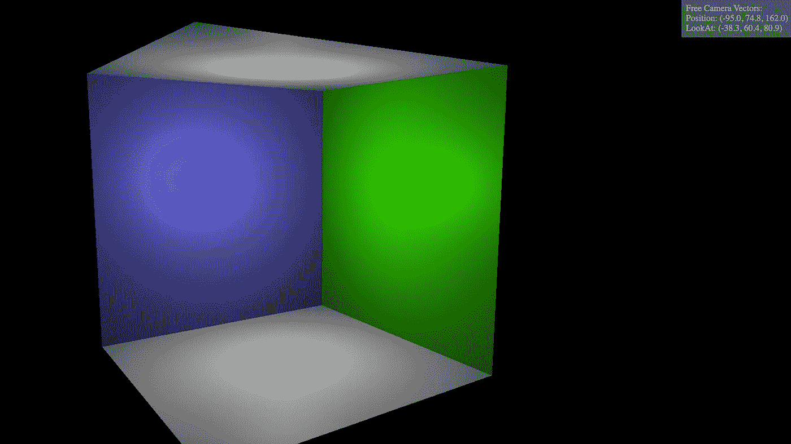

# 如何像专业人士一样控制 Three.js 相机

> 原文：<https://medium.com/geekculture/how-to-control-three-js-camera-like-a-pro-a8575a717a2?source=collection_archive---------1----------------------->



在本指南中，我将带你完成使用`FlyControls`来获得你想要的相机最佳角度的位置和注视向量的步骤。为了简单起见，我只用`PerspectiveCamera`来演示。

当我第一次开始学习 Three.js 时，挑战之一是找到正确的角度来查看我的对象。如果你只有一个物体在宇宙的中心(0，0，0)，这不会困扰你。但是一旦你的场景得到越来越多的物体，你可能会发现很难在你的大脑中进行 3d 矢量计算来为你的相机选择正确的位置和方向。

你可能会说，“嘿，你有轨道控制器来帮你！”嗯，是的，但是在某些情况下`[OrbitControls](https://threejs.org/docs/#examples/en/controls/OrbitControls)`可能还不够。有时，您希望相机不仅仅围绕场景中的特定点旋转。

# 输入飞行控制

有了`[FlyControls](https://threejs.org/docs/#examples/en/controls/FlyControls)`，你终于可以带着相机在你的场景里自由的漫游*。一旦将它添加到代码中，您就可以使用这些键进行移动:*

*   *WASD (W:向前，S:向后，A:向左，D:向右)*
*   *RF (R:上升，F:下降)*
*   *QE(卷)*
*   *↑ ↓(音高)*
*   *← →(偏航)*

*这一点在 [this three.js 示例](https://threejs.org/examples/#misc_controls_fly)中有所展示。这个例子的源代码是学习使用`FlyControls`的一个起点，但是当你只是想学习`FlyControls`的时候，行星和恒星网格是相当令人分心的。这就是为什么我写这篇文章是为了提供一个更简单、更清晰的例子来展示`FlyControls`、**是如何工作的，只需要 3 个步骤**。*

# *FlyControls 用法*

*在这次提交中，我提交了工作代码来演示`FlyControls` [在我的 Github repo 上的基本用法。在下面我正在粘贴的`index.js`中，跟随编号注释来理解它的用法:](https://github.com/franky-adl/threejs-camera-demo/tree/a816f8563694b43fd7864af35ac777c77e73a802)*

```
*import './style.css';import * as THREE from 'three';
// 1\. import FlyControls
import { FlyControls } from 'three/examples/jsm/controls/FlyControls'import { addWallLighting, addRoom } from './common';let camera, scene, canvas, controls, rendererinit()
animate()function init() {
  scene = new THREE.Scene();
  canvas = document.querySelector("#canvas"); // Set up the renderer
  renderer = new THREE.WebGLRenderer({canvas});
  renderer.setSize( window.innerWidth, window.innerHeight ); // Set up camera
  camera = new THREE.PerspectiveCamera( 45, window.innerWidth / window.innerHeight, 1, 500);
  camera.position.set( 0, 75, 160 ); // 2\. Initiate FlyControls with various params
  controls = new FlyControls( camera, renderer.domElement );
  controls.movementSpeed = 100;
  controls.rollSpeed = Math.PI / 24;
  controls.autoForward = false;
  controls.dragToLook = true; // set up a basic room scene
  addWallLighting(scene);
  addRoom(scene);
}// Animate the scene
function animate() {
  renderer.render( scene, camera ); // 3\. update controls with a small step value to "power its engines"
  controls.update(0.01) requestAnimationFrame( animate );
};*
```

*除了编号代码部分之外的其他代码有助于建立一个基本的 Three.js 场景，即使你是 Three.js 初学者，你也应该很快认出这个模式。*

*我将`dragToLook`设置为 true，这样自由摄像机就不会随着我的鼠标在场景上移动，我之前发现这很烦人。现在，只有当我用鼠标拖动或按键时，它才会移动。*

*`FlyControls`和`OrbitControls`最大的区别是你需要在你的动画循环中加入第三步`controls.update(delta)`来让它工作。起初，我不知道需要调用第三步，我想‘WTH，我的相机不动了！’30 分钟，因为我最初认为这将是一样的`OrbitControls`。在检查了`FlyControls`的源代码后，发现`update`函数是摄像机移动的驱动程序:*

```
*this.update = function ( delta ) { const moveMult = delta * scope.movementSpeed;
    const rotMult = delta * scope.rollSpeed; scope.object.translateX( scope.moveVector.x * moveMult );
    scope.object.translateY( scope.moveVector.y * moveMult );
    scope.object.translateZ( scope.moveVector.z * moveMult ); scope.tmpQuaternion.set( scope.rotationVector.x * rotMult, scope.rotationVector.y * rotMult, scope.rotationVector.z * rotMult, 1 ).normalize();
    scope.object.quaternion.multiply( scope.tmpQuaternion ); if (
        lastPosition.distanceToSquared( scope.object.position ) > EPS ||
        8 * ( 1 - lastQuaternion.dot( scope.object.quaternion ) ) > EPS
    ) { scope.dispatchEvent( _changeEvent );
        lastQuaternion.copy( scope.object.quaternion );
        lastPosition.copy( scope.object.position ); }};*
```

*所以有两个地方你可以调整你的`FlyControls`的飞行速度，第一个是`controls.movementSpeed`，第二个是你传递给`controls.update(step)`的步长值，最后两者基本上是相乘的正如你在上面的源代码中看到的。*

# *获取自由摄像机的位置和注视向量*

*现在我们有了一个可以工作的自由摄像机，当你在场景中飞行时，你可能也想知道摄像机的位置和注视向量。因为如果你正在为你的场景寻找一个完美的角度，你将需要为你的相机设置正确的位置和注视向量。*

*摄像机的位置很容易得到，只需访问 position 属性的 x/y/z 属性，就像这样:`camera.position.x`。但是获取相机的观察向量有点棘手，因为没有直接的方法。不要担心，我会解释我们如何在你飞来飞去的时候在场景中显示相机的位置向量和注视向量。*

*下面的代码可以在[这个提交](https://github.com/franky-adl/threejs-camera-demo/tree/ed8f80e9343d6c76c62d6953d75cee61b698d45e)中找到。*

*首先，让我们在`index.html`中添加 span 元素:*

```
*<!doctype html>
<html class="no-js" lang=""><head>
  <meta charset="utf-8">
  <title>ThreeJS Camera Demo</title>
  <meta name="description" content="Your Site Description.">
  <meta name="viewport" content="minimum-scale=1, initial-scale=1, width=device-width">
</head><body>
  <canvas id="canvas"></canvas>
  <!-- 1\. create spans for displaying camera position and lookAt vectors -->
  <div id="camera-vectors">
    <span>Free Camera Vectors:</span><br>
    <span id="position"></span><br>
    <span id="lookingAt"></span>
  </div>
</body></html>*
```

*然后添加 css 使其位于`style.css`的右上方:*

```
*body {
  margin: 0;
}#canvas {
  width: 100%;
  height: 100%;
  display: block;
}/* 2\. set appropriate css for the camera vectors */
#camera-vectors {
  position: absolute;
  top: 0;
  right: 0;
  background: grey;
  padding: 8px;
  color: white;
}*
```

*最后，按照`index.js`中的步骤 3 至 5 计算并显示位置和注视矢量值:*

```
*import './style.css';import * as THREE from 'three';import { FlyControls } from 'three/examples/jsm/controls/FlyControls'import { addWallLighting, addRoom } from './common';let camera, scene, canvas, controls, renderer
// 3\. define cameraDirection and span variables
let cameraDirection = new THREE.Vector3()
let camPositionSpan, camLookAtSpaninit()
animate()function init() {
  scene = new THREE.Scene();
  canvas = document.querySelector("#canvas");
  // 4\. set the spans with the queried HTML DOM elements
  camPositionSpan = document.querySelector("#position");
  camLookAtSpan = document.querySelector("#lookingAt"); // Set up the renderer
  renderer = new THREE.WebGLRenderer({canvas});
  renderer.setSize( window.innerWidth, window.innerHeight ); // Set up camera
  camera = new THREE.PerspectiveCamera( 45, window.innerWidth / window.innerHeight, 1, 500);
  camera.position.set(0, 75, 160); // Initiate FlyControls with various params
  controls = new FlyControls( camera, renderer.domElement );
  controls.movementSpeed = 100;
  controls.rollSpeed = Math.PI / 24;
  controls.autoForward = false;
  controls.dragToLook = true; // set up a basic room scene
  addWallLighting(scene);
  addRoom(scene);
}// Animate the scene
function animate() {
  renderer.render( scene, camera ); // update controls with a small step value to "power its engines"
  controls.update(0.01) // 5\. calculate and display the vector values on screen
  // this copies the camera's unit vector direction to cameraDirection
  camera.getWorldDirection(cameraDirection)
  // scale the unit vector up to get a more intuitive value
  cameraDirection.set(cameraDirection.x * 100, cameraDirection.y * 100, cameraDirection.z * 100)
  // update the onscreen spans with the camera's position and lookAt vectors
  camPositionSpan.innerHTML = `Position: (${camera.position.x.toFixed(1)}, ${camera.position.y.toFixed(1)}, ${camera.position.z.toFixed(1)})`
  camLookAtSpan.innerHTML = `LookAt: (${(camera.position.x + cameraDirection.x).toFixed(1)}, ${(camera.position.y + cameraDirection.y).toFixed(1)}, ${(camera.position.z + cameraDirection.z).toFixed(1)})` requestAnimationFrame( animate );
};*
```

*这里的技巧是首先通过`camera.[getWorldDirection](https://threejs.org/docs/#api/en/cameras/Camera.getWorldDirection)`得到一个单位向量，这个向量表示相机正在看的世界空间方向。结果正在被复制到`cameraDirection`中。因为它是一个单位向量，我们想放大这些值，这样这些数字在你的场景中更有意义。然后，为了得到你的摄像机正看着的点的最终世界空间矢量，我们把摄像机的位置矢量和放大的`cameraDirection`相加。这是[我们通常如何做矢量加法](https://www.intmath.com/vectors/7-vectors-in-3d-space.php#adding)，简单地分别把 x/y/z 相加，你就完成了。*

*结果是右上角的这个简洁的小部件显示了我们的免费摄像机在哪里，并实时查看:*

**