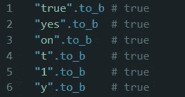
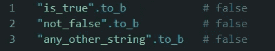

# 如何在 Ruby 中将字符串转换成布尔值

> 原文：<https://medium.com/geekculture/how-to-convert-strings-to-booleans-in-ruby-f17abb2f0a7b?source=collection_archive---------15----------------------->

Photo by [Fleur](https://unsplash.com/@yer_a_wizard?utm_source=medium&utm_medium=referral) on [Unsplash](https://unsplash.com?utm_source=medium&utm_medium=referral)

在最近的一个项目中，我发现了一个作用于 API 响应的保护条款。我的应用程序根据 API 返回的值是真还是假向用户返回了一条特定的消息。不管这个 API 是不稳定的，还是之前的开发者太过谨慎，我发现在我们检查的属性的末尾附加了一个“to_b”。虽然我以前使用过“to_b ”,但我从未深入了解过它的内部工作原理，并且很想了解更多。

与第三方 API 交互的最大挑战之一是让您的逻辑和 API 的响应相匹配。API 响应从许多不同类型的数据库中提取，这些数据库存储不同的可能值，用于判断真假。当一个 API 发送一个带有布尔值的响应对象时，我们要问的是 true 一个字符串“true”，一个 1 或者甚至只是一个布尔值 true？因为这是一个常见的问题，Ruby 提供了“to_b”字符串方法。

**什么是 to_b 法？**

“to_b”方法是一种特定于字符串的方法，Ruby 使用它来将对象评估为布尔值。这个方法的价值令人难以置信，因为它可以添加到任何字符串，以确定值是真还是假。这对于 JSON 响应尤其有价值，因为 JSON 对象中的所有值都是字符串。

要理解这个方法的响应，必须知道“string.to_b”有三种可能的响应:真、假、nil。

我们先来看看产生 nil 的字符串。如果对“nil”或“null”调用“to_b ”,将返回 nil。Ruby 不使用“null ”,那么它为什么要产生“nil”的响应呢？这是一个很好的观点，虽然 Ruby 不使用“null ”,但是 JavaScript 使用，所以它将返回一个缺少赋值的“null ”,然后可以转换为“nil ”,以便在 Ruby 中使用。

“to_b”的下一个可能结果为真。True 在编程中可以表示为很多东西，但是只有某些字符串“to_b”会转换为布尔值 true。它们是:

Figure 1\. All strings that will evaluate to true

“to_b”的最终可能返回值包含所有其他字符串。除了上面列出的字符串之外，对任何其他字符串调用“to_b”都将返回值“false”。如果我们用“to_b”运行以下任何字符串，我们将总是得到 false:

Figure 2\. Some of the many strings that evaluate to false

**结论**

现在，您对“to_b”字符串方法有了更多的了解，希望您能够更好地集成来自 API 响应的逻辑。请在评论中告诉我你将如何使用“to_b”来重构你现有的代码，或者提高未来项目的弹性！

**注意事项**

[https://www . ruby doc . info/github/ruby works/facets/String:to _ b](https://www.rubydoc.info/github/rubyworks/facets/String:to_b)