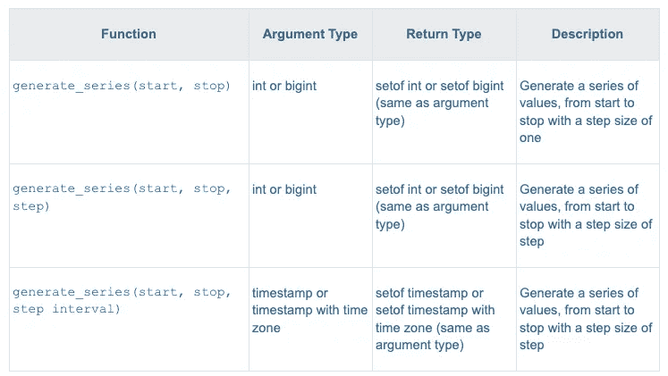
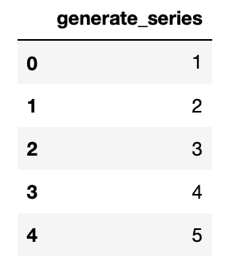
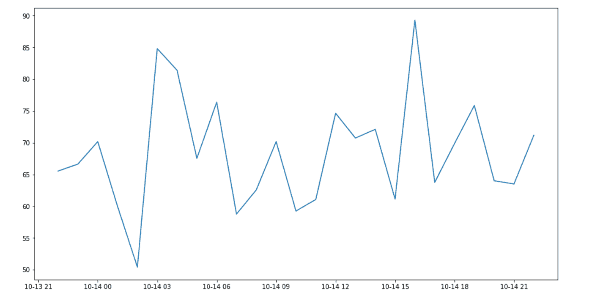
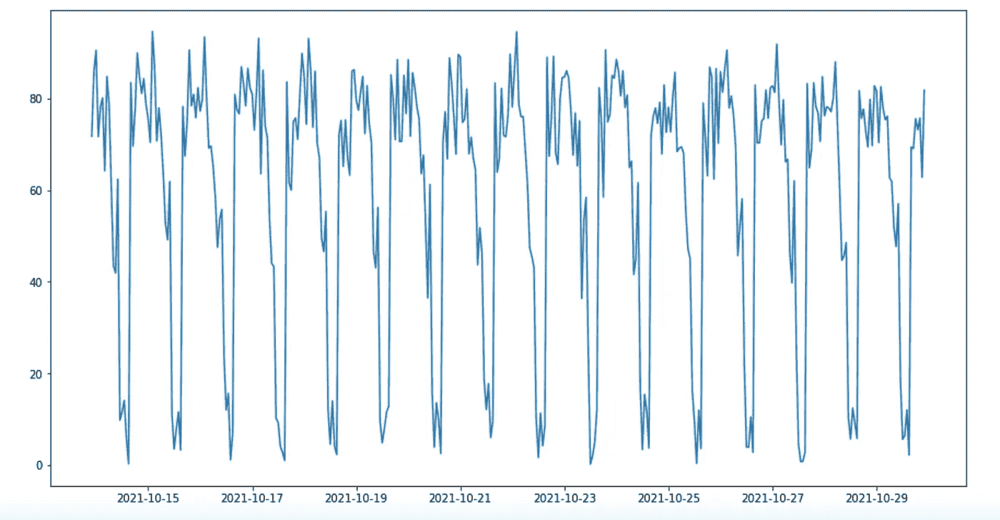
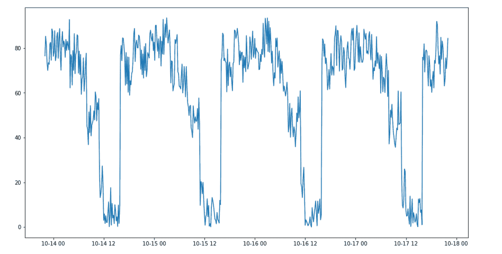
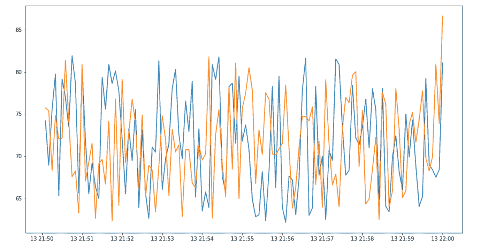

# 如何在几秒钟内用 PostgreSQL 创建 3750 万个数据

> 原文：<https://medium.com/geekculture/how-to-create-37-5-million-data-in-postgresql-in-a-matter-of-seconds-858693976d17?source=collection_archive---------1----------------------->

本系列包括两篇文章:

1.  [如何在几秒钟内用 PostgreSQL 创建 3750 万条数据](/geekculture/how-to-create-37-5-million-data-in-postgresql-in-a-matter-of-seconds-858693976d17?sk=888ccfc6d0747b5df266955497ce7e7a)
2.  [优化拥有数百万数据的 PostgreSQL 数据库的 4 种方法](https://josipvojak.com/4-ways-to-optimise-postgresql-database-with-millions-of-data-c70e11d27a94?sk=d2c6b400b64e89304a0a2da28eb83531)


当您需要访问以特定方式形成和建模的大量数据时，有几个明显的原因:

*   测试一项功能
*   运行基准测试
*   出于学习目的(例如，学习用于创建图表的库)
*   用于测试和学习数据库优化技术

# 数据，数据，更多的数据。

幸运的是，PostgreSQL 提供了一个现成的解决方案来创建大量的样本数据。这个令人惊叹的特性是以 PostgreSQL 函数的形式出现的。

拥有真实的数据总是最好的，但从真实的用户和设备获取数据可能会很笨拙，可能需要几周、几个月或几年才能获得这么多信息。

但有时，这是不可能的，你现在就需要这些数据。事实上，有一个属于 PostgreSQL 的内在函数，我将向您展示如何使用它，从非常基础的角度到更高级的技术，以获得更随机但同时更真实的数据。

## PostgreSQL 函数— generate_series()

那么，这是怎么回事？有一个 generate_series()函数可以创建大型数据集。
首先，让我们来看看函数语句，它有三种方式:



PostgreSQL Set Returning Functions

在深入研究函数能力之前，让我们创建一个示例数据库。我把它叫做 *dummy_data。*

```
CREATE DATABASE dummy_data;
\c dummy_dataYou are now connected to database "dummy_data" as user "postgres".
```

**generate_series** ()让我们可以轻松地创建数字或日期的有序表格，PostgreSQL 称之为[集合返回函数](https://www.postgresql.org/docs/13/functions-srf.html)，因为它可以返回多行。

## 1.生成系列(开始，停止)

让我们从学习使用第一个定义开始。

```
SELECT * FROM generate_series(1,5);generate_series
-----------------
1
2
3
4
5(5 rows)
```

这将生成一系列整数，从 1 开始，以 5 结束。

## 2.生成系列(开始、停止、步进)

第二种方法是，生成一个包含一个步骤的序列。这将生成一个序列，从 0 开始，到 10 结束，步长为 2。

```
SELECT * from generate_series(0,10,2);generate_series
— — — — — — — -
0
2
4
6
8
10(6 rows)
```

## 3.generate_series(开始、停止、步长间隔)

我们还可以将 generate_series()与日期一起使用，如下所示，如果我们提供一个步长间隔作为第三个参数:

```
SELECT * from generate_series(
   ‘2021–10–14’,
   ‘2021–10–15’, 
   INTERVAL ‘1 hour’
);generate_series
— — — — — — — — — — — 
2021–10–14 00:00:00+02
2021–10–14 01:00:00+02
2021–10–14 02:00:00+02
2021–10–14 03:00:00+02
2021–10–14 04:00:00+02
2021–10–14 05:00:00+02
2021–10–14 06:00:00+02
2021–10–14 07:00:00+02
2021–10–14 08:00:00+02
2021–10–14 09:00:00+02
2021–10–14 10:00:00+02
2021–10–14 11:00:00+02
2021–10–14 12:00:00+02
2021–10–14 13:00:00+02
2021–10–14 14:00:00+02
2021–10–14 15:00:00+02
2021–10–14 16:00:00+02
2021–10–14 17:00:00+02
2021–10–14 18:00:00+02
2021–10–14 19:00:00+02
2021–10–14 20:00:00+02
2021–10–14 21:00:00+02
2021–10–14 22:00:00+02
2021–10–14 23:00:00+02
2021–10–15 00:00:00+02(25 rows)
```

返回的日期包括开始和停止值，就像数字示例一样。

输出返回 25 行，而不是预期的 24 行，因为可以使用一小时间隔(步骤参数)达到**停止值。然而，**如果间隔被跳过，它将不会被包括**，我们可以通过修改上面的查询来检查:**

```
SELECT * from generate_series(
   '2021-10-14',
   '2021-10-15',
   INTERVAL '1 hour 25 minutes'
);generate_series
------------------------
2021-10-14 00:00:00+02
2021-10-14 01:25:00+02
2021-10-14 02:50:00+02
2021-10-14 04:15:00+02
2021-10-14 05:40:00+02
2021-10-14 07:05:00+02
2021-10-14 08:30:00+02
2021-10-14 09:55:00+02
2021-10-14 11:20:00+02
2021-10-14 12:45:00+02
2021-10-14 14:10:00+02
2021-10-14 15:35:00+02
2021-10-14 17:00:00+02
2021-10-14 18:25:00+02
2021-10-14 19:50:00+02
2021-10-14 21:15:00+02
2021-10-14 22:40:00+02(17 rows)
```

这返回了 **17 行，而不是 18 行**，因为如果我们加上 1 小时 25 分钟，就会得到日期 2021–10–15 00:05:00+02，这是越界的。

# 加密挖掘器—数据生成器示例

既然我们已经了解了基础知识，我们可以从一个更具体的例子开始。

假设我们想要为加密硬币矿工人工创建指标——我们可能想要跟踪 CPU 使用率、平均兆哈希/秒、矿工温度、粉丝百分比。

## 摆桌子

我们可以从创建一个名为 miners 的样本表开始，假设我拥有三个 miners。我们可以给它们命名:

1.  钻石
2.  铂
3.  金色的

```
CREATE TABLE IF NOT EXISTS miners (
id smallint,
name varchar(20),
graphic_cards smallint 
);INSERT INTO 
   miners (id, name, graphic_cards) 
   VALUES 
      (1, 'Diamond', 10), 
      (2, 'Platinum', 7), 
      (3, 'Gold', 4);SELECT * FROM miners;
 id |   name   | graphic_cards 
----+----------+---------------
  1 | Diamond  |            10
  2 | Platinum |             7
  3 | Gold     |             4
```

现在，让我们为这三个矿工创建一天的数据—每个矿工每小时一个条目。

```
SELECT 
   miners.name, 
   s1.time as time, 
   random() * (100–0) + 0 AS cpu_usage, 
   random() * (30–26) + 26 * graphic_cards AS average_mhs, 
   random() * (90–50) + 50 AS temperature, 
   random() * (100–0) + 0 AS fan 
FROM generate_series(
   ‘2021–10–14’, 
   ‘2021–10–15’, 
   INTERVAL ‘1 hour’) AS s1(time) 
CROSS JOIN(
   SELECT 
      id,
      name, 
      graphic_cards 
   FROM miners
) miners 
ORDER BY 
  miners.id, 
  s1.time;
```

查询解释，如果你不明白:

*   我们有**名称**、**时间**、 **cpu_usage** 、 **average_mhs** 、**温度**和**风扇**值:
*   cpu_usage、average_mhs、温度和风扇值完全是随机的
*   **cpu_usage** 可以从 0% — 100%
*   **average_mhs** —我举了一个例子，一个显卡可以产生 26-30 Mh/s 的速度
*   **温度**——在 50 到 90 度之间变化
*   **风扇** —从 0% — 100%
*   **系列为 2021–10–14 和 2021–10–15 之间的每小时**生成，步长为 1 小时(01:00、02:00、03:00 等)
*   **交叉连接先前创建的矿工表**，其中包含矿工姓名和显卡数量的信息
*   **先按矿工 id**排序，然后每个分组按时间升序排序

这将产生与此类似的输出(由于用于 cpu_usage、average_mhs、temperature 和 fan 的 random()函数不同，输出会有所不同)。

## Jupyter 笔记本

为了在图表中显示数值，我决定使用一个简单的 **jupyter 笔记本**，这样我们就能对数据有所了解。

如果你不熟悉 jupyter，那也没关系——它是一个交互式 web 工具，用于将软件代码、计算输出、说明性文本和多媒体资源组合在一个文档中。它由 Python 驱动，但是您可以使用许多其他语言来绘制数据。

这是我将用于显示表格或绘制图表的示例代码:

```
import psycopg2 as pg
import pandas.io.sql as psql
import matplotlib.pyplot as pltconn = pg.connect(host=”localhost”, database=”dummy_data”, user=”postgres”, password=”password”)df = psql.read_sql(‘SELECT * FROM generate_series(1,5)’, conn)df.head()
```

这将产生与从命令行查询 Postgres 数据库相同的输出:



Using jupyter notebook to display table data

总而言之，这只是运行在 jupyter 笔记本上的 python 代码:

*   连接到数据库
*   执行查询
*   在表格中显示数据。

## 绘图数据

例如，我可以绘制钻石矿工的温度(使用我们在上面已经看到的查询):

```
import psycopg2 as pg
import pandas.io.sql as psql
import matplotlib.pyplot as pltconn = pg.connect(host="localhost", database="dummy_data", user="postgres", password="password")query_string = """
   SELECT miners.name, s1.time,
      random() * (100-0) + 0 AS cpu_usage,
      random() * (30-26) + 26 * graphic_cards AS  average_mhs,
      random() * (90-50) + 50 AS temperature,
      random() * (100-0) + 0 AS fan
   FROM generate_series(
      '2021-10-14', 
      '2021-10-15', 
      INTERVAL '1 hour') AS s1(time)
   CROSS JOIN(
      SELECT id, name, graphic_cards 
      FROM miners 
      WHERE 
         name = 'Diamond'
   ) miners
   ORDER BY miners.id, s1.time;
"""df = psql.read_sql(query_string, conn)
#dfplt.figure(figsize=(15,8))
plt.plot(df["time"], df["temperature"])
plt.show
```

我稍微修改了一下查询，只返回**钻石**矿工的数据。我还添加了 plt.figure，plt.plot & plt.show。这将创建一个图形，定义 x 和 y 轴，并显示绘图。它产生了下面的情节:



Displaying temperature over time for Diamond miner

但是，这似乎不太现实。我们可以试着改变这个想法来获得更真实的数据

# 更现实的方法

例如，我们可以说矿工只在下午 6 点到上午 10 点之间工作，因为那时的电费比较便宜。

这将直接影响温度、风扇、average_mhs 和 cpu_usage。因此，让我们确定一个时间表，假设从上午 10 点到下午 6 点，我们用它来工作，从下午 6 点到上午 10 点，我们用它来挖掘加密。

这样，我们仍然可以预期在我们的工作时间中会有一些移动和随机性，而当 miner 用于挖掘 crypto 时，值将接近峰值。

此外，我们还可以假设，一天中可能有一半时间，我们渲染视频并进行一些中等程度的数据处理，因此在这段时间内，我们的工作强度会稍高一些，而其余时间则是随意使用，可能是阅读、文档等。

## 添加更多分散体

因此，总结一下，我们有三个不同强度的三个周期:

*   **下午 6 点—上午 10 点—高强度**
*   **上午 10 点—下午 2 点—中等强度**
*   **下午 2 点— 6 点—低强度**

要继续，创建一个具有强度的表，从 0 到 1 描述一天中的每个小时，以增加更多的分散。
表格会很简单:

```
CREATE TABLE hours ( 
  hour INT NOT NULL, 
  intensity NUMERIC NOT NULL
);
```

一天有 24 个小时，我们将根据以下规则定义每个小时的强度:

*   **低强度从 0–20%**
*   **中等强度为 21–75%**
*   **高强度超过 75%**

```
INSERT INTO hours(hour, intensity) VALUES
 (1,.9),
 (2,.92),
 (3,.89),
 (4,.95),
 (5,.94),
 (6,.80),
 (7,.88),
 (8,.79),
 (9,.78),
 (10,.56),
 (11,.55),
 (12,.63),
 (13,.28),
 (14,.14),
 (15,.18),
 (16,.07),
 (17,.07),
 (18,.89),
 (19,.8),
 (20,.78),
 (21,.92),
 (22,.86),
 (23,.82),
 (0,.87);
```

现在，我们有一个这样的表格:

```
SELECT * FROM hours;hour  | intensity 
------+-----------
    1 |       0.9
    2 |      0.92
    3 |      0.89
    4 |      0.95
    5 |      0.94
    6 |      0.80
    7 |      0.88
    8 |      0.79
    9 |      0.78
   10 |      0.56
   11 |      0.55
   12 |      0.63
   13 |      0.28
   14 |      0.14
   15 |      0.18
   16 |      0.07
   17 |      0.07
   18 |      0.89
   19 |       0.8
   20 |      0.78
   21 |      0.92
   22 |      0.86
   23 |      0.82
   0  |      0.87
```

我们可以使用前面提到的值来定义峰值使用值(或某段时间内允许的最大值)，并使用如下查询:

```
SELECT 
   a.HOURLY, 
   ABS(intensity - rval)*100 as value
FROM( 
   SELECT 
      HOURLY, 
      date_part('hour', HOURLY) _hour, 
      random()*0.2 as rval, 
      intensity                    
   FROM generate_series(
      '2021-10-14', 
      '2021-10-30', 
      INTERVAL '1 hour'
   ) HOURLY
   INNER JOIN hours h ON date_part('hour', HOURLY) = h.hour 
   ORDER BY hourly
) AS a;
```

..为了得到一个随机值，它将比峰值低 20%。
查询中发生了什么？

我们可以从检查内部查询开始:

```
SELECT * FROM generate_series(
   '2021-10-14', 
   '2021-10-30', 
   INTERVAL '1 hour'
) HOURLY;
```

这将产生一系列时间，从 2021–10–14 00:00:00 开始，到 2021–10–30 00:00:00 结束，增量为 1 小时。

示例:

```
2021-10-14 00:00:00+02
2021-10-14 01:00:00+02
2021-10-14 02:00:00+02
2021-10-14 03:00:00+02
2021-10-14 04:00:00+02
...
2021-10-30 00:00:00+02
```

接下来，我们可以继续使用之前创建的 ***hours*** 表中的内部连接:

```
SELECT * FROM generate_series(
   '2021-10-14', 
   '2021-10-30', 
   INTERVAL '1 hour'
) HOURLY
INNER JOIN hours h ON date_part('hour', HOURLY) = h.hour 
ORDER BY hourly;
```

这将创建一个包含三列的表:

*   每小时一次
*   **小时**
*   **强度**

并将(小时，强度)对应用于我们先前生成的从**2021–10–14 00:00:00**到**2021–10–30 00:00:00**的一系列小时中的每个小时

输出如下所示:

```
hourly                  | hour | intensity 
------------------------+------+-----------
 2021-10-14 00:00:00+02 |    0 |      0.87
 2021-10-14 01:00:00+02 |    1 |       0.9
 2021-10-14 02:00:00+02 |    2 |      0.92
 2021-10-14 03:00:00+02 |    3 |      0.89
 2021-10-14 04:00:00+02 |    4 |      0.95
 2021-10-14 05:00:00+02 |    5 |      0.94
 2021-10-14 06:00:00+02 |    6 |      0.80
 2021-10-14 07:00:00+02 |    7 |      0.88
 ...
 2021-10-30 00:00:00+02 |    0 |      0.87
```

如果我们将其添加到外部查询中:

```
SELECT * FROM( 
   SELECT 
      HOURLY, 
      date_part(‘hour’, HOURLY) _hour, 
      random()*0.2 as rval, 
      intensity
   FROM generate_series(
      ‘2021–10–14’, 
      ‘2021–10–30’, 
      INTERVAL ‘1 hour’
   ) HOURLY
   INNER JOIN hours h ON date_part(‘hour’, HOURLY) = h.hour 
   ORDER BY hourly
) AS a;
```

这将得到四列:

*   **每小时**
*   **_ 小时**
*   **rval**
*   **强度**

其中三个是先前已知的，现在我们只计算一个 rval，它是一个从 0–0.2(0–20%)的随机数，**它将在最后一次查询中从强度**中减去(并且用 ABS 包装，这样我们永远不会得到负值)。

最终产品如下所示:



Displaying temperature data for period 10/14/2021–10/30/2021 randomly generated with three intensity factors — low, medium, and high

我们可以看到，它的行为与我们在初始语句中描述的一样:

**下午 6 点—上午 10 点—高强度
上午 10 点—下午 2 点—中等强度
下午 2 点—下午 6 点—低强度**

也许以 10 分钟为间隔查看三个不同的强度级别会更好:



10-minute interval with 3 intensity levels

当值从 0–100%变化时，这可以模仿矿工的 **fan** values 的行为。通过应用简单或更复杂的数学，我们也可以得到其他值。

让我们假设这是一个适合我们需求的模型。现在，我们必须为所有设备创建数据，为期一年，增量为一小时？

瞧。

```
SELECT 
   name, 
   HOURLY, 
   abs(intensity - rval)*100 as fan                
FROM( 
   SELECT 
      miners.name, 
      HOURLY, 
      date_part('hour', HOURLY) _hour, 
      random()*0.2 as rval
   FROM generate_series(
      '2020-10-14', 
      '2021-10-14', 
      INTERVAL '1 hour'
) HOURLY
CROSS JOIN(
   SELECT DISTINCT(name) 
   FROM miners
) miners
) m
INNER JOIN hours h ON date_part('hour', HOURLY) = h.hour 
ORDER BY hourly;
```

如果我们这样计算，总共有 **26283 行— (3 个设备 x 24h 小时 x 365 天)+2021–10–14 00:00:00 的 3 个条目**(每个设备)= 26283。

# 插入大量数据

我们用 5 秒步长增量代替 1 小时增量，再加三个设备:**银级，铜级，默认**。

```
INSERT INTO 
   miners (id, name, graphic_cards) 
VALUES 
   (4, 'Silver', 3), 
   (5, 'Bronze', 2), 
   (6, 'Default', 1);
```

打开 PostgreSQL 计时，打开**\计时。**

计算行数:

```
#InputSELECT COUNT(*) FROM(
   SELECT 
      name, 
      HOURLY, 
     abs(intensity - rval)*100 as fan                
   FROM( 
      SELECT 
         miners.name, 
         HOURLY, 
         date_part('hour', HOURLY) _hour, 
         random()*0.2 as rval
      FROM generate_series(
         '2020-10-14', 
         '2021-10-14', 
         INTERVAL '5 second') HOURLY
   CROSS JOIN(
      SELECT DISTINCT(name) 
      FROM miners) 
   miners) m
INNER JOIN hours h ON date_part('hour', HOURLY) = h.hour 
ORDER BY hourly) e;# Outputcount   
----------
 37843206
(1 row)Time: 48916.613 ms (00:48.917)
```

我们花了 48 秒创建了 3784.3 万个数据。
最后，让我们将它插入到一个表格中，这样我们就不必每次都计算数据了:

```
CREATE TABLE IF NOT EXISTS miner_data(
 time TIMESTAMPTZ NOT NULL,
 miner_name VARCHAR(20),
 fan_percentage FLOAT
);
```

添加随机数据(这需要一些时间):

```
INSERT INTO miner_data(
   miner_name, 
   time, 
   fan_percentage) 
SELECT 
   name, 
   HOURLY, 
   abs(intensity - rval)*100 as fan
FROM( 
   SELECT 
      miners.name, 
      HOURLY, 
      date_part('hour', HOURLY) _hour, 
      random()*0.2 as rval
   FROM generate_series(
      '2020-10-14', 
      '2021-10-14', 
      INTERVAL '5 second'
   ) HOURLY
CROSS JOIN(
   SELECT DISTINCT(name) 
   FROM miners) 
miners) m
INNER JOIN hours h ON date_part('hour', HOURLY) = h.hour 
ORDER BY hourly;INSERT 0 37843206
Time: 161775.825 ms (02:41.776)
```

差不多三分钟就搞定了。

要查看我们的数据，假设我们绘制了过去 10 分钟的钻石和默认矿工粉丝百分比(每分钟 12 条记录* 10 分钟=每个设备在图上有 120 个条目)。

下面是 jupyter 笔记本/python 代码:

```
import psycopg2 as pg
import pandas.io.sql as psql
import matplotlib.pyplot as plt
conn = pg.connect(host="localhost", database="dummy_data", user="postgres", password="password")query_string1 = """
                SELECT * FROM miner_data WHERE miner_name = 'Diamond' ORDER BY TIME DESC LIMIT 120;
                """query_string2 = """
                SELECT * FROM miner_data WHERE miner_name = 'Default' ORDER BY TIME DESC LIMIT 120;
                """df1 = psql.read_sql(query_string1, conn)
df2 = psql.read_sql(query_string2, conn)
#dfplt.figure(figsize=(15,8))
plt.plot(df1["time"], df1["fan_percentage"])
plt.plot(df2["time"], df2["fan_percentage"])
plt.show
```

最后的输出是:



我们已经成功地创建了 3784.3 万个完全随机但真实的数据，并将它们存储在数据库中。这可以进一步用于测试目的。

然而，查询如此大的数据集需要时间。
例如，上面有一个简单的选择查询:

```
SELECT * FROM miner_data 
WHERE 
   miner_name = ‘Diamond’ 
ORDER BY TIME LIMIT 120;Time: 9403.223 ms (00:09.403)
```

查询这个问题花了将近 9.5 秒。你不想等 10 秒钟再看图表吧？
如果您有兴趣了解如何优化查询数据，请关注我的下一个系列— **优化拥有数百万数据的 PostgreSQL 数据库的 4 种方法**

[](https://josipvojak.com/4-ways-to-optimise-postgresql-database-with-millions-of-data-c70e11d27a94) [## 优化拥有数百万数据的 PostgreSQL 数据库的 4 种方法

### 这些简单的技术可以将数据库性能提高 25，500 倍！

josipvojak.com](https://josipvojak.com/4-ways-to-optimise-postgresql-database-with-millions-of-data-c70e11d27a94)