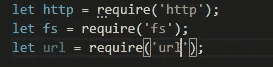
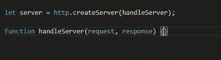
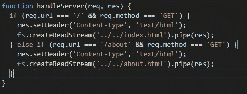
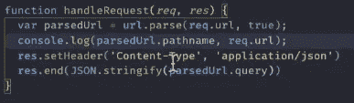

# 如何使用 Node.js 创建基本服务器

> 原文：<https://medium.com/geekculture/how-to-create-a-basic-server-using-node-js-b696ce54c90a?source=collection_archive---------25----------------------->

在这里，我们将了解如何使用 node.js 创建一个基本的服务器

1.  首先，我们必须将“HTTP”、“URL”和“fs”模块导入到我们的。js 文件来使用模块中提供不同方法。我们可以按如下方式导入它们

importing modules

2.在导入这三个模块之后，我们必须使用 HTTP 模块的“createServer()”方法，并且必须将它存储到某个变量中，如下所示。***http . createserver()***方法接受一个回调函数作为参数，在其中我们要做服务器上的所有事情。

creating server

3.一旦我们创建了一个服务器，我们必须添加“.listen”方法，该方法将接受第一个参数作为服务器将要托管的端口号，第二个可选参数作为回调函数。例如:-

server.listen()

> “重要提示”:- handleServer()函数必须包含“ **res.end()”。如果我们不使用它，那么服务器将永远不会完成加载，并且将无限期地等待加载**

4.现在我们必须将请求和响应方法添加到 handleServer 函数中。

在 if 语句中，我们寻找 URL "/"，它也称为索引 URL，如果请求方法是" GET "方法，如果它是真的，那么我们通过使用语句"***RES . set header(" Content-Type "，" text/html ")告诉 JS 要显示的项目的内容类型是" HTML "；*** ”。

之后，我们使用 fs 模块及其 createReadStream()方法从原始文件中以小块缓冲内存(node.js 为 64 位)的形式获取数据。我们通过管道把这些数据块显示出来。用来做这件事的语句是" ***fs.createReadStream(../../index.html)。*管(RES)**

> 这样，我们可以使用 node.js 创建非常简单的服务器

# “如何从给定的 url 获取查询”

如果网址像" **localhost:3000/about/？username=onkar** "。在这种情况下，我们得到一个 URL 查询，我们可以从中提取。这里的 URL 模块非常有用。我们知道 url 模块给了我们"***URL . parse(give nurl)***"方法用来解析给定的 URL。

harvesting query from url

a)这里我们将 URL 解析成对象，并将其存储到新的变量 parsedUrl 中

b)解析后，我们可以检查路径名和给定的 URL。在这里，我们可以发现 pathname 不包含 URL 中的查询。

c)我们可以通过访问 parsedUrl 中名为“query”的键来访问 URL 中的查询。它是对象形式的。

d)如果我们必须在 DOM 上显示查询，我们可以使用“ **JSON.stringify()** ”方法，我们可以将“ **parsedUrl.queries** ”对象作为参数传递给该方法。