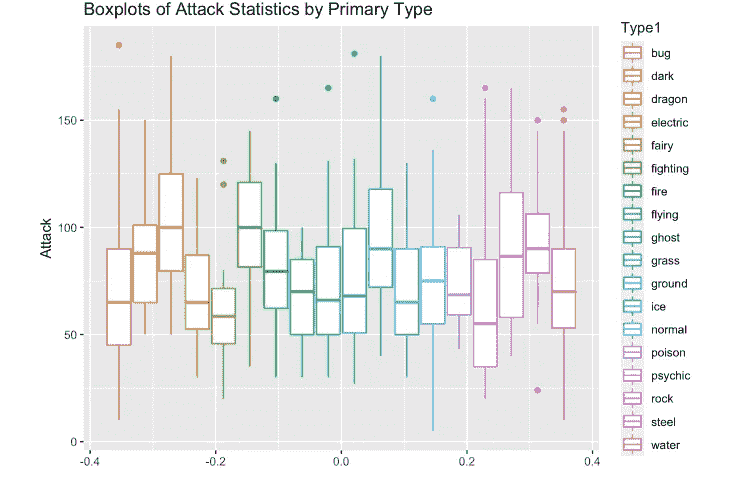

# 如何用口袋妖怪在 R 中创建一个 Boxplot

> 原文：<https://medium.com/geekculture/how-to-create-a-boxplot-in-r-with-pokemon-18a3e9c29225?source=collection_archive---------10----------------------->

在本教程中，我将解释我们为什么使用 boxplots 以及何时使用它们，如何使用 R 中的 ggplot 包轻松创建它们，最后如何添加格式使它们看起来更漂亮。你很快就会成为一名制图大师。本教程是为初学 r 的程序员或数据科学家设计的。

那么究竟什么是箱线图呢？