# 如何在 Oracle 中创建容器数据库

> 原文：<https://medium.com/geekculture/how-to-create-a-container-db-in-oracle-c8bf1c0b3bbd?source=collection_archive---------16----------------------->

这里我们看到了在 oracle 中创建容器的步骤

安装 oracle 12c 软件后，让我们来看看如何在 Oracle 12c 中创建容器数据库

s-1:

转到$ORACEL_HOME/bin 位置给定

。/dbca

它将填充下面的屏幕，并选择“创建数据库”选项

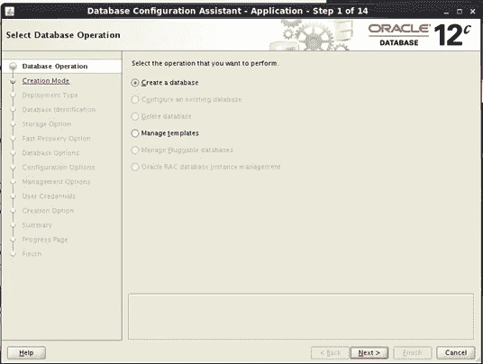

s-2:

选择如下“高级选项”

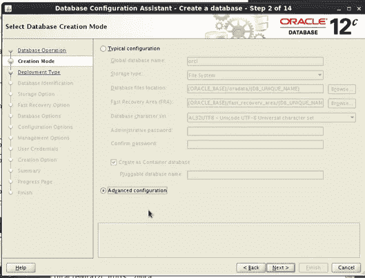

s-3

选择“通用单实例”选项

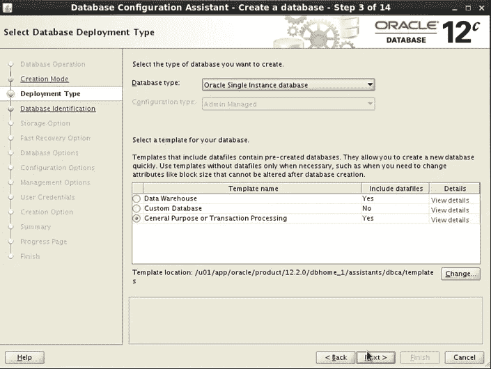

s-4

我们需要提供实例名称，这里我们将创建一个空的容器数据库，因此选择下面的选项

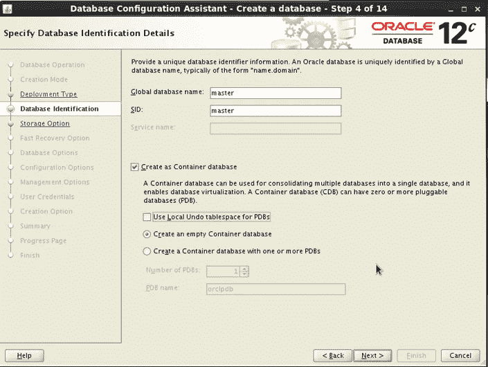

s-5:

我们需要选择本地文件系统

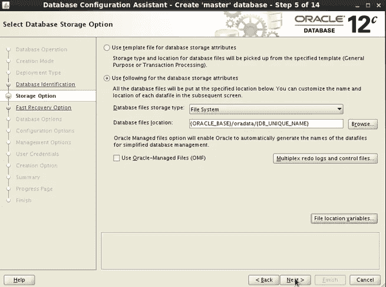

s-6:

我们通过选择此选项来启用 FRA 和归档日志模式

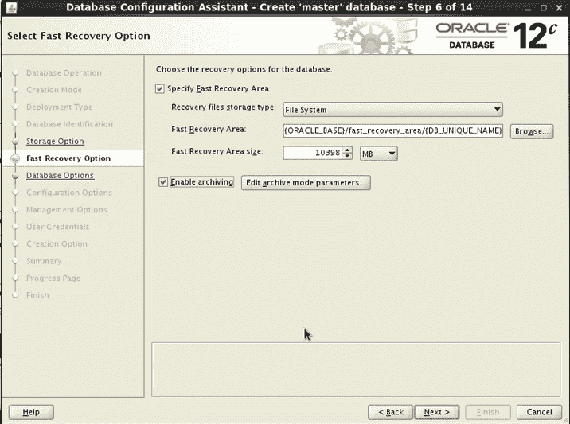

s-7:

如果已经存在一个侦听器，我们可以选择它，或者为 DB wise 创建一个单独的侦听器，我们应该创建一个条目以及如下所示的端口

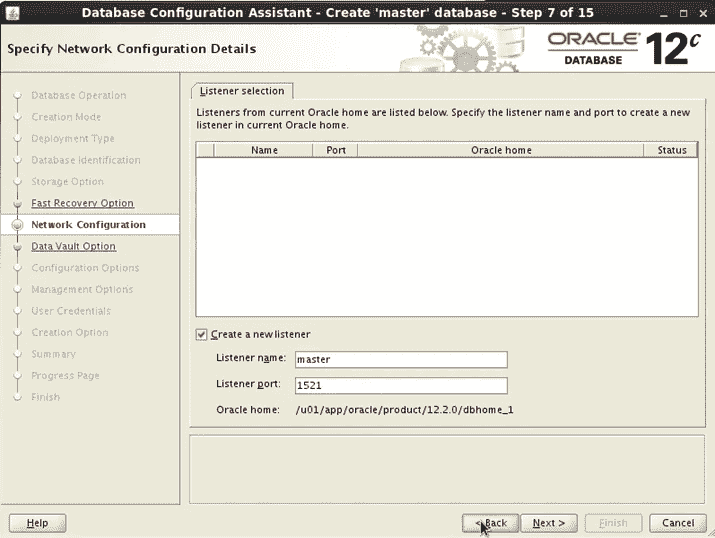

s-8:

我们现在不启用保管库和安全性，因为我们稍后将看到这一点，而不选择此选项继续下一步

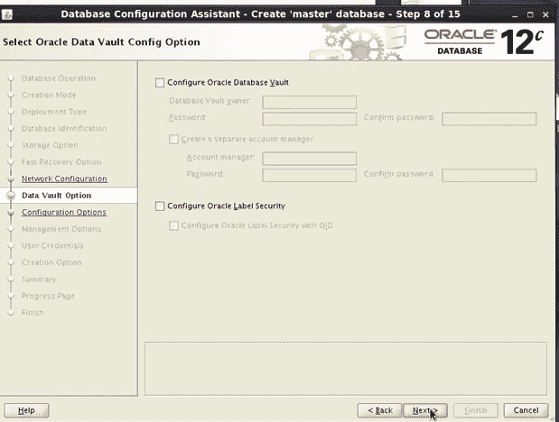

s-9:

我们正在启用大小 AMM(自动内存管理)

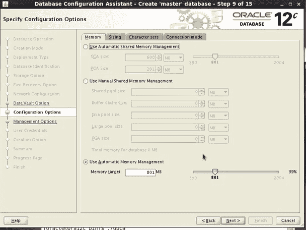

s-10:

我们不支持企业管理器表达

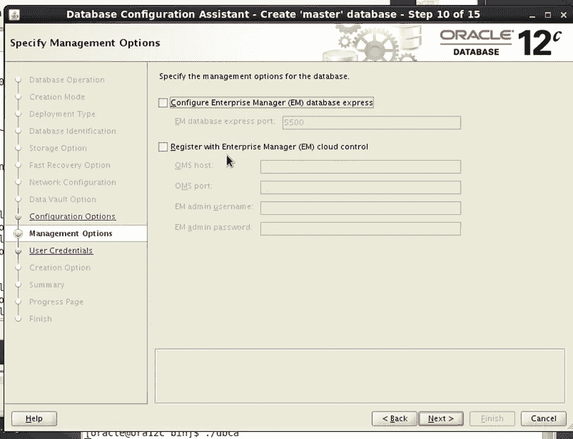

s-11

设置 sys & system 口令，并按 yes 继续

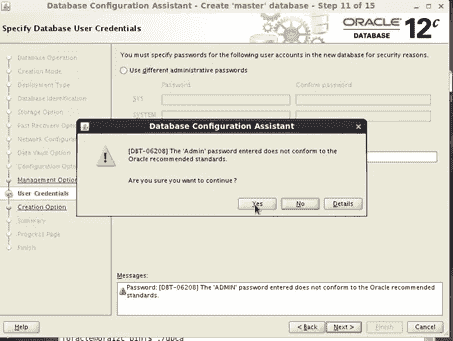

s-12

创建如下所示的数据库

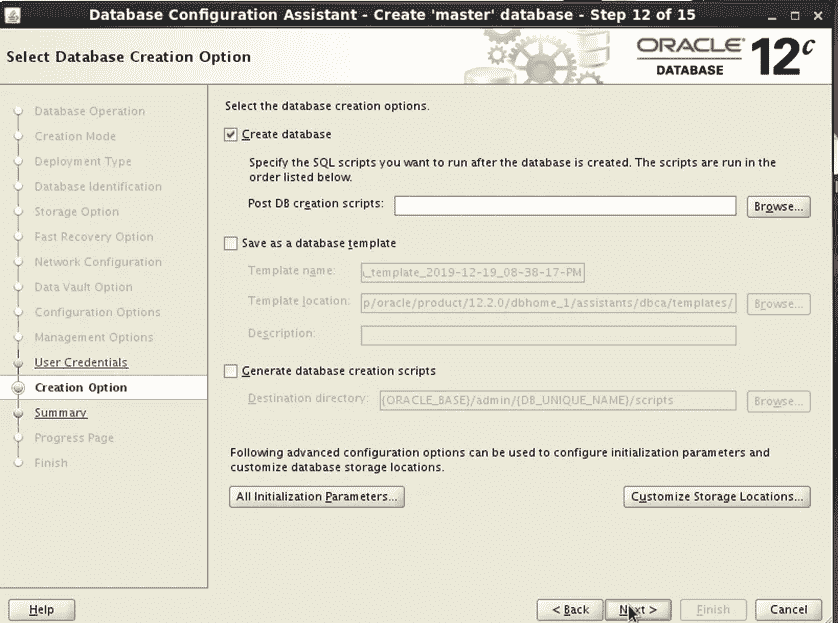

安装完成后，连接数据库并检查它

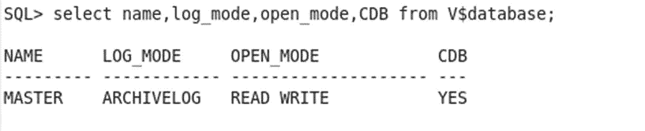