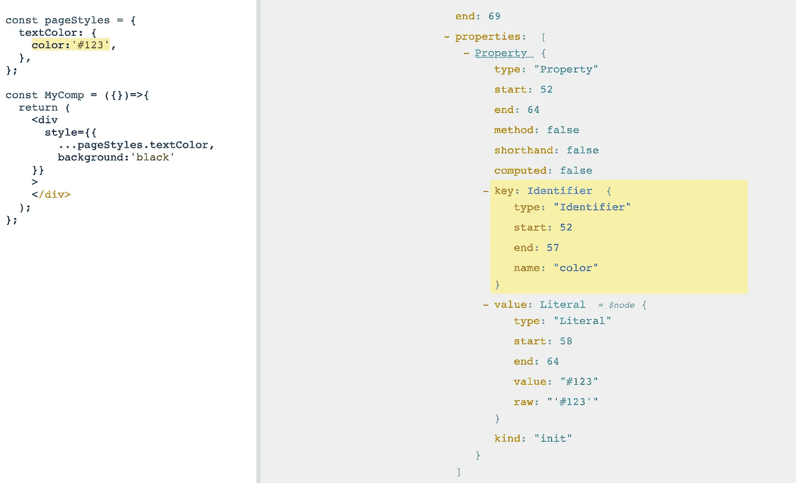
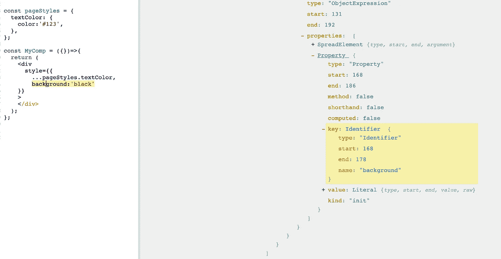
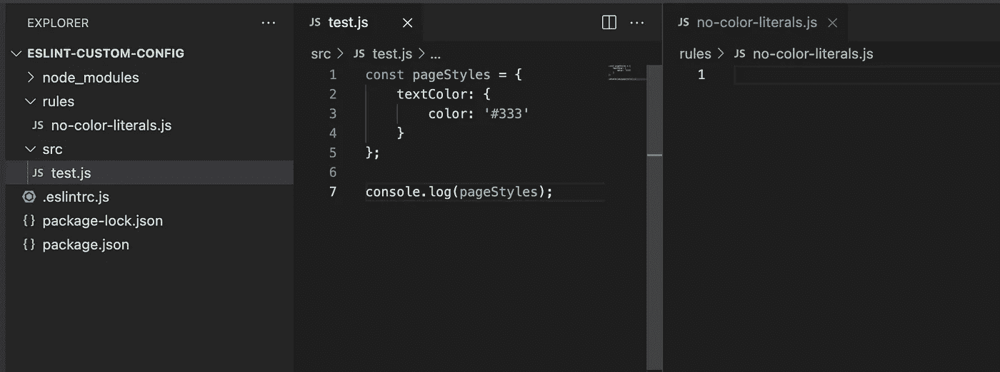
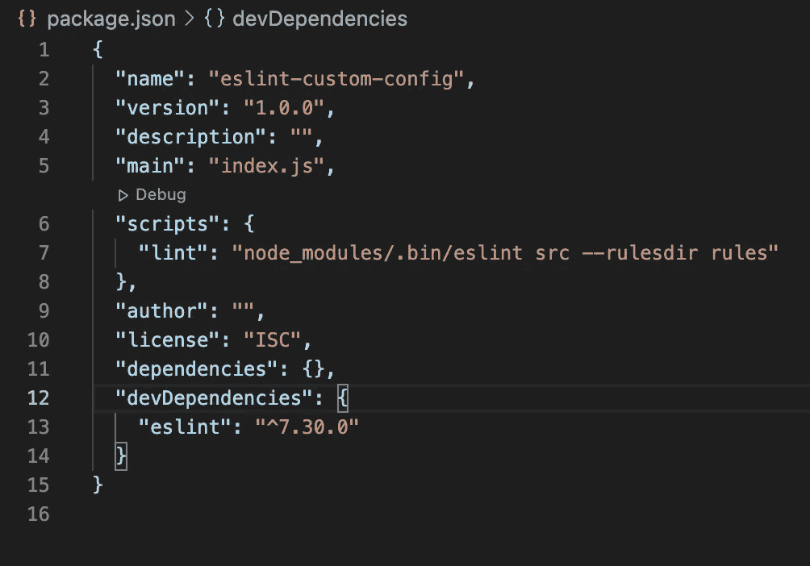
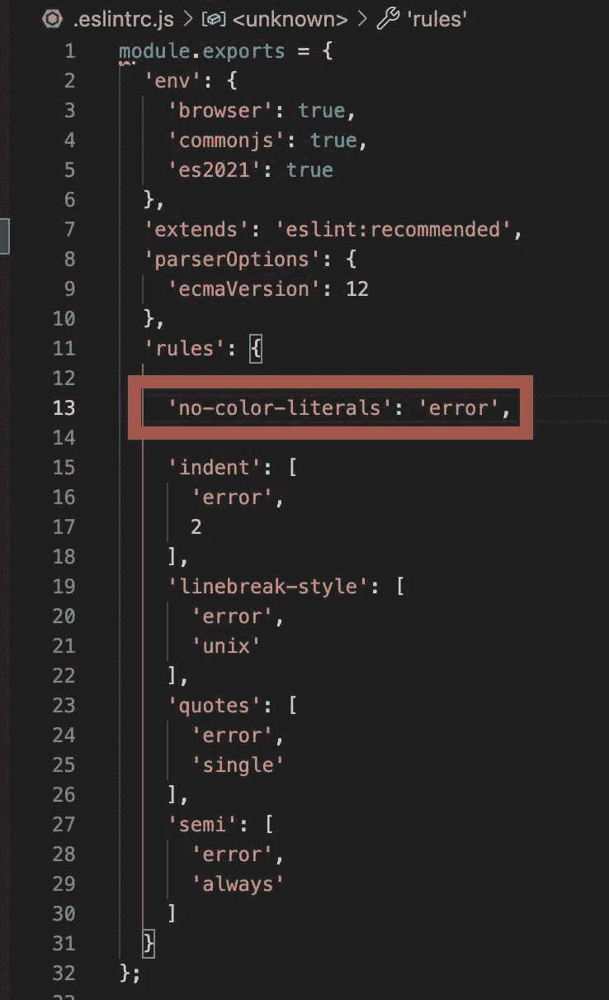
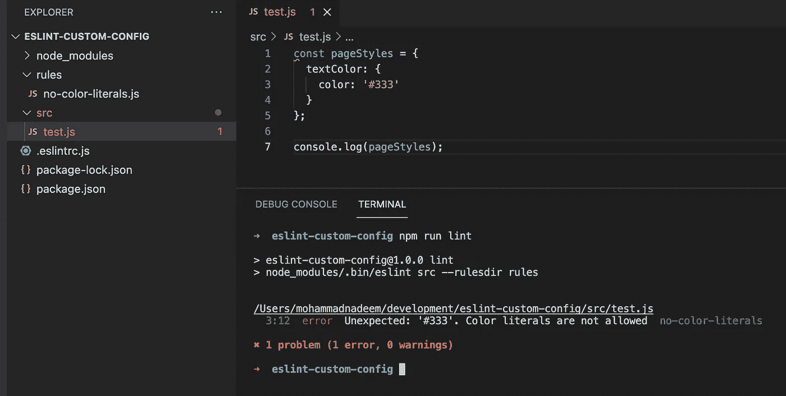
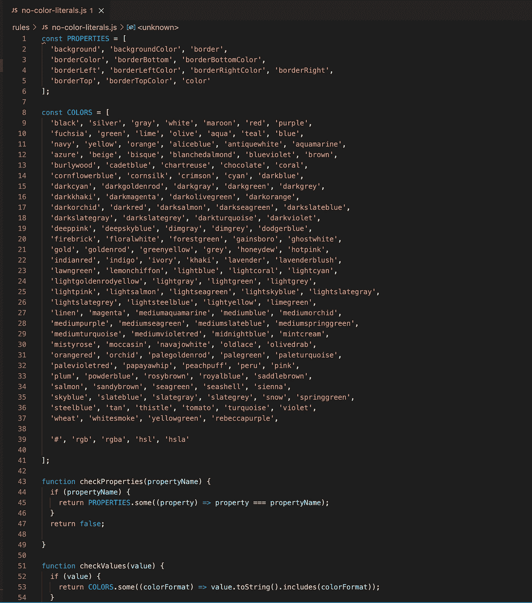
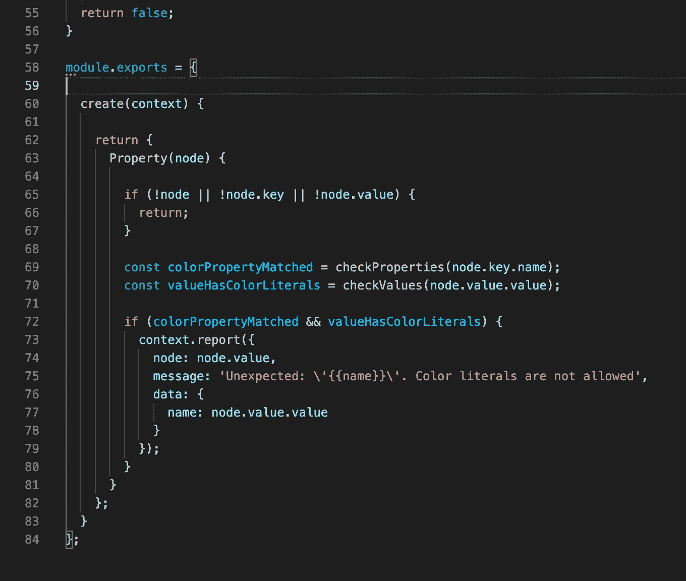
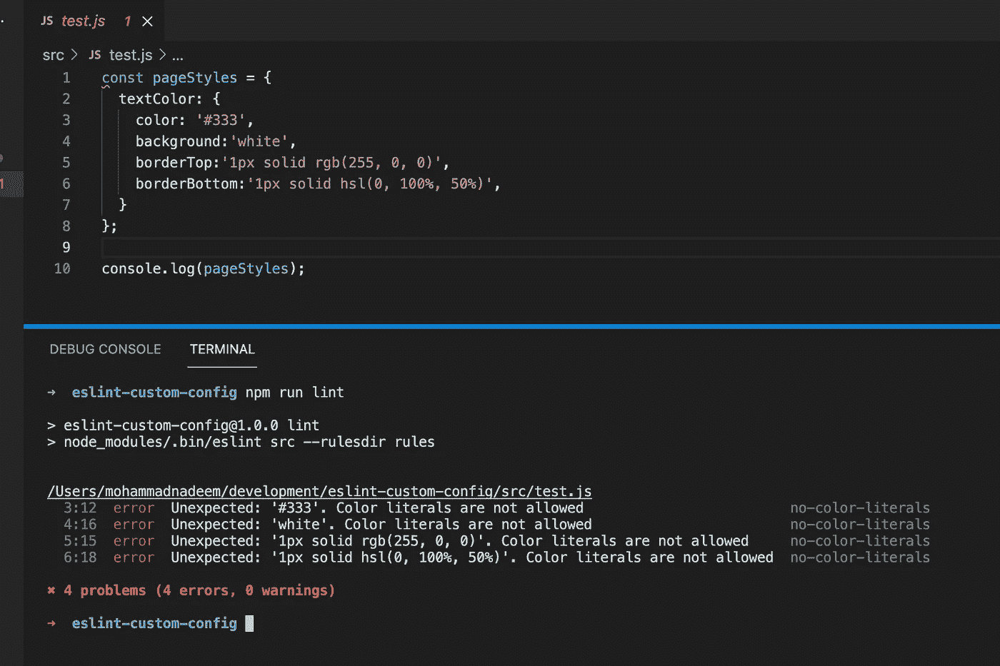

# 如何创建自定义的 ESLint 配置和可共享插件？第一部分

> 原文：<https://medium.com/geekculture/how-to-create-a-custom-eslint-configuration-and-shareable-plugin-part-1-78732dcafe81?source=collection_archive---------23----------------------->

> 我关于媒介的第一篇文章。建议、欣赏、批评都是受欢迎的，因为这是我们学习的方式。😇


Image Source: [https://timesofindia.indiatimes.com/](https://timesofindia.indiatimes.com/)

开发人员确实会编写大量的代码，如果代码以一种良好的方式进行格式化，那么管理大型代码就变得更加容易。格式良好的代码易于阅读、维护和调试。我们使用插件来简化我们的格式化工作。其中一个插件是 ESLint，它可以帮助 Javascript 开发者轻松格式化代码。

ESLint 附带了许多内置配置，可以轻松使用。有时候我们可能需要有自己的自定义规则。在本文中，我将帮助您理解我们如何编写定制的 ESLint 规则/配置。

让我们考虑一个规则，在这个规则中，我们限制在 Javascript 文件(或 React 组件)中使用颜色文字，我们将这个规则命名为:

```
no-color-literals
```

我们添加了这条规则，以避免在 React 应用程序的组件级样式中编写颜色属性。因此，我们将考虑为扩展名为**的文件添加规则。js** 和**。jsx**

> **这是第 1 部分，我们将创建自定义的 ESLint 配置。请继续关注第 2 部分，在那里我们将看到如何使这个配置成为一个可共享的 ESLint 插件并跨 JS 项目安装。**
> 
> 参见此处的[第 2 部分。](/@ndm0501/how-to-create-a-custom-eslint-configuration-and-shareable-plugin-part-2-22d4b03d218)

# 第一步:

## 使用抽象语法树

在我们编写自定义的 ESLint 规则之前，我们必须了解我们的代码是如何构造的。为此，我们将借助[作为探索者](https://astexplorer.net/)。AST Explorer 帮助我们分析代码的结构。我们将粘贴一个包含样式对象的小代码片段，它将覆盖 *React 的 JSX* 语法以及 *VanillaJS* 文件。

```
const pageStyles = {
  textColor: {
    color:'#123',
  },
};const MyComp = ({})=>{
  return (
    <div
      style={{background:'black'}}
    >
    </div>
  );
};
```

上面的代码有两部分，一部分包含一个 style 对象 **pageStyles** 对象，该对象包含另一个对象， ***textColor*** 包含键值对。

下一部分是一个简单的 React 组件，有一个内联样式对象，同样包含键值对。

键是一个 ***Javascript 风格的属性*** ，值是一个 ***十六进制颜色代码/颜色值*** 。

让我们将上面的代码片段粘贴到浏览器中，并检查我们的代码是如何构建的。



Image 1: Style property node in AST

注意这里，在右边，蓝色的文本，属性，标识符，文字都是节点。

将鼠标悬停在 ***属性*** 节点上(在右侧)高亮显示**颜色:' #123'** 。这里，**颜色**是一个 ***标识符*** ， **'#123'** 是一个 ***文字。***

这对于内联样式对象也是一样的。查看下图:



Image 2: Style property node in AST

我们以后会需要这些细节。现在让我们设置我们的环境来编写和测试配置。

# 第二步:

## 设置环境以编写和测试配置

1.  创建一个文件夹`eslint-custom-config`，用你喜欢的代码编辑器打开。
2.  在`eslint-custom-config`文件夹中，运行
    `npm init -y`命令创建一个`package.json`文件
3.  使用命令`npm i eslint`
    在本地安装 ESLint。此外，您可以使用`npm i -g eslint`在全局安装 ESLint
4.  在同一个文件夹中，创建一个名为`.eslintrc.js`的文件，并粘贴以下配置:

```
module.exports = {
  'env': {
    'browser': true,
    'commonjs': true,
    'es2021': true
  },
  'extends': 'eslint:recommended',
  'parserOptions': {
    'ecmaVersion': 12
  },
  'rules': {
    'indent': ['error', 4],
    'linebreak-style': ['error','unix'],
    'quotes': ['error','single'],
    'semi': ['error','always']
  }
};
```

5.要创建一个 ESLint 手动规则，创建一个文件夹`rules`，并在`rules`文件夹中创建一个名为`no-color-literals.js`
6 的文件。让我们创建另一个文件夹`src`，它将保存我们需要测试的文件。
7。在`src`文件夹下创建一个文件`test.js`，粘贴以下内容:

```
const pageStyles = {
  textColor: {
    color: '#333'
  }
};
console.log(pageStyles);
```

到目前为止，我们的文件夹结构应该是这样的:



Image 3: Folder structure

8.要运行 lint 检查，让我们设置脚本。导航到`package.json`并在脚本下添加`"lint":"node_modules/.bin/eslint src --ruledir rules"`。`package.json`应该是这样的:



Image 4: package.json

*这将使用* `*no-color-literals*` *规则检查* `*src*` *文件夹中文件的林挺错误。*

9.在`no-color-literals.js`文件中，粘贴以下代码:

```
module.exports = {
  create(context){
    return {
     // our logic goes here

      Property(node){  
        /* node refers to the Property node from Abstract Syntax        Tree that we saw on ASTExplorer.
        node.key refers to Identifier and node.value refers to Literals
        */ if(!node){ // if node doesn't exist, no need to check
          return;
        }        

        if(
          node.key.name == 'color' &&    node.value.value.toString().includes('#')
          ){/* if key is 'color' and value specified includes '#', report the error */

            context.report({
              node: node.value,
              data: {
                name: node.value.value
              },
              message: "Unexpected: '{{name}}'. Color literals are not allowed", });
        }
      }
    }
  }
}
```

`context.report`方法接受一个属性很少的对象，并在 lint 规则失败时报告错误。

`node`是发生 lint 错误的确切节点(位置)。

`data`用来传递一些数据。这里，我们有 name 属性，它保存了`color`属性的值

`message`用于传递一些信息，以便开发者确切地知道应该做什么。

我们已经成功地创建了配置来检查 color 属性是否将任何十六进制颜色代码作为颜色文字。我们稍后将修改我们的逻辑以涵盖更多的场景，但是首先，让我们在我们的`.eslintrc.js`文件中实现这个规则。

12.现在我们已经创建了我们的定制配置，让我们用 ESLint 配置文件插入它。在`.eslintrc.js`文件中，在`rules`下添加我们的自定义规则为`"no-color-literals": "error"`，如下图:



Image 5: .eslintrc.js

11.测试时间:

在根目录中运行命令`npm run lint`，您应该会在终端中看到错误。



Image 6: Trial 1

到目前为止，我们已经限制了颜色属性的十六进制颜色代码的使用。我们写的逻辑很粗糙，需要提炼。

## 步骤 3:
修改我们的逻辑，在所有接受颜色(例如:边框、背景、颜色等)的 Javascript 样式属性中，限制所有颜色文字(十六进制、rgb、hsl、白色、黑色等)的使用

1.  收集所有样式属性:

```
const PROPERTIES = ['background', 'backgroundColor', 'border', 'borderColor', 'borderBottom', 'borderBottomColor', 'borderLeft', 'borderLeftColor', 'borderRightColor', 'borderRight', 'borderTop', 'borderTopColor', 'color' ];
```

2.收集所有可能的颜色文字:

```
const COLORS = ['black', 'silver', 'gray', 'white', 'maroon', 'red', 'purple', 'fuchsia', 'green', 'lime', 'olive', 'aqua', 'teal', 'blue', 'navy', 'yellow', 'orange', 'aliceblue', 'antiquewhite', 'aquamarine', 'azure', 'beige', 'bisque', 'blanchedalmond', 'blueviolet', 'brown', 'burlywood', 'cadetblue', 'chartreuse', 'chocolate', 'coral', 'cornflowerblue', 'cornsilk', 'crimson', 'cyan', 'darkblue', 'darkcyan', 'darkgoldenrod', 'darkgray', 'darkgreen', 'darkgrey', 'darkkhaki', 'darkmagenta', 'darkolivegreen', 'darkorange', 'darkorchid', 'darkred', 'darksalmon', 'darkseagreen', 'darkslateblue', 'darkslategray', 'darkslategrey', 'darkturquoise', 'darkviolet', 'deeppink', 'deepskyblue', 'dimgray', 'dimgrey', 'dodgerblue', 'firebrick', 'floralwhite', 'forestgreen', 'gainsboro', 'ghostwhite', 'gold', 'goldenrod', 'greenyellow', 'grey', 'honeydew', 'hotpink', 'indianred', 'indigo', 'ivory', 'khaki', 'lavender', 'lavenderblush', 'lawngreen', 'lemonchiffon', 'lightblue', 'lightcoral', 'lightcyan', 'lightgoldenrodyellow', 'lightgray', 'lightgreen', 'lightgrey', 'lightpink', 'lightsalmon', 'lightseagreen', 'lightskyblue', 'lightslategray', 'lightslategrey', 'lightsteelblue', 'lightyellow', 'limegreen', 'linen', 'magenta', 'mediumaquamarine', 'mediumblue', 'mediumorchid', 'mediumpurple', 'mediumseagreen', 'mediumslateblue', 'mediumspringgreen', 'mediumturquoise', 'mediumvioletred', 'midnightblue', 'mintcream', 'mistyrose', 'moccasin', 'navajowhite', 'oldlace', 'olivedrab', 'orangered', 'orchid', 'palegoldenrod', 'palegreen', 'paleturquoise', 'palevioletred', 'papayawhip', 'peachpuff', 'peru', 'pink', 'plum', 'powderblue', 'rosybrown', 'royalblue', 'saddlebrown','salmon', 'sandybrown', 'seagreen', 'seashell', 'sienna', 'skyblue', 'slateblue', 'slategray', 'slategrey', 'snow', 'springgreen', 'steelblue', 'tan', 'thistle', 'tomato', 'turquoise', 'violet','wheat', 'whitesmoke', 'yellowgreen', 'rebeccapurple','#', 'rgb', 'rgba', 'hsl', 'hsla'
]
```

3.创建实用程序方法来检查:

a.如果使用的属性位于属性数组中。

```
function checkProperties(propertyName) {
  if (propertyName) {
    return PROPERTIES.some((property) => property === propertyName);
  }
  return false;
}
```

b.如果该值是十六进制代码(包含#)，或者是 rgb、rgba、hsl、hsla 或任何其他颜色值。

```
function checkValues(value) {
  if (value) {
    return COLORS.some((colorFormat) =>  value.toString().includes(colorFormat));
  }
  return false;
}
```

4.重写我们的逻辑:

```
Property(node) {
  if (!node || !node.key || !node.value) {
    return;
  } const colorPropertyMatched = checkProperties(node.key.name);
  const valueHasColorLiterals = checkValues(node.value.value);

  if (colorPropertyMatched && valueHasColorLiterals) {
    context.report({
      node: node.value,
      message: "Unexpected: '{{name}}'. Color literals are not allowed",
      data: {
        name: node.value.value
      }
    });
  }
}
```

`colorPropertyMatched`:当属性数组中存在样式属性时，它将保存值`true`

`valueHasColorLiterals`:当指定给 style 对象的值是 COLORS 数组中提到的一种时，它将保存值`true`

在`colorPropertyMatched`和`valueHasColorLiterals`都为真的情况下，我们有一个属性节点，将 key 作为 Javascript 样式属性，其值包含颜色文字。在这种情况下，ESLint 会用我们已经添加的消息向我们报告错误。

到目前为止，`no-color-lierals.js`文件应该是这样的:



Image 7: a. no-color-literals.js



Image 8: b. no-color-literals.js

让我们修改`test.js`文件中的样式对象来测试更多的场景:

```
const pageStyles = {
  textColor: {
    color: '#333',
    background:'white',
    borderTop:'1px solid rgb(255, 0, 0)',
    borderBottom:'1px solid hsl(0, 100%, 50%)',
  }
};
console.log(pageStyles);
```

现在运行命令`npm run lint`来看看*的魔力！*



Image 9: Trial 2

瞧！我们已经成功地添加了 lint 规则来限制 Javascript 样式属性中的颜色。这将**而非**影响您的`css`或`scss`文件。

## 最后一步(可选)

要为扩展名为`jsx`的文件添加这条规则，我们需要在`pacakge.json`文件中稍微调整一下我们的`lint`脚本。

`"lint": "node_modules/.bin/eslint src --rulesdir rules --ext js,jsx"`

现在我们可以添加一个具有内联样式的虚拟 React 组件，并测试 lint 规则。

[如何创建自定义 ESLint 配置和可共享插件？第二部分](/@ndm0501/how-to-create-a-custom-eslint-configuration-and-shareable-plugin-part-2-22d4b03d218)