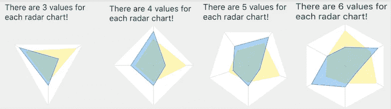
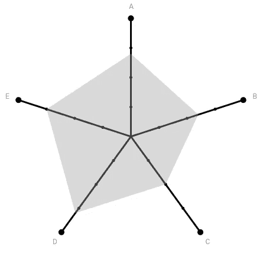
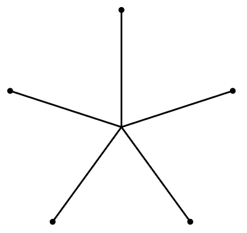
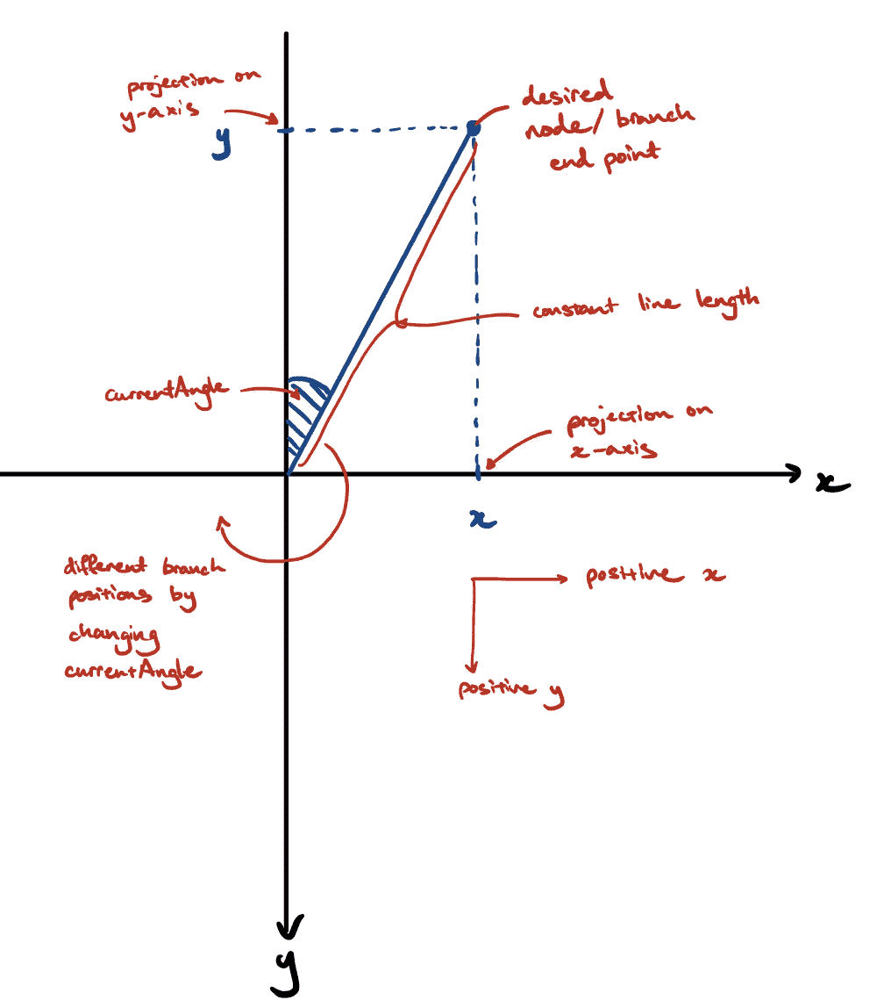
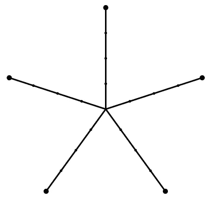
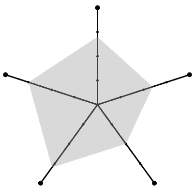
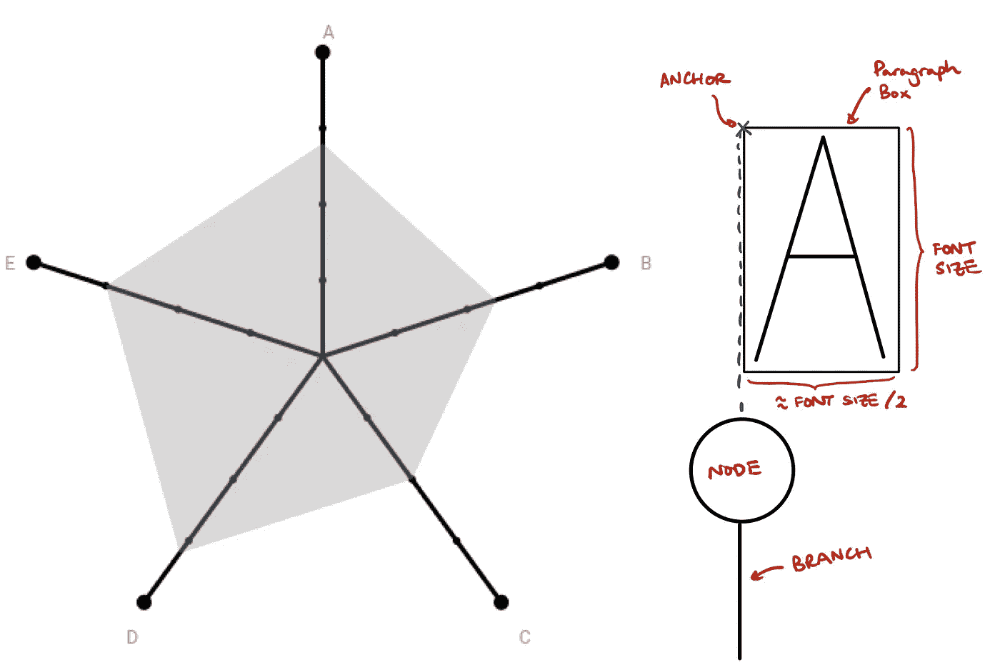
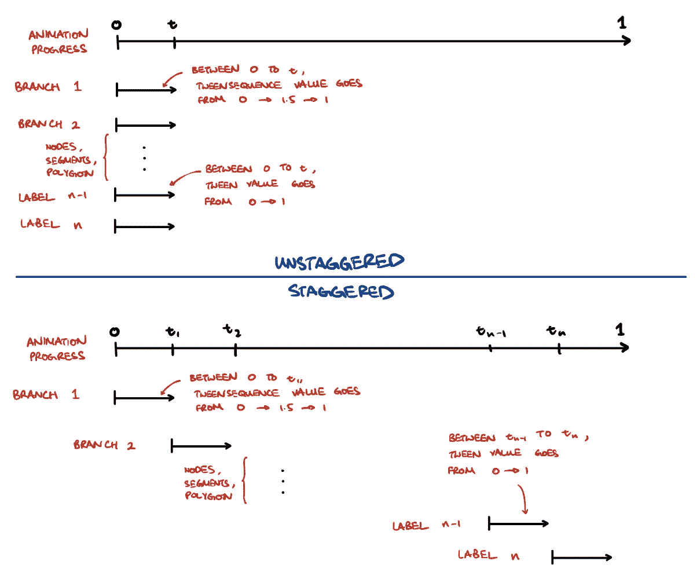

# 如何创建一个自定义交错动画与颤振

> 原文：<https://medium.com/geekculture/how-to-create-a-custom-staggered-animation-with-flutter-13803dea5659?source=collection_archive---------36----------------------->

My custom staggered radar chart animation | credited: n.a. | [Source](https://github.com/juskek/flutter_radarchart)

## 软件/颤振

## 我是如何用 Flutter 创建我的第一个自定义交错动画的；使用补间序列的雷达图。

# 1 导言

我正在开发[我的个人网站](https://justinkek.com/)，希望我的项目页面有一个仪表板，包括每个项目的瓷砖和不同项目类别的分类(例如，前端，后端)。为了说明项目的分类和分布，我决定使用雷达图。我找到了一些现有的包(`[flutter_radar_chart](https://pub.dev/packages/flutter_radar_chart)`和`[radar_chart](https://pub.dev/packages/radar_chart)`)，但是它们没有我想要的简约外观。

Radar chart design from flutter_radar_chart | credited: flutter_radar_chart | [Source](https://pub.dev/packages/flutter_radar_chart)

Radar chart design from radar_chart | credited: radar_chart | [Source](https://pub.dev/packages/radar_chart)

因此，我决定借此机会创建我的第一个自定义交错动画，以了解更多关于 Flutter 的动画框架。数学是可管理的，但我很难弄清楚如何将`CustomPainter`和`AnimatedWidget`拼凑在一起，并让参数从头到尾流动。我已经设法让它达到我满意的阶段，并想巩固我所学的东西。如果你学到了新东西，或者有什么我可以做得更好的地方，请在评论中告诉我——我希望你喜欢这篇文章！

My radar chart design | credited: n.a. | [Source](https://github.com/juskek/flutter_radarchart)

# 2 种方法

## 2.1 动画方法

我解决这个问题的方法是使用基于代码的、显式的自定义动画，因为我想要的结果需要多个小部件一起制作动画。这包括定义(*基于代码的*)一个`FooTransition`类作为`AnimatedWidget` ( *自定义动画*)和*显式*管理一个动画控制器及其生命周期。我还包含了一个`CustomPainter`,因为我无法找到一种方法来轻松地用现有的小部件获得想要的形状和位置。

> 我将为 Flutter 写一本绝对的初学者指南，其中将涵盖 Flutter 的动画框架以及如何在不久的将来选择最合适的方法。

## 2.2 代码结构

与所有 Flutter 应用程序一样，第一行代码包含调用无状态小部件`MyApp`的 main 函数，它构建一个默认为有状态`MyHomePage`小部件的应用程序。`MyHomePage`小部件创建一个状态`_MyHomePageState`，其中包含了`Scaffold`的构建方法，嵌套了总体动画小部件`RadarChartTransition`。注意在`State`小部件中定义的动画控制器需要一个由`TickerProviderStateMixin`提供的 ticker 提供者。

`RadarChartTransition`是`AnimatedWidget`类的扩展，返回一个以`RadarChartPainter`为画师的`CustomPaint`画布。`RadarChartPainter`扩展了`CustomPainter`，允许你在画图功能中指定在画布上画什么。使用这种结构允许动画进度从`_MyHomePageState`到`RadarChartPainter`沿树向下传递，动画显示画布上绘制的任何内容。

Code structure for the radar chart with some boilerplate code omitted (indicated by `*...*`) | credited: n.a. | [Source](https://github.com/juskek/flutter_radarchart)

## 2.3 输入变量

雷达图包含四个变量，这些变量在`State`小部件中定义:

1.  节点数，它定义了有多少个分支或节点。
2.  段数，定义每个分支被分割成多少段。
3.  数据，这是一个百分比列表，描述每个分支的多边形(阴影区域)顶点应该到达的位置。
4.  标签，这是每个分支的文本标签列表。

## 2.4 绘制雷达图

本节将介绍`CustomPainter`中绘制雷达图的方法。以下部分详细介绍了所使用的方法和函数，最后是代码摘录。

**2.4.1 分支&节点**

Adding branches and nodes to my radar chart | credited: n.a. | [Source](https://github.com/juskek/flutter_radarchart)

为了绘制分支和节点，我使用了`canvas.drawLine`和`canvas.drawCircle`命令。`canvas.drawLine`接受起点、终点和绘画风格参数，而`canvas.drawCircle`接受点、半径和绘画风格参数。画布上的位置在`Offset(x,y)`中指定，原点`(0,0)`在画布的中心，正`x`在右边，正`y`在底部。我希望节点位于每个分支的外端，因此 line 和 circle 函数的端点和点参数是等价的。为了确定每个端点的位置，将一个圆分成所需数量的节点，以获得等角分支。这是通过以下方式实现的:

1.  寻找每个分支之间的角度，`angle = 360 / nodes`，
2.  假设第一个分支在 12 点钟位置，计算该分支与 y 轴之间的当前角度`currentAngle = i * angleInRadians`，其中`i`是从 0 开始的分支数。
3.  用三角学、`x = lineLength * sin(currentAngle)` 、
    和`y = -lineLength * cos(currentAngle)`计算终点在 x 轴和 y 轴上的投影，并保存为`Offset(x,y)`
4.  重复步骤 2。第三。对于剩余的分支

我在下面做了一个速写，详细描述了这个过程。

Determining branch end points/node position | credited: n.a. | Source: n.a.

然后，保存的偏移量用于绘制分支和节点。

**2.4.2 段**

Adding segments to my radar chart | credited: n.a. | [Source](https://github.com/juskek/flutter_radarchart)

我使用了`canvas.drawCircle`函数来绘制线段，但是半径较小。由于绘制分段指示符的点位于分支的路径上，所以我将每个节点`Offset(x,y)`视为一个向量，并相应地缩放它。例如，上图中有四个分段(或三个分段指示器)。要获得这些点的坐标，只需将节点偏移量分别乘以 0.25、0.5 和 0.75。

**2.4.3 阴影区域/多边形**

Adding a shaded area/polygon to my radar chart | credited: n.a. | [Source](https://github.com/juskek/flutter_radarchart)

阴影区域使用了类似的方法，但是我没有使用`canvas.drawCircle`，而是使用了`canvas.drawPolygon`。这个函数接受一个路径和绘画风格参数，路径由一个坐标列表定义。坐标列表是通过用提供的数据缩放节点偏移而获得的。在上图的例子中，从 12 点钟的分支开始，顺时针方向移动，使用的值分别是`[0.7, 0.6, 0.5, 0.8, 0.75]`。

**2.4.4 标签**

Adding labels to my radar chart design | credited: n.a. | [Source](https://github.com/juskek/flutter_radarchart)

向节点添加标签被证明是有点棘手，没有简单的文本功能(如果我错了，请纠正我！)内置成`CustomPainter`。相反，我使用了`canvas.drawParagraph`，它接受`Paragraph`和点参数。`Paragraph`类型参数包含文本、文本样式和其他文本属性的信息，只能通过定义`ParagraphBuilder`来使用。样式和文本被添加到`ParagraphBuilder`中，并通过调用`ParagraphBuilder.build`方法创建一个`Paragraph`对象。段落的位置是通过将节点坐标缩放 1.1，将文本放置在每个节点的外边缘来获得的。然而，段落框被左上角锚定，这导致标签和分支之间的错位。通过将坐标上移(字体大小的一半)和左移(字体大小的四分之一)修复了这个问题。

Positioning of labels not in line due to anchor at the top left hand of box | credited: n.a. | [Source](https://github.com/juskek/flutter_radarchart)

> 构建器在构建完`Paragraph`后被释放，不能再调用；创建每个标签后，必须创建一个新的`ParagraphBuilder`。参见第 3 节进行讨论。

**2.4.5 代码摘录**

Commands used in CustomPainter to draw the radar chart | credited: n.a. | [Source](https://github.com/juskek/flutter_radarchart)

## 2.5 制作雷达图动画

这一节介绍了我如何在雷达图的每个组件中实现动画。虽然为了更容易理解，我将这种方法分成了三个小节，但是大部分实现是同时进行的，因此我将在本节的最后提供一段代码摘录。

**2.5.1 生成补间**

现在雷达图的所有特征都已经绘制出来了，我想给每个特征添加一些动态效果。我希望分支和节点弹出，部分逐层填充，多边形从中心开始生长，标签淡入。

Animation breakdown | credited: n.a. | [Source](https://github.com/juskek/flutter_radarchart)

这是通过定义一个单独的动画控制器来实现的，该控制器为一组补间动画制作动画。

> 补间是描述动画从开始到结束的过渡的值列表。

例如，如果我想让一条线的长度从零到 L，它的补间动画应该是这样的:`[0,1,2,3,....,L]`。我使用了两种补间来实现不同的效果:

1.  来自`[0,...,1]`的`Tween`描述了多边形的增长占其最终位置的百分比，以及标签的可见性占其最终不透明度的百分比。补间值为零时，多边形和标签不可见，随着补间值的增加，多边形的大小会增加，标签变得更加可见。
2.  一个`TweenSequence`，来自`[0,...,1.5,...,1]`，描述分支、节点和片段的弹出动画占其最终大小的百分比。这个补间序列是通过将两个补间(`TweenSequenceItem`)串成一个序列而创建的。补间值为零时，组件不可见；在`1.5`时，它们“弹出”，在`1`时，它们达到最终尺寸。

这些补间是在`RadarChartTransition`动画小部件中定义的。

**2.5.2 制作补间动画**

现在我们有了一种方法来描述所有组件的转换，我们需要一种方法来控制转换的开始时间和速度。

这就是`AnimationController`发挥作用的地方；我在 State 小部件中定义了一个具有所需持续时间的控制器，将其同步到 ticker 提供程序并启动控制器。然后它被传递到`RadarChartTransition`,在这里它可以被用来制作上一节定义的两个补间动画。animate()函数，该函数在相应的补间动画上调用。该函数返回当前的*补间值，该值位于补间的起始值和结束值之间，并根据动画的进度而变化，例如，对于补间序列`[0,...,1.5,...,1]`，该函数返回`0.03 @ time t`、`0.5 @ t+1`、`1.45 @ t+2`、`1.2\. @ t+3`等。*

动画控制器从开始到结束以恒定的速度前进，如果要控制补间值的变化，可以指定一条曲线。对补间序列和补间都是这样做的。

**2.5.3 交错补间**

在当前状态下，我可以使用从`.animate()`方法返回的值来动画化雷达图，但是这会导致每个组件的动画同时发生和结束。

为了错开动画，我编写了一个结合了`.animate()`方法和`Interval()`方法的函数，它指定了动画应该何时开始。这是通过指定`start`和`end`进度来实现的，其中进度由`AnimationController`定义，范围从 0 到 1。然后，该函数从`Tween`或`TweenSequence`返回一个值，并为每个分支、节点、线段、多边形和标签调用，以通过改变`start`和`end`进度来创建交错动画。我通过以下方式计算开始和结束进度值:

1.  将动画控制器的最终进度(值为 1)划分为每个组件类型的不同部分(例如，分支、节点)。
2.  将每个部分除以每种类型的组件数量(例如，5 个分支，5 个节点)。
3.  使用上述信息计算开始和结束进度。

Unstaggered vs. staggered animations | credited: n.a. | Source: n.a.

然后将每个分支、节点、线段、多边形顶点和标签的补间值传递给`CustomPainter`并传递给各自的绘画风格，以制作大小、厚度、不透明度等动画。

**2.5.4 代码摘录**

Code used to implement animations into CustomPainter | credited: n.a. | [Source](https://github.com/juskek/flutter_radarchart)

# 3 结果和讨论

你可以在这里找到整个库[。](https://github.com/juskek/flutter_radarchart)

## 3.1 计算开销大:ParagraphBuilder

我想在代码中强调的一个问题是使用`Paragraph`来显示文本标签。如第 2.4.4 节所述，ParagraphBuilder 在创建段落对象后被丢弃，并且必须用每个新标签重新初始化。我想知道这是否相对昂贵，如果有人能指出更好的方法来达到同样的效果，我将不胜感激。

# 4 结论

如果这篇文章引起了足够的兴趣，我可能会考虑将它作为一个 Flutter 包发布，请让我知道你是否会使用这个包，请在下面留下掌声！