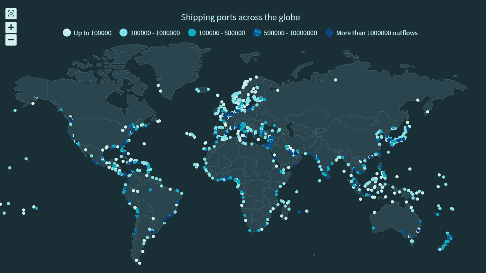
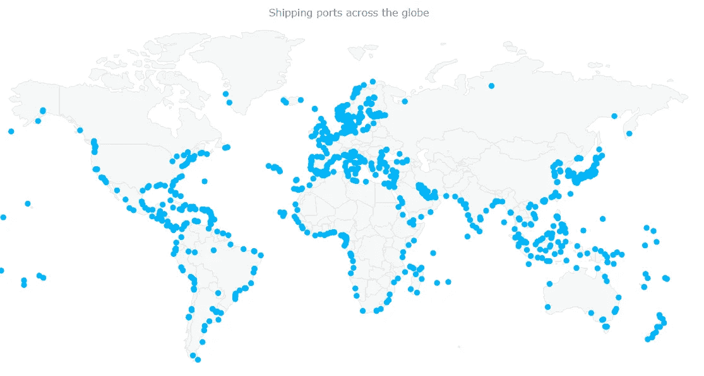
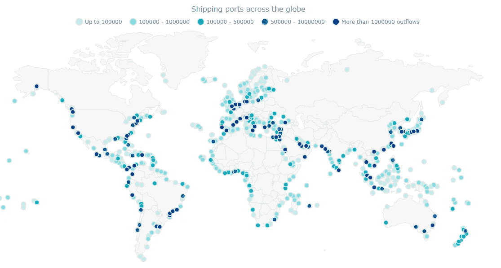
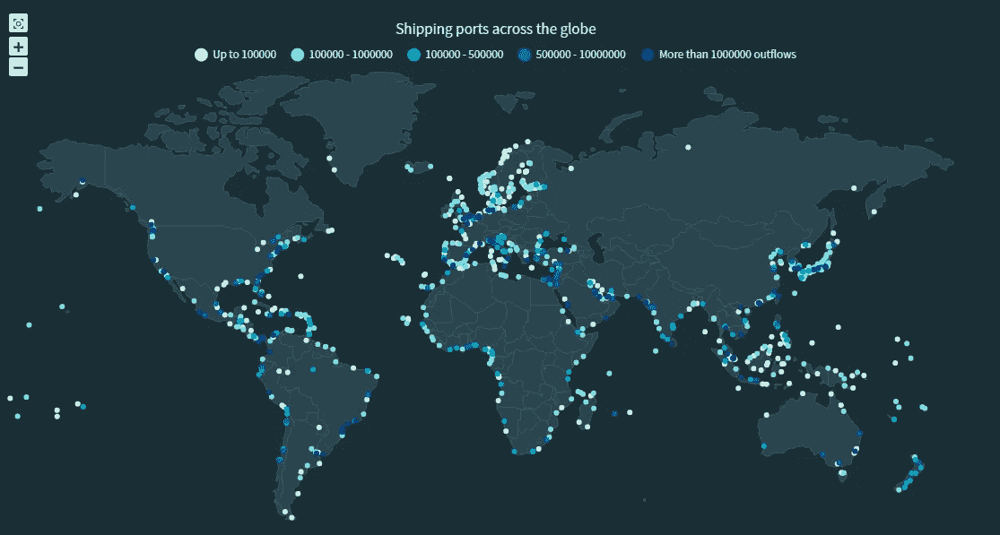

# 制作 JS 点密度图以可视化全球航运港口

> 原文：<https://medium.com/geekculture/how-to-create-a-js-dot-density-map-visualizing-shipping-ports-across-the-globe-5a02dfb77eb9?source=collection_archive---------23----------------------->



最近发生的 [**苏伊士运河堵塞事件**](https://en.wikipedia.org/wiki/2021_Suez_Canal_obstruction) **引起了我对航运的兴趣，促使我探索全球各个航运港口。世界上有 850 多个港口，为了全面了解这些港口的位置，我决定用 JavaScript 将它们绘制在** [**点状图**](https://www.anychart.com/chartopedia/chart-type/dot-map/) **或点密度图上。**

构建交互式 JS 点密度图似乎是一项艰巨的任务。但让我向你保证，这可能非常简单。现在，我将展示如何使用用于数据可视化的 JavaScript 库来制作一个全功能的点阵图。

# JavaScript 图表库

有一些很棒的 [JavaScript 图表库](https://en.wikipedia.org/wiki/Comparison_of_JavaScript_charting_libraries)可供使用，每一个都有其优点和缺点。使用 JS 库的好处是，所有这些库的图表创建过程的逻辑非常相似。因此，您可以使用一个库来学习基础知识，然后根据您的学习来使用适合您项目需求的库。

对于本教程，我已经决定使用 [AnyChart JS Charts](https://www.anychart.com/) 库来创建点密度图。我认为这对于初学者来说是一个很好的选择，因为 AnyChart 易于使用，而且灵活，有大量的文档和大量的例子。

# 用 JavaScript 构建点密度图

无论是点密度图还是其他任何地图或图表，对于 JavaScript 图表来说，通常需要四个基本步骤来实现几乎任何类型的数据可视化:

1.  创建显示图表的 HTML 页面。
2.  包括所有必要的 JavaScript 文件。
3.  准备要可视化的数据。
4.  为图表编写 JS 代码。

## 1.创建基本的 HTML 页面

第一步是创建一个空白的 HTML 页面来保存点阵图。我添加了一个具有惟一 id 的 div 元素，稍后我将使用它来引用它。

请注意，您可以在`<style>`块中指定宽度和高度参数，以修改可视化将占用的空间。我把两个参数都设为 100%,这样我的点密度图将会充满整个页面。

```
<html>
  <head>
    <title>JavaScript Dot Map</title>
    <style type="text/css">      
      html, body, #container { 
        width: 100%;
        height: 100%;
        margin: 0;
        padding: 0; 
      } 
    </style>
  </head>
  <body>
    <div id="container"></div>
  </body>
</html>
```

## 2.包括必需的脚本

下一步是链接将用于创建点地图的适当的 JS 脚本。由于我使用的是 AnyChart 库，所以我将引用相应的文件。对于我的地图，我需要添加 AnyChart 的核心和地理地图[模块](https://docs.anychart.com/Quick_Start/Modules)。我还需要包含世界地图的地理数据文件，该文件也可以在图书馆的 [CDN](https://cdn.anychart.com) 中找到。

所有这些脚本文件都需要包含在 HTML 页面的`<head>`部分中。

```
<html>
  <head>
    <title>JavaScript Dot Map</title>
    <script src="https://cdn.anychart.com/releases/8.9.0/js/anychart-core.min.js"></script>
    <script src="https://cdn.anychart.com/releases/8.9.0/js/anychart-map.min.js"></script>
    <script src="https://cdn.anychart.com/geodata/latest/custom/world/world.js"></script> <style type="text/css">      
      html, body, #container { 
        width: 100%;
        height: 100%;
        margin: 0;
        padding: 0; 
      } 
    </style>
  </head>
  <body>  
    <div id="container"></div>
    <script>
 ***// All the code for the JS dot density map will come here.***    </script>
  </body>
</html>
```

## 3.连接数据

我从[世界银行数据目录](https://datacatalog.worldbank.org/dataset/global-international-ports)下载了装运港数据。

AnyChart 库支持许多[数据格式](https://docs.anychart.com/Working_with_Data/Supported_Data_Formats)，包括 CSV、JSON 和 XML。我的文件是 JSON，你可以在这里下载。

在我们开始使用数据之前，我在 HTML 页面上包含了另外两个脚本文件。为了处理数据文件的加载，我添加了[数据适配器](https://docs.anychart.com/Working_with_Data/Data_Adapter/Overview)模块。因为我正在创建地图，所以我将使用另一个 JavaScript 库——[Proj4js](http://proj4js.org/)——它将点坐标从一个坐标系转换到另一个坐标系。简单地说，它将负责在各自的地理区域上绘制点。

然后，我使用 HTML 页面主体中的`<script>`标记内的`loadJsonFile`方法来加载 JSON 文件。

```
<html>
  <head>
    <title>JavaScript Dot Map</title>
    <script src="https://cdn.anychart.com/releases/8.9.0/js/anychart-base.min.js"></script>
    <script src="https://cdn.anychart.com/releases/8.9.0/js/anychart-map.min.js"></script>
    <script src="https://cdn.anychart.com/geodata/latest/custom/world/world.js"></script> <script src="https://cdn.anychart.com/releases/8.9.0/js/anychart-data-adapter.min.js"></script>
    <script src="https://cdnjs.cloudflare.com/ajax/libs/proj4js/2.3.15/proj4.js"></script> <style type="text/css">      
      html, body, #container { 
        width: 100%;
        height: 100%;
        margin: 0;
        padding: 0; 
      } 
    </style>
  </head>
  <body>  
    <div id="container"></div>
    <script>anychart.data.loadJsonFile('https://gist.githubusercontent.com/shacheeswadia/47b28a4d061e415555f01f5ce48e9ae3/raw/0f7592a8048872db7b77ccd2df8907e61952a806/shippingDataInverted.json', function (data) {}) </script>
  </body>
</html>
```

所以，现在包裹都准备好了，是时候发货了！

## 4.添加代码以绘制点密度图

使用 JS 图表库的最大好处是要编写的代码量非常有限。我说只用 10 行代码就可以构建点密度图，这并不夸张。

首先，我将确保创建图表的所有代码都在`anychart.onDocumentReady()`函数中。这是为了在执行任何其他操作之前完全加载页面。加载数据后，正如我们在前面的步骤中看到的，我创建地图并设置地理数据。我还在地图上添加了一个标题。

```
<script>anychart.onDocumentReady(function() {
anychart.data.loadJsonFile('https://gist.githubusercontent.com/shacheeswadia/47b28a4d061e415555f01f5ce48e9ae3/raw/0f7592a8048872db7b77ccd2df8907e61952a806/shippingDataInverted.json',
function (data) {

 ***// set the map chart***  var map = anychart.map();

 ***// set the global geodata***  map.geoData('anychart.maps.world'); ***// set the map title***  map.title( 'Shipping ports across the globe');

});
});</script>
```

接下来，我将创建一个系列，在地图上将海港标记为点。默认情况下，每个点显示一个纬度和经度标签，这是我不想要的，所以我禁用了这个系列的标签。

```
***// set the marker series*** var series = map.marker(anychart.data.set(data));   

***// disable labels to not show latitude and longitude for each point*** series.labels(false);
```

最后两行代码将容器设置为引用之前添加的 HTML 块元素，并绘制地图。

```
***// set the containter*** map.container('container');***// draw the map*** map.draw();
```

就是这样，一个全功能的交互式点密度图就这样诞生了！



> **你可以用这里的代码，或者在** [**CodePen**](https://codepen.io/shacheeswadia/pen/XWpgepY) **，或者在** [**AnyChart 游乐场**](https://playground.anychart.com/VevfP9bJ/) **上查看这个初始版本。**

```
<html>
  <head>
    <title>JavaScript Dot Map</title>
    <script src="https://cdn.anychart.com/releases/8.9.0/js/anychart-base.min.js"></script>
    <script src="https://cdn.anychart.com/releases/8.9.0/js/anychart-map.min.js"></script>
    <script src="https://cdn.anychart.com/geodata/latest/custom/world/world.js"></script> <script src="https://cdn.anychart.com/releases/8.9.0/js/anychart-data-adapter.min.js"></script>
    <script src="https://cdnjs.cloudflare.com/ajax/libs/proj4js/2.3.15/proj4.js"></script> <style type="text/css">      
      html, body, #container { 
        width: 100%;
        height: 100%;
        margin: 0;
        padding: 0; 
      } 
    </style>
  </head>
  <body>  
    <div id="container"></div>
    <script>anychart.onDocumentReady(function() {
anychart.data.loadJsonFile('https://gist.githubusercontent.com/shacheeswadia/47b28a4d061e415555f01f5ce48e9ae3/raw/0f7592a8048872db7b77ccd2df8907e61952a806/shippingDataInverted.json',
function (data) {

 ***// set the map chart***  var map = anychart.map();

 ***// set the global geodata***
  map.geoData('anychart.maps.world'); ***// set the chart title***
  map.title( 'Shipping ports across the globe'); ***// set the marker series***
  var series = map.marker(anychart.data.set(data));   

 ***// disable labels to not show latitude/longitude for each point***
  series.labels(false); ***// set the container***
  map.container('container'); ***// draw the chart***
  map.draw();});
}); </script>
  </body>
</html>
```

# 自定义 JS 点阵图

这里我们有一个用 JavaScript 构建的基本点地图，有预定义的样式和特性。然而，有许多方法可以轻松地调整地图，使其更具吸引力。您可能希望使图形更美观，突出显示数据可视化中特别有趣的方面，或者添加一些功能来改善显示的信息。

我将通过以下方式向您展示如何自定义 JS 点密度图:

1.  用色标标明每个装运港的流出数量。
2.  增强工具提示。
3.  为地图添加缩放功能。
4.  更改整体颜色主题。

## 1.用色标表示每个端口的流出量

我想在不增加太多复杂性的情况下，在可视化中显示更多的信息。因此，我在点图上增加了一个额外的维度，用颜色来表示每个装运港的流出量。这需要一点编码，所以跟着我解释我是怎么做的。

首先，我定义了一个数据集，我将根据流出量用不同的颜色映射到多个系列。

```
var portsDataSet = anychart.data.set(data).mapAs();
```

接下来，我创建了一个函数，它定义了我希望如何表示这个系列以及这个表示的图例。现在，使用这个函数，我创建了五个不同的系列，每个系列都有一个名称、最小/最大流出量和颜色。

```
***// helper function to create several series***
var createSeries = function (name, data, color) {

 ***// set the marker series***  var series = map.marker(data);

 ***// configure the series settings***  series
    .name(name)
    .fill(color)
    .stroke('2 #E1E1E1')
    .type('circle')
    .size(5)
    .labels(false)
    .selectionMode('none'); series
    .legendItem()
    .iconType('circle')
    .iconFill(color)
    .iconStroke('2 #E1E1E1');
};***// create 5 series, filtering the data by the outflows at each port***
createSeries(
  'Up to 100000',
  portsDataSet.filter('outflows', filterFunction(0, 100000)),
  '#D1FAE9'
);
createSeries(
  '100000 - 1000000',
  portsDataSet.filter('outflows', filterFunction(100000, 1000000)),
  '#9CE0E5'
);
createSeries(
  '100000 - 500000',
  portsDataSet.filter('outflows', filterFunction(1000000, 5000000)),
  '#00ACC3'
);
createSeries(
  '500000 - 10000000',
  portsDataSet.filter('outflows', filterFunction(5000000, 10000000)),
  '#355CB1'
);
createSeries(
  'More than 1000000 outflows',
  portsDataSet.filter('outflows', filterFunction(10000000, 0)),
  '#002D79'
);
```

您将看到一个筛选函数被用来分离每个系列中的数据。这个过滤函数就定义在代码的末尾。

```
***// helper filter function***
function filterFunction(val1, val2) {
  if (val2) {
    return function (fieldVal) {
      return val1 <= fieldVal && fieldVal < val2;
    };
  }
  return function (fieldVal) {
    return val1 <= fieldVal;
  };
}
```

我启用了地图的图例，瞧，你可以看到根据流出量的不同，这些点被涂上了 5 种不同的颜色。

```
map.legend(true);
```



如果这一切让你感到有些不知所措，请不要担心。这有点超出了初学者的水平，但如果你按照步骤来做就不会太复杂。 ***你可以在***[***CodePen***](https://codepen.io/shacheeswadia/pen/LYxLOWN)***或者在***[***any chart 游乐场***](https://playground.anychart.com/TYjWoWB7/) ***上玩这个定制的点密度图的代码。***

## 2.增强地图工具提示

点阵图的默认工具提示只显示每个点的纬度和经度，所以我定制了工具提示来显示一些更有意义的信息。

对于每一点，我在工具提示的标题中显示装运港口的名称，在工具提示的正文中显示国家以及流出的数量。因为我想显示多个字段，所以我为工具提示启用了 HTML，这将允许我格式化文本。然后，我以 HTML 格式添加所有信息。

```
map
  .tooltip() 
  .useHtml(true)
  .padding([8, 13, 10, 13])
  .width(350)
  .fontSize(12)
  .fontColor('#e6e6e6')
  .titleFormat(function () {
    return this.getData('Name');
  })
  .format(function () {
    return (
      '<span style="color: #bfbfbf;">Country: </span>'+
      this.getData('Country') +
      '<br/>' +
      '<span style="color: #bfbfbf;">Outflows: </span>' +
      this.getData('outflows').toFixed(0)
    );
  });
```

工具提示现在不觉得像是点密度图的一个有用的附加物吗？

## 3.为地图添加缩放功能

在点阵图中，我注意到在某些区域有一些集群指示了许多船运港口。为了使查看者能够更近距离地查看这些区域，我添加了缩放功能。

为此，我首先需要包含一些脚本和 CSS 链接。我在`<head>`部分添加了所有这些。然后，我只添加两行来启用地图的缩放 UI 控件。这再次显示了在使用适当的数据可视化库(如 AnyChart)时，添加这些特性是多么容易和方便。

```
<script src="https://cdn.anychart.com/releases/8.9.0/js/anychart-exports.min.js"></script>
<script src="https://cdn.anychart.com/releases/8.9.0/js/anychart-ui.min.js"></script><link rel="stylesheet" type="text/css" href="https://cdn.anychart.com/releases/8.9.0/css/anychart-ui.min.css">
<link rel="stylesheet" type="text/css" href="https://cdn.anychart.com/releases/8.9.0/fonts/css/anychart-font.min.css">...***// add zoom ui controls***
var zoomController = anychart.ui.zoom();
zoomController.render(map);
```

如果您想要设置任何其他交互行为来让查看者挖掘地图上显示的数据，请查看[移动和缩放 API](https://docs.anychart.com/Maps/Move_and_Zoom) 文档。

## 4.改变整体主题和一些外观调整

为了润色网点密度图，我做了一些简单的修改。我决定把地图的背景改成更暗的颜色，这样可以突出点。为此，我使用了 AnyChart 内置的[主题之一](https://docs.anychart.com/Appearance_Settings/Themes)——黑暗魅力——包括预定义的设置，如深色背景色。为此，我包含了主题脚本并添加了一行代码来设置地图的主题。

```
<script src="https://cdn.anychart.com/releases/8.9.0/themes/dark_glamour.min.js"></script>...***// set the color theme***anychart.theme('darkGlamour');
```

我做的最后一件事是减小标记的尺寸，并删除系列的笔画。

```
series
  .name(name)
  .fill(color)
  .stroke('none')
  .type('circle')
  .size(3)
  .labels(false)
  .selectionMode('none');
```

你有它！一个非常酷和漂亮的点阵图，直观地展示了全球不同的航运港口。



***看看***[***CodePen***](https://codepen.io/shacheeswadia/pen/eYgRVBM)***上的代码，或者看看***[***any chart 游乐场***](https://playground.anychart.com/EiEgLDJq/) ***上的代码，或者就在下面。***

```
<html>
  <head>
    <title>JavaScript Dot Map</title>
    <script src="https://cdn.anychart.com/releases/8.9.0/js/anychart-base.min.js"></script>
    <script src="https://cdn.anychart.com/releases/8.9.0/js/anychart-map.min.js"></script>
    <script src="https://cdn.anychart.com/geodata/latest/custom/world/world.js"></script> <script src="https://cdn.anychart.com/releases/8.9.0/js/anychart-data-adapter.min.js"></script>
    <script src="https://cdnjs.cloudflare.com/ajax/libs/proj4js/2.3.15/proj4.js"></script> <script src="https://cdn.anychart.com/releases/8.9.0/js/anychart-exports.min.js"></script>
    <script src="https://cdn.anychart.com/releases/8.9.0/js/anychart-ui.min.js"></script> <script src="https://cdn.anychart.com/releases/8.9.0/themes/dark_glamour.min.js"></script> <link rel="stylesheet" type="text/css" href="https://cdn.anychart.com/releases/8.9.0/css/anychart-ui.min.css">
    <link rel="stylesheet" type="text/css" href="https://cdn.anychart.com/releases/8.9.0/fonts/css/anychart-font.min.css"> <style type="text/css">      
      html, body, #container { 
        width: 100%;
        height: 100%;
        margin: 0;
        padding: 0; 
      } 
    </style>
  </head>
  <body>  
    <div id="container"></div>
    <script>

anychart.onDocumentReady(function() {
anychart.data.loadJsonFile('https://gist.githubusercontent.com/shacheeswadia/47b28a4d061e415555f01f5ce48e9ae3/raw/0f7592a8048872db7b77ccd2df8907e61952a806/shippingDataInverted.json',
function (data) {

 ***// set the color theme***  anychart.theme('darkGlamour');

 ***// set the map chart***  var map = anychart.map();

 ***// set the global geodata***  map.geoData('anychart.maps.world'); ***// set the chart title***  map.title( 'Shipping ports across the globe'); ***// create a dataset from data***  var portsDataSet = anychart.data.set(data).mapAs(); ***// helper function to create several series***  var createSeries = function (name, data, color) {

 ***// set the marker series***    var series = map.marker(data);

 ***// configure the series settings***    series
      .name(name)
      .fill(color)
      .stroke('none')
      .type('circle')
      .size(3)
      .labels(false)
      .selectionMode('none'); series
      .legendItem()
      .iconType('circle')
      .iconFill(color);
  }; ***// create 5 series, filtering data by the outflows at each port***  createSeries(
    'Up to 100000',
    portsDataSet.filter('outflows', filterFunction(0, 100000)),
    '#D1FAE9'
  );
  createSeries(
    '100000 - 1000000',
    portsDataSet.filter('outflows', filterFunction(100000, 1000000)),
    '#9CE0E5'
  );
  createSeries(
    '100000 - 500000',
    portsDataSet.filter('outflows', filterFunction(1000000, 5000000)),
    '#00ACC3'
  );
  createSeries(
    '500000 - 10000000',
    portsDataSet.filter('outflows', filterFunction(5000000, 10000000)),
    '#355CB1'
  );
  createSeries(
    'More than 1000000 outflows',
    portsDataSet.filter('outflows', filterFunction(10000000, 0)),
    '#002D79'
  ); ***// enable and configure the map tooltip***  map
    .tooltip() 
    .useHtml(true)
    .padding([8, 13, 10, 13])
    .width(350)
    .fontSize(12)
    .fontColor('#e6e6e6')
    .titleFormat(function () {
      return this.getData('Name');
    })
    .format(function () {
      return (
        '<span style="color: #bfbfbf">Country: </span>'+
        this.getData('Country') +
        '<br/>' +
        '<span style="color: #bfbfbf">Outflows: </span>' +
        this.getData('outflows').toFixed(0)
      );
    }); ***// turn on the map legend***  map.legend(true); ***// add zoom ui controls***  var zoomController = anychart.ui.zoom();
  zoomController.render(map); ***// set the container***  map.container('container'); ***// draw the map***  map.draw();});
});***// helper filter function*** function filterFunction(val1, val2) {
  if (val2) {
    return function (fieldVal) {
      return val1 <= fieldVal && fieldVal < val2;
    };
  }
  return function (fieldVal) {
    return val1 <= fieldVal;
  };
} </script>
  </body>
</html>
```

# 结论

如您所见，使用 JavaScript 库创建像点密度图这样的交互式数据可视化是非常简单和令人兴奋的。AnyChart 有许多不同类型的图表和地图，所以在这里查看各种选项。

我希望这篇教程已经激起了你对点阵图和 JavaScript 图表的兴趣。请随时提问、提供建议或发表评论。继续，探索海洋，让您的数据可视化之船航行吧！

我们 AnyChart 很高兴感谢 Shachee Swadia 创建了这个惊人的 JS 点阵图教程。

*如果你想为我们的博客写一篇有趣的客座博文，请* [*联系我们*](https://www.anychart.com/support/) *。*

*查看其他* [*JavaScript 制图教程*](https://www.anychart.com/blog/category/javascript-chart-tutorials/) *。*

*最初发表于 2021 年 4 月 20 日 https://www.anychart.com*[](https://www.anychart.com/blog/2021/04/20/js-dot-density-map/)**。**