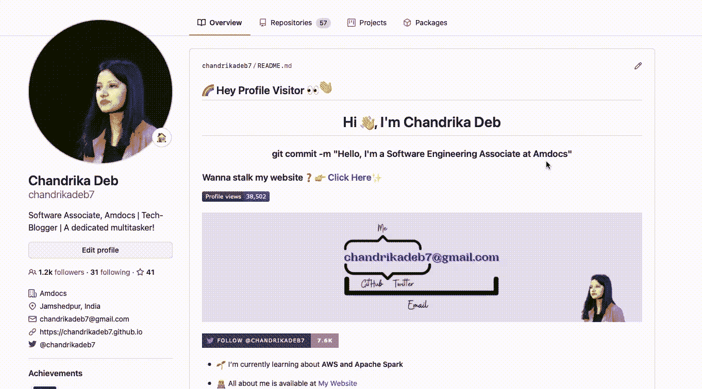
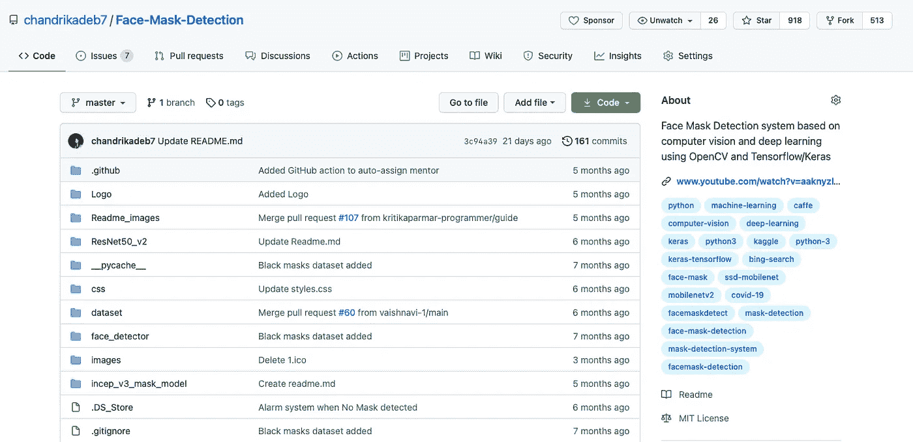
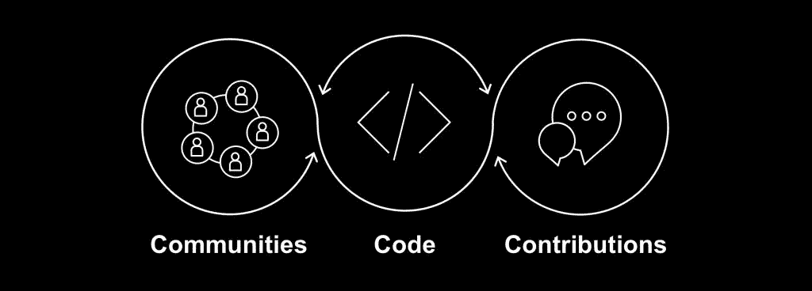

# 如何创建一个吸引顶级技术职位的 GitHub 简介？

> 原文：<https://medium.com/geekculture/how-to-create-a-kick-ass-github-profile-that-attracts-top-tech-jobs-784e618b9048?source=collection_archive---------2----------------------->

一位开发伙伴的五大技巧，她直接从 GitHub 个人资料中吸引了超过 10 个邀请！😊

十多年来，GitHub 一直是**代码灵感**、**开发者社区**和**开源合作**的广泛平台。

用通俗的语言，人们可以说—

> GitHub 属于开发人员，为开发人员服务，由开发人员使用…

从那以后时代变了，现在一个人的 **GitHub 个人资料在招聘人员眼中被视为一个重要的项目**！👀

在这里，我分享了提升你的 GitHub 简介的五大技巧，以增加你吸引工作机会或通过技术面试的机会🚀

# 1.从小处着手，但保持一致

早在我上大学的时候，我经常收到大三学生的一个问题，关于在他们的 GitHub 上放什么项目？

我对这个问题的回答是— **你已经解决或正在解决的每一个问题**。可以是编码问题、谜题、挑战、迷你实验室项目等。

它可以帮助你以不同的解决问题的方式获得有意义的合作，甚至可以帮助你解决长期悬而未决的 bug！🐛

✅:一致贡献图是向你的招聘人员传达你积极参与开源合作并且对 Git 概念适应良好的关键。

# 2.简明概要自述文件

如今，GitHub Profile ReadMe **就像简历一样突出你的一切**。从你的社会联系，最好的项目，最近的活动，你知道的技能，你使用的工具，一切都可以在这里起草！

目标是让这份文件对你未来的雇主有吸引力，同时保持真实性。不要在你的自述文件中过多地使用你只用过一次的技能或工具！**🦄**

✅你可以从下面的开发者那里获得灵感，轻松地为自己创建一个出色的个人资料自述文件

*   [https://github.com/gautamkrishnar/gautamkrishnar](https://github.com/gautamkrishnar/gautamkrishnar)
*   [https://github.com/thmsgbrt/thmsgbrt](https://github.com/thmsgbrt/thmsgbrt)
*   [https://github.com/anmol098/anmol098](https://github.com/anmol098/anmol098)
*   [https://github.com/Prince-Shivaram/Prince-Shivaram](https://github.com/Prince-Shivaram/Prince-Shivaram)

## 👉您可以轻松地生成一个自述文件(从这里开始制作我的)😀) —

 [## GitHub 配置文件自述文件生成器

### 使用这个神奇的自述文件生成器美化您的 github 个人资料。

rahuldkjain.github.io](https://rahuldkjain.github.io/gh-profile-readme-generator/) 

# 3.一个好项目> > 100 个辅导项目

***一个优质项目足以带你从赤贫到暴富！***

如果你在你的 GitHub 中有一个任何项目的**端到端实现**，有一个**定义良好的分步自述**，它可以为你赢得财富。💸

世界范围的贡献、流量、成为各种开源竞赛和社区的一部分可以让你和你的项目受益，达到新的高度！

✅针对任何行业的现状集思广益，无论是医疗保健、制造还是教育，然后**尝试用你的创新项目实施来解决问题**。

🌐在 GitHub 上发布后，在您的社交平台上分享，贡献将会源源不断！

# 4.加入，编码，为开源做贡献

对我来说，开源就是学习和探索

GitHub 上有数以千计的开源库、博客和指南，这些都是为开始您的开源之旅而编写的。

但是，你的主要动机应该如下—

*   了解现有的代码库、贡献指南等。
*   了解生产构建和管道
*   识别缺陷、错误和潜在风险
*   能够提出改进建议并进行改进
*   全年做出有意义的贡献，不仅仅是为了 HacktoberFest！

Photo by [Alex Kulikov](https://unsplash.com/@burntime?utm_source=medium&utm_medium=referral) on [Unsplash](https://unsplash.com?utm_source=medium&utm_medium=referral)

成为开源开发者社区的一员不仅仅是赢得奖品！它将你与志同道合的人、信息丰富的技术讨论、扩展的机会等联系起来。

✅:在几次采访中，有人问我关于开源软件的贡献。这真是时下招聘人员的热门问题，所以系好安全带！

# 5.关注你渴望成为的 GitHub 个人资料

Photo by [Richy Great](https://unsplash.com/@richygreat?utm_source=medium&utm_medium=referral) on [Unsplash](https://unsplash.com?utm_source=medium&utm_medium=referral)

> 受到鼓舞，但不要不知所措…受到激励，但不要被吓倒！

用这个，我传达我的最后一个提示。跟随并启动你最鼓舞人心的库，最活跃和最有知识的开发者。

✅向他们学习，但不要模仿他们。给你的大脑一个思考的机会，重新思考，在现有的基础上想出一些创新的东西。🌟

*感谢阅读到最后！希望有帮助…👩‍💻*

如果你是 GitHub 的新手，看看这个故事👇

 [## 适合初学者的 GitHub

### 这是一本帮助指南，面向所有渴望探索 GitHub 并为开源做出贡献但不了解 Git 的新手。

medium.com](/analytics-vidhya/github-for-beginners-bb1b6d9911a4) 

如有任何疑问，请随时与我联系，或者只是打个招呼！👇

 [## 软件工程师

### Chandrika Deb 是 Amdocs 的一名软件工程师，她喜欢学习新事物和帮助技术初学者。

chandrikadeb7.github.io](https://chandrikadeb7.github.io/)