# 如何使用 Graphite 创建销售线索评分模型

> 原文：<https://medium.com/geekculture/how-to-create-a-lead-scoring-model-with-graphite-81a3b4f4535d?source=collection_archive---------19----------------------->

## 销售线索代表有兴趣购买您的产品或服务的潜在客户。在这个高级分析和机器学习的时代，每个组织都希望改变从一长串对你提供的产品或服务感兴趣的人或公司中识别线索的过程。改造它，让它变得更好更有效率。为了解决这一问题，销售线索评分模型应运而生。

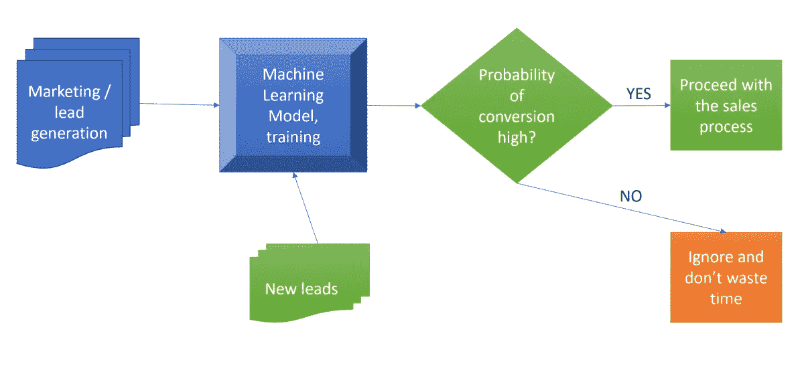

Image by the author: Lead Scoring model training and predictions process

# 介绍

公司做生意是为了盈利，只有提供客户需要的产品或服务才能盈利。满足这些需求意味着他们可以创造收入来维持和扩大业务。这就是产生销售线索的原因，因为如果公司没有带来新客户，那么他们将无法增长，并将开始停滞。

但是仅仅产生销售线索就足够了吗？

让我们开始吧。

# 什么是销售线索评分模型？

如果你的团队有很多线索，但没有足够的资源去追踪它们，你必须优先考虑你的销售团队的时间，给他们最好的线索。这意味着最有可能转化的销售线索。

线索评分模型只是一种方法，我们在其中训练机器学习模型从历史数据中学习。在我们的示例中，该模型将学习对两种状态的销售线索进行分类，即“将转化”和“将不转化”它还将了解哪些因素会影响销售线索的转化。

也许它会发现，那些打过两个以上电话的潜在客户很有可能会转变，但前提是他们在你的网站上呆了 10 分钟以上。

我相信你会同意，这种知识在任何营销和销售团队的手中都是极其强大的。

# 资料组

当您获得销售线索时，它通常包括以下信息:

*   名字
*   人口统计学的
*   标签/评论
*   潜在顾客的详细联系信息
*   原产地
*   花在网站上的时间
*   点击次数
*   发送的电子邮件数量
*   电话/演示次数
*   …

在这篇文章中，我们使用了 Kaggle 的一个流行的[销售线索转化](https://www.kaggle.com/ashydv/leads-dataset)数据集。它包含 37 列 9240 多个过去的线索。

数据集由各种属性组成，如潜在客户来源、在网站上花费的总时间、总访问量或上次活动。这些可能有助于也可能没有助于决定销售线索是否会被转化。

最重要的变量是列“Converted”它表明过去的销售线索是否已转化为客户。

*   “1”表示它已被转换
*   “0”表示它未被转换。

我们的目标:公司希望发现最有潜力的潜在客户，也就是所谓的“热门客户”

假设他们成功识别了这组线索。在这种情况下，销售线索转化率应该会上升，因为销售团队现在将更多地关注与潜在销售线索的沟通，而不是给每个人打电话。

# 导入数据集

只需点击几下鼠标，我们就可以导入并解析之前从 Kaggle 下载的 CSV 文件。

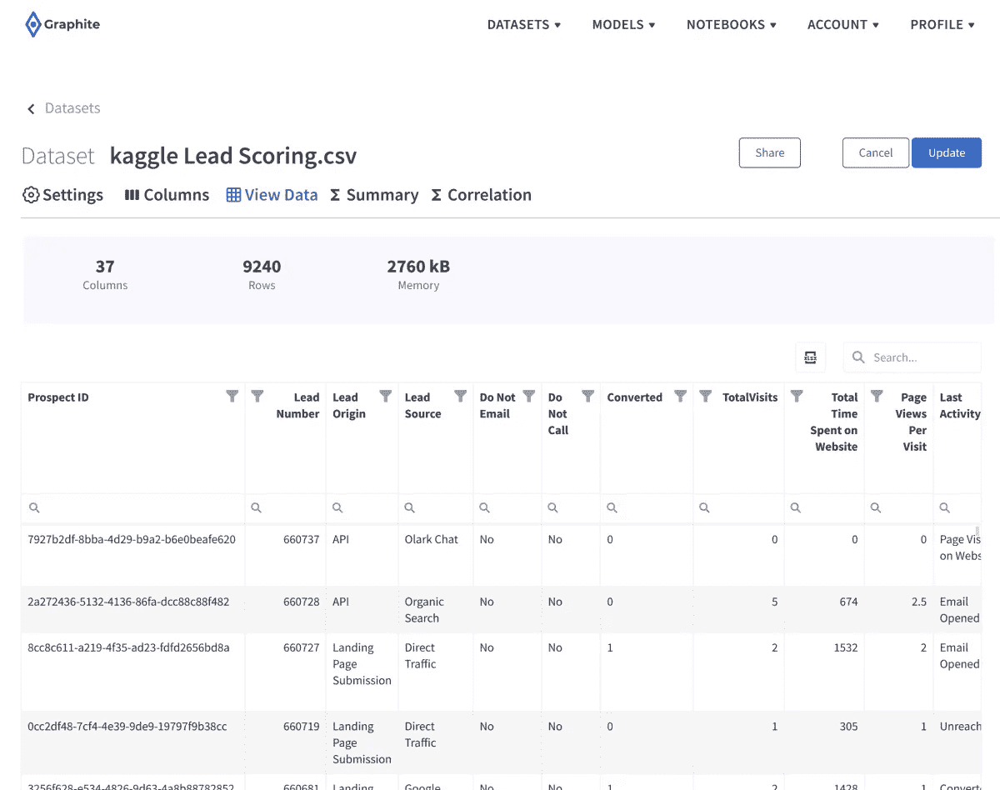

Image by the author: lead scoring training dataset in Graphite

我们可以在“查看数据”选项卡上浏览数据集行、过滤或搜索。我们有 37 列和 9240 行。

Graphite 中每个上传的数据集都有一个实用的摘要选项卡。它可以让您一目了然地检查数字列的分布、空值的数量以及不同的统计度量。

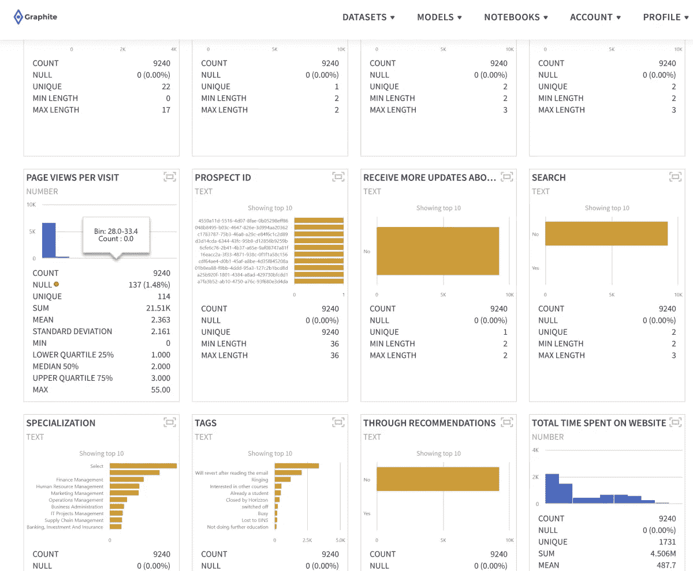

Image by the author: lead scoring training dataset summary in Graphite

作为快速探索性数据分析(EDA)的一部分，检查数据集中的相关性(在“相关性”选项卡上为您准备好)总是有助于更好地理解和“感受”数据。

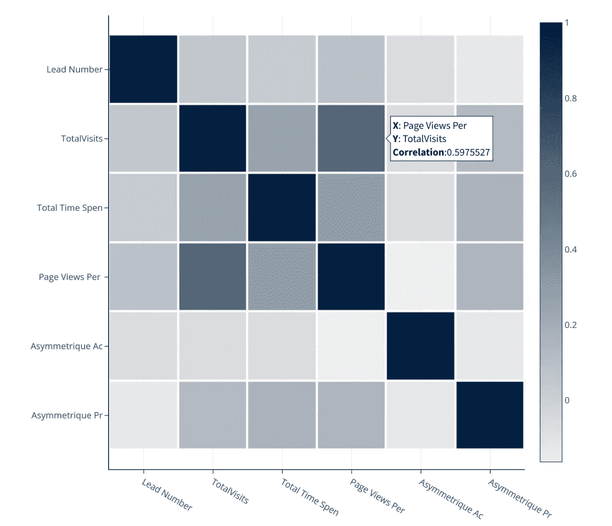

Image by the author: lead scoring training dataset correlations in Graphite

# 二元分类

预测销售线索转化是[二元机器学习分类](https://en.wikipedia.org/wiki/Binary_classification)的一个很好的用例。

二进制，因为我们将为其训练模型的目标变量只能有两种状态—‘T2’0—未转换’和‘T4’1—已转换’。

# 在 Graphite 中运行无代码机器学习模型

现在我们已经上传了数据集，我们准备在 Graphite 中创建一个无代码的机器学习模型。我们选择了**二元分类模型**。

在 Graphite 中，要构建二进制分类模型，您需要

*   一个二元目标列(我们预测的是什么，只有两个不同的状态？)
*   一组功能(对目标列有影响的其他列)

只需点击几下鼠标，我们将定义一个模型场景。

我们数据集的**目标列**:

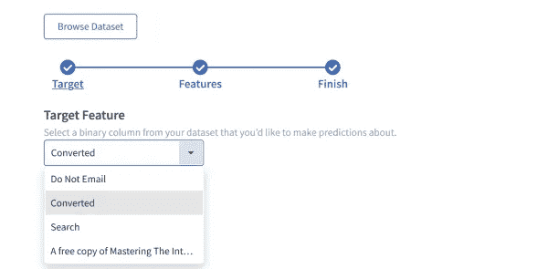

Image by the author: target column selection in Graphite

我们将选择所有其他列作为特征。

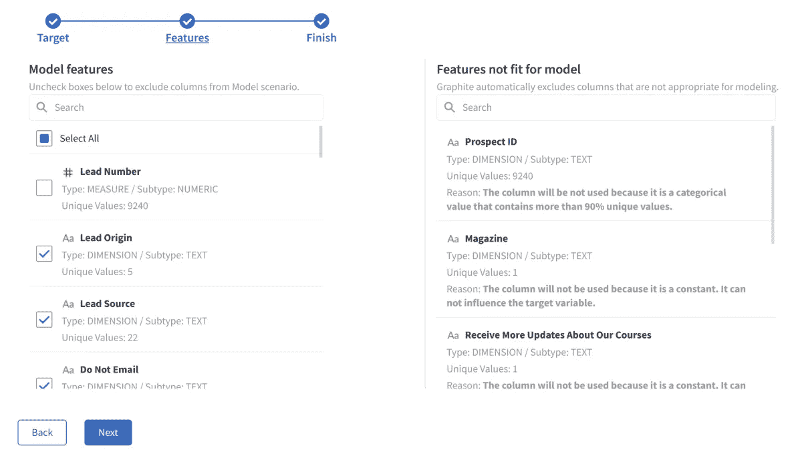

Image by the author: feature columns selection in Graphite

注意 Graphite 是如何立即排除不适合建模的列的。示例:

*   潜在客户 ID:它包含 9240 个唯一值。将不使用该列，因为它是包含 90%以上唯一值的分类值。
*   Magazine:不会使用该列，因为它是一个常量。它不能影响目标变量。

# 二元分类模型结果

我们将默认保留所有其他选项，并运行此场景。

Graphite 将负责几个预处理步骤以达到最佳效果，所以您不必考虑它们。所有这些预处理步骤将自动发生:

*   空值处理
*   缺少值
*   一个热编码
*   修复不平衡
*   正常化
*   常数
*   基数

Graphite 将抽取我们 80%的数据样本，训练几个机器学习模型。然后，它将在剩余的 20%上测试这些模型，并计算相关的模型分数。最终的最佳模型拟合、结果和预测将显示在结果选项卡上。

大约 30 秒后，我们有了结果。

Graphite 运行几个机器学习算法，通过使用

*   80%的数据(7392 行)用于训练和
*   20% (1848 行)用于测试数据集。

总训练时间为 36.46 秒。

基于 F1 值的最佳型号是**光梯度助推器**。下面列出了其他模型的培训指标。

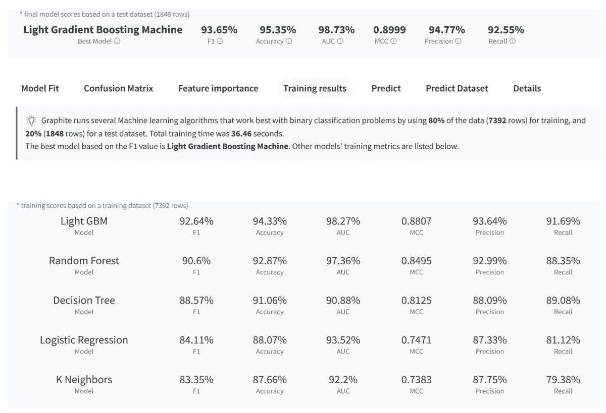

Image by the author: lead scoring training results in Graphite

“模型拟合”选项卡显示了 Graphite 的性能。对于测试数据集中的 1848 行，我们将“已转换”列的模型预测与“已转换”列的历史已知结果进行比较历史柱线和预测柱线越接近，模型拟合越好。

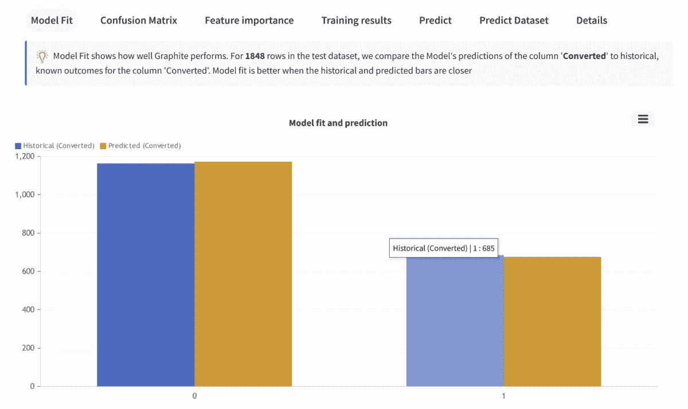

Image by the author: lead scoring model fit in Graphite

# 混淆矩阵

混淆矩阵揭示分类错误。
很容易看出这个模型是否混淆了两个阶级。对于每个类别，它总结了正确和错误预测的数量。该模型为 1848 行的测试数据集预测了“已转换”的列，并将预测结果与历史结果进行了比较。

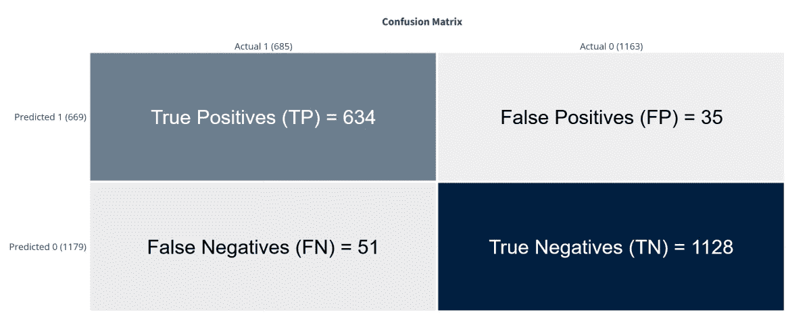

Image by the author: lead scoring model accuracy in Graphite

**正确的预测**

总共 1848 个测试行中的 1762 个。这就是定义模型准确度= 95.35%

真阳性(TP) = 634:某行为 1，模型预测该行为 1 类。

True Negatives (TN) = 1128:某行为 0，模型预测该行为 0 类。

**错误**

1848 个测试行中共有 86 行，占 4.65%

误报(FP) = 35:某行为 0，而模型预测该行为 1 类。

假阴性(FN) = 51:某行为 1，而模型预测该行为 0 类。

**其他型号分数**

请注意，我们将预测值描述为正和负，将实际值描述为真和假。

**精度**，(TP + TN) /合计。

从所有的类(正类和负类)来看，95.35%我们都预测对了。
精度应尽可能高。

**精度**，TP / (TP + FP)。

从所有我们预测为正的类中，94.77%实际上是正的。
精度应尽可能高。

**回忆**，TP / (TP + FN)。

从所有的积极类，92.55%我们预测正确。
召回率要尽可能高。

**F1 得分**，2 *(精度*召回)/(精度+召回)。

f1-得分 93.65%。它有助于同时测量召回率和精确度。没有一个强大的模型，你不可能有高的 F1 分数。

# 特征重要性

特征重要性是指该模型在多大程度上依赖于每一列(特征)来做出准确的预测。模型越依赖列(特征)进行预测，它对模型就越重要。Graphite 使用**排列特征重要性**进行计算。

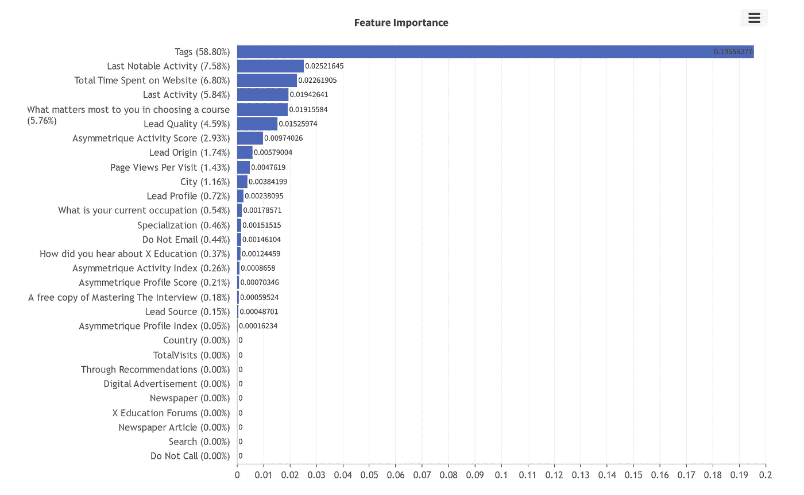

Image by the author: lead scoring feature importance in Graphite

最重要的功能是列“标签”，然后是“最后值得注意的活动”，“花在网站上的总时间”，等等。

当“标签”列包含特定标签时，这些潜在客户会更频繁地转换。

# 对新线索的预测

石墨自动部署训练模型。这意味着可以直接预测新的、看不见的潜在客户数据，无论他们是否会转变，以及这种结果的概率。

想象一下，在您使用 Graphite 培训销售线索评分模型之后，您的营销团队通知您他们的新销售线索。

您可以检查该销售线索是否会转换以及转换的可能性。一个强大的工具，让你只关注高质量的线索！

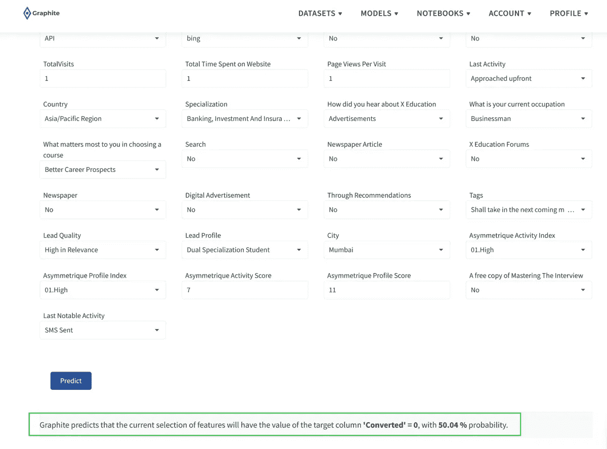

Image by the author: predicting lead conversion in Graphite

对于这种特殊的新铅，Graphite 预测它不会**转化**(转化= 0)，这种结果的概率为 50.04 %。

# 结论

我希望这能帮助你理解在像 [Graphite](https://graphite-note.com/) 这样的无代码机器学习软件中训练模型是多么容易。只需点击几下鼠标，我们就可以预测销售线索的转化。

你可以在这里探索所有其他石墨[模型。](https://graphite-note.com/machine-learning-automl-models)随意在任何数据集上训练你的机器学习模型，同样容易，或者[如果你需要任何帮助或有任何问题，可以安排一个演示](https://graphite-note.com/no-code-machine-learning-demo)。

我希望你们喜欢它！

*原载于 2022 年 3 月 29 日 https://graphite-note.com**的* [*。*](https://graphite-note.com/how-to-create-a-lead-scoring-model-with-graphite)