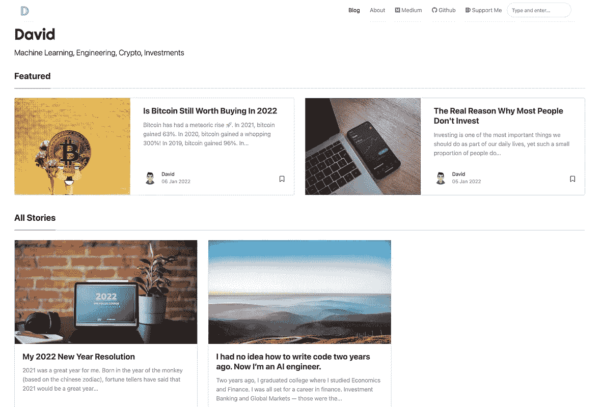
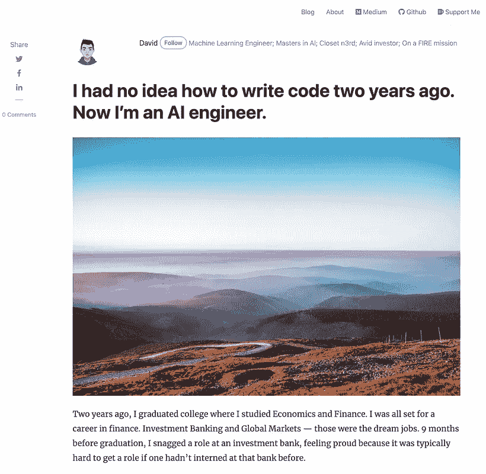
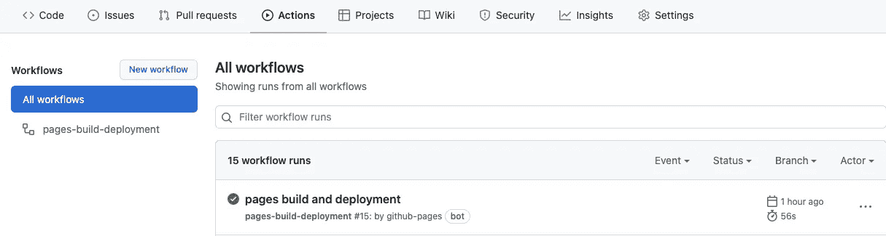
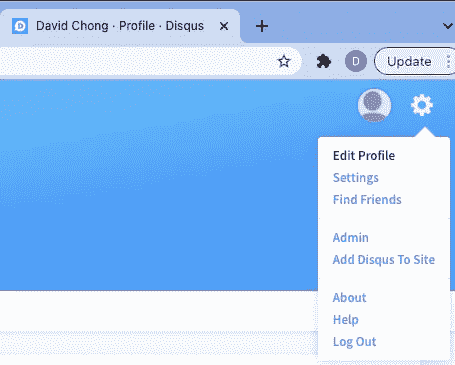
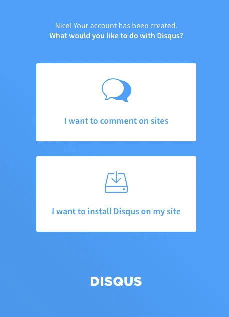
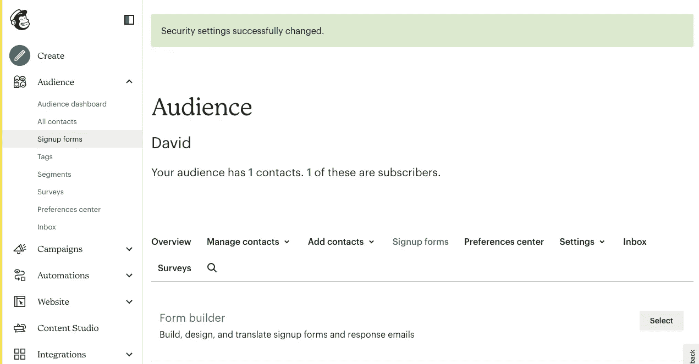

# 如何在一天内免费创建一个类似媒体的个人博客

> 原文：<https://medium.com/geekculture/how-to-create-a-medium-like-personal-blog-for-free-in-a-day-55ebd9551d9c?source=collection_archive---------4----------------------->

## 为什么要为 Wix 或者 SquareSpace 这样的网站建设者付费？

现在，在我们开始之前，让我给你看看最终的网站会是什么样子(在下面的截图中)来吊你的胃口。或者，你可以点击查看网站[，获得更好的用户体验。](https://davidcjw.github.io/)



Screenshot of landing page (left) and sample post (right) — [Photo by Author]

我们将使用的主题是 [*地中海-主题-哲基尔*](https://github.com/wowthemesnet/mediumish-theme-jekyll) 。

**所需技能**:一些基本的编程技能

**Tech Stack** : GitHub(项目管理、CI/CD、网站托管)、Markdown(用于写帖子)、Ruby(环境管理)、HTML(编辑页面结构)

**最终产品**:托管网站，用户可以在这里写博客文章，由 Google Analytics 提供支持，评论区，读者可以对文章发表评论，以及由 MailChimp 提供支持的订阅者邮件列表

> ***免责声明:*** *我会尽量让这变得简单，因为我的目标是帮助没有多少编程技能的人建立他们自己的网站。*

现在，让我们开始吧！

# 1.创建 GitHub 存储库

首先，我们将使用 [GitHub Pages](https://pages.github.com/) 来托管我们的网站，因为它是免费的，并允许我们使用他们的*Pages-build-deployment*GitHub actions 工作流(相当于 CI 管道)自动部署我们的网站，以应对任何新的变化。

为此，如果您还没有 GitHub 帐户，请创建一个。然后，使用以下存储库名称创建一个存储库:`<username>.github.io`。**不要**在存储库中包含任何其他文件——我们将如上所述处理[*mediumish-Jekyll-theme*](https://github.com/wowthemesnet/mediumish-theme-jekyll)。

# 2.用模板文件初始化 GitHub 存储库

转到[*mediumish-Jekyll-theme*](https://github.com/wowthemesnet/mediumish-theme-jekyll)*，点击“下载”按钮下载一个*。回购的 zip* 文件。或者，你可以在这里直接下载[。](https://github.com/wowthemesnet/mediumish-theme-jekyll/archive/master.zip)*

*在您的终端上，克隆您刚刚在[1]中创建的存储库。*

```
*git clone <repo_name>
cd <repo_name>*
```

*解压缩您刚刚下载的文件，并将解压缩后的文件夹中的所有文件复制到您的存储库的根目录下。您可以排除复制的一些文件/文件夹是:*

*   *`.github`*
*   *`LICENSE.txt`*
*   *`changelog.md`*
*   *`README.md`*

*复制完成后，让我们用这些文件初始化我们的存储库。*

```
*git add .
git commit -m "Initial commit"
git push origin master*
```

*推送后，您可以查看存储库上的“ **Actions** ”选项卡，以查看已经触发的 GitHub 工作流。请注意，此工作流程会自动构建和部署您的网页。*

****

*GitHub workflow trigger (Photo by Author)*

*如果您在工作流完成运行后看到绿色勾号，那么恭喜您！你现在已经有了你的模板网站并开始运行了！你可以在`https://<username>.github.io/mediumish-theme-jekyll`观看。您应该会看到类似于现场演示的东西，如这里看到的。*

# *3.定制，让它成为你自己的！*

*现在到了棘手的部分——定制。通常情况下，我们希望在实际部署之前在本地查看我们的更改(推送到我们的存储库的主分支以触发 GitHub 工作流)。为了在部署之前在本地测试我们的更改以让公众看到它，我们希望设置本地环境来服务我们的 web 页面。*

## *3a。使用 rbenv 设置我们的本地环境*

*出于本文的目的，我将使用 macOS 来演示各种依赖项的安装(请遵循各个链接中针对您各自操作系统的说明)。*

*因为我们需要使用 ruby 来管理我们的项目，我们将安装一个 Ruby 环境管理器来管理不同版本的 Ruby。具体来说，我们将使用`[rbenv](https://github.com/rbenv/rbenv)`来实现这个目的。*

1.  *卸载任何现有版本的 Ruby*

```
*brew uninstall ruby*
```

*2.安装`rbenv`*

```
*brew install rbenv*
```

*3.安装并使用我们需要的 Ruby 版本*

```
*rbenv install 2.7.5  # Install version 2.7.5
rbenv local 2.7.5  # Use version 2.7.5*
```

*4.检查我们使用的是 2.7.5 版本的 Ruby*

```
*ruby -v
>>> ruby 2.7.5*
```

*5.验证`rbenv`是否设置正确*

```
*curl -fsSL [https://github.com/rbenv/rbenv-installer/raw/main/bin/rbenv-doctor](https://github.com/rbenv/rbenv-installer/raw/main/bin/rbenv-doctor) | bash>>> Checking for `rbenv' in PATH: /usr/local/bin/rbenv
>>> Checking for rbenv shims in PATH: OK
>>> Checking `rbenv install' support: /usr/local/bin/rbenv-install (ruby-build 20211227)
>>> Counting installed Ruby versions: 1 versions
>>> Checking RubyGems settings: OK
>>> Auditing installed plugins: OK*
```

*6.(可选)解决路径问题*

*如果上面的任何输出没有被标记为`OK`，很可能您需要将相关的二进制文件添加到您的 PATH 变量中(您可以使用`echo $PATH`进行检查)。*

```
*# To add `rbenv`to PATH
echo 'export PATH="$HOME/.rbenv/bin:$PATH"' >> ~/.bashrc# To add rbenv shims to PATH
echo 'export PATH="$HOME/.rbenv/shims:$PATH"' >> ~/.bashrc*
```

*注意，上面的示例代码假设用户正在使用 bash shell。根据您使用的 shell，您应该将`~/.bashrc`替换为`~/.bash_profile`或`~/.zshrc`(对于 Zsh)。对于鱼壳，使用:*

```
*set -Ux fish_user_paths $HOME/.rbenv/bin $fish_user_paths
set -Ux fish_user_paths $HOME/.rbenv/shims $fish_user_paths*
```

## *3b。本地提供网页*

*在本地进行任何更改之前，让我们先尝试在本地提供网页服务。*

```
*bundle install  # install required dependencies
bundle exec jekyll serve --watch  # served and changes are watched*
```

*您现在可以找到您在`localhost:4000/mediumish-theme-jekyll`提供的网页。*

*恭喜你。现在，您可以在本地提供您的 web 页面，在提交到 GitHub 之前预览您想要做的任何更改。*

## *3c。编辑帖子*

*值得注意的是，这个主题基于一个使用 [Bootstrap 4](https://getbootstrap.com/) 构建的 [Jekyll](https://en.wikipedia.org/wiki/Jekyll_(software)) 模板。如果你不知道这些是什么，那也没关系。在创建和编辑我们的博客帖子时，我们只需遵循一定的格式。模板的创建者友好地创建了一个简单的[文档](https://bootstrapstarter.com/template-mediumish-bootstrap-jekyll/)，它是 YAML 邮报所要求的格式。*

*总而言之，你需要知道的是:*

*   *帖子将通过在`_posts`文件夹中添加 markdown ( `.md`)文件来填充。*
*   *这些帖子`.md`文件遵循`YYYY-MM-DD-insert-title-here.md`的格式。*
*   *每个岗位使用一个 [YAML 前台](https://jekyllrb.com/docs/front-matter/)。这仅仅意味着每个降价文件都以:*

```
*---
layout: post
title: "hello world"
author: david
...
<other options below>
---*
```

*   *任何低于 YAML 封面的内容都是以减价格式撰写的帖子内容本身。你可以参考这个简单的[减价备忘单](https://www.markdownguide.org/cheat-sheet/)来格式化你的帖子。*
*   *在这里阅读前面的可用选项[并了解如何使用它们是值得的](https://bootstrapstarter.com/template-mediumish-bootstrap-jekyll/)*

## *3d。编辑` _config.yml '*

*这个文件可能是最重要的文件，它包含了重要的配置，您需要编辑这些配置来使站点成为您自己的站点。我将讨论一些不太容易理解的问题，您需要对它们进行修改。*

*   *`logo.png`和`favicon.png`:这是用于在页面左上角显示您的品牌的标志，在页面下方，读者可以选择订阅您的电子邮件简讯。替换`assets/images`文件夹中的这些文件。*
*   *`google_analytics`:这是 Google Analytics 使用的通用分析(UA)标识符。这使您能够跟踪重要的指标，如独立访问者的数量、用户在特定页面上停留的时间等。点击阅读如何生成自己的 UA 标识符*
*   *`disqus`:这是你在每篇文章底部看到的评论部分。要生成您自己的`disqus` ID，首先在这里注册一个账户[。接下来，在您的个人资料页面上，选择“*将 Disqus 添加到站点*”。跟随页面并选择“*我想在我的网站上添加 Disqus*”。](https://disqus.com/)*

****

*Screenshots by Author*

*   *`mailchimp-list`:在 MailChimp 上注册一个账户，使用他们的“表单生成器”定制一个表单，然后用这个表单 URL 替换。*

**

*Screenshot by Author*

*   *`baseurl`:如果您不想使用`baseurl`，就像`baseurl: ""`一样将其留空。你的网页将在`https://<username>.github.io`使用`index.html`。*
*   *`authors`:修改 YAML 前台使用的作者密钥*

# *最后的话*

*就是这样！你差不多完成了！将您的更改推送到 GitHub 上的主分支，并等待工作流完成，以查看您的更改是否得到反映。*

*也就是说，通过修改模板本身(在`_includes`和`_layouts`下的 HTML 文件)，您可以定制更多内容。可能性是无穷无尽的:)*

*另外，如果你愿意，你可以使用你自己的自定义域来代替 GitHub 的`github.io`。点击了解如何做到这一点[。](https://docs.github.com/en/pages/configuring-a-custom-domain-for-your-github-pages-site/about-custom-domains-and-github-pages)*

*最后，大声喊出来萨尔，这个主题的创造者。你可以在这里给他买一杯咖啡[来感谢他的出色工作。](https://www.wowthemes.net/donate/)*

****支持我！*** —如果你喜欢我的内容并且*没有*订阅 Medium，请考虑支持我并通过我的推荐链接[在这里订阅](https://davidcjw.medium.com/membership) ( *注:你的一部分会员费将作为推荐费*分摊给我)。*