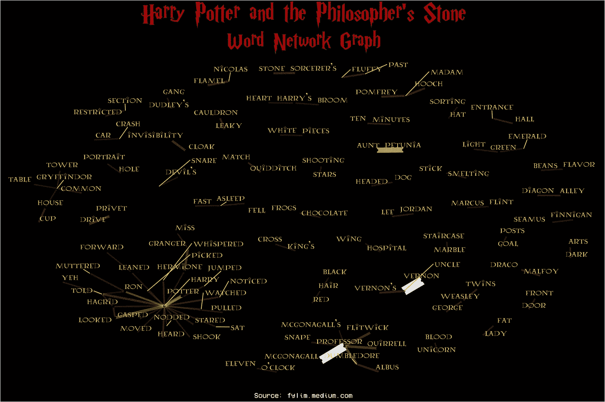

# 如何用 R 中的单词创建网络图

> 原文：<https://medium.com/geekculture/how-to-create-a-network-graph-with-words-in-r-7f40ef1a3ec7?source=collection_archive---------9----------------------->

## 使用《哈利·波特》系列中的文本创建网络图的两个简单步骤

## 将文本可视化为自然语言处理领域的一部分

自然语言处理(NLP)是数据科学的一个子领域，专注于分析文本。流行的自然语言处理技术…