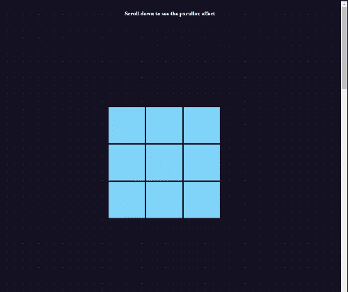

# 如何在纯 Javascript 上创建视差图

> 原文：<https://medium.com/geekculture/how-to-create-a-parallax-on-pure-javascript-eb3fca423551?source=collection_archive---------9----------------------->



每个人至少有一次在网站上看到视差效果。它们可能很简单。例如滚动时特定点上的静态背景。另一方面，这些影响可能极其复杂。然而，这种效果通常在视觉上看起来令人印象深刻。

视差总是让我惊讶。在 web 开发中是如何做到的。在我看来，这是如此复杂和不可实现的。然后经过几年对使用这种技术的漂亮网站的沉思，我决定尝试一下。

**什么是视差？**

“视差”一词的意思是指计算机图形学中使用的一种特定技术。当用户滚动网页时，多个层以不同的速度移动。如此多的运动产生了一种视觉错觉。老实说，这项技术并不新鲜。它在 1980 年代早期的超级马里奥兄弟游戏中被用来创造深度感。然后这个图形技巧在网页设计中获得了第二次生命。

**科技栈**

如上所述，我使用了 vanillaJS(纯 JavaScript)。Pug 模板语言被用来加速 HTML 的工作。以及 SCSS，而不是纯粹的 CSS。

**什么被创造出来，它是如何工作的？**

它开始是一个实验。虽然最后变成了一个小图书馆。它需要一个小的 HTML 和一些 Javascript 函数。我们有特定的课程。每个“. prlx-item-inner”都可以有一个动画。此外，每一个可以有多个动画。所以你可以把缩放和旋转结合起来。

这个代码可以在任何 HTML 网站上使用。JavaScript*(function(){ })*包装将防止与任何其他库冲突。

**可重用类列表**

*   方向运动类:左，右，上，下
*   速度-<number>-可以有任何数字。《出埃及记》:`速度-3 '</number>
*   旋转——旋转对象
*   缩放—缩小

**至结构**

这需要的基本元素是容器和滚动的内部元素的数量。

以下是 HTML 代码:

```
#prlx-container
  .text-top
    p Scroll down to see the parallax effect
  .row
    .prlx-item
      .prlx-item-inner.left.speed-3
    .prlx-item
      .prlx-item-inner.top.speed-2.spin
    .prlx-item
      .prlx-item-inner.right
    .prlx-item
      .prlx-item-inner.left.speed-5
    .prlx-item
      .prlx-item-inner.zoom.speed-2
    .prlx-item
      .prlx-item-inner.right.speed-5
    .prlx-item
      .prlx-item-inner.left
    .prlx-item
      .prlx-item-inner.bottom
    .prlx-item
      .prlx-item-inner.right.spin
  .side-dots
```

在这个例子中，我设置了*。第*行元素为*位置:固定；*。所以它总是可见的。

*。prlx-item-inner* 必须在*位置:绝对；*这样我们可以用 x，y(左上)坐标来控制。它的父母是*。prlx-item* 为*位置:相对位置；*。这样，它的子对象将相对于父对象移动，而不是相对于整个视口移动。

**Javascript**

有三种功能负责运动。分别缩放()、旋转()、移动()。

checkMovement()检查哪个方向、速度和动画类型被设置为一个元素。然后 bindMovementsToElement()将特定的动画绑定到 html 元素。

在文件的末尾，我们有一个*window . addevent listener(' scroll '，()= > {})* 事件，它在每次滚动发生时触发并激活 html 元素上的动画。

就是这样。仅此而已。代码简单快捷。

下面是代码本身:

**结论**

它开始是一个实验。虽然最后变成了一个小图书馆。也许有一天我会发表在 github 上。目前，任何人都可以在 codepen 上试用，并在自己的网站上使用。