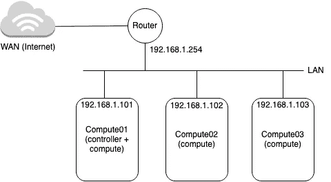
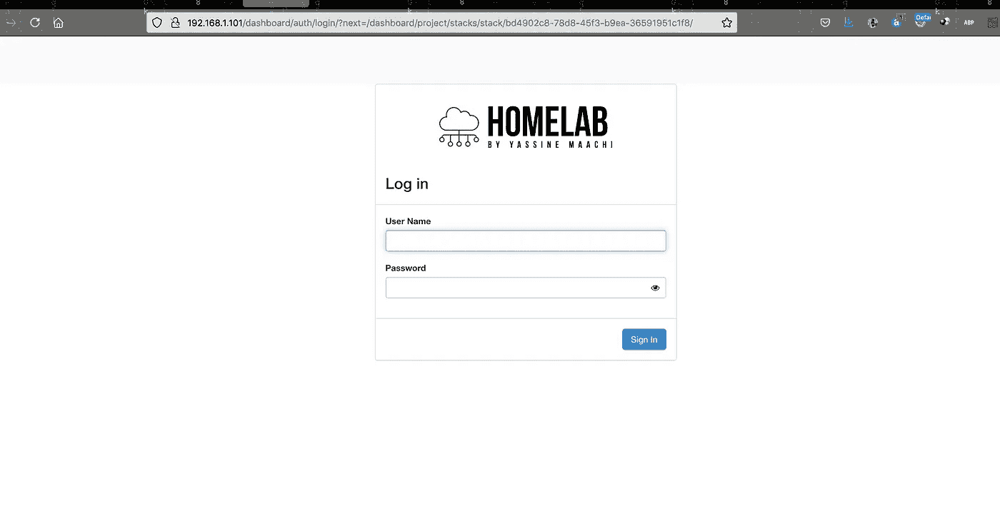
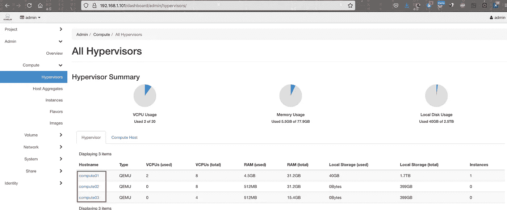

# 如何使用 Openstack 在家中创建个人云

> 原文：<https://medium.com/geekculture/how-to-create-a-personal-cloud-at-home-using-openstack-24061f991048?source=collection_archive---------9----------------------->


原文:

 [## 如何使用 Openstack 在家中创建个人云

### 本文档展示了如何使用 Packstack 安装实用程序在 3 个节点上构建概念验证云。的…

blog.yassinemaachi.com](https://blog.yassinemaachi.com/2021/06/how-to-create-personal-cloud-at-home.html) 

本文档展示了如何使用 Packstack 安装实用程序在 3 个节点上构建概念验证云。

本指南中使用的硬件配置:

*   1x Dlink DR-600 路由器，使用 NAT、防火墙等提供互联网接入
*   1x 数据链路交换机，提供机器之间的通信
*   3 台带有硬件虚拟化扩展的物理机，以及至少一个网络适配器。



Homelab architecture

*   *compute 01:****8 CPU****|****32G****RAM |****1，8t****data |****192 . 168 . 1 . 101****|****CentOS 7 x86 _ 64***
*   *compute 02:****8 CPU****|****32G****RAM |****500g****data |****192 . 168 . 1 . 102***|***CentOS***
*   *compute 03:****4c pu****|****16G****RAM |****500g****data |****192 . 168 . 103***

# **在第一个节点“compute 01”us root 用户上运行以下命令**

**在同时充当控制器和计算节点的第一个节点上开始安装。**

**如果使用非英语语言环境，请确保填充了/etc/环境:**

```
echo "LANG=en_US.utf-8
LC_ALL=en_US.utf-8" >> /etc/environment
```

**在/etc/hosts 中添加其他节点地址**

```
echo "192.168.1.101 compute01
192.168.1.102 compute02
192.168.1.103 compute03" >> /etc/hosts
```

**如果您的系统满足下面提到的所有先决条件，请继续运行以下命令。**

*   **Red Hat Enterprise Linux (RHEL) 7 是最低推荐版本，或者是基于 RHEL 的 Linux 发行版(如 CentOS、Scientific Linux 等)的等效版本。x86_64 是目前唯一支持的体系结构。**
*   **具有至少 16GB RAM、带有硬件虚拟化扩展的处理器和至少一个网络适配器的机器。**

**更新您当前的软件包:**

```
yum update -y
```

**如果您计划通过外部网络访问服务器和实例，这是正确配置网络设置的好时机。一个静态的 IP 地址给你的网卡，并禁用网络管理器是好主意。**

```
systemctl disable firewalld
systemctl stop firewalld
systemctl disable NetworkManager
systemctl stop NetworkManager
systemctl enable network
systemctl start network
yum update -y
```

**在 CentOS 7 上，Extras 存储库提供支持 OpenStack 存储库的 RPM。CentOS 8 默认启用 Extras，因此您只需安装 RPM 即可设置 OpenStack 存储库:**

```
yum install -y centos-release-openstack-rocky
yum update -y
```

**安装 Packstack 安装程序:**

```
yum install -y openstack-packstack
```

**如果您有额外的硬盘驱动器，您可以使用它们作为 lvm 后端来扩展 cinder 存储容量。要添加装载在/dev/sdb 和/dev/sdc 上的 2 个磁盘，请运行以下命令:**

**对于第一个磁盘/dev/sdb :
在/dev/sdb 磁盘上创建一个带有内部日志的 XFS 文件系统:**

```
mkfs.xfs -f -L "HomeLabStore" /dev/sdb
```

**接下来，我们将使用 pvcreate 命令创建一个物理卷，供 LVM 稍后使用。在这种情况下，物理卷将是我们新的/dev/sdb:**

```
pvcreate -y /dev/sdb
```

**现在，使用 vgextend 命令，我们通过添加/dev/sdb 物理卷来扩展 centos 卷组，该物理卷是我们刚刚使用 pvcreate 命令创建的。**

```
vgextend centos /dev/sdb
```

**然后使用 lvextend 命令扩展逻辑卷。我们在较新的/dev/sdb 上扩展了/dev/centos/root 的原始逻辑卷**

```
lvextend -l +100%FREE /dev/centos/root
```

**通过以下方式扩展文件系统:**

```
xfs_growfs /
```

**检查更改:**

```
lvmdiskscan -l
df -h
```

**对于第二个磁盘/dev/sdc :
在/dev/sdc 磁盘上创建一个带有内部日志的 XFS 文件系统:**

```
mkfs.xfs -f -L "HomeLabStore" /dev/sdc
```

**接下来，我们将使用 pvcreate 命令创建一个物理卷，供 LVM 稍后使用。在这种情况下，物理卷将是我们新的/dev/sdc:**

```
pvcreate -y /dev/sdc
```

**现在，使用 vgextend 命令，我们通过添加/dev/sdc 物理卷来扩展 centos 卷组，该物理卷是我们刚刚使用 pvcreate 命令创建的。**

```
vgextend centos /dev/sdc
```

**然后使用 lvextend 命令扩展逻辑卷。我们在较新的/dev/sdc 上扩展了/dev/centos/root 的原始逻辑卷**

```
lvextend -l +100%FREE /dev/centos/root
```

**通过以下方式扩展文件系统:**

```
xfs_growfs /
```

**检查更改:**

```
lvmdiskscan -l
df -h
```

**重新启动节点:**

```
reboot
```

**Packstack 免去了手动设置 OpenStack 的工作。对于单节点 OpenStack 部署(我们将在第二个部署中添加其他节点)，运行以下命令:**

```
packstack
 --allinone --provision-demo=n  --os-neutron-l2-agent=openvswitch 
--os-neutron-ml2-mechanism-drivers=openvswitch 
--os-neutron-ml2-tenant-network-types=vxlan 
--os-neutron-ml2-type-drivers=flat,vlan,gre,vxlan  
--os-neutron-ovs-bridge-mappings=extnet:br-ex 
--os-neutron-ovs-bridge-interfaces=br-ex:p3p1
```

**这意味着，我们将打开接口，并将其作为端口插入 br-ex OVS 网桥，以提供上行链路连接。并将为我们的外部物理 L2 网段定义一个逻辑名称“extnet”。稍后，在创建外部网络时，我们将通过名称来引用我们的提供商网络。**

**检查网络配置的一些有用命令:**

```
ovs-vsctl list-br
cat /etc/sysconfig/network-scripts/ifcfg-p3p1
cat /etc/sysconfig/network-scripts/ifcfg-br-ex
ovs-vsctl list-ports br-tun
ovs-vsctl list-ports br-int
ovs-vsctl list-ports br-ex
cat /etc/neutron/plugins/ml2/ml2_conf.ini |grep type_drivers
cat /etc/neutron/plugins/ml2/ml2_conf.ini |grep tenant_network_types
cat /etc/neutron/plugins/ml2/ml2_conf.ini |grep flat_networks
cat /etc/neutron/plugins/ml2/ml2_conf.ini |grep vni_ranges
cat /etc/neutron/plugins/ml2/openvswitch_agent.ini |grep  tunnel_types -B12
cat /etc/neutron/plugins/ml2/openvswitch_agent.ini |grep  l2_population
cat /etc/neutron/plugins/ml2/openvswitch_agent.ini |grep  prevent_arp_spoofing
cat /etc/neutron/plugins/ml2/openvswitch_agent.ini |grep  bridge_mappings
```

**重新启动节点:**

```
reboot
```

**现在，用中子创建外部网络。**

```
source keystonerc_admin
neutron net-create external_network --provider:network_type flat --provider:physical_network extnet  --router:external
```

**请注意:“extnet”是我们用上面的–OS-neutron-ovs-bridge-mappings 定义的 L2 段。**

**您需要创建一个分配范围在外部 DHCP 范围之外的公共子网，并将网关设置为外部网络的默认网关。**

```
neutron
 subnet-create --name public_subnet --enable_dhcp=False 
--allocation-pool=start=192.168.1.110,end=192.168.1.210  
--gateway=192.168.1.254 external_network 192.168.1.0/24
```

**获得一个 cirros 映像，在没有演示配置的情况下不进行配置:**

```
curl
 -L [http://download.cirros-cloud.net/0.3.4/cirros-0.3.4-x86_64-disk.img](http://download.cirros-cloud.net/0.3.4/cirros-0.3.4-x86_64-disk.img) |
 glance          image-create --name='cirros image' --visibility=public 
--container-format=bare --disk-format=qcow2
```

**因为您还没有创建项目和用户:**

```
openstack project create --enable homelab
openstack user create --project homelab --password SuperPassw0Rd --email ymaachi@yassinemaachi.com --enable ymaachi
```

**现在，让我们创建一个源文件，以便轻松切换到新创建的用户:**

```
echo "    export OS_USERNAME=ymaachi
    export OS_PASSWORD='SuperPassw0Rd'
    export OS_TENANT_NAME=homelab
    export PS1='[\u@\h \W(keystone_ymaachi)]\$ '" > keystonerc_ymaachi
```

**然后创建一个路由器，并使用管理员在前面的某个步骤中创建的外部网络设置其网关:**

```
neutron router-create homelab_router
neutron router-gateway-set homelab_router external_network
```

**现在创建一个专用网络并在其中创建一个子网，因为演示配置已被禁用:**

```
neutron net-create homelab_network
neutron
 subnet-create --name homelab_subnet --gateway 192.168.100.1 
--dns-nameserver 192.168.1.254 --dns-nameserver 8.8.8.8 --dns-nameserver
 4.4.4.4  homelab_network 192.168.100.0/24
```

**最后，通过路由器将新的私有网络连接到公共网络，路由器将提供浮动 IP 地址。**

```
neutron router-interface-add homelab_router homelab_subnet
```

**导入 ssh 密钥以访问实例(您可以生成自己的密钥):**

```
openstack keypair create --public-key ~/.ssh/id_rsa.pub rootATcompute01
```

**创建一个安全组来授权对实例的 ssh 访问:**

```
openstack security group create secgroup01
openstack security group rule create --protocol icmp --ingress secgroup01
openstack security group rule create --protocol tcp --dst-port 22:22 secgroup01
openstack security group rule list
```

# **以 root 用户身份在第二个节点“Compute02”上运行以下命令**

**如果使用非英语语言环境，请确保填充了/etc/环境:**

```
echo "LANG=en_US.utf-8
LC_ALL=en_US.utf-8" >> /etc/environment
```

**在/etc/hosts 中添加其他节点地址**

```
echo "192.168.1.101 compute01
192.168.1.102 compute02
192.168.1.103 compute03" >> /etc/hosts
```

**如果您的系统满足下面提到的所有先决条件，请继续运行以下命令。**

*   **Red Hat Enterprise Linux (RHEL) 7 是最低推荐版本，或者是基于 RHEL 的 Linux 发行版(如 CentOS、Scientific Linux 等)的等效版本。x86_64 是目前唯一支持的体系结构。**

**更新您当前的软件包:**

```
yum update -y
```

**如果您计划通过外部网络访问服务器和实例，这是正确配置网络设置的好时机。一个静态的 IP 地址给你的网卡，并禁用网络管理器是好主意。**

```
systemctl disable firewalld
systemctl stop firewalld
systemctl disable NetworkManager
systemctl stop NetworkManager
systemctl enable network
systemctl start network
yum update -y
```

**在 CentOS 7 上，Extras 存储库提供支持 OpenStack 存储库的 RPM。CentOS 8 默认启用 Extras，因此您只需安装 RPM 即可设置 OpenStack 存储库:**

```
yum install -y centos-release-openstack-rocky
yum update -y
```

**重新启动节点:**

```
reboot
```

# **以 root 用户身份在第三个节点“Compute03”上运行以下命令**

**如果使用非英语语言环境，请确保填充了/etc/环境:**

```
echo "LANG=en_US.utf-8
LC_ALL=en_US.utf-8" >> /etc/environment
```

**在/etc/hosts 中添加其他节点地址**

```
echo "192.168.1.101 compute01
192.168.1.102 compute02
192.168.1.103 compute03" >> /etc/hosts
```

**如果您的系统满足下面提到的所有先决条件，请继续运行以下命令。**

*   **Red Hat Enterprise Linux (RHEL) 7 是最低推荐版本，或者是基于 RHEL 的 Linux 发行版(如 CentOS、Scientific Linux 等)的等效版本。x86_64 是目前唯一支持的体系结构。**

**更新您当前的软件包:**

```
yum update -y
```

**如果您计划通过外部网络访问服务器和实例，这是正确配置网络设置的好时机。一个静态的 IP 地址给你的网卡，并禁用网络管理器是好主意。**

```
systemctl disable firewalld
systemctl stop firewalld
systemctl disable NetworkManager
systemctl stop NetworkManager
systemctl enable network
systemctl start network
yum update -y
```

**在 CentOS 7 上，Extras 存储库提供支持 OpenStack 存储库的 RPM。CentOS 8 默认启用 Extras，因此您只需安装 RPM 即可设置 OpenStack 存储库:**

```
yum install -y centos-release-openstack-rocky
yum update -y
```

**重新启动节点:**

```
reboot
```

# **以 root 用户身份在控制器节点(第一个节点)“Compute01”上运行以下命令**

**首先，编辑在初始 Packstack 设置期间生成的“应答文件”。您将在运行 Packstack 的目录中找到该文件。**

**注意:默认情况下，$youranswerfile 名为 pack stack-answer-$ date-$ time . txt。**

```
vi packstack-answers-20210604-163902.txt
```

**如果希望将新节点作为唯一的计算节点，请将 CONFIG_COMPUTE_HOSTS 的值从第一个主机 IP 地址的值更改为第二个主机 IP 地址的值。如果您以逗号分隔列表的形式添加这两个系统，也可以将它们作为计算节点:**

```
CONFIG_COMPUTE_HOSTS=192.168.1.101,192.168.1.102,192.168.1.103
```

**您可以更改以下值，以便在您的家庭云中安装这些附加服务:**

```
CONFIG_MANILA_INSTALL=y
CONFIG_PANKO_INSTALL=y
CONFIG_SAHARA_INSTALL=y
CONFIG_HEAT_INSTALL=y
CONFIG_MAGNUM_INSTALL=y
CONFIG_TROVE_INSTALL=y
CONFIG_NEUTRON_FWAAS=y
CONFIG_NEUTRON_VPNAAS=y
```

**再次运行 Packstack，指定修改后的“应答文件”:**

```
packstack --answer-file=packstack-answers-20210604-163902-second-deployment.txt
```

**安装程序将要求您为正在网络上安装的每个主机节点输入 root 密码，以启用主机的远程配置，这样它就可以使用 Puppet 远程配置每个节点。**

**在 Horizon 中安装马尼拉用户界面:**

```
yum install -y openstack-manila-ui
```

**自定义 Horizon 徽标:**

```
mv
 /usr/share/openstack-dashboard/static/dashboard/img/logo-splash.svg 
/usr/share/openstack-dashboard/static/dashboard/img/logo-splash.svg.old
mv /usr/share/openstack-dashboard/static/dashboard/img/logo.svg /usr/share/openstack-dashboard/static/dashboard/img/logo.svg.old
mv

/usr/share/openstack-dashboard/openstack_dashboard/static/dashboard/img/logo.svg

/usr/share/openstack-dashboard/openstack_dashboard/static/dashboard/img/logo.svg.old
mv

/usr/share/openstack-dashboard/openstack_dashboard/static/dashboard/img/logo-splash.svg

/usr/share/openstack-dashboard/openstack_dashboard/static/dashboard/img/logo-splash.svg.old
```

**从您的计算机上，将新徽标复制到 horizon，以替换 openstack 默认徽标:**

```
scp
 img/Color-logo-no-background.svg 
root@192.168.1.101:/usr/share/openstack-dashboard/openstack_dashboard/static/dashboard/img/logo.svg
scp
 img/Color-logo-no-background-splash.svg 
root@192.168.1.101:/usr/share/openstack-dashboard/openstack_dashboard/static/dashboard/img/logo-splash.svg
scp img/Color-logo-no-background.svg root@192.168.1.101:/usr/share/openstack-dashboard/static/dashboard/img/logo.svg
scp
 img/Color-logo-no-background-splash.svg 
root@192.168.1.101:/usr/share/openstack-dashboard/static/dashboard/img/logo-splash.svg
```

**现在，从控制器节点(compute01)添加 Horizon 的 DNS 别名并重启 httpd 服务:**

```
vi /etc/httpd/conf.d/15-horizon_vhost.conf
  ServerAlias cloud.yassinemaachi.com
systemctl restart httpd
systemctl restart memcached
```

**流程完成后，您可以通过访问 [http://$YOURIP/dashboard 登录 OpenStack web 界面 Horizon。](/$YOURIP/dashboard.)用户名是 admin。可以在控制节点的/根目录下的 keystonerc_admin 文件中找到该密码。**

****

**Horizon homelab access**

**要检查 horizon 中所有计算节点的状态，请转至管理项目中“计算”下的“虚拟机管理程序”部分:**

****

**homelab horizon hypervisors**

**下一步:**

**[](https://yassinemaachi5.medium.com/deploy-a-virtual-machine-in-openstack-then-install-docker-and-rancher-on-it-ea21d40da700) [## 在 Openstack 中部署一个虚拟机，然后在其上安装 docker 和 rancher

### Openstack、Heat、centos、docker、rancher

yassinemaachi5.medium.com](https://yassinemaachi5.medium.com/deploy-a-virtual-machine-in-openstack-then-install-docker-and-rancher-on-it-ea21d40da700) 

这个故事是基于和灵感来自于 https://www.rdoproject.org/install/packstack/[的 RDO 项目](https://www.rdoproject.org/install/packstack/)**