# 如何创建 Pinterest 克隆第一部分:上传照片

> 原文：<https://medium.com/geekculture/how-to-create-a-pinterest-clone-part-i-upload-photos-a1f385812729?source=collection_archive---------8----------------------->

## 由 TigerGraph 提供图片分类和搜索的图片托管服务


The preview of the final product

**概述及目标**

Pinterest 是一家价值十亿美元的公司，用户数量不断增长。Pinterest 与众不同的技术之一是由 Pinterest 的首席科学家兼斯坦福大学教授 Jure Leskovec 在[的视频](https://info.tigergraph.com/graph-ai-summit-spring-2021-jure-leskovec)中介绍的，他在视频中讲述了 Pinterest 如何使用数十亿个引脚和电路板的图形信息来增强人工智能，并提供更多相关的推荐和搜索结果。光是大头针就可以生成一个图表，其中照片与公共元数据相关联。这个图形信息也可以用来获得更好的搜索结果。

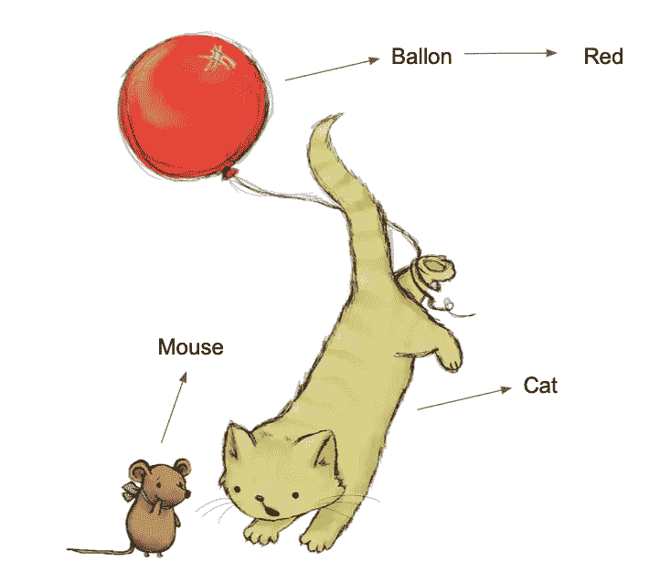

Example of the metadata in a picture (Image from [Pixabay](https://pixabay.com/illustrations/cat-cat-and-mouse-cute-cute-cat-3552048/))

本博客系列将一步步向您展示如何构建 Pinterest 克隆，该克隆使用基本的图像分类算法识别用户上传照片的元数据，并使用 TigerGraph 的元数据来支持搜索。我们将使用 Quasar 作为前端，FastAPI 作为后端，MongoDB 存储照片文件，TigerGraph 存储照片元数据和 empower 搜索。到本博客(第一部分)结束时，您将已经构建了一个支持照片上传和预览的 web 应用程序。在每一步之后，请随意参考为前端和后端发布的代码！

**先决条件:**

建议基本熟悉 Typescript、Python 和 MongoDB，但这不是必需的！请随意探索您感兴趣的部分，并复制其他部分的代码！

**第一部分:创建前端、后端和数据库**

让我们首先创建一个名为`photo_library`的目录，它将包含这个项目的所有内容。我们将首先使用 [Quasar-CLI](https://quasar.dev/start/quasar-cli) 创建我们的前端目录。在`photo_library` 打开一个终端，输入:

```
$ yarn global add @quasar/cli 
$ yarn create quasar# or: $ npm i -g @quasar/cli 
$ npm init quasar
```

如果你还没有安装 yarn 和 npm，建议安装 npm。请参考[这里的文档](https://docs.npmjs.com/downloading-and-installing-node-js-and-npm)！

它将安装 Quasar-CLI 与纱或 npm，并开始创建一个 Quasar 应用程序。当提示输入配置时，请参考:

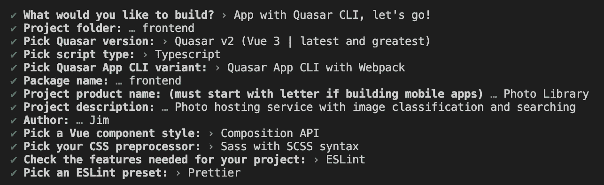

酷！它将创建目录`photo_library/frontend`。现在让我们在 VSCode(或者您最喜欢的代码编辑器)中打开它。如果我们运行`$ quasar dev`，我们将看到默认的 Quasar 页面显示在[http://localhost:8080/#/](http://localhost:8080/#/)上。让我们把它改成这个项目的模板页面。我们可以把下面的代码分别放在`src/pages/IndexPage.vue`和`src/layouts/MainLayout.vue`中。

如果我们现在运行`$ quasar dev`，我们会看到如下页面:

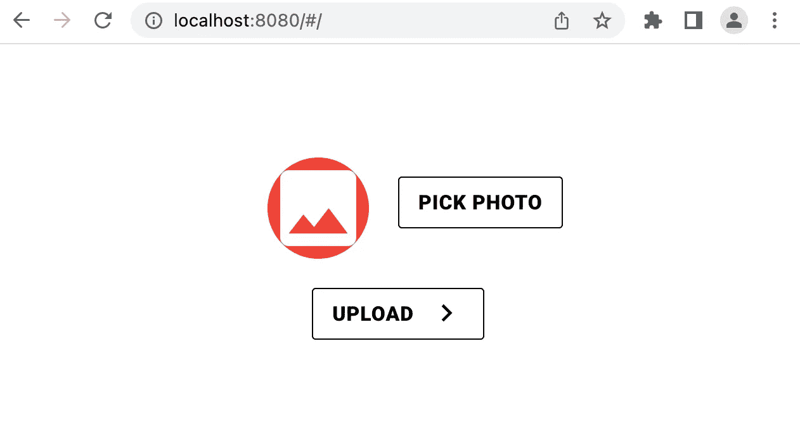

干得好！它看起来已经(有点)接近我们的最终产品了。

我们将使用“axios”包向后端发送 API 请求。让我们导航到`photo_library/frontend`并将`"axios": "0.27.2"`添加到`package.json`的`"dependencies"`中。

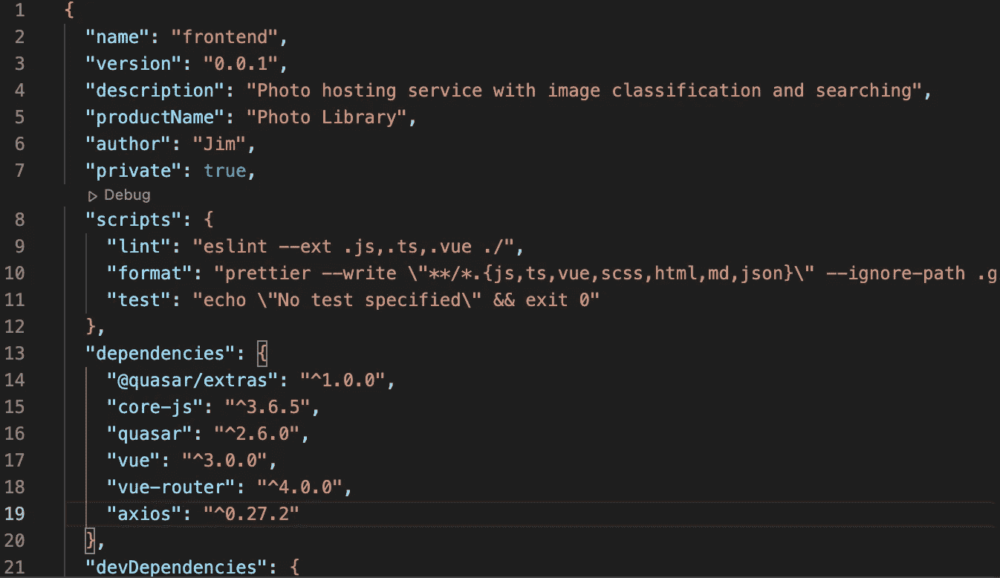

然后，我们可以跑了

```
$ yarn
# or:
$ npm install
```

安装“axios”软件包。

**所有后续的代码更改将在** `**src/pages/IndexPage.vue**` 中进行，我们将迭代地接近我们的最终产品。

让我们继续我们的后端。如果你还没有安装 python3，在 Mac 上请参考[这个](https://docs.python-guide.org/starting/install3/osx/)，在 Windows 上请参考[这个](https://docs.python.org/3/using/windows.html)。

我们将从创建目录`photo_library/backend`和其中的两个文件`main.py`和`requirements.txt`开始。然后，我们在其中放入一些初始代码:

```
# main.py
import uvicorn
from fastapi import FastAPIapp = FastAPI()@app.get("/")
async def root():
    return {"message": "Hello World"}if __name__ == '__main__':
    uvicorn.run('main:app', reload=True)
```

和

```
# requirements.txt
fastapi==0.75.2
uvicorn==0.15.0
pyTigerGraph==0.0.9.9.2
motor==2.5.1
python-multipart==0.0.5
matplotlib==3.5.2
```

为了简单起见，需求文件中包含了本项目中`pip3`将要安装的所有模块(只剩下`tensorflow`，我们稍后会用`pip`安装)。为了不破坏本地环境，我们将使用虚拟环境来安装模块。在`photo_library/backend`的一个终端，让我们运行:

```
$ python3 -m venv venv
$ source venv/bin/activate
```

我们将看到`(venv)`出现在终端提示行的开头。这意味着我们的终端运行在虚拟环境中。请记住每次关闭和重新打开终端时运行`$ source venv/bin/activate`。

然后，我们可以跑了

```
$ pip3 install -r requirements.txt
```

安装模块，这将需要不到一分钟的时间。在那之后，我们跑

```
$ python3 main.py
```

它将启动我们的后端，第一个 API 端点监听 [http://localhost:8000/](http://localhost:8000/) :

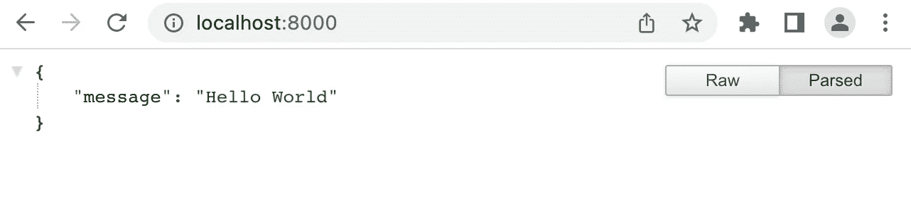

太好了！我们现在有一个工作的 FastAPI 后端服务器。

我们将使用 MongoDB 和 TigerGraph 来存储数据。

对于 MongoDB，我们可以参考[本指南](https://www.mongodb.com/docs/manual/administration/install-community/)进行 MongoDB 社区版的安装设置，还可以安装[指南针](https://www.mongodb.com/try/download/compass)，这是 MongoDB 的图形用户界面(GUI)。之后，打开 Compass 并点击按钮 **Connect** 创建一个到 MongoDB 的连接。在出现的页面上，点击**数据库**选项卡，点击**创建数据库**，然后输入 **photo_library** 作为数据库名称，输入 **photos** 作为收藏名称。然后，我们就用 MongoDB 好了！

对于 TigerGraph，我们可以参考[该文档](https://docs.tigergraph.com/cloud/solutions/create)来创建我们的 TigerGraph 云解决方案。它是一个具有人性化 GUI 的云图数据库，并且可以免费使用！在设置过程中，记得**记下你的初始密码和子域！**我们将使用`photo-library.i.tgcloud.io`作为我们的子域，使用`tigergraph`作为我们的密码。本博客使用的解决方案在发布时已经终止。请使用更安全的密码创建解决方案。

创建解决方案后，我们将单击开始按钮:


Please notice that the solution will automatically stop after 1 hour of inactivity, but you can restart it anytime

一旦启动，我们就可以打开 GraphStudio 来创建图形和编写查询！


输入用户名(默认值:tigergraph)和密码(您刚刚为您的解决方案设置的初始密码)来登录 GraphStudio。然后点击左上角的全局视图，创建一个名为“照片”的图表。

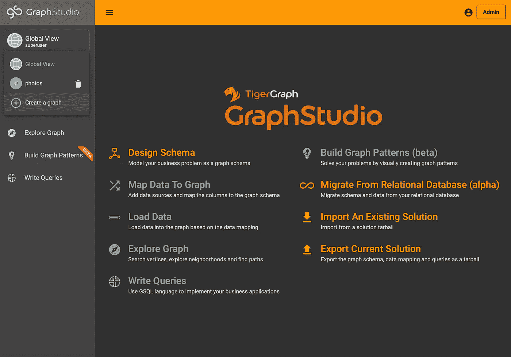

Click on ‘Create a Graph’ (The graph ‘photos’ is already created in this example solution)

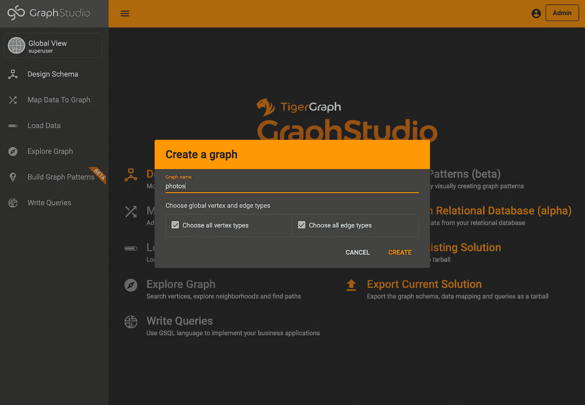

Enter the name of the graph

然后点击“全局视图”,然后点击下拉列表中的“照片”,切换到图表“照片”。单击“设计模式”选项卡，为我们的图表创建一个顶点。

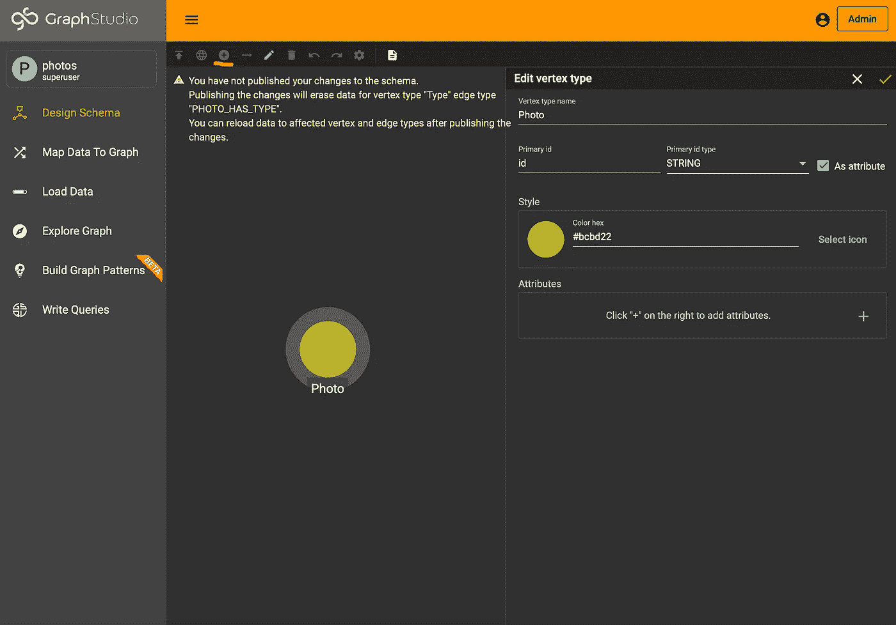

Click on the button marked red in the upper left corner to add a local vertex type, then edit the vertex type as shown in the image. (You will not see the warning. It is a spoiler for a later part of this blog.)

我们将创建一个顶点类型“Photo ”,其属性为“id ”,用于存储 MongoDB 中照片的对象 ID。虽然在 TigerGraph 中单独存储对象 ID 目前没有用，但当它与我们将在后面部分中使用图像分类算法生成的标签结合使用时，它将支持搜索。

更改后，点击“添加本地顶点类型”按钮左侧的“发布模式”按钮，等待更改被提交，我们的 TigerGraph 解决方案就可以使用了！

祝贺您建立了开发环境！让我们休息一下，然后继续实现照片托管服务！

**第二节:实施照片托管服务**

先说后端。我们需要一个 API 端点，它将表单数据中的照片作为输入，将照片字节存储在 MongoDB 的一个文档中，并将文档的对象 ID 存储在 TigerGraph 中。

API 端点将如下所示:

```
# from fastapi import UploadFile
@app.post("/uploadPhoto/")
async def upload_photo(file: UploadFile):
    contents = await file.read()
    # add photo to MongoDB
    data = { "photo": contents }
    photoID = await **add_photo_to_MongoDB**(data)
    # add photoID TigerGraph
    success = await **add_photo_id_to_TigerGraph**(photoID)
    if success:
        return { "code": 200, "message": "Photo uploaded"}
    else:
        return { "code": 401, "message": "Failed to add photo"}
```

然后，我们实现与数据库交互的大胆函数。我们使用[马达](https://motor.readthedocs.io/en/stable/)与 MongoDB 交互:

```
# import motor.motor_asyncio
####################
# Connection to MongoDB
client = motor.motor_asyncio.AsyncIOMotorClient("mongodb://localhost:27017")
database = client.**photo_library**
photo_collection = database.get_collection("**photos**")# Add a new photo to MongoDB
async def add_photo_to_MongoDB(photo_data:dict):
    try:
        entry = await photo_collection.insert_one(photo_data)
        return str(entry.inserted_id) 
    except:
        return False
```

注意，粗体变量指的是我们前面使用的数据库名称和集合名称。如果您使用不同的名称，您可以更改它们。

我们将使用 pyTigerGraph 与 TigerGraph 进行交互。请将主机和密码更改为您自己的。

```
# import pyTigerGraph as tg
####################
# Connection to TigerGraph
conn = tg.TigerGraphConnection(
    host="[https://photo-library.i.tgcloud.io](https://photo-manager.i.tgcloud.io)",
    graphname="photos",
    username="tigergraph",
    password="tigergraph", )
conn.apiToken = conn.getToken(conn.createSecret())
#conn.apiToken = ('...', ..., '...')
async def add_photo_id_to_TigerGraph(id: str):
    try:
        conn.upsertVertex("Photo", id, {})
        return True
    except:
        return False
```

有一个用 PyTigerGraph 开发的小技巧:apiToken 的生成可能需要几秒钟，这会使 FastAPI 重载的响应性降低。如果我们经常更改代码，打印出 apiToken 一次并将其设置为值会很有帮助。

把它们放在一起，`main.py`现在看起来是这样的:

我们可以从`python3 main.py`开始(记得用`source venv/bin/activate`激活虚拟环境)并访问[http://localhost:8000/docs](http://localhost:8000/docs)上的文档页面

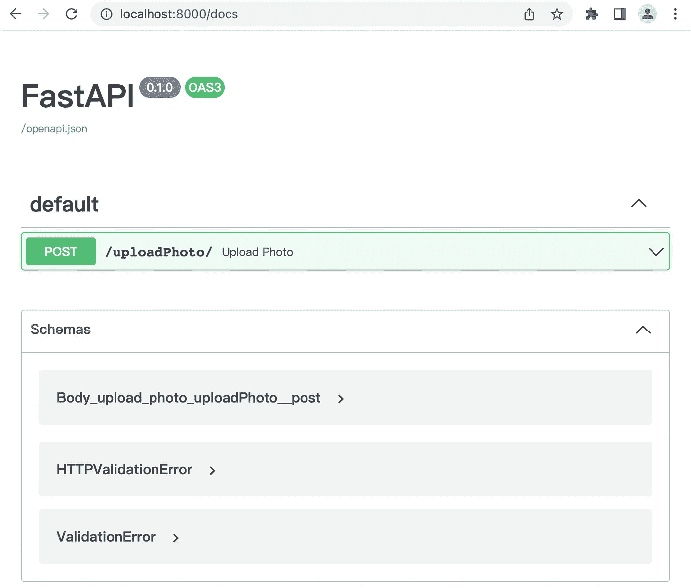

展开我们刚刚构建的端点的选项卡，然后单击“试用”。

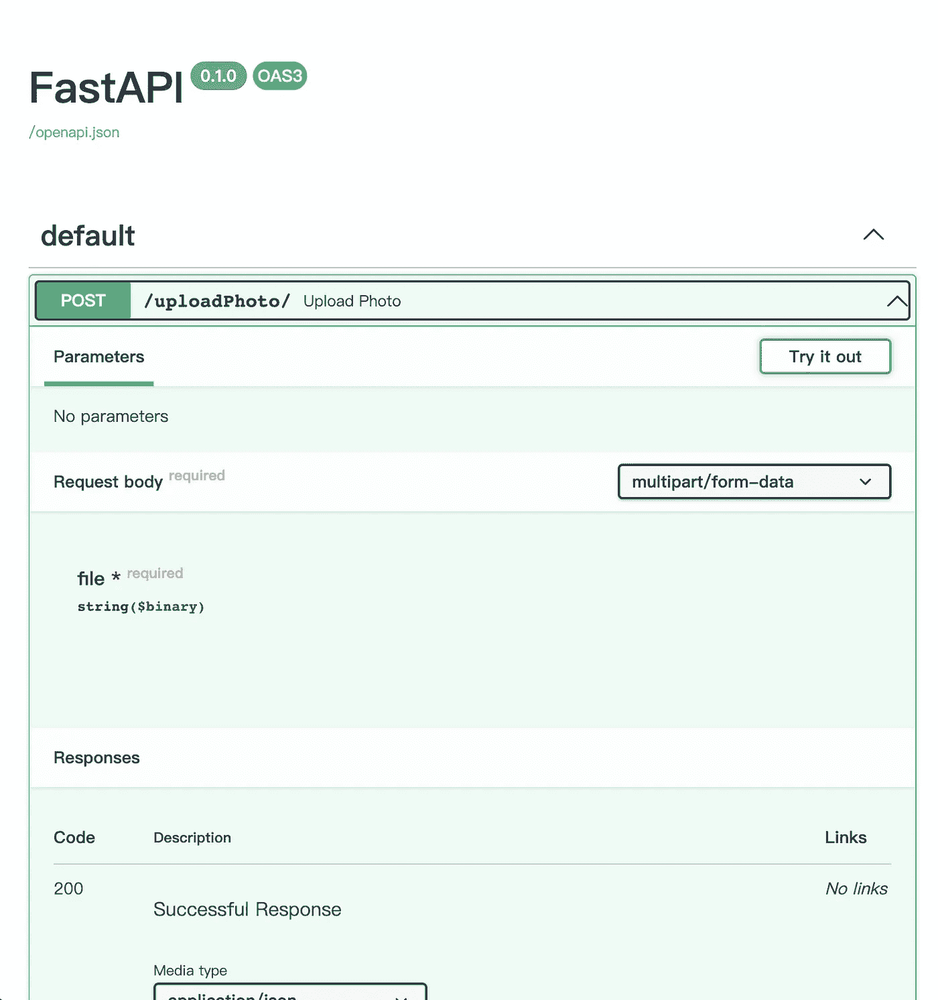

然后，我们可以选择一个文件(小于 16MB)并单击“执行”。如果 MongoDB 社区版和 TigerGraph 解决方案运行正常，我们可以看到在 MongoDB 中添加了一个新文档，在 TigerGraph 中添加了一个具有相同对象 ID 的顶点。

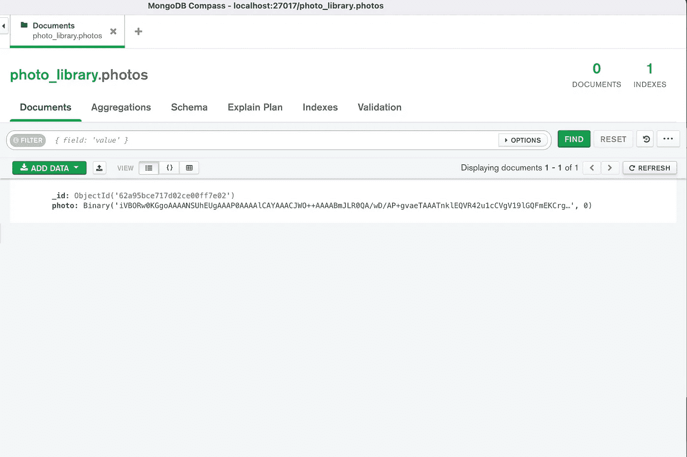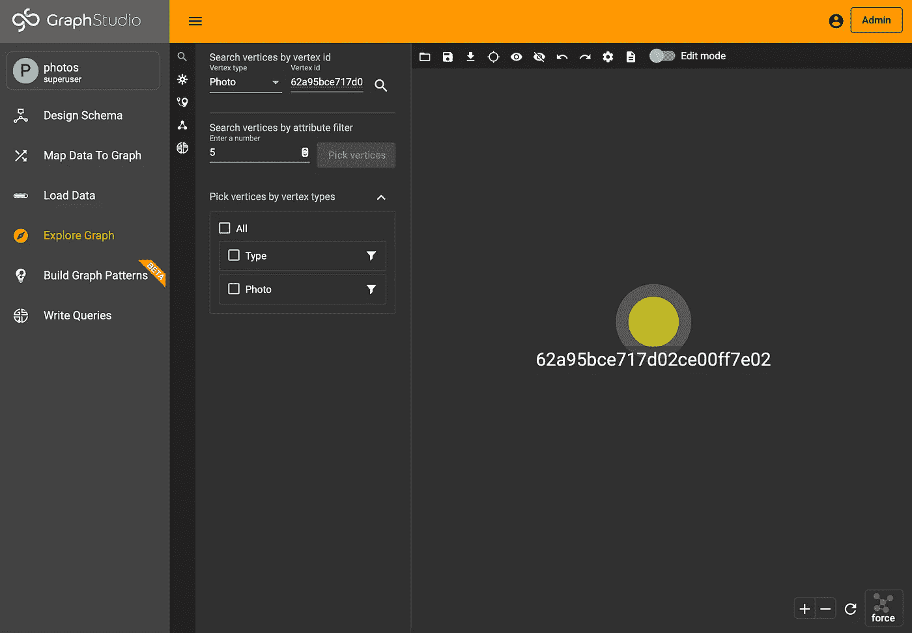

In GraphStudio, you can switch to the graph ‘photos’, click on ‘Explore Graph’, and search for the vertex

我们已经建立了一个工作的 API 端点来上传和存储照片！让我们完成这一部分，建立一个简单的前端与一些风格。我们可以把下面的代码放在`photo_library/frontend/src/pages/IndexPage.vue`里。

结果页面将如下所示:

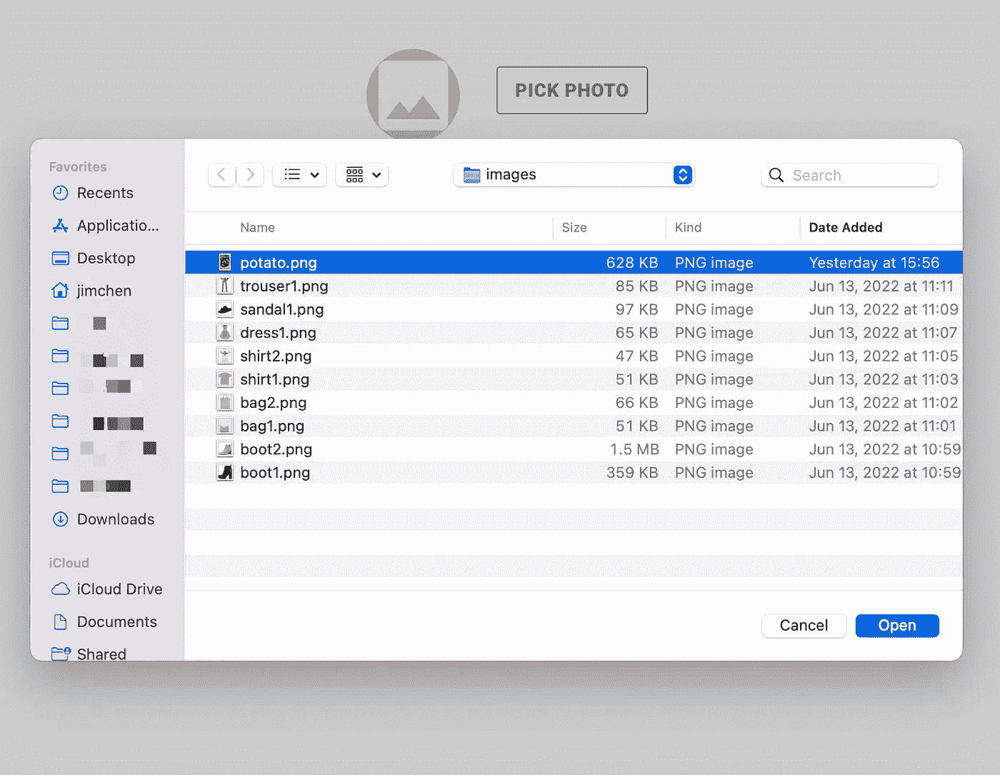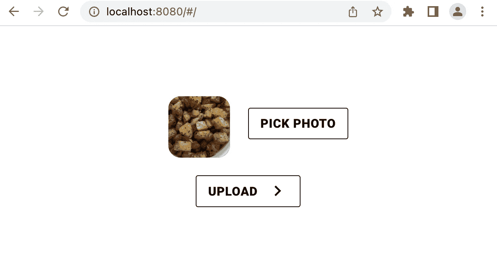

您可以单击“选择照片”选择一张照片，然后单击“上传”将所选照片发送到后端。您可以随意使用它，并检查数据库中是否反映了更改。

祝贺您完成第 1 部分！所有的代码都上传到[这里](https://github.com/JimChen2002/photo-library-part1)带有运行它的指令。

我们将在后面的部分中结合图像分类和搜索。同时，如果你有任何问题，一定要加入 [TigerGraph Discord](https://discord.com/invite/tigergraph) 和[开发者论坛](https://dev.tigergraph.com/forum/)！