# 如何创建 Pinterest 克隆第二部分:图像分类

> 原文：<https://medium.com/geekculture/how-to-create-a-pinterest-clone-part-ii-image-classification-1ecf4cca0b20?source=collection_archive---------15----------------------->

## 使用 TensorFlow 和 **Python** 影像库的基本影像分类工作流

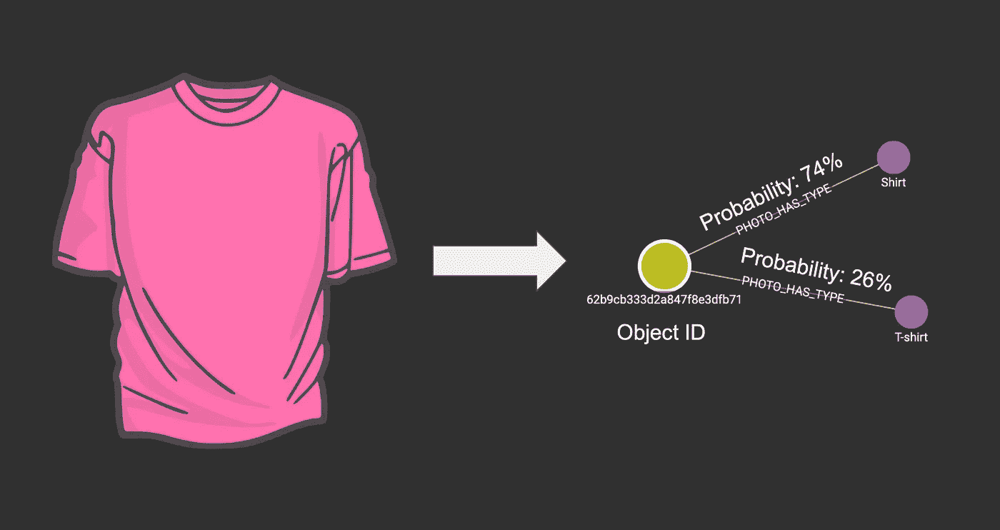

**概述及目标**

在[的上一篇博客](/geekculture/how-to-create-a-pinterest-clone-part-i-upload-photos-a1f385812729)中，我们构建了一个可以上传图像的网页，并创建了一个 API 端点，可以接收这些图像，并将文件存储在 MongoDB 中，将元数据存储在 TigerGraph 中。在这篇博客中，我们将把使用 TensorFlow 和 Python 图像库构建的基本图像分类工作流集成到 API 端点中，以标记图像并将标记存储到 TigerGraph 中。这些标签可以用于搜索。

**第一节:使用 TensorFlow 的基本图像分类模型**

Pinterest 使用的实际图像分类算法很复杂，超出了本博客的范围。我们将按照本文档中的说明来训练一个简单的神经网络模型，该模型可以对服装图像进行分类。它使用了[时尚 MNIST](https://github.com/zalandoresearch/fashion-mnist) 数据集，该数据集包含 10 个类别的 70，000 幅灰度图像(28×28 像素)。以下是一些例子:


[Fashion-MNIST samples](https://github.com/zalandoresearch/fashion-mnist) (by Zalando, MIT License).

我们需要先安装 TensorFlow。记得激活虚拟环境，这样就不会搞乱我们的本地环境。

```
$ cd photo_library/backend
$ source venv/bin/activate
```

然后我们可以运行这个命令来安装 TensorFlow(仅限 MacOS，其他系统请参考[本文档](https://www.tensorflow.org/install/pip#macos))。

```
# the only package installed with pip
$ python3 -m pip install tensorflow
```

让我们开始创建一个 Python 程序来训练和保存模型！

```
# photo_library/backend/ML.py
import tensorflow as tf
import numpy as np
```

导入模块后，我们将加载时尚-MNIST 数据集。

```
fashion_mnist = tf.keras.datasets.fashion_mnist
(train_images, train_labels), (test_images, test_labels) = fashion_mnist.load_data()
class_names = ['T-shirt/top', 'Trouser', 'Pullover', 'Dress', 'Coat', 'Sandal', 'Shirt', 'Sneaker', 'Bag', 'Ankle boot']
```

有 60，000 个训练图像和 10，000 个测试图像。每个图像都有一个相应的标签，它是一个从 0 到 9 的数字，代表一个类别名称(例如，0 代表 t 恤/上衣，9 代表踝靴)。更准确地说，变量`train_images`是一个大小为 60000*28*28 的 numpy 数组，代表 60000 张图像，每张图像的 28*28 像素的值为 0 到 255，变量`train_labels`是一个大小为 60000 的 numpy 数组，其中每个元素取 0 到 9 的值，代表每张图像的类名。

由于神经网络模型最适用于从 0 到 1 的数字，因此我们需要将 0–255 到 0–1 的像素值标准化。

```
train_images = train_images / 255.0
test_images = test_images / 255.0
```

然后，我们可以训练并保存模型。

```
model = tf.keras.Sequential([
    tf.keras.layers.Flatten(input_shape=(28, 28)),
    tf.keras.layers.Dense(128, activation='relu'),
    tf.keras.layers.Dense(10)
])
model.compile(optimizer='adam', loss=tf.keras.losses.SparseCategoricalCrossentropy(from_logits=True), metrics=['accuracy'])
model.fit(train_images, train_labels, epochs=10)
model.save('my_model')
```

基本上，我们链接几个层来创建模型，用一些推荐的参数编译模型，拟合(或训练)模型，并将模型保存到给定的路径。有关每个组件的详细描述，请查看本文档。对于高层次的概念理解，我会强烈推荐 3Blue1Brown 的[这个视频系列](https://youtu.be/aircAruvnKk)。

我们现在可以运行程序了。

```
# a terminal at photo_library/backend
$ python3 ML.py
```

普通的 Mac 用不了 30 秒。不需要 GPU！我们可以通过在程序末尾添加下面两行来评估带有测试数据集的模型。

```
test_loss, test_acc = model.evaluate(test_images, test_labels)
print('\nTest accuracy:', test_acc)
```

该模型将用于预测每个测试图像的类别(从 0 到 9 的数字)，并将预测与实际标签进行比较，以获得大约 90%的准确度。虽然我们用的是小数据集和简单模型，但是结果还是挺好的！

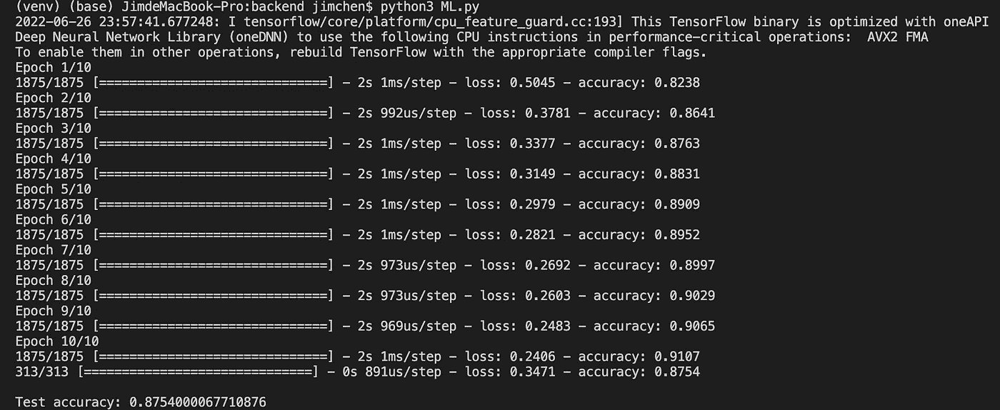

The terminal output after we ran the program

我们现在有了一个基本的图像分类模型！作为本节的总结，我们将以下代码放在`photo_library/backend/ML.py`并运行它，它训练了一个图像分类模型并将其保存在`photo_library/backend/my_model`。

**第二节:将图像分类模型集成到服务器中**

目前，我们有一个 API 端点，它将用户上传的照片文件存储到 MongoDB 中，生成一个对象 ID，并将对象 ID 放入 TigerGraph 中。

```
# main.py
@app.post("/uploadPhoto/")
async def upload_photo(file: UploadFile):
    contents = await file.read()
    # add to MongoDB
    data = { "photo": contents }
    photoID = await add_photo_to_MongoDB(data)
    # **TODO:** tag the photo with the model
    success = await add_photo_id_to_TigerGraph(photoID)
    if success:
        return { "code": 200, "message": "Photo uploaded"}
    else:
        return { "code": 401, "message": "Failed to add photo"}
```

现在我们想用模型标记照片，并将元数据添加到 TigerGraph 数据库中。首先，我们需要将照片文件转换成一个`Image`对象，并用 Python 图像库(PIL)对其进行处理。

```
# import uuid
# from PIL import Image
# import matplotlib.pyplot as plt# All the code below is added to the **TODO** positionunique_file_path = str(uuid.uuid4()) + file.filename
with open(unique_file_path, 'wb') as f:
    f.write(contents)
img=Image.open(unique_file_path)
os.remove(unique_file_path)
# Show the image in a pop-up window
plt.imshow(img)
plt.show()
```

添加完依赖项和代码后，我们可以运行项目并尝试上传图像。

```
# Start the frontend
$ cd photo_library/frontend
$ quasar dev# Start the backend
$ cd photo_library/backend
$ source venv/bin/activate
$ python3 main.py
```

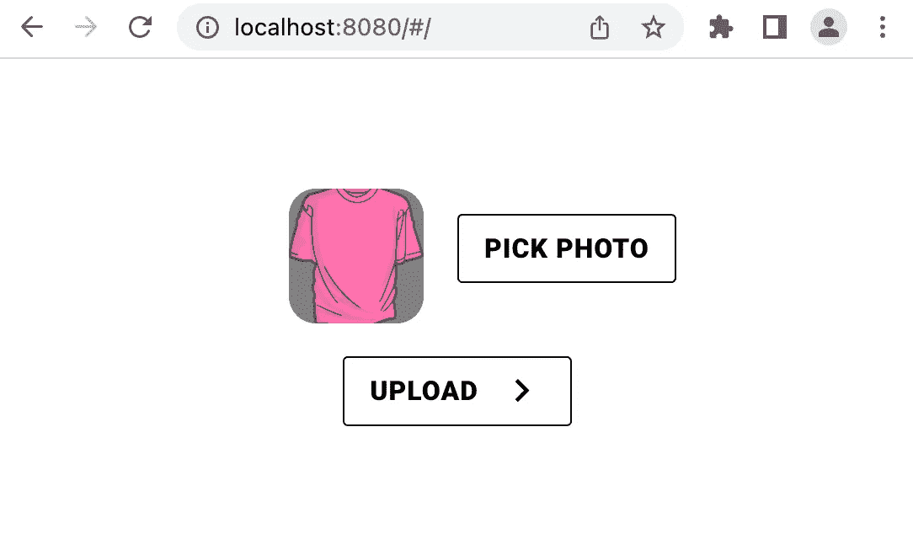

Shirt Image from [Pixabey](https://pixabay.com/vectors/shirt-pink-t-shirt-jersey-tee-34238/)

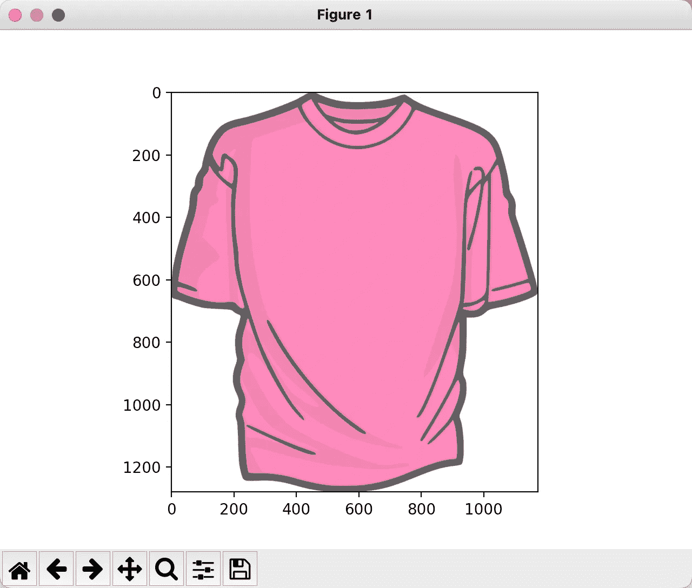

Shirt Image in a Pop-up Window

照片被加载为一个`Image`对象，我们需要将它转换为 28×28 像素大小的灰度图像。

```
# Resize the image to 28*28 with bilinear interpolation
small_img=img.resize((28,28),Image.Resampling.BILINEAR)
# Show the image
plt.imshow(small_img)
plt.show()
```

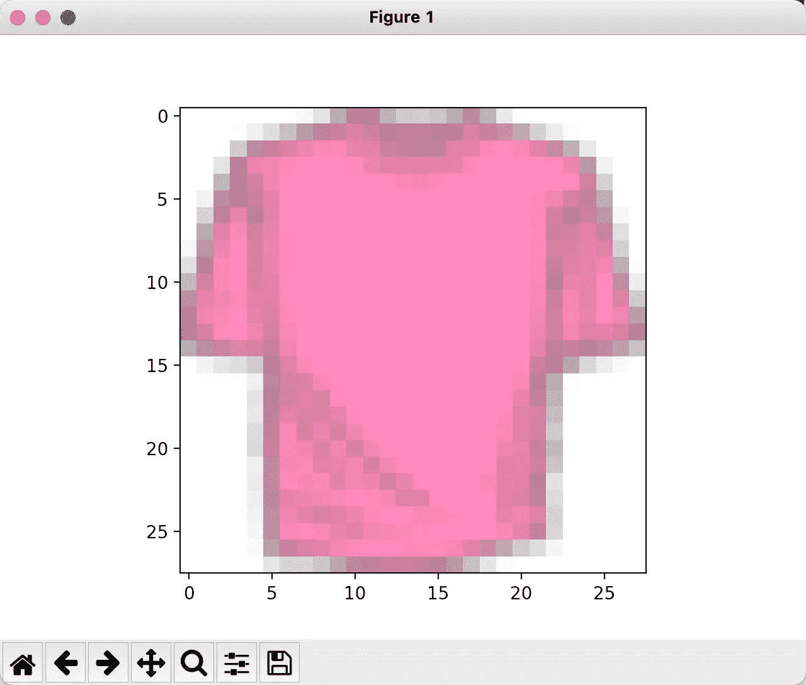

Resized Shirt

```
# Turn the image into Black & White
BW_small_img=small_img.convert("L")
# Show the image
plt.imshow(BW_small_img)
plt.colorbar()
plt.show()
```

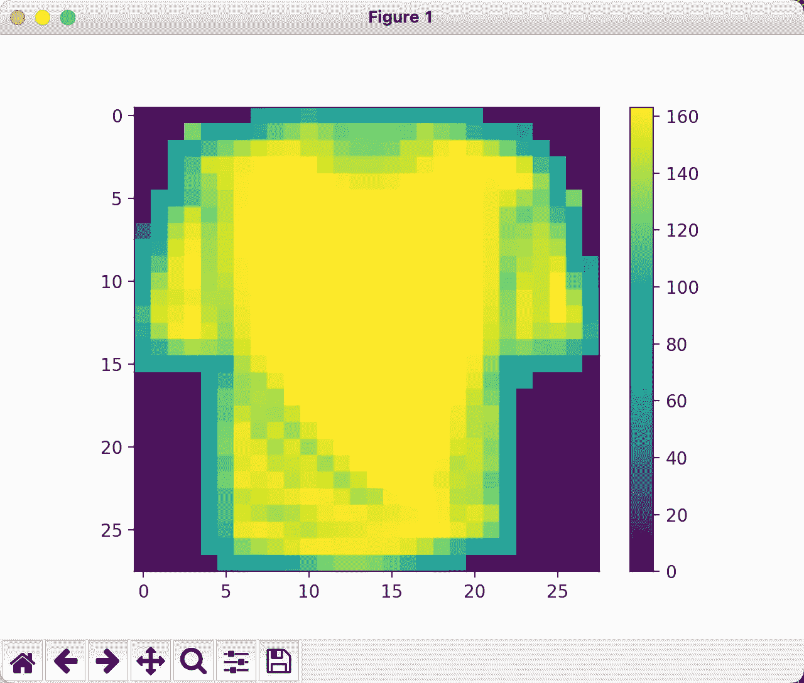

Grayscale, 28 by 28 pixels image with pixel value from 0 to 255

然后，我们将图像像素转换成归一化的 Numpy 数组。

```
# import numpy as np
pix = np.array(BW_small_img)
img = np.expand_dims(pix,0) / 255.0
```

我们加载训练好的模型，并用它来预测图像的类别。

```
# import tensorflow as tf
model = tf.keras.models.load_model('my_model')
probability_model = tf.keras.Sequential([model, tf.keras.layers.Softmax()])
predictions = probability_model.predict(img)
print(predictions)
```

删除显示 image 的代码后，让我们运行它并查看预测！

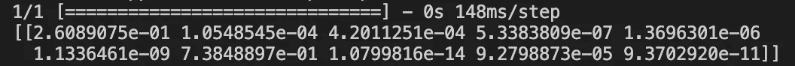

从 0 到 1 有 10 个数字，代表图像属于某一类的概率。回想一下，这 10 个类是:

```
class_names = ['T-shirt/top', 'Trouser', 'Pullover', 'Dress', 'Coat', 'Sandal', 'Shirt', 'Sneaker', 'Bag', 'Ankle boot']
```

我们可以看到‘衬衫’的概率最高为 0.74，‘t 恤/上衣’的概率第二高为 0.26，这是合理的！

概括一下，你可以把下面的代码放在`photo_library/backend/main.py`中。API 端点现在将为每张上传的照片打印一个预测数组。

**第三节:在 TigerGraph 中存储元数据**

在上一篇博客中，我们在 TigerGraph 中创建了“照片”顶点。现在，我们将添加一个“类型”顶点和一个边“照片类型”来存储元数据。

让我们导航到[https://tgcloud.io/](https://tgcloud.io/)，使用凭据登录，然后转到“我的解决方案”选项卡。


启动我们创建的解决方案，这大约需要一分钟，然后打开 GraphStudio。


切换到“照片”图形，导航到“设计模式”，并单击“+”按钮添加“类型”顶点，其主要 id 称为“名称”，具有类型字符串并存储为属性。

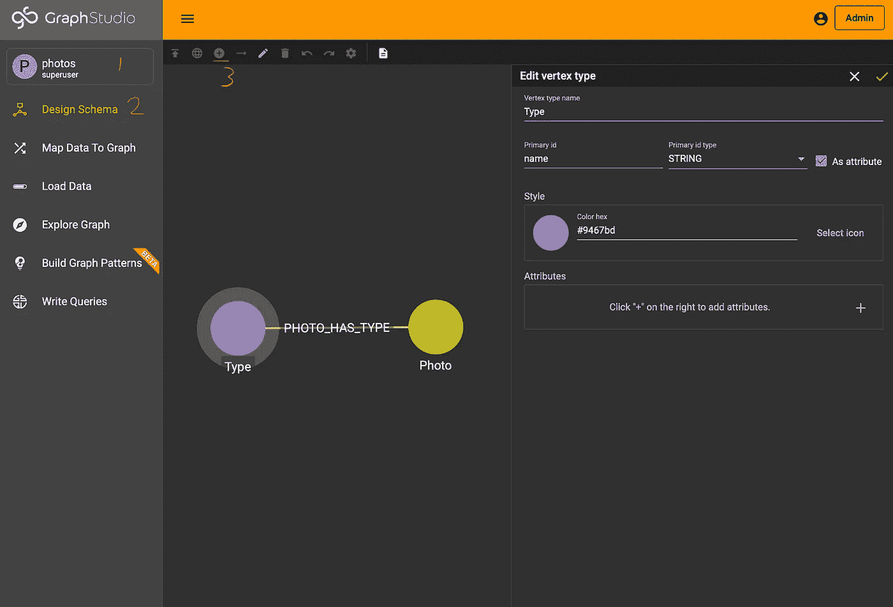

然后，我们可以单击右箭头按钮来添加“照片类型”边缘。该配置包括源顶点“照片”、目标顶点“类型”和浮点类型的属性“概率”。

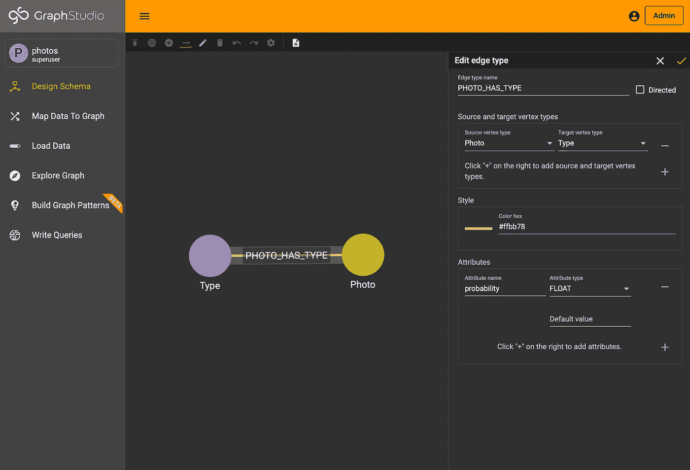

最后，我们点击左上角的按钮“发布模式”，我们的 TigerGraph 解决方案就可以开始了！

在`main.py`中，我们可以更新获取照片 ID 并将其插入 TigerGraph 的函数，以添加照片的元数据。

```
async def add_photo_id_with_predictions_into_TigerGraph(id: str, predictions: list):
    try:
        class_names = ['T-shirt', 'Trouser', 'Pullover', 'Dress', 'Coat', 'Sandal', 'Shirt', 'Sneaker', 'Bag', 'Ankle-boot']
        conn.upsertVertex("Photo", id, {})
        # only need to insert type vertexes once
        for name in class_names:
            conn.upsertVertex("Type", name, {})
        threshold = 0.01
        for idx, probability in enumerate(predictions):
            if probability >= threshold:
                conn.upsertEdge("Photo", id, "PHOTO_HAS_TYPE", "Type", class_names[idx], {"probability": probability})
        return True
    except:
        return False
```

我们插入带有对象 ID 的“照片”顶点，该对象 ID 引用存储在 MongoDB 中的照片文件，添加所有“类型”顶点，并添加带有概率的边，该概率指示每张照片属于一个类的可能性。我们只需要插入一次“类型”顶点，所以插入“类型”顶点后，可以随意删除或注释掉两行代码。我们还包括一个减少冗余边的可能性阈值。

让我们在 API 端点中使用这个函数，代码如下所示:

如果我们运行项目并再次上传粉色衬衫照片，我们将在 MongoDB 中看到它。

```
# As a reminder of how to run the project
# Start the frontend
$ cd photo_library/frontend
$ quasar dev# Start the backend
$ cd photo_library/backend
$ source venv/bin/activate
$ python3 main.py
```

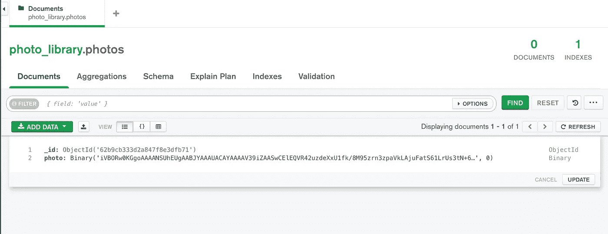

我们可以复制它的对象 ID 并在 TigerGraph 中搜索它。

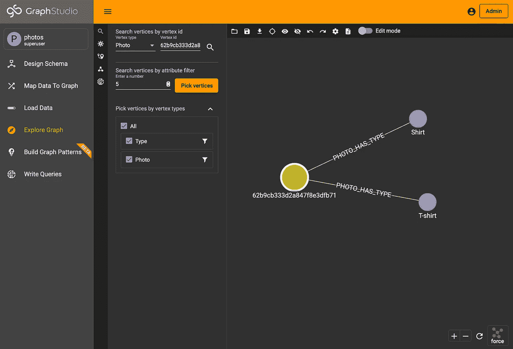

它以 0.74 和 0.26 的概率连接到‘衬衫’和‘t 恤’，这正是我们所期待的！

**第四部分:后续步骤和资源**

这部分到此为止！所有的代码都上传到这里[和运行它的指令](https://github.com/JimChen2002/photo-library-part2)。如果你对本博客中使用的一些技术特别感兴趣，这里有它们文档的链接: [TigerGraph Cloud](https://docs.tigergraph.com/cloud/start/overview) 、 [MongoDB Setup](https://www.mongodb.com/docs/manual/administration/install-community/) 、 [FastAPI](https://fastapi.tiangolo.com) 和 [Quasar](https://quasar.dev) 。

我们将在下一部分通过完成前端搜索来总结它。如果你有任何问题，欢迎加入 [TigerGraph Discord](https://discord.com/invite/tigergraph) 和[开发者论坛](https://dev.tigergraph.com/forum/)！