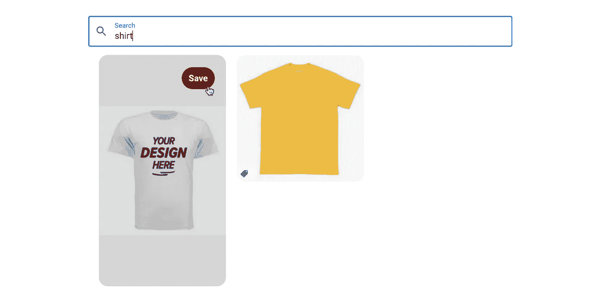
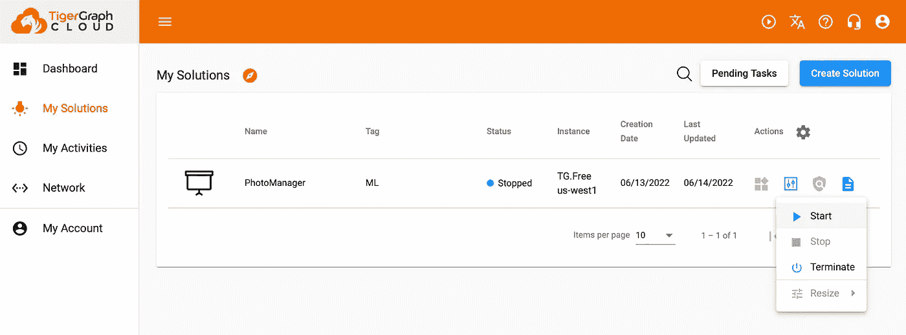
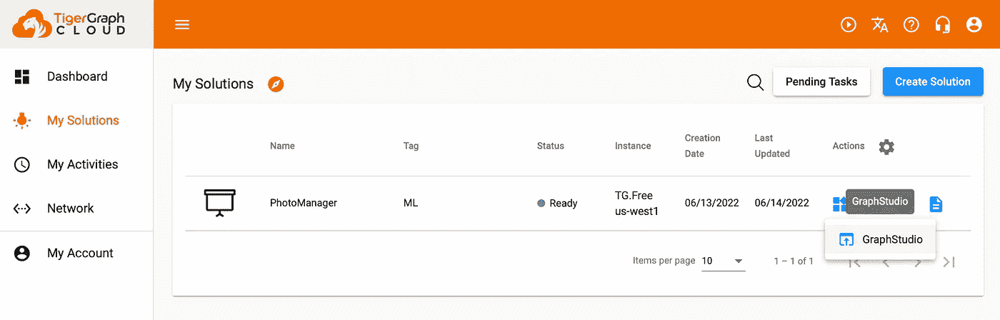
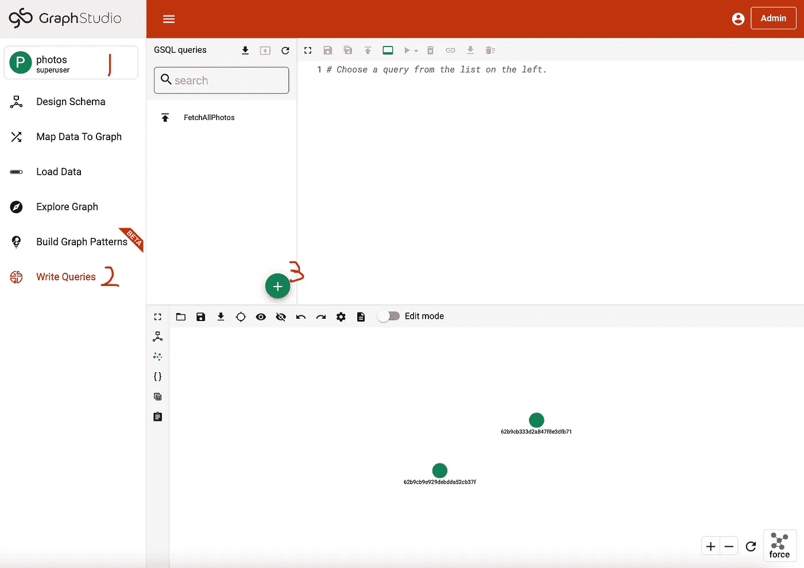
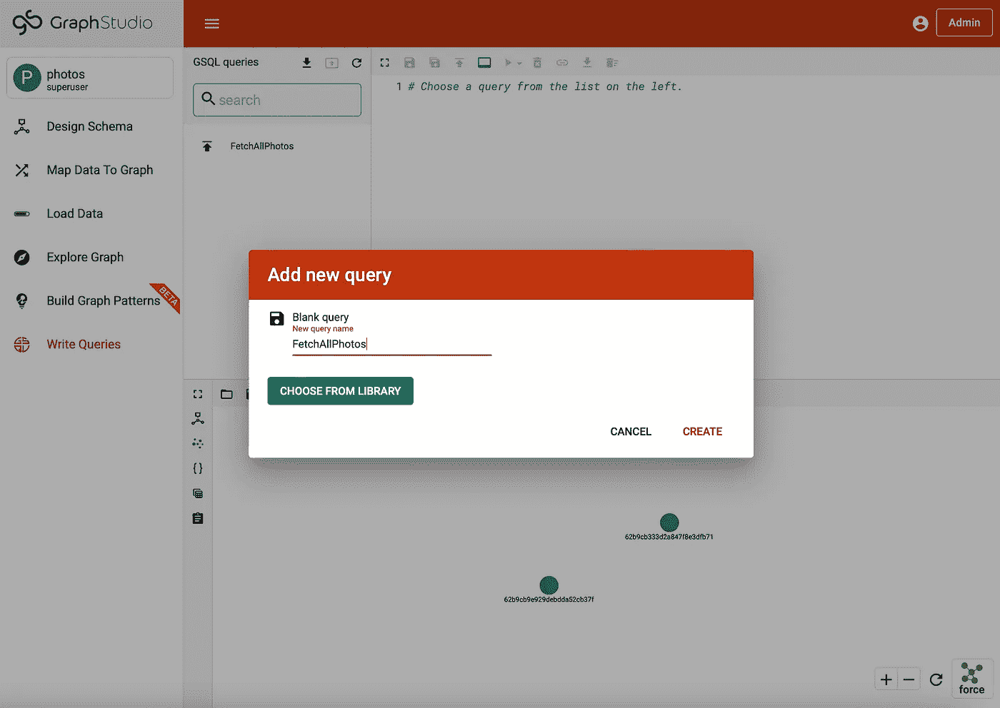
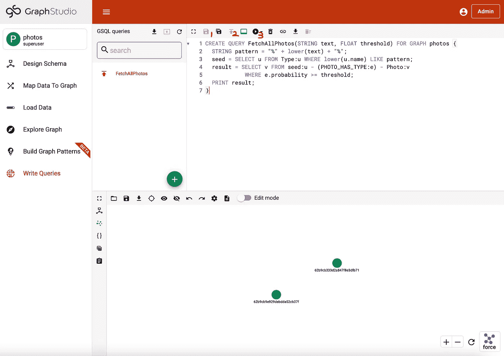
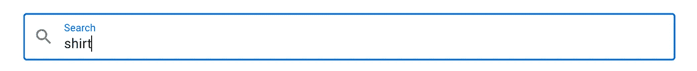
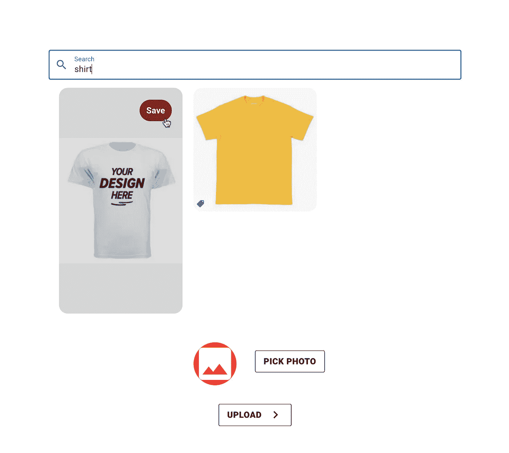

# 如何创建 Pinterest 克隆第三部分:显示和搜索

> 原文：<https://medium.com/geekculture/how-to-create-a-pinterest-clone-part-iii-display-and-searching-bb1d36e49a0f?source=collection_archive---------9----------------------->



**概述及目标**

在前两篇博客([第 1 部分](/geekculture/how-to-create-a-pinterest-clone-part-i-upload-photos-a1f385812729)和[第 2 部分](/geekculture/how-to-create-a-pinterest-clone-part-ii-image-classification-1ecf4cca0b20))中，我们构建了一个 web 应用程序，其中包含一个供用户上传照片的网页和一个 API 端点，该端点使用经过训练的神经网络标记照片，将照片文件存储在 MongoDB 中，并将 MongoDB 生成的对象 ID 和标记一起保存到 TigerGraph 数据库中。在这篇博客中，我们将添加两个功能:显示和搜索。

**第一节:实现后端**

我们在后端需要两个新的端点。一个将通过对象 ID 从 MongoDB 中检索照片文件，另一个将返回一个照片 ID 列表，给出一个可选的搜索文本。

先说第一个。使用[马达](https://motor.readthedocs.io/en/stable/)模块，可以直接通过对象 ID 在 MongoDB 中获得一个条目。

```
# from bson.objectid import ObjectId
####################
# Connection to MongoDB
# client = motor.motor_asyncio.AsyncIOMotorClient("mongodb://localhost:27017")
# database = client.photo_manager
# photo_collection = database.get_collection("photos")# Get a specific photo from MongoDB by ID
async def retrieve_photo_from_MongoDB(id:str):
    try:
        entry = await photo_collection.find_one({"_id": ObjectId(id)})
        if entry:
            return entry
        else:
            return False
    except:
        return False
```

该函数的返回值要么是 False，要么是一个形式为`{_id: <Object ID>, photo: <Photo file in bytes>}`(python 字典)的条目。然后，我们可以在 API 端点中使用这个函数。

```
# from fastapi.responses import Response
# import base64
@app.put("/retrievePhoto/{id}")
async def retrieve_photo(id: str):
    data = await retrieve_photo_from_MongoDB(id)
    if not data:
        return { "code": 401, "message": "Failed to get photo."}
    contents = data["photo"]
    contents = base64.b64encode(contents)
    return Response(content=contents, media_type="image/png")
```

这里需要注意的一点是，如果我们直接传输文件的原始字节，它们可能包含干扰连接的网络协议的保留字节，所以我们需要用 [Base64 数据编码](https://docs.python.org/3/library/base64.html)对字节进行编码。编码的结果也是一个字节数组，我们会把它传回前端，不做进一步处理，因为在前端从编码的字节重建文件更容易。`media_type`参数只是对其真实类型的一个提醒。我们可以把`media_type="image/jpeg"`或其他一些类型。

另一件要注意的事情是，我们需要添加一些 CORS 设置，以便返回媒体类型的响应。

```
# from fastapi.middleware.cors import CORSMiddleware
####################
# API endpoints# app = FastAPI()
app.add_middleware(
    CORSMiddleware,
    allow_origins=["*"],
    allow_credentials=True,
    allow_methods=["*"],
    allow_headers=["*"],
)
```

让我们转到另一个端点，它可以返回搜索文本的照片 id 列表，我们将在 TigerGraph 上编写一个查询来帮助完成这个任务！

你可以在 https://tgcloud.io/[访问 TigerGraph 云门户](https://tgcloud.io/)，登录你的账户，启动你的解决方案，然后像上次一样打开 GraphStudio。



然后，切换到左上角的“照片”图，单击“编写查询”选项卡，并使用“+”按钮创建一个新的查询。



在弹出窗口中，输入`FetchAllPhotos`作为名称，然后单击创建。



用下面的代码替换默认的查询内容。

```
CREATE QUERY FetchAllPhotos(STRING text, FLOAT threshold) FOR GRAPH photos { 
  STRING pattern = "%" + lower(text) + "%";
  seed = SELECT u FROM Type:u WHERE lower(u.name) LIKE pattern;
  result = SELECT v FROM seed:u - (PHOTO_HAS_TYPE:e) - Photo:v
            WHERE e.probability >= threshold;
  PRINT result;
}
```

基本上，这是一个 [GSQL 查询](https://docs.tigergraph.com/gsql-ref/current/querying/query-operations)，它接受两个参数(搜索文本和一个概率阈值)，找到所有与搜索文本名称相似的`Type`顶点，并返回所有与概率大于阈值的这种类型连接的`Photo`顶点。如果参数`text`是一个空字符串，所有类型都将被接受。

使用 GSQL 语言我们可以完成更多的事情，比如排序和过滤。如果你有兴趣，请查看[这篇文档](https://docs.tigergraph.com/gsql-ref/current/querying/select-statement/)获取更多示例！

现在我们可以用顶部栏上的按钮保存、安装和运行查询了！一旦你的 TigerGraph 数据库填充了一些数据，你就可以用不同的输入来测试它。



在 TigerGraph 数据库上安装了查询之后，我们就可以完成最后一个 API 端点了。我们需要一个函数来运行查询，并返回与要显示的照片相对应的对象 id 列表。

```
async def retrieve_all_photo_info_from_TigerGraph(text: str):
    try:
        threshold = 0.5
        results = conn.runInstalledQuery("FetchAllPhotos", params={
            "text": text,
            "threshold": threshold
        })
        ret = []
        for photo_info in results[0]["result"]:
            ret.append(photo_info["attributes"]["id"])
        return ret
    except:
        return False
```

我们根据经验将阈值设置为 0.5，这样，如果用户搜索“衬衫”，将只显示被分类为概率高于 50%的衬衫的照片。然后，我们可以轻松地实现 API 端点。

```
# from typing import Union
@app.put("/retrieveAllPhotoInfo")
async def retrieve_all_photo_info(text: Union[str, None] = None):
    if text is None:
        data = await retrieve_all_photo_info_from_TigerGraph("")
    else:
        data = await retrieve_all_photo_info_from_TigerGraph(text)
    if not data:
        return { "code": 401, "message": "Failed to retrieve photo"}
    else:
        return { "code": 200, "data": data, "message": "Photo fetched" }
```

请注意，搜索文本可能是空的(或者没有)，在这种情况下，我们将显示所有照片。

现在你已经完成了这个项目的整个后端！下面是完整的代码。

**第二节:实现前端**

我们将在前端添加两个组件:搜索栏和显示部分。搜索栏是简单的类星体框架。

```
<div>
  <q-input
    outlined
    v-model="searchText"
    label="Search"
    debounce="500"
    class="text-body1 text-weight-bolder"
    @update:model-value="retrieveAllPhotos()"
  >
    <template v-slot:prepend>
      <q-icon name="search" />
    </template>
  </q-input>
</div>
```

它看起来像这样:



我们将输入存储在变量`searchText`中，并在每次输入改变时用函数`retrieveAllPhotos`(尚未实现)刷新显示部分。

对于显示部分，我们将显示存储在`libraryPhotoURLs`数组中的所有照片，该数组是从照片文件生成的[数据 URL](https://developer.mozilla.org/en-US/docs/Web/HTTP/Basics_of_HTTP/Data_URLs)的数组。函数`retrieveAllPhotos`刷新`libraryPhotoURLs`数组。由于函数`getSize()`随机返回`card-small`、`card-medium`和`card-large`中的一个类，所以照片的大小是不同的。

```
<div class="library-content">
  <div 
    v-for="idx in libraryPhotoURLs.length" 
    :key="idx" 
    :class="getSize()"
  >
    <div class="pin-modal">
      <div class="modal-head">
        <div class="save-card">Save</div>
      </div>
    </div>
    <div class="pin-photo">
      
    </div>
  </div>
</div>
```

我们使用 CSS 网格布局和悬停效果来复制 Pinterest 的风格。下面给出了与这部分相关的 CSS 代码。

函数`retrieveAllPhotos`向后端发出请求，获取与所有要显示的照片相对应的对象 id 数组，将`libraryPhotoURLs`设置为一个新的相同长度的空数组，并为每张照片调用函数`retrievePhoto`。

```
retrieveAllPhotos(){
  const api = axios.create({ baseURL: 'http://localhost:8000' });
  api.put(`/retrieveAllPhotoInfo?text=${this.searchText}`, {})
    .then((resp)=>{
      // an array of object IDs
      const all_photo_info = resp.data.data;
      this.libraryPhotoURLs = (new Array(all_photo_info.length)).fill('');
      for(let i=0;i<all_photo_info.length;i++) {
        this.retrievePhoto(all_photo_info[i], i);
      }
    })
    .catch((err)=>{
      console.log(err);
    });
}
```

函数`retrievePhoto`通过对象 ID 从后端请求 base64 编码的照片字节，将字节解码到缓冲区中，重建照片文件，生成数据 URL，并将其存储在`libraryPhotoURLs`数组的指定索引处。

```
retrievePhoto(id:string, idx:number){
  const api = axios.create({ baseURL: 'http://localhost:8000' });
  api.put(`/retrievePhoto/${id}`, {})
    .then((resp)=>{
      const buff = Buffer.from(resp.data, 'base64');
      const blob = new Blob([buff], { type: 'image/png' });
      const photo = new File([blob], 'test', { type: 'image/png' });
      const reader = new FileReader();
      reader.onload = (e) => {
        this.libraryPhotoURLs[idx] = e.target?.result as string;
      };
      reader.readAsDataURL(photo as File);
    })
    .catch((err)=>{
      console.log(err)
    });
}
```

前端的所有改动都是在`frontend/src/pages/IndexPage.vue`中做的，我们把这个文件[的全部代码放在这里](https://github.com/JimChen2002/photo-library-part3/blob/master/frontend/src/pages/IndexPage.vue)。

**第三部分:总结和资源**

祝贺你完成这个博客系列！你可以运行应用程序，找到一些衣服的照片，上传到这个应用程序。提醒一下，您可以通过在终端中键入以下内容来运行该应用程序:

```
# Start the frontend
$ cd photo_library/frontend
$ quasar dev# Start the backend
$ cd photo_library/backend
$ source venv/bin/activate
$ python3 main.py# Remember to start the TigerGraph solution and the MongoDB service
```

希望你得到和这张图一样的结果:



在这个博客系列中，你已经学会了如何做这些事情:

*   用 Pinterest 的风格构建一个前端应用
*   使用图像分类模型构建后端服务器
*   设置 TigerGraph 和 MongoDB 并与之交互

有了这些技能，你可以更容易地开始其他全栈或机器学习项目！

这个项目的所有代码上传[在这里](https://github.com/JimChen2002/photo-library-part3)与指令运行它。如果你有任何问题，欢迎加入 [TigerGraph Discord](https://discord.com/invite/tigergraph) 和[开发者论坛](https://dev.tigergraph.com/forum/)！