# 如何创建 Rails 后端 API

> 原文：<https://medium.com/geekculture/how-to-create-a-rails-backend-api-871fcddd6e20?source=collection_archive---------1----------------------->

## 构建 Rails REST API 的分步指南


Photo by [Andrew Neel](https://unsplash.com/@andrewtneel?utm_source=medium&utm_medium=referral) on [Unsplash](https://unsplash.com?utm_source=medium&utm_medium=referral)

您是否开始了一个新项目，需要一个专用的后端 API 来持久存储数据？不要再看了；这本指南会引导你走向正确的方向。

# 0.规划领域模型和关联

当开始一个新项目时，首先规划出你的领域模型和[关联](https://guides.rubyonrails.org/association_basics.html)总是很重要的。请参考下面的图表来绘制您的模型关联。

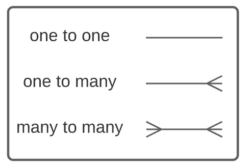

Crow’s Foot notation reference

在本指南中，我们将使用以下领域模型为库应用程序构建一个简单的 API:

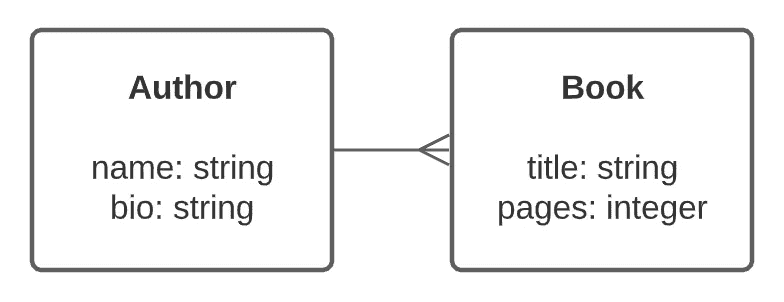

Domain model for our library-API

这两个模型之间的联系在上面用“鱼尾纹”符号表示出来了。

一个作者的书。一本书`belongs_to`一个作者。

# 1.正在初始化 Rails API

在您的终端中，使用下面的命令初始化一个新的 [Rails API](https://guides.rubyonrails.org/api_app.html) 。

**模板:**

```
$ rails new **<API NAME>** --api --database=postgresql
```

**示例:**

```
$ rails new **library-api** --api --database=postgresql
```

`--api`标志告诉 Rails 初始化一个新的应用程序，而不需要膨胀和中间件，这在 API 应用程序中是不必要的。

`--database=`标志向 Rails 指定我们将使用什么数据库。在这种情况下，如果您计划将 API 部署到 Heroku 上，我们将使用 PostgreSQL，因为它是 Heroku 的标准数据库。

*没有指定数据库类型，Rails 默认使用 SQLite。*

记得将目录更改为新初始化的 API 的根文件夹，并运行`$ bundle`来安装您的依赖项。

# 2.模型

一旦 Rails 完成了对我们的 API 的初始化，使用下面的命令为我们的 API 生成我们的[模型](https://guides.rubyonrails.org/active_model_basics.html)并为我们的数据库生成表格。

**模板:**

```
$ rails generate model **<MODEL NAME>** **<COLUMNS>**
```

## 生成作者模型

在我们的示例中，我们为我们的 **Author** 表创建了一个模型和迁移，该表由两列( **name** 和 **bio** )组成，类型为 string。

**例如:**

```
$ rails generate model **Author** **name:string bio:string**
```

我们可以通过使用以下规则来缩短生成命令:

*   *如果列类型是字符串，我们可以省略* `*:string*` *，因为如果没有指定，Rails 会默认将每个列类型设置为字符串。*
*   *将* `*rails generate model*` *缩短为* `*rails g model*` *。*

**举例(缩短):**

```
$ rails g model **Author** **name bio**
```

## 生成图书模型

基于我们的领域模型，一个作者有很多书，一本书属于一个作者。为了让我们的数据库识别图书和作者之间的关联，我们可以使用我们试图链接的模型的名称添加一个新列，并将列类型设置为`:belongs_to`。

**例子:**

```
$ rails g model Book title pages:integer **author:belongs_to**
```

将列类型设置为`:belongs_to`将告诉 Rails 自动:

*   在 Book 表中创建一个`author_id`列，将作者的 ID 存储为外键。
*   将`belongs_to`关联添加到图书模型中。

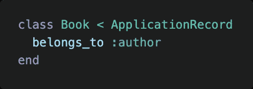

app/model/book.rb

## 向模型添加关联

尽管 Rails 可能已经在图书模型生成期间建立了图书与作者之间的关联，但是我们仍然需要手动建立作者与图书模型之间的关联。

在我们的`app/models/author.rb`文件中，添加关联`has_many :books`。

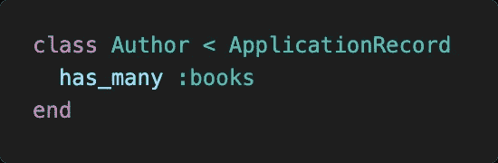

app/models/author.rb

*注意:添加* `*has_many*` *关联时，记得将模型复数化。*

## 向模型添加验证

为了防止无效数据被保存到我们的数据库中，我们可以为我们的模型设置[验证器](https://guides.rubyonrails.org/active_record_validations.html)。

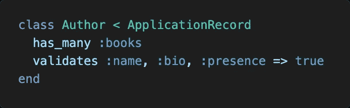

app/models/author.rb

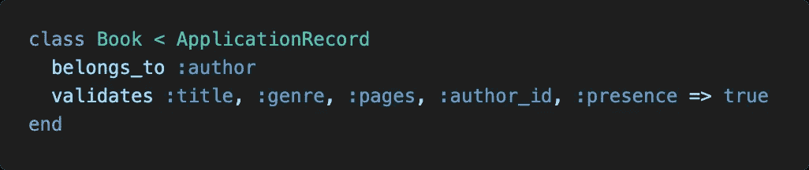

app/models/book.rb

# 3.启动数据库

为了启动数据库，我们需要创建数据库并迁移我们的更改以更新模式。

```
$ rails db:create
$ rails db:migrate
```

通过检查`db/schema.rb`中的模式，确认您的迁移已经发生。如果您发现您的一个表中缺少一列，不要手动更改`schema.rb`，因为它会破坏您的应用程序。

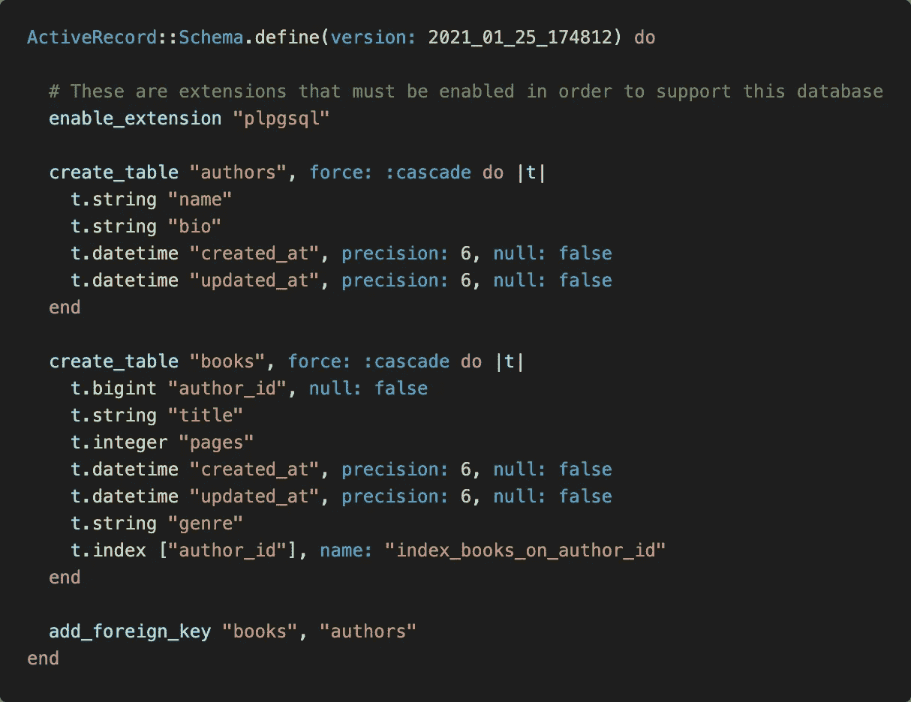

db/schema.rb

## 生成迁移

其中一个表中缺少一列？我们可以生成一个迁移来向表中添加一列。

*注意:记住表名要用复数形式，以符合数据库惯例。*

**模板:**

```
$ rails g migration add_**<COLUMN>**_to_**<TABLE NAME>** **<COLUMN>:<TYPE>**
```

**例如:**

```
$ rails g migration add_**genre**_to_**books** **genre:string**
```

在生成您的迁移之后，只需运行`$ rails db:migrate`来迁移任何更改。

# 4.控制器

既然我们已经建立了数据库，我们将需要一种 API 访问数据的方法。为此，我们需要设置控制器。

## 发电控制器

顾名思义，我们的控制器容纳了所有的方法和动作，将充当集合的“控件”。

*注意:控制器名应该是复数，因为它包含集合的所有方法。*

**模板:**

```
$ rails g controller **<CONTROLLER NAME>**
```

**示例:**

```
$ rails g controller **Authors** $ rails g controller **Books**
```

## **向控制器添加动作**

生成控制器后，我们需要用我们希望 API 执行的动作填充控制器。

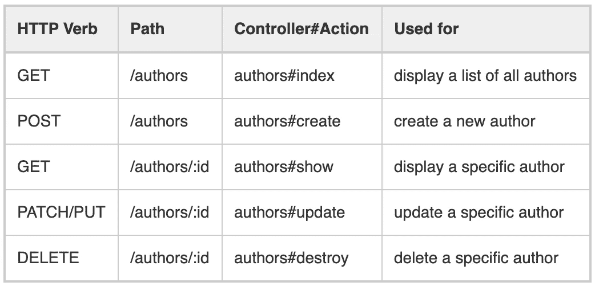

Routes and Controller Actions Reference

遵循 RESTful 架构和 CRUD 惯例，我们可以使用上面的图表作为 API 中常见动作的参考。

*注意:这并不限制我们创建自己的自定义操作。如果您决定添加一个自定义操作，我们只需要在我们的路由中多做一点配置。*

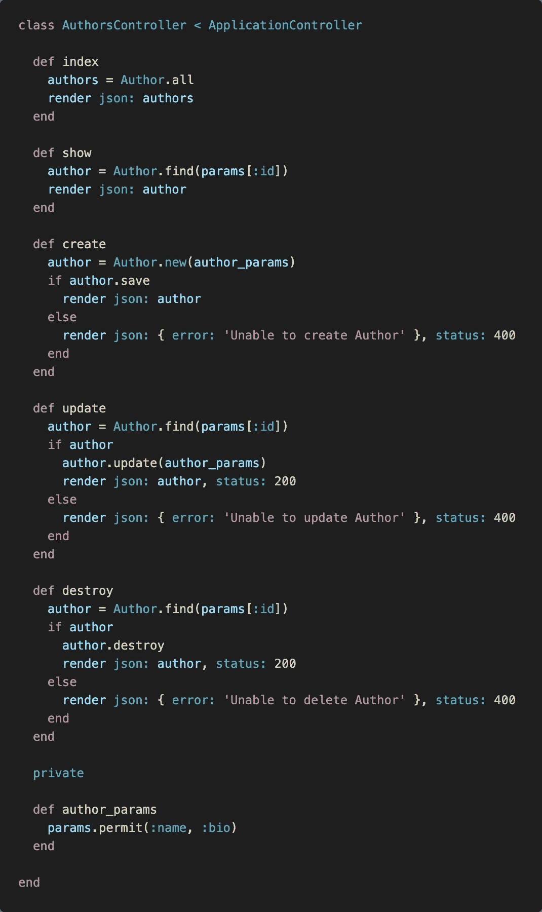

# 5.路线

当设置[路由](https://guides.rubyonrails.org/routing.html)时，我们基本上是在设置 API 端点或 URL，它们将分派某个动作来返回响应。

## 资源路由

如果我们在设置控制器动作时遵循 Rails 喜欢的命名约定，我们就可以利用 Rails 的资源路由。导航到`config/routes.rb`并将`resources **<CONTROLLER NAME>**`添加到您的路线中。

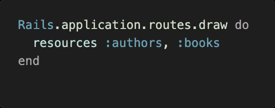

config/routes.rb

## 自定义路由

如果您向控制器添加了一个自定义动作，并希望将该动作分派给一个[自定义路线](https://guides.rubyonrails.org/routing.html#non-resourceful-routes)，我们可以使用下面的模板。

**模板:**

```
**<HTTP VERB>** '**<PATH>**', to: '**<CONTROLLER>#<ACTION>'**
```

**例如:**

```
get 'custom/path', to: 'authors#index'
```

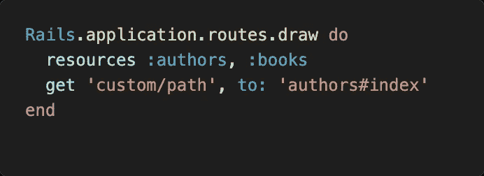

config/routes.rb

# 6.测试 API

既然我们已经设置了路由，我们希望确保路由正常工作。然而，我们的数据库目前还没有任何数据可以发送回去。我们需要首先播种我们的数据库。

## 种子数据库

导航到`db/seeds.rb`，添加一些种子数据并运行`$ rails db:seed`。

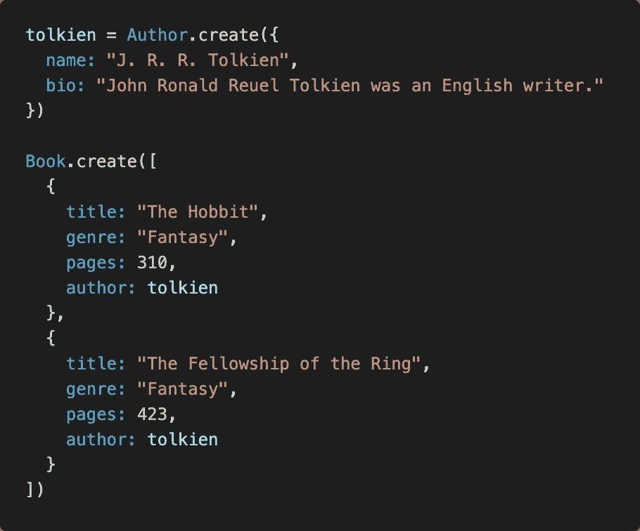

db/seeds.rb

## 启动服务器

一旦您的数据库被植入，通过在您的终端中运行`$ rails s`来启动服务器。默认情况下，您的 Rails 服务器应该在端口 3000 上启动。如果您想使用不同的端口，您可以添加`-p **<PORT NUMBER>**` 标志来指定您希望您的服务器在哪个端口上运行。

**例如:**

```
$ rails s -p 3000
```

## 测试终点

一旦服务器运行，我们可以通过在浏览器中导航到`[http://localhost:3000/authors](http://localhost:3000/authors)`来检查作者的路线。

*注意:记住，我们的浏览器只能执行 GET 请求。如果想测试出其他请求，我推荐使用* [*Postman*](https://www.postman.com/) *。*

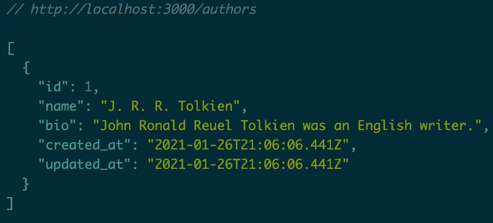

JSON response from /authors

我们得到了回应，这很好，但是我们播种的书在哪里呢？这就把我们带到了下一个话题，序列化器。

# 7.序列化程序

序列化器允许我们以一种像我们这样的开发人员容易使用的方式格式化我们的数据。也许，有些东西我们想省略发回，如密码或无意义的元数据。

## 装置

我们将使用[ActiveModelSerializer](https://rubygems.org/gems/active_model_serializers/versions/0.10.10)gem。导航到您的`Gemfile`并添加`gem 'active_model_serializers'`作为依赖项。然后运行`$ bundle`来安装所有的依赖项。

## 生成序列化程序

一旦安装了 ActiveModelSerializer，我们就可以访问新的 generate 命令。

**模板:**

```
rails g serializer **<MODEL NAME>**
```

**例如:**

```
rails g serializer author
rails g serializer book
```

## 序列化您的数据

导航到位于`app/serializers`目录中的序列化器，添加或删除 JSON 响应中需要的属性。

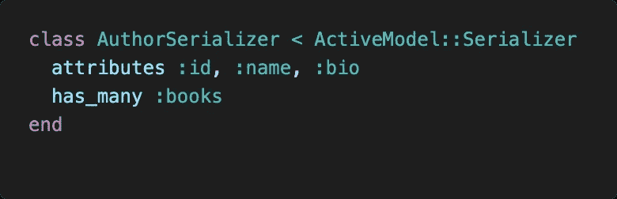

app/serializer/author_serializer.rb

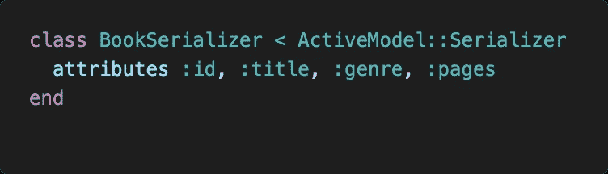

app/serializer/book_serializer.rb

既然已经设置了序列化器，那么再次启动服务器并检查 API 的 JSON 响应。看起来很干净！

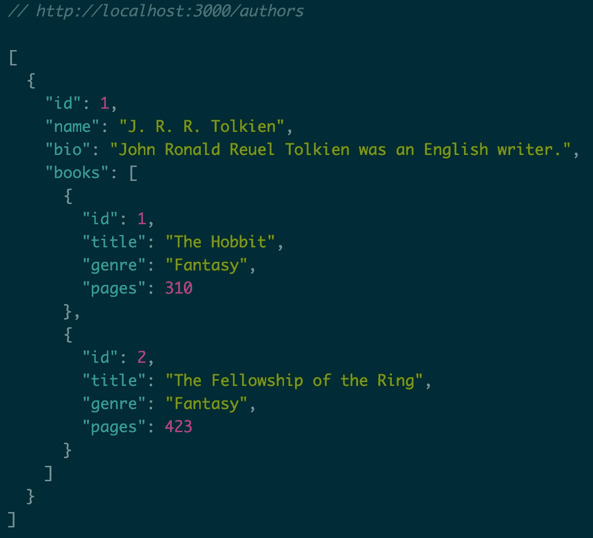

# 结论

希望本指南让您清楚地了解了如何启动自己的 Rails API。能够构建自己的 API 肯定有它的好处，并为令人敬畏的项目创意开辟了许多机会。