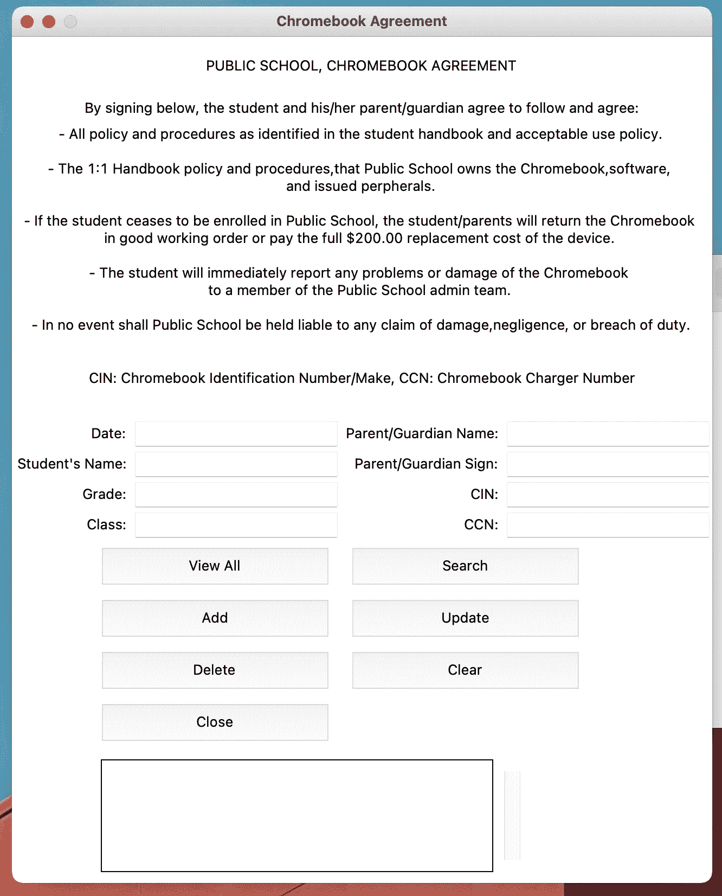

# 如何用 Python GUI 创建一个记录保持器

> 原文：<https://medium.com/geekculture/how-to-create-a-record-keeper-with-python-gui-tkinter-b16957f59591?source=collection_archive---------32----------------------->

在本教程中，我将带您浏览一个 GUI 应用程序，它保存 Chromebook 设备的签入和签出记录。它可以被公立学校使用，或者任何其他人可以修改代码并免费使用，如果它适合他们的需要。


Photo by [Brooke Cagle](https://unsplash.com/@brookecagle?utm_source=medium&utm_medium=referral) on [Unsplash](https://unsplash.com?utm_source=medium&utm_medium=referral)

那我们开始吧。

我在应用前端用过 ***tkinter*** 库，后端跟一个数据库差不多， ***sqlite3*** 。在这个项目中将有三个主要部分，首先是设计前端。第二部分是建立数据库连接和 CRUD 操作，最后我们将连接前端和后端。

我们将创建两个文件，一个将被命名为 app1.py，这将是我们的前端，另一个将被命名为 app1 _ backend.py 将包括后端代码。

让我们看看下面的代码片段:我们将从 ***tkinter*** 库中导入所有代码，我们还将导入名为 ***app1_backend*** 的 python 文件。py 包含数据库信息作为后端。在导入文件时，我们不需要添加。 ***py*** 扩展。

```
from tkinter import *
import app1_backend
```

导入所需的文件和库后，我们将如下初始化我们的应用程序，并为我们的应用程序添加一个标题:

```
window = Tk()
window.wm_title(“Chromebook Agreement”)
```

在 python 文件 app1.py 的最后，我们将添加以下代码片段:该应用程序将不可调整大小，因为我已经以这种方式设置了它，但是如果您想使它可调整大小，您需要编写 True，而不是零。不要忘记所有的前端 GUI 代码都将写在 ***window =Tk()*** 到 ***window.mainloop()之间。*** “窗”是我们这里的主要画布。

```
window.resizable(0,0)
window.mainloop()
```

下面是“ ***标签*** ”:我们将使用 ***tkinter*** 库的 grid()函数来排列标签、条目和按钮。

```
lb_title = Label(window,text=”Public School, Chromebook Agreement”.upper())
lb_title.grid(row=0,column=0,columnspan=4,pady=15)lb_info = Label(window , text=”By signing below, the student and his/her parent/guardian agree to follow and agree:”)
lb_info.grid(row=1,column=0,columnspan=4)lb_explanation = Label(window, text=”- All policy and procedures as identified in the student handbook and acceptable use policy.\n\n- The 1:1 Handbook policy and procedures,that Public School owns the Chromebook,software, \nand issued perpherals.\n\n- If the student ceases to be enrolled in Public School, the student/parents will return the Chromebook \nin good working order or pay the full $200.00 replacement cost of the device. \n\n- The student will immediately report any problems or damage of the Chromebook \nto a member of the Public School admin team. \n\n- In no event shall Public School be held liable to any claim of damage,negligence, or breach of duty.”)
lb_explanation.grid(row=2,column=0,columnspan=4)lb_ps = Label(window,text=”CIN: Chromebook Identification Number/Make, CCN: Chromebook Charger Number”)
lb_ps.grid(row=3,column=0,columnspan=4,pady=25)lb_date = Label(window,text=”Date:”)
lb_date.grid(row=4,column=0,sticky=”e”)lb_sname = Label(window,text=”Student’s Name:”)
lb_sname.grid(row=5,column=0,sticky=”e”)lb_grade = Label(window,text=”Grade:”)
lb_grade.grid(row=6,column=0,sticky=”e”)lb_class = Label(window,text=”Class:”)
lb_class.grid(row=7,column=0,sticky=”e”)lb_pname = Label(window,text=”Parent/Guardian Name:”)
lb_pname.grid(row=4,column=2,sticky=”e”)lb_psign = Label(window,text=”Parent/Guardian Sign:”)
lb_psign.grid(row=5,column=2,sticky=”e”)lb_cin = Label(window,text=”CIN:”)
lb_cin.grid(row=6,column=2,sticky=”e”)lb_ccn = Label(window,text=”CCN:”)
lb_ccn.grid(row=7,column=2,sticky=”e”)
```

那么，让我们来看看“条目”:

```
en_date = StringVar()
e1 = Entry(window,textvariable= en_date)
e1.grid(row =4,column=1)en_sname = StringVar()
e2 = Entry(window,textvariable= en_sname)
e2.grid(row =5,column=1)en_grade = StringVar()
e3 = Entry(window,textvariable= en_grade)
e3.grid(row =6,column=1)en_class = StringVar()
e4 = Entry(window,textvariable= en_class)
e4.grid(row =7,column=1)en_pname = StringVar()
e5 = Entry(window,textvariable= en_pname)
e5.grid(row =4,column=3)en_psign = StringVar()
e6 = Entry(window,textvariable= en_psign)
e6.grid(row =5,column=3)en_cin = StringVar()
e7 = Entry(window,textvariable= en_cin)
e7.grid(row =6,column=3)en_ccn = StringVar()
e8 = Entry(window,textvariable= en_ccn)
e8.grid(row =7,column=3)
```

给你按钮:

```
b1 = Button(window,text=”View All”, width=23,height=2,command=view_all)
b1.grid(row=8,column=0,columnspan=2,sticky=”e”,padx=10,pady=6)b2 = Button(window,text=”Search”, width=23,height=2,command=search_record)
b2.grid(row=8,column=2,columnspan=2,sticky=”w”,padx=10,pady=6)b3 = Button(window,text=”Add”, width=23,height=2,command=add_record)
b3.grid(row=9,column=0,columnspan=2,sticky=”e”,padx=10,pady=6)b4 = Button(window,text=”Update”, width=23,height=2,command=update_record)
b4.grid(row=9,column=2,columnspan=2,sticky=”w”,padx=10,pady=6)b5 = Button(window,text=”Delete”, width=23,height=2,command=delete_record)
b5.grid(row=10,column=0,columnspan=2,sticky=”e”,padx=10,pady=6)b6 = Button(window,text=”Close”, width=23,height=2,command=window.destroy)
b6.grid(row=11,column=0,columnspan=2,sticky=E,padx=10,pady=6)b7 = Button(window,text=”Clear”, width=23,height=2,command=new_record)
b7.grid(row=10,column=2,columnspan=2,sticky=”w”,padx=10,pady=6)
```

我们还将在显示记录的地方使用“listbox”和“ScrollBar ”,并将 ListBox 和 scrollbar 连接起来:

```
student_list= Listbox(window,height=6,width=40)
student_list.grid(row=12,column=0,rowspan=6,columnspan=3,sticky=E,padx=10,pady=10)sb1 = Scrollbar(window)
sb1.grid(row=12,column=3,rowspan=6,sticky=W)student_list.configure(yscrollcommand=sb1.set)
sb1.configure(command=student_list.yview)
```

然后，为了从列表框中获取所选记录的内容，我们使用以下代码将列表框与所选行绑定:

```
student_list.bind(‘<<ListboxSelect>>’,selected_row)
```

这里我们总结一下前端。尽管后端非常简单。我将在另一个时间编辑这个故事，以解释更多的细节。最终项目将看起来如下截图。



在那之前，你可以通过这个链接访问所有的代码:[https://github.com/bunyaminsari/ps-chromebook-records](https://github.com/bunyaminsari/ps-chromebook-records)

更多内容将在我的博客上分享，你可以关注我:[https://benedtech.com/](https://benedtech.com/)

别忘了查看这个链接；

https://benedtech.medium.com/membership