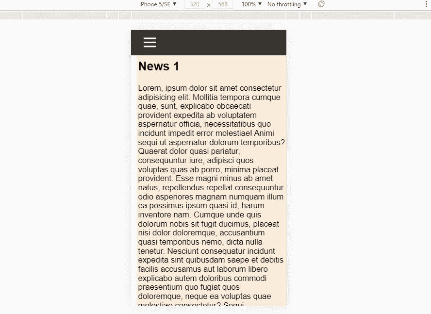

# 如何创建一个带有汉堡菜单的响应式导航条

> 原文：<https://medium.com/geekculture/how-to-create-a-responsive-navbar-with-hamburger-menu-da2366122d69?source=collection_archive---------12----------------------->

## 使用 CSS 和 JavaScript 切换到移动友好的导航条

在这篇文章中，当屏幕尺寸很小时，我们将使桌面网站 navbar 变成一个具有汉堡菜单的移动友好 navbar。

## 添加桌面版导航栏