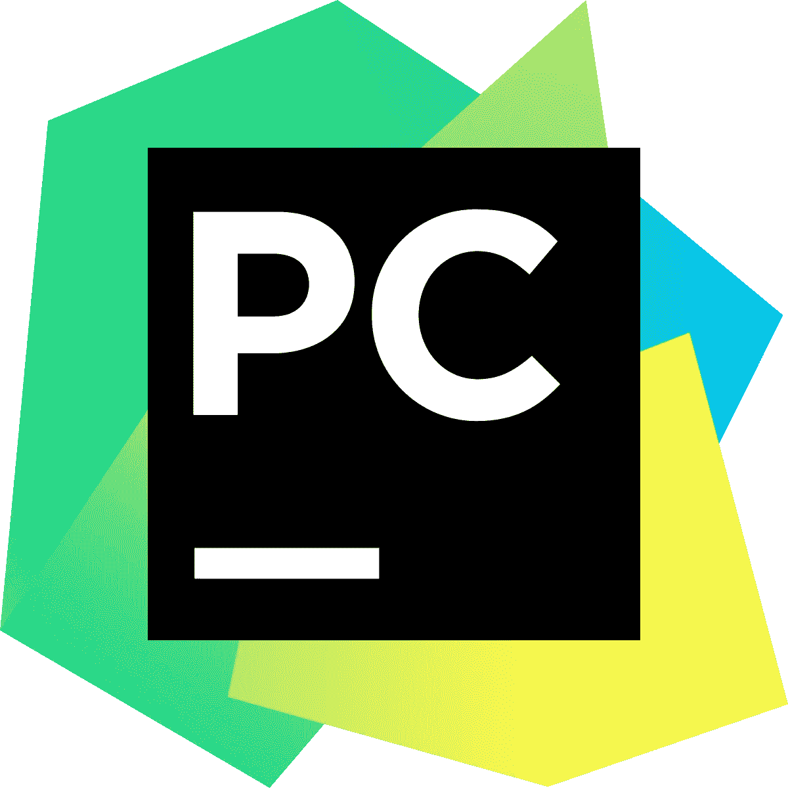

# 如何创建 SaaS web 应用程序—第 4 部分—设置项目(Django + GitHub)

> 原文：<https://medium.com/geekculture/how-to-create-a-saas-web-application-part-4-setting-up-the-project-django-github-8780e40b714c?source=collection_archive---------9----------------------->

这一系列文章将教您如何开发和部署 SaaS web 应用程序，包括订阅。

SaaS web 应用程序是通过互联网交付的软件即服务应用程序。

这是一种基于订阅的模式，用户可以通过网络访问和使用该应用程序…