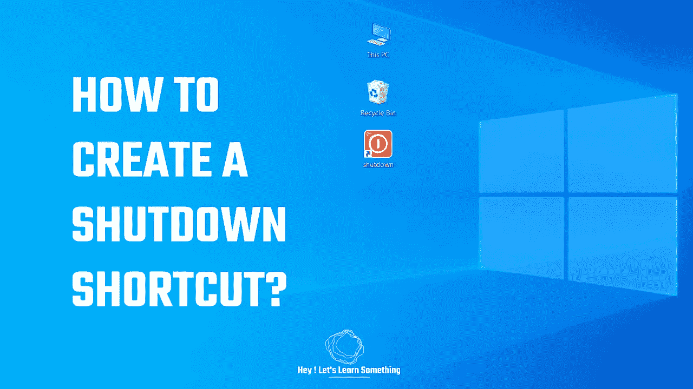

# 如何在 Windows 上创建关机快捷方式？

> 原文：<https://medium.com/geekculture/how-to-create-a-shutdown-shortcut-on-windows-a67114a1b679?source=collection_archive---------15----------------------->

*一键关机选项！*

您正在为您的计算机寻找一个单击关机选项吗？如果是的话，那么在这篇文章中你将很快学会如何在你的电脑上创建一个关机快捷方式。这基本上意味着，只需点击一下就可以关闭电脑。你可以把快捷方式放在任何你喜欢的地方，使用自定义图标，只需一次点击，你的电脑就会…