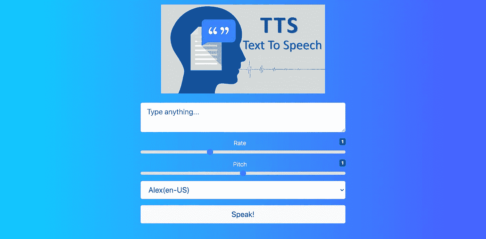

# 如何创建一个简单的文本到语音转换应用程序

> 原文：<https://medium.com/geekculture/how-to-create-a-simple-text-to-speech-web-application-2a8fdb9ccbcc?source=collection_archive---------6----------------------->

Photo by [Fotis Fotopoulos](https://unsplash.com/@ffstop?utm_source=unsplash&utm_medium=referral&utm_content=creditCopyText) on [Unsplash](https://unsplash.com/?utm_source=unsplash&utm_medium=referral&utm_content=creditCopyText)

如果你曾经对阅读一篇文章感到厌烦或厌倦，或者觉得你需要有人帮你大声朗读一本杂志的内容，那么你并不孤单。我也有过这样的感觉！这是我决定写这篇文章的主要原因，以帮助 Web 开发人员构建一些非常简单的东西来解决这个巨大的问题。

在本文中，我将讨论什么是 Web API，以及如何使用语音合成 API 将文本转换成不同声音的语音。

> 根据[维基百科对 API](https://en.wikipedia.org/wiki/Application_programming_interface) 的定义:API(应用编程接口)是定义多个软件应用之间交互的接口。它定义了可以发出的请求的种类、如何发出请求、应该使用的数据格式、应该遵循的约定等等。它还可以提供扩展机制，以便用户能够以各种方式扩展现有的功能。

不同类型的 API 有**开放 API**、**内部 API**、**合作伙伴 API**、**复合 API**、 **RESTFUL** 、 **JSON-RPC** 、 **XML** -RPC，以及 **SOAP** 。

> Web APIs 经常使用基于机器的交互，比如 REST 和 SOAP。

在本文中，我们主要关注的是 **Web 语音 API** ，它属于**Web/浏览器 API** ，而其他 API 将在另一篇文章中详细讨论。

# 什么是 Web/浏览器 API？

**浏览器 API**(或 web**API**)是内置在**浏览器**中的**API**。他们能够从浏览器和周围的计算机环境中公开数据，这有助于开发人员执行复杂的操作。有了这些 API，我们可以构建利用通知、振动等本地特性的应用程序。

# **网络语音 API**

根据 [*MDN*](https://developer.mozilla.org/en-US/docs/Web/API/Web_Speech_API) *，****Web 语音 API 是一个** web api ，它的使您能够将语音数据合并到 Web 应用程序中。Web 语音 API 有两个部分:**语音合成(文本到语音)**和**语音识别(异步语音识别)。)***

*在本文中，我们将会看到**语音合成(文本到语音**的强大功能以及如何利用它。*

# *言语合成*

*根据[*MDN*](https://developer.mozilla.org/en-US/docs/Web/API/SpeechSynthesis),[Web 语音 API](https://developer.mozilla.org/en-US/docs/Web/API/Web_Speech_API) 的`**SpeechSynthesis**`接口是语音服务的控制器接口；这可用于检索有关设备上可用的合成语音、开始和暂停语音以及其他命令的信息。*

***属性** *继承自其父接口，EventTarget:**

*`[SpeechSynthesis.paused](https://developer.mozilla.org/en-US/docs/Web/API/SpeechSynthesis/paused)`这是一个`[Boolean](https://developer.mozilla.org/en-US/docs/Web/JavaScript/Reference/Global_Objects/Boolean)`，如果 speechSynthetisis 对象处于暂停状态，它将返回`true`。*

*`[SpeechSynthesis.pending](https://developer.mozilla.org/en-US/docs/Web/API/SpeechSynthesis/pending)` A `[Boolean](https://developer.mozilla.org/en-US/docs/Web/JavaScript/Reference/Global_Objects/Boolean)`，如果话语队列包含尚未说出的话语，则返回`true`。*

*`[SpeechSynthesis.speaking](https://developer.mozilla.org/en-US/docs/Web/API/SpeechSynthesis/speaking)`一个`[Boolean](https://developer.mozilla.org/en-US/docs/Web/JavaScript/Reference/Global_Objects/Boolean)`，如果一个话语当前正在被说出，则返回`true`——即使`SpeechSynthesis`处于暂停状态。*

***方法** *也从其父接口* `[*EventTarget*](https://developer.mozilla.org/en-US/docs/Web/API/EventTarget)` *继承方法。**

*从话语队列中删除所有话语。*

*`[SpeechSynthesis.getVoices()](https://developer.mozilla.org/en-US/docs/Web/API/SpeechSynthesis/getVoices)`返回代表当前设备上所有可用声音的`[SpeechSynthesisVoice](https://developer.mozilla.org/en-US/docs/Web/API/SpeechSynthesisVoice)`对象列表。*

*`[SpeechSynthesis.pause()](https://developer.mozilla.org/en-US/docs/Web/API/SpeechSynthesis/pause)`将`SpeechSynthesis`对象置于暂停状态。*

*`[SpeechSynthesis.resume()](https://developer.mozilla.org/en-US/docs/Web/API/SpeechSynthesis/resume)`将`SpeechSynthesis`对象置于非暂停状态:如果它已经暂停，则恢复它。*

*`[SpeechSynthesis.speak()](https://developer.mozilla.org/en-US/docs/Web/API/SpeechSynthesis/speak)`添加一个`[utterance](https://developer.mozilla.org/en-US/docs/Web/API/SpeechSynthesisUtterance)`到发言队列；当任何其他话语在它被说出之前排队时，它将被说出。*

> **现在是时候构建我们简单的文本到语音转换应用程序了**

*演示链接:[https://mytextspeech.netlify.app/](https://mytextspeech.netlify.app/)*

**

*Final result*

****第一步:****

*创建一个文件夹，在文件夹中，创建一个 index.html 文件，并将下面的代码粘贴到其中。下面的代码片段包含构建应用程序布局时使用的 HTML 代码。*

*index.html*

*S ***tep 2:****

*创建一个 javascript 文件 main.js，并将下面的代码粘贴到其中。*

*main.js*

*在这里，我们声明了我们的 **main.js** 文件中需要的所有变量。第一个变量 synth 表示在`[speechSynthesis](https://developer.mozilla.org/en-US/docs/Web/API/SpeechSynthesis/paused)` 对象中可用的属性，而其他变量是将用于处理事件的 DOM 元素。*

****第三步:****

*在 main.js 文件中，复制并粘贴下面的代码*

*`voices`数组将包含浏览器 Web speech API 中出现的所有语音，同时创建`[getVoices](https://developer.mozilla.org/en-US/docs/Web/API/SpeechSynthesis/paused)` 函数以获取所有语音以及语音名称和使用的语言。最后，这些声音会被附加到我们网页上的选择选项中。这将使用户能够选择他们喜欢的声音。*

****第四步:****

*在 main.js 文件中，复制并粘贴下面的代码*

*此时，我们将创建一个函数`speak`来处理说话事件，在声音说话时添加波形背景，处理选定的声音，设置声音的速率和音调，还处理过程中的错误。*

****第五步:****

*在 main.js 文件中，复制并粘贴下面的代码*

*最后，我们有事件句柄，它负责处理应用程序中所有可点击和可选择的事件，例如提交文本内容，增加/减少速率和音调，以及改变声音。*

# *完全码*

*Complete index.html code*

*Complete main.js code*

> *耶！😃，我们做到了。我们刚刚创建了一个简单的文本到语音的应用程序，使用户能够输入或复制单词或句子，然后转换成语音。现在你可以舒服地坐着，粘贴你想要的文本，放松地享受阅读这些内容的人的声音😂。*

# *结论*

*在我的其他文章中，我解释了更多关于浏览器 API 的内容，并进一步讨论了不同类型的可用浏览器 API。*

# *类似文章*

*   *[“了解浏览器 API”](https://javascript.plainenglish.io/understanding-browser-apis-83a570a62840)*
*   *[“如何创建简单的语音转文本应用程序”](https://javascript.plainenglish.io/how-to-create-a-voice-to-text-application-2cb12e6b50fd)*

# *进一步的解释/参考*

*   *[网络语音 API](https://developer.mozilla.org/en-US/docs/Web/API/Web_Speech_API) ，“Mozilla 开发者网络*
*   *[网络语音 API 规范:编辑稿](https://dvcs.w3.org/hg/speech-api/raw-file/tip/webspeechapi.html)，“W3C*
*   *[语音合成 API](http://caniuse.com/#feat=speech-synthesis) ，“我可以用吗？(浏览器支持图表)*
*   *“会说话的网络应用:语音合成 API 简介，”谷歌开发者埃里克·比德尔曼*
*   *[语音合成 API](https://developer.microsoft.com/en-us/microsoft-edge/testdrive/demos/speechsynthesis/) ，“微软开发者(Edge 的演示)*