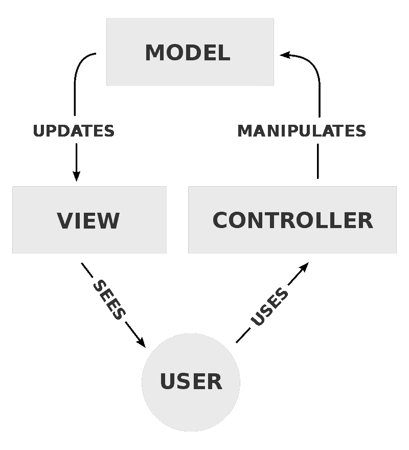
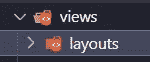
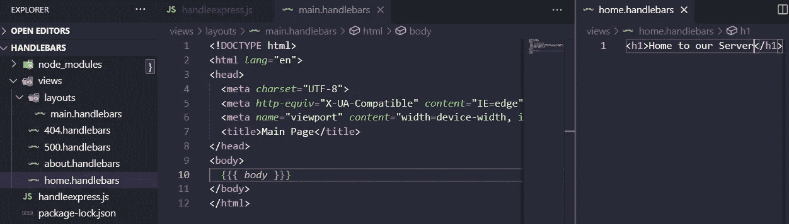
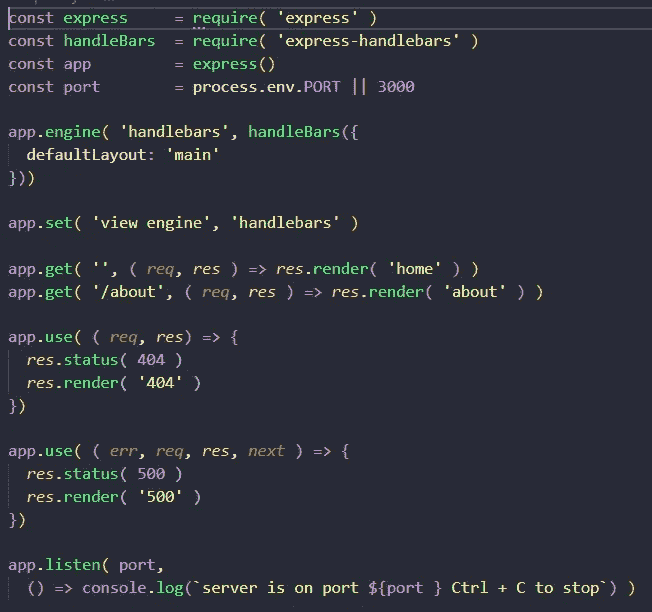
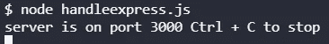
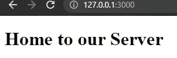
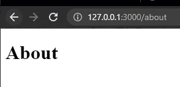
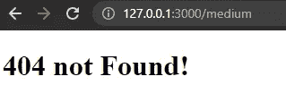
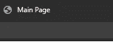

# 如何使用手柄用 Express.js 创建一个小服务器

> 原文：<https://medium.com/geekculture/how-to-create-a-small-server-with-express-js-using-handlebars-aab529be375a?source=collection_archive---------8----------------------->


Handlebars

这将是非常动态的，我们将学习如何使用小胡子模板语言的超集进行布局、视图，以及我们如何使用 Express.js 来实现这一切，这将是一个简单但有价值的例子。

# 模型-视图-控制器

这将是其他框架的一种方法，如 [CodeIgniter](https://codeigniter.com/) 、 [Laravel](https://laravel.com/) 等。Express.js 也可以使用这个概念，但是它是什么呢？从维基百科中的[图中，对 MVC 有一个简单的概念](https://en.wikipedia.org/wiki/Model%E2%80%93view%E2%80%93controller)



Example Model View Controller from Wikipedia

[维基说](https://en.wikipedia.org/wiki/Model%E2%80%93view%E2%80%93controller)

> 模型负责管理应用程序的数据。它从控制器接收用户输入。
> 
> 视图以特定的格式呈现模型的表示。
> 
> 控制器响应用户输入并在数据模型对象上执行交互。控制器接收输入，可选地验证它，然后将输入传递给模型。

重要！因为 Express-handlebar 更新了它的库，所以您需要更改导入

```
import { engine } from 'express-handlebars';
```

并为此更改 handleExp

```
app.engine( 'handlebars', engine({
defaultLayout: 'main'
}))
```

如果你愿意，你可以看视频

# 快递. js

Express.js 可以管理 MVC，但是我们使用 mustache 模板语言(handlebars)并对我们的代码做了一点修改，但是它会工作得很好，让我们看看

安装快递. js

```
npm i express
```

首先，你需要安装把手包到我们的快递项目

```
npm i express-handlebars
```


Installing express and express-handlebars

创建视图/布局目录



creating views and layouts

用 Express.js 创建我们的页面和主页来动态改变数据



Example pages and main page

如果您看到我们正在创建我们的主布局，这将是我们的中心，其他视图是代码的较小部分，这些将在我们主页的{{{ body }}}部分发生变化。

然后用这段代码创建我们的 Express.js 服务器，我们将开始添加我们的变量，然后我们需要指定引擎，在这种情况下是 handlebars，下一个参数是使用 defaultLayout 的 handlebar 函数，然后我们需要设置视图引擎和 handlebars 的设置，之后我们使用 get 来指定它将用于在主页上更改的代码，但是这次我们使用 render 而不是 send，并且只使用 404 和 500 错误页面上的状态



Example code for Express.js and handlebars

```
const express     = require( 'express' )
const handleBars  = require( 'express-handlebars' )
const app         = express()
const port        = process.env.PORT || 3000app.engine( 'handlebars', handleBars({
defaultLayout: 'main'
}))app.set( 'view engine', 'handlebars' )
app.get( '', ( *req*, *res* ) => *res*.render( 'home' ) )
app.get( '/about', ( *req*, *res* ) => *res*.render( 'about' ) )
app.use( ( *req*, *res*) => {
*res*.status( 404 )
*res*.render( '404' )
})
app.use( ( *err*, *req*, *res*, *next* ) => {
*res*.status( 500 )
*res*.render( '500' )})
app.listen( port,() => console.log(`server is on port ${port } Ctrl + C to stop`) )
```

我们启动我们的服务器和 Boala！



Example output server



Home page



About page



404 not found page

它工作得非常好，它交换来自我们的观点的信息，这是伟大的，如果你看到标题页，它总是显示“主页”



Example main page

# 结论

这是一种建模视图控制器的方法，以及我们如何将它与 Express.js 一起使用，如果你真的熟悉 MVC，并且如果你想使用 Express.js，这是非常好的，Express.js 让我对它可以做什么以及我们如何了解它和使用包的多样性感到更加兴奋，这太棒了！

# 来源

[](http://expressjs.com/) [## Express - Node.js web 应用程序框架

### Express 是一个最小且灵活的 Node.js web 应用程序框架，它为 web 和…

expressjs.com](http://expressjs.com/) [](https://www.npmjs.com/package/express-handlebars) [## 快速把手

### 一个车把查看引擎的表达，不吸。这个套件过去被命名为 express 3-handlebar。的…

www.npmjs.com](https://www.npmjs.com/package/express-handlebars) [](https://laravel.com/) [## laravel——Web 工匠的 PHP 框架

### Laravel 是一个 web 应用程序框架，具有丰富、优雅的语法。我们相信发展必须是令人愉快的…

laravel.com](https://laravel.com/) [](https://codeigniter.com/) [## CodeIgniter Web 框架

### CodeIgniter 是一个功能强大的 PHP 框架，占用空间非常小，是为需要一个简单而优雅的…

codeigniter.com](https://codeigniter.com/) [](https://en.wikipedia.org/wiki/Model%E2%80%93view%E2%80%93controller) [## 模型-视图-控制器-维基百科

### 模型-视图-控制器(通常称为 MVC)是一种软件设计模式，通常用于开发用户界面…

en.wikipedia.org](https://en.wikipedia.org/wiki/Model%E2%80%93view%E2%80%93controller) [](https://www.amazon.com/Web-Development-Node-Express-Leveraging/dp/1492053511) [## 使用 Node 和 Express 进行 Web 开发:利用 JavaScript 堆栈

### 使用 Node 和 Express 进行 Web 开发:利用 Amazon.com 的 JavaScript 堆栈。*免费*送货到…

www.amazon.com](https://www.amazon.com/Web-Development-Node-Express-Leveraging/dp/1492053511)