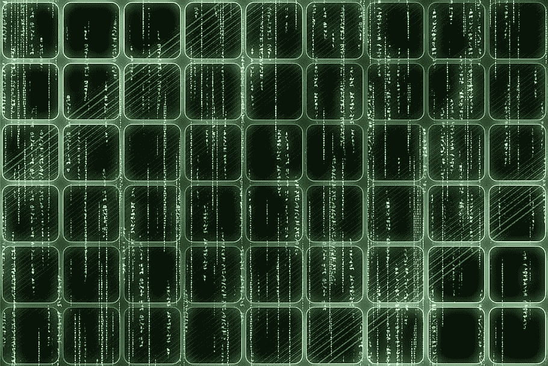

# 如何在 Python 中创建 spd 矩阵

> 原文：<https://medium.com/geekculture/how-to-create-a-spd-matrix-in-python-fb81f671f352?source=collection_archive---------11----------------------->

在我过去的帖子中，我介绍了稀疏编码信号的创建，可以在这里阅读:-[https://medium . com/geek culture/how-to-make-a-sparse-coded-signal-with-sk learn-f 28 BAC B2 fedf](/geekculture/how-to-make-a-sparse-coded-signal-with-sklearn-f28bacb2fedf)

在这篇文章中，我想继续讨论 sklearn 的一个更模糊的数据集，make_spd_matrix。该数据集返回一个随机的对称正定矩阵。