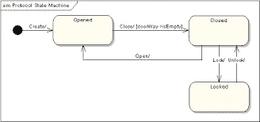
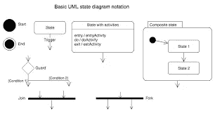
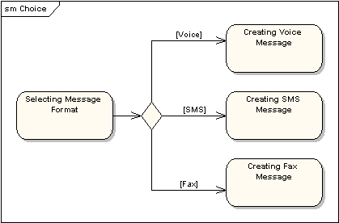
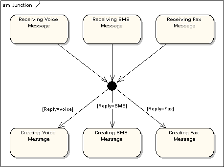
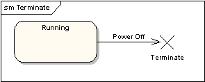
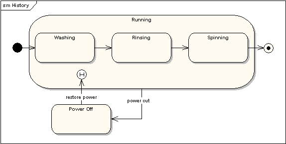
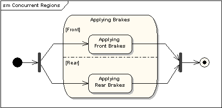

# 如何创建状态图

> 原文：<https://medium.com/geekculture/how-to-create-a-state-diagram-110d709c2fc8?source=collection_archive---------10----------------------->

在设计面向对象的程序时，通常会用到状态图。在本文中，我们将深入探讨什么是状态图以及如何准备状态图。

Figure 1: The State Diagram of a Door

您知道实际上有十四(14)种类型的 UML 图吗？现在你知道了！根据您正在开发的程序，其中一个可能适合您的需要。例如，如果你的程序严重依赖于类结构，你可能会从使用*类图*中获益更多。另一方面，如果时间对你的程序非常重要，你可能想使用一个*时序图*。类似地，如果你的程序是由一个对象可以存在的有限数量的状态组成的，你将需要一个*状态图*。

**状态图**是一种用于图形化表示*有限状态机*的图，也称为*自动机*。**另一方面，自动机**基本上是一种计算的数学模型，由有限数量的状态、关系以及这些状态之间的动作组成。

状态图基本上是对计算机程序中每个对象状态的图形化描述，并用不同的事件控制这些状态。作为一个例子，你可以想到电梯的程序。乘坐电梯的人可能处于四种状态:进入电梯、在电梯内等待、离开电梯和到达目的地。

**活动图**行为图的区域类型就像状态图一样，非常相似，但是不要搞错了！这两者的不同之处在于，状态图表示对象的*状态*，而活动图表示对象的*活动*。

状态图表示一个对象在其生命周期中可以存在的每个状态，一旦状态结束，该对象的*生命周期*也将结束。因此，我们也可以说一个状态图将代表一个物体的预期寿命。状态图包括对象如何通过流机制从一种状态切换到另一种状态，以及这些状态是什么。只有当存在一个对象并且该对象由事件触发时，状态才能存在。例如，对于处于电梯内状态的管家，您将首先需要一个“管家”对象，然后通过一些活动影响它，如“进入电梯内”和“在电梯内等待”。

同样，让我们看看上面图 1 中的例子。图 1 显示了一扇门的状态图。在那里，门可以处于的状态用盒子表示:开、关、锁。一扇门可以采取的动作写在连接这些状态的箭头上:开、关、锁、开。注意每个状态并不是在所有情况下都可用:例如，如果门是开着的，你就不能锁门，你需要先把门关上。看看如果有必要的话，我们如何为要采取的行动添加一些条件:为了关门，你必须首先确保门口是空的。

总之，我们可以说状态图的三个主要目标是:

*   模拟系统的动态结构
*   模拟试剂系统的生命周期
*   模拟对象在其生命周期中所处的不同状态

在这个意义上，我们可以推断出每个状态图:

*   表示单个对象的行为
*   确定在所述对象的生命周期中将发生的事件的顺序

Figure 2: Basic State Diagram Structure

通过上面的图 2，我们可以推断出，在设计状态图时，我们:

*   将州名写在带椭圆角的矩形框内
*   用一个完整的黑色圆圈标记对象生命周期的开始，用一个浅色圆圈内的黑色圆圈标记程序的结束。
*   可以标记也可以不标记开始和结束标记
*   我们用箭头表示从一个状态到另一个状态的转换。这些箭头可以有 3 个属性:

—触发器:过渡的原因。它可能是一个信号，一个事件，一个变化或者仅仅是时间的流逝。

Guard:为了触发转换，应该授予其条件。

—效果:作为转换的结果，将在对象上直接调用的操作。

*   我们在转换箭头上写下特定语法的属性:触发[保护]/效果(或者导致[条件]/结果)
*   当一个状态由动作组成时，我们如上所示表示它:在同一个状态框中，状态名称与动作分开，下面列出输入和输出动作，每个动作用斜杠(“/”)分开。
*   当一个状态再次转变为自身时，即。当你在电梯里等了一分钟，等待状态每两秒钟刷新一次，我们表示这种情况，我们让转换箭头退出，到达同一个状态框。
*   当一个状态覆盖一个或多个其他状态时，我们称之为复合状态。如果一个复合状态包含另一个复合状态，因为它太大了，不能在同一个状态框中表示，我们简单地创建带有状态名的状态框，并加上一个符号“<> - <>”，以表示内容将被绘制在另一个图中。
*   在某些情况下，您可能不希望从初始化点进入状态，而是从另一个点进入状态:例如，在自动售货机中，您将首先要求客户将一些钱放入机器中，但是如果他们已经使用过该自动售货机一次，并且还有钱购买另一种苏打水，您可能希望跳过机器要求钱的初始化步骤。在这种情况下，我们创建两个初始化点:一个表示有钱，一个表示没钱。最初的初始化点用黑色实心圆表示，而第二个初始化点用空白圆表示。
*   出口点可以放在程序的很多地方。在这种情况下，您应该用相同的名称标记所有的出口点。

Choice Pseudo-State

*   当一个状态可以根据转移条件(Guard)转移到两个或多个状态时，这叫做选择伪状态。

Junction Pseudo-State

*   当多个过渡连接在一个效果上时，我们称之为连接伪状态。在这种状态下，一个单个交叉点可以有一个或多个进入转换和一个或多个退出转换。一些或所有过渡段可以有防护装置。如果在连接伪状态图中，一个进入转换分解成多个退出转换，我们称之为静态条件分支，虽然它类似于选择伪状态，但选择伪状态将实现动态条件分支。

Terminate Pseudo-State

*   为了表明自动机的生命周期在程序内部的某个地方结束，我们使用终止符号:s 单个大“X”。

History States

*   想象一下，你把要洗的衣服放进洗衣机，就在快洗完的时候，突然停电了。现在恢复供电后，是否需要重新进行整个洗涤过程？如果使用历史状态架构就不会。使用这种类型的结构是为了在断电的情况下保持对先前状态的记忆。建模时，我们简单地创建一个转换，它使用“断电”的情况作为保护，并返回到原始状态中的“历史”状态(上面显示了一个 H)。历史状态将记录最近采取的行动，通过这一点，机器将继续从电源关闭点开始的程序。

Concurrent Regions

*   有时，在一个状态中，我们可能有多个同时但独立工作的状态。我们称这样的状态为“并发区域”。在这种情况下，我们在状态中为每个并发状态创建区域，并使用 fork 和 join 代替 choice 和 merge 伪状态，如上例所示，以便模拟它们是*同步*状态的事实。上面的例子显示了在驾驶时使用刹车时，前后刹车是如何同时但独立地工作的。