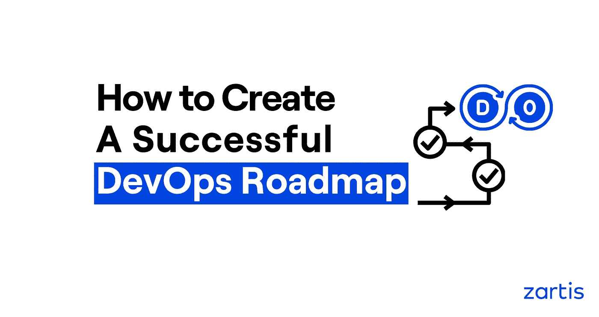

# 如何创建成功的开发运维路线图

> 原文：<https://medium.com/geekculture/how-to-create-a-successful-devops-roadmap-8e6b44d57988?source=collection_archive---------29----------------------->

## 开发 DevOps 路线图的分步指南

与传统的线性(或瀑布式)软件开发方法不同，DevOps 方法将工程和运营团队聚集在一起，让他们在整个产品发布周期中紧密合作。