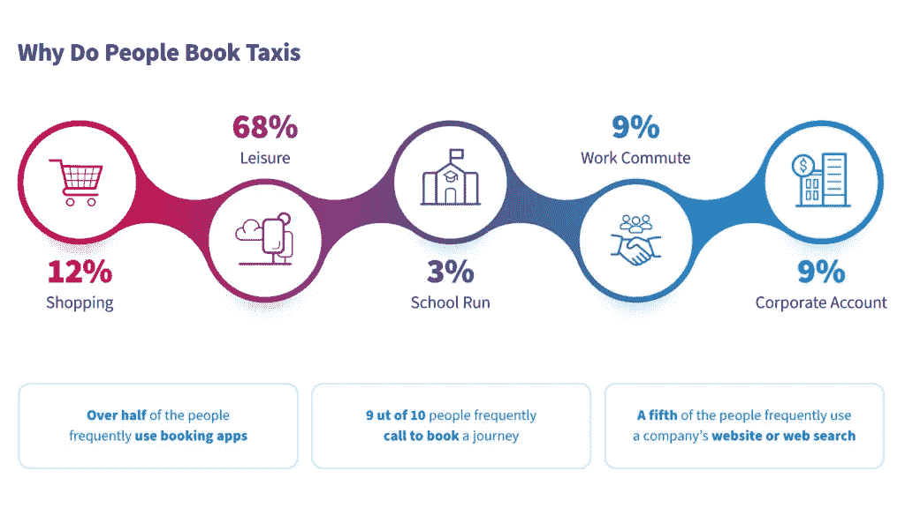
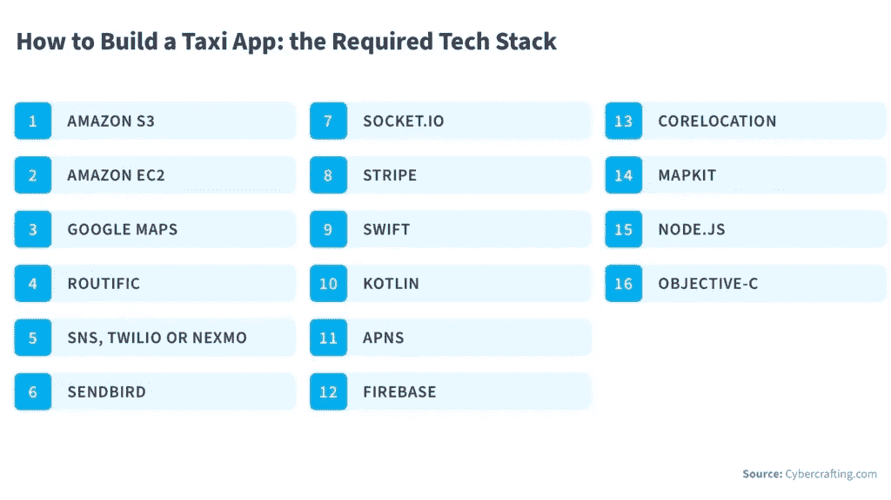
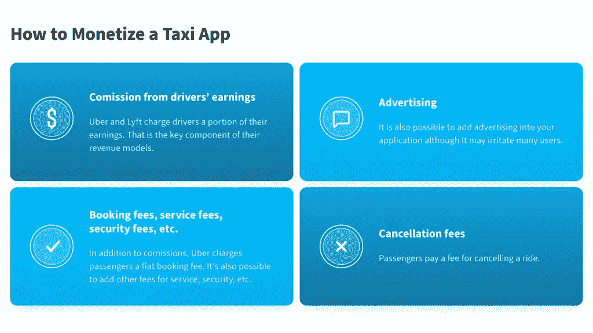
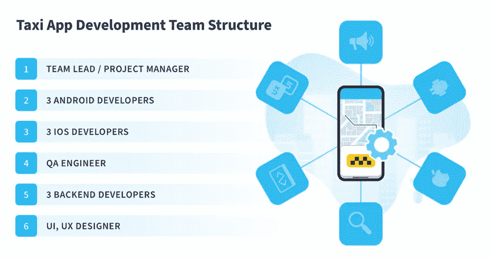

# 如何打造比优步更好的打车 App 尼克斯联合

> 原文：<https://medium.com/geekculture/how-to-create-a-taxi-app-better-than-uber-nix-united-a0495738fc6a?source=collection_archive---------28----------------------->

你是出租车服务或类似业务的所有者，受到了优步、Lyft 和 Grab 等拼车应用的影响吗？或者，你可能在一个还没有被这些服务瞄准的较小的市场，你想早点建立你的存在。无论是哪种情况，你可能想知道你需要做什么来建立一个像优步这样的应用程序，这样你才能在你的市场上竞争。

对于人口稠密城市的居民来说，私人汽车似乎总是一种不必要的享受。高昂的停车费、保险费和燃油费，以及持续不断的交通拥堵，使得出租车和公共交通成为许多人唯一的选择。

随着优步、Lyft 和 Grab 等拼车服务的推出，消费者有了另一种需要时可以使用的选择。然而，这些服务的推出极大地冲击了长期以来习惯于垄断市场的现有出租车服务。虽然拼车服务不一定更便宜，但这些应用程序让使用它们变得更方便。

# 如何建立一个像优步一样的应用程序？

虽然优步是构建拼车应用的领先组织，但 Lyft、Grab、Ola 等其他公司很快推出了自己的竞争服务。这些公司了解优步在其市场中的重要性，并且可以看到它的受欢迎程度几乎每天都在增长。

通过专注于类似优步的应用程序开发，他们已经成功地迅速进入优步完全主导的领域。这些应用程序都提供了相似的工作流程:

1.  用户请求旅行并确认他们的目的地
2.  基于这个目的地，他们被匹配到合适的驱动程序
3.  他们旅行到目的地
4.  用户自动向司机转账付款
5.  用户提交关于他们体验的评论

如果你准备建立一个像优步一样的应用程序，请按照以下步骤开始:

# 1.创建一个商业模型来理解需求

简单地假设“如果你建造了它，他们就会来”并不是成功的秘诀。构建一个[好的移动应用](https://nix-united.com/services/mobile-app-development/)不是一件小事。

当着手创建一个像优步这样的应用程序时，你需要了解你的目标市场，以及为什么他们会对你的服务感兴趣。

*   你的目标受众是谁？他们的平均年龄，人口统计，职业。
*   你的目标市场有多大？
*   你的潜在客户主要是苹果设备、安卓设备的用户，还是两者都用？
*   什么能帮助你的应用脱颖而出？您是否有兴趣为司机提供加密或添加优化路线功能等替代支付解决方案？
*   启动应用程序需要多快？

如果你的目标只是提供一个替代的解决方案，这不是最好的主意。因为拼车市场有太多的全球竞争对手。然而，如果你提供新的和独特的东西，你更有可能获得市场份额。为你现在需要的和将来可能需要的制定一个清晰的计划，将有助于你决定你的发展选择。

# 2.为类似优步的应用程序开发流程寻找合适的技术团队

当考虑如何制作一个像优步一样的应用程序时，商业计划只是第一步。下一个要求是考虑项目的所有技术方面。专业的软件开发公司可以帮你估算一个应用上线大概需要的成本和时间。NIX 在移动应用程序开发、web 开发、UI/UX 设计、项目管理、商业分析和质量保证方面拥有一支经验丰富的程序员队伍。公司提供了[完整的软件开发生命周期](https://nix-united.com/services/software-engineering/)。

# 3.建立一个像优步一样的应用程序

从开发的角度来看，考虑:

*   后端开发需求和成本
*   管理面板和报告的 Web 开发服务
*   面向 iOS 和 Android 设备的原生和混合应用开发
*   用户界面/UX 设计服务，以确保应用程序的功能和良好的设计
*   QA 服务，用于测试新版本和补丁，并保证应用程序正常运行

从企业管理的角度来看，寻找以下技能:

*   项目管理服务，以确保开发人员能够在预算范围内按时完成项目
*   应用程序构建完成后，为后续维护提供发布后故障排除和技术支持服务
*   与新版本相关的持续管理成本维护和修补活动

要考虑的其他成本包括:

*   您需要的服务器和数据库的硬件成本
*   互联网数据和托管成本

你需要考虑的下一件事是谁将构建你的应用程序。

使用像 NIX 这样的离岸软件开发公司的服务可能是一个非常划算的选择。NIX 可以接触到世界各地成千上万的开发者，他们拥有你在开发像优步这样的应用时所需要的技能和知识。

# 需要向客户提供哪些功能？

对于类似优步的应用程序开发，一个关键的考虑因素是客户的特点。基于优步已经提供的功能，客户希望他们的拼车应用程序能提供某些功能。如果这些功能缺失，他们就不太可能使用你的应用。

这是出租车服务需要理解的一个关键点，因为它们习惯于提供某种类型的服务。但优步和其他拼车公司已经改变了他们习惯的工作环境。

有了优步，乘客希望能够通过应用程序直接联系司机，并查看他们的距离和他们在路线上的位置。拼车客户希望拥有无缝的注册体验，并且正在寻找能够以直观的方式为他们提供所有信息而无需浏览菜单和设置的应用程序。

从成本的角度来看，骑手们正在寻找一个应用程序，在进入车辆之前给他们一个总成本的估计。同样，对于支付，他们想要一个与流行的信贷和本地支付提供商无缝集成的应用程序。此外，考虑为与他人共乘一辆车的乘客提供费用分摊等服务。

最后，想想评分和评论等社交功能，因为这是帮助优步在许多市场增长的东西。此外，不要忘记优步最近发布的一些新功能，如为他人预订乘车服务，甚至提前安排乘车时间。

最终，有 3 个主要因素会影响顾客的舒适度:服务价格、充分意识和乘坐本身。

# 你应该关注司机的哪些需求

如果没有在全球范围内使用的驱动因素，优步就不会成为一个覆盖全球、价值数百万美元的企业。虽然你可能有自己的车队或出租车，但优步为司机提供的特性和功能值得一提，因为它们可能对你也有用。

当构建一个像优步这样的应用程序时，想想你的司机会如何使用这个应用程序。让他们能够用活动和非活动标志来指示他们的可用性。他们还应该能够直接从应用程序直接与乘客沟通。

此外，该应用程序应该提供地图，不仅显示道路，还显示交通状况，以及先进的路线优化。这可能包括捷径，甚至是在某些地区不太为人所知的安全路线。

司机应该能够获得不同时间段的预订报告，这样他们就可以快速方便地计算他们的收入。此外，该应用程序应该提供一个计时器，以便如果一个票价选择在一段时间后取消，他们仍然会得到帐单。

# 把所有这些放在一起，控制一切

要构建一个像优步一样的应用程序，你基本上是用管理面板作为控制器为乘客和司机构建两个不同的应用程序。

管理面板的目的是让你控制整体业务。这包括让你收集用户数据和付款，以及决定你应该付给你的司机多少钱。

管理面板可以包括几个模块:

*   驱动程序和用户管理
*   机票预订和位置管理
*   支付和促销管理
*   评级和审核管理
*   客户服务模块
*   授权模块

管理面板还可以提供有关车辆及其维护时间表的信息，使其成为您的出租车业务的完整控制中心。

根据您的具体需求，构建管理面板可能是一个复杂的过程。

# 类似优步的应用程序开发评估

前面提到的功能需要开发时间和精力，所以如果你有兴趣建立一个优步应用程序，你可能需要一些成本的概念。

地理定位服务是一项允许乘客查看司机实时位置的功能。这有助于了解司机有多近或多远，以及他们来自哪个方向，以便乘客可以做好准备。它还帮助司机找到客户的上车地址。

考虑**支付集成**需要在开发生命周期的早期就决定如何处理支付。对于希望保留所有信用卡和用户信息的公司来说，PCI 认证是必须的。包括优步在内的许多人使用的替代方案是使用 PCI 认证的第三方。根据您希望启用的不同支付选项，支付集成成本会有所不同。

**注册**页面应该使用现有的谷歌和脸书个人资料提供简化的授权。它还应该与评级和审查系统集成，以便只有经过验证的配置文件可以离开审查。留下评论的能力是 Ubers 的秘密之一，并帮助推动了它的发展。如果可能的话，这应该是一个你可以使用的特性。

客户端和驱动程序之间的调用是一个重要的功能。此外，开发人员还需要考虑不同的消息平台，并推送**通知**，以保证通信是无缝的。通知功能和地理定位取决于所使用的设备。因此，实现这一功能的成本将因所选平台而异。

乘客已经习惯了使用优步这样的应用程序，这带来的一个重要好处是，他们可以在使用服务之前提前知道自己将支付多少费用。**乘坐费用估算**不是一个简单的计算，它会根据当时可用车辆的数量以及旅途中选择的车辆类型而变化。

在**后端**开发中，运行应用程序的代码与保存所有信息的数据库集成在一起。后端和前端共同为应用提供动力。后端开发是复杂的，你可以预期团队会把大部分时间花在集成和测试所有的特性和功能上。

**前端**开发时间因平台而异，因为 Android 或 iOS 的要求不同。与后端开发类似，这是另一个需要花费大量时间和精力的领域。前端是应用程序的整体外观和感觉，包括导航菜单，因此正确使用它至关重要。

总的来说，一个应用程序的总成本可能会因你计划提供的功能和你希望应用程序运行的平台而有很大差异。例如，一个可以在 iOS 或 Android 上运行的应用程序将比一个可以在两个平台上运行的应用程序便宜。但这并不意味着它会给你带来客户，所以选择一个平台你必须取决于观众的偏好，让你的决定是数据驱动的，不要根据节省的方式做出选择。

# 结论

构建具有这些功能的应用程序需要一定的知识和技能，这是很难找到的。如果你想在内部开发这个应用，你需要雇佣一个包括开发人员、工程师、项目经理和设计师的团队。这是一个昂贵且耗时的过程。

开发团队需要了解如何最好地与不同的支付平台集成，并了解 Android 和 iOS。因此，虽然知道自己需要什么样的打车应用是很好的第一步，但这还不足以构建一个能够与优步竞争的解决方案。更好的选择是将你的应用程序开发外包给第三方，比如 NIX。

NIX 的开发人员拥有最新技术的经验。我们的项目经理和业务分析师团队可以与您合作，确保您考虑了所有要求，并且您的计划是最适合市场的。联系我们，了解我们如何帮助您创建像优步这样的应用程序。

*原载于 2021 年 4 月 28 日*[*【https://nix-united.com】*](https://nix-united.com/blog/how-to-create-a-taxi-app-better-than-uber/)*。*