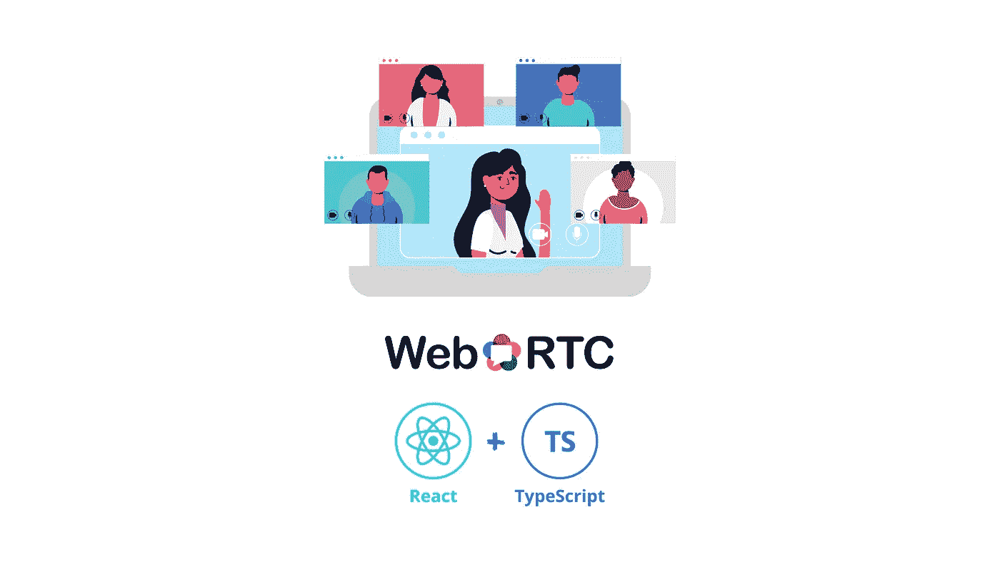

# 如何使用 React、TypeScript 和 WebRTC 创建视频聊天

> 原文：<https://medium.com/geekculture/how-to-create-a-video-chat-with-react-typescript-and-webrtc-8a70f6159cdc?source=collection_archive---------6----------------------->

## 创建对等连接以建立视频聊天

Photo made with [Canva](https://www.canva.com/).

如今，越来越多的人使用在线资源进行交流，进行演示，从事项目工作，甚至在在线协作中创作音乐。因此，许多科技公司正在加强他们的服务，以提供一种方式来实现这一点…