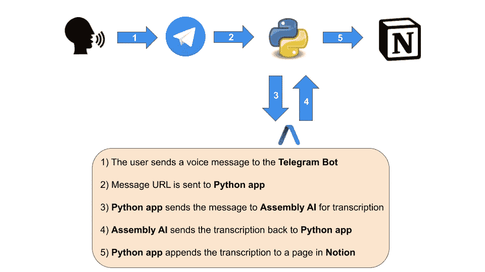

# 如何用 Telegram、Python 和 AssemblyAI 创建语音日记

> 原文：<https://medium.com/geekculture/how-to-create-a-voice-diary-with-telegram-python-and-assemblyai-6e75c8eb3284?source=collection_archive---------12----------------------->

## 一个简单的声音转录工具

Voice diary architecture. Image by author

最近，我偶然发现了一个名为 AssemblyAI 的工具，它实现了一些语音识别和分析的 API。我已经决定尝试使用 Telegram、Python 和 voice 来创建一个小型语音日记。

# 什么是语音日记？