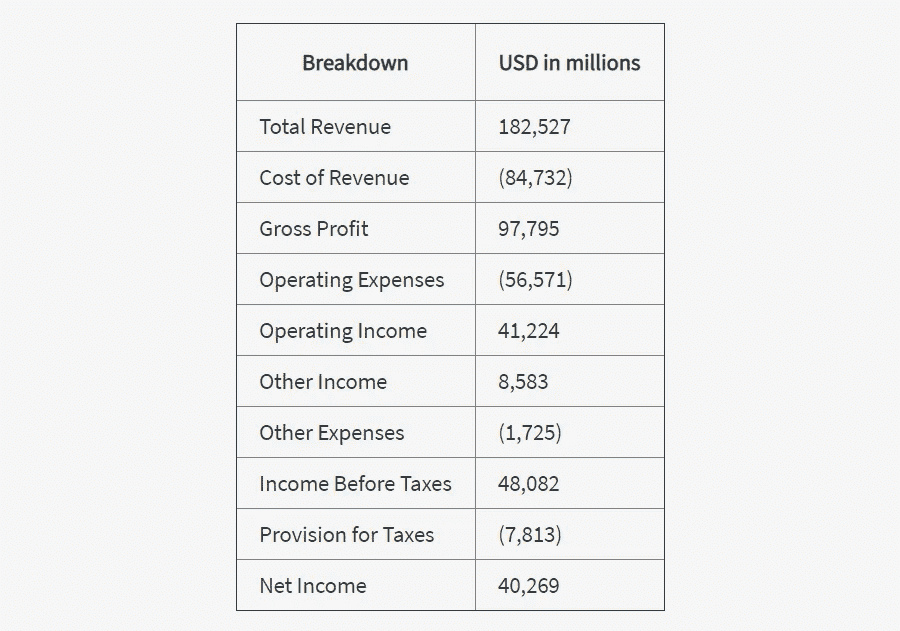
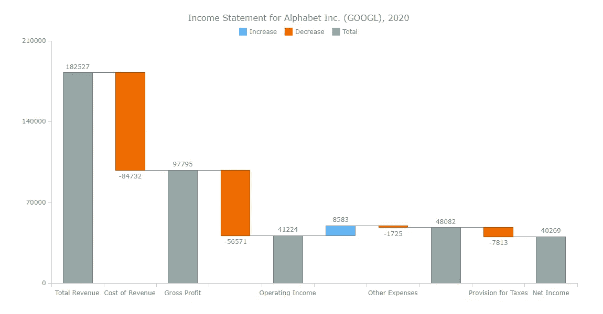
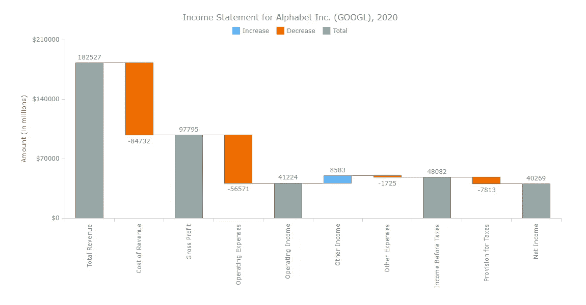
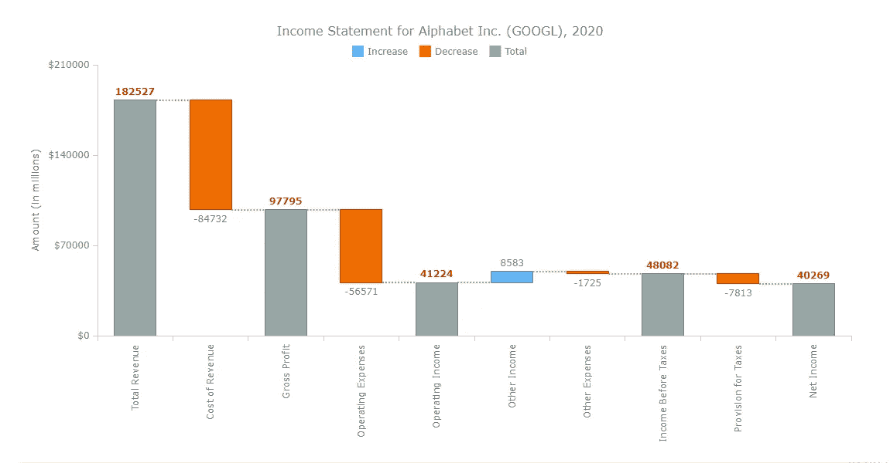
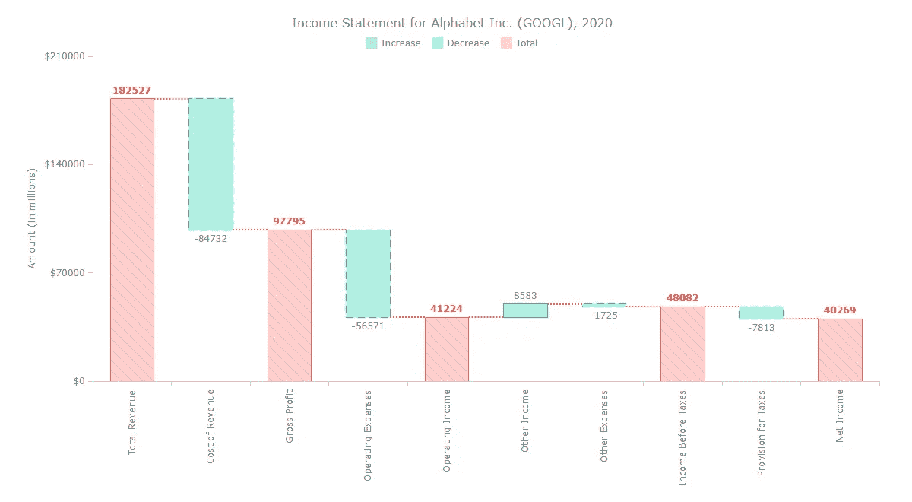

# 如何用 JavaScript 创建瀑布图

> 原文：<https://medium.com/geekculture/how-to-create-a-waterfall-chart-with-javascript-3a655ead0932?source=collection_archive---------12----------------------->


Do **您想知道如何使用 JavaScript 轻松地将瀑布图添加到网页或应用程序中吗？本教程将确保您准备好自信地处理那种交互式数据可视化开发！**

[瀑布图](https://www.anychart.com/chartopedia/chart-type/waterfall-chart/)展示了起始值如何通过一系列中间加法(正值)和减法(负值)变成最终值。这些增减可以是基于时间的，也可以表示多种收入来源和支出等类别。在金融学中，瀑布图通常被称为桥梁；你可能也听说过它被称为瀑布图、马里奥图或飞砖图。

要查看瀑布图并学习如何用 JavaScript (HTML5)构建它们，我们需要一些有趣的真实数据来可视化。在本教程中，我们来看看谷歌母公司 Alphabet Inc. (GOOGL)的 **2020 年损益表。**

因此，和我一起一步一步地达到我们的目标，所以最后，你会看到当用一个漂亮的，互动的，JS 瀑布图来说明的时候，很多数字是如何容易理解的。上船啦

# 如何创建一个基本的 JS 瀑布图

一般来说，在 JS 中可视化任何图表时，需要采取四个基本步骤:

*   步骤 1:创建一个 HTML 页面。
*   第二步:参考所有必要的 JavaScript 库。
*   第三步:加载需要可视化的数据集。
*   步骤 4:编写一些 JS 图表代码。

现在让我们按照这些步骤，基于这种方法构建一个很酷的 JavaScript 瀑布图。现实中，一切都很快。

## 步骤 1:创建一个 HTML 页面

第一件事是制作一个可以呈现瀑布图的 HTML 页面。

```
<!DOCTYPE html>
<html>
  <head>
    <title>Waterfall Chart Example</title>
    <style>
      html, body, #WaterfallContainer {
        width: 100%;
        height: 100%;
        margin: 0;
        padding: 0;
      }
    </style>
  </head>
  <body>
    <div id="WaterfallContainer">
 ***// Place the waterfall chart here.***    </div>
  </body>
</html>
```

如上所示创建的 HTML 页面在`<title>`标签中包含了一个标题。造型单在`<style>`中确定。您可以根据自己的喜好随意定制。

在`<body>`部分，有一个`<div>`元素将被用作瀑布图的容器。它应该有一个 id，这样我们以后可以很容易地引用它。在这种情况下，它的 id 被设置为`WaterfallContainer`。

## 步骤 2:参考所有必要的 JavaScript 库

第二，我们需要连接将用于生成瀑布图的所有相关 JS 脚本。URL 放在`<head>`部分内的`<script>`标签中。对于本教程，我选择了 [AnyChart](https://www.anychart.com) 的 JavaScript 图表库。它功能强大、灵活且易于使用，能让图表在你的网页上迅速可视化。然而，这个过程是相当普遍的。

AnyChart 是[模块化](https://docs.anychart.com/Quick_Start/Modules)，这意味着当你只需要它的一些图表和特性时，你不必加载整个库。为了创建瀑布图，我们只需要核心库模块，这是所有类型的图表所需要的，以及专用的“瀑布”模块。

```
<!DOCTYPE html>
<html>
  <head>
    <title>Waterfall Chart Example</title>
    <script src="https://cdn.anychart.com/releases/8.9.0/js/anychart-core.min.js"></script>
    <script src="https://cdn.anychart.com/releases/8.9.0/js/anychart-waterfall.min.js"></script>      
    <style>
      html, body, #WaterfallContainer {
        width: 100%;
        height: 100%;
        margin: 0;
        padding: 0;
      }
    </style>
  </head>
  <body>
    <script>
 ***// Place the waterfall chart here.***    </script>
  </body>
</html>
```

## 步骤 3:加载需要在瀑布图中可视化的数据集

因此，为了向您展示瀑布图的美丽和使命，我需要一个数据集，其中初始值受到一系列中间值(正的和负的)的影响。

我决定查看 Alphabet Inc .2020 年的年度[损益表。下面是我基于它为这个 JS 瀑布图教程准备的数据集:](https://www.stock-analysis-on.net/NASDAQ/Company/Alphabet-Inc/Financial-Statement/Income-Statement)



现在我们已经获得了数据，让我们将它转化为一个对象数组:

```
var data = [
  { x: 'Total Revenue', value: 182527 },
  { x: 'Cost of Revenue', value: -84732 },
  { x: 'Gross Profit', isTotal: true },
  { x: 'Operating Expenses', value: -56571 },
  { x: 'Operating Income', isTotal: true },
  { x: 'Interest Income', value: 8583 },
  { x: 'Other Expenses', value: -1725 },
  { x: 'Income Before Taxes', isTotal: true },
  { x: 'Provision for Taxes', value: -7813 },
  { x: 'Net Income', isTotal: true }
];
```

如果你仔细看上面的片段，有一个关键词叫做`isTotal`。它是用来显示合计的，基本上当你需要得到一系列加减的累计值时，用值`true`包含就可以了。没错，你甚至不需要计算任何东西，因为库已经为你计算好了。

## 步骤 4:编写 JS 瀑布图代码

到目前为止，一切都已就绪，我们离瀑布图可视化又近了一步。只需几行 JavaScript 代码，您就可以检查它，甚至将其集成到任何地方进行进一步的分析。

我们之前准备的所有东西都需要放在`anychart.onDocumentReady()`函数中，这个函数必须放在 HTML 页面的`<body>`部分的`<script>`标签中。

```
<script>
  anychart.onDocumentReady(function() {
 ***// The entire JS code of the waterfall chart will be here.***  });
</script>
```

接下来，只需命令创建一个瀑布图，并像我们在步骤 3 中塑造的那样为其提供数据集:

```
var chart = anychart.waterfall(data);
```

我们要不要为我们的图表定一个主要的标题？

```
chart.title('Income Statement for Alphabet Inc. (GOOGL), 2020');
```

最后，让我们在步骤 1 中设置的容器中绘制 JS 瀑布图:

```
***// set the container id for the waterfall chart*** chart.container('WaterfallContainer');***// draw the resulting chart*** chart.draw();
```

下面来看看结果吧！这是一个基于 JavaScript 的基本交互式瀑布图，可视化了谷歌 2020 年的损益表，我们刚刚用很少几行代码创建了它。



[https://playground.anychart.com/HCwZE7Cr/](https://playground.anychart.com/HCwZE7Cr/4/iframe)

为了您的方便，下面是完整的代码，欢迎您在 [AnyChart 游乐场](https://playground.anychart.com/HCwZE7Cr/)上查看。随着定制的临近，请继续阅读！

```
<!DOCTYPE html>
<html>
  <head>
    <title>Waterfall Chart Example </title>
    <script src="https://cdn.anychart.com/releases/8.9.0/js/anychart-core.min.js"></script>
    <script src="https://cdn.anychart.com/releases/8.9.0/js/anychart-waterfall.min.js"></script>      
    <style>
      html, body, #WaterfallContainer {
        width: 100%;
        height: 100%;
        margin: 0;
        padding: 0;
      }
    </style>
  </head>
  <body>
    <script>anychart.onDocumentReady(function () { ***// set the data***  var data = [
    { x: 'Total Revenue', value: 182527 },
    { x: 'Cost of Revenue', value: -84732 },
    { x: 'Gross Profit', isTotal: true },
    { x: 'Operating Expenses', value: -56571 },
    { x: 'Operating Income', isTotal: true },
    { x: 'Interest Income', value: 8583 },
    { x: 'Other Expenses', value: -1725 },
    { x: 'Income Before Taxes', isTotal: true },
    { x: 'Provision for Taxes', value: -7813 },
    { x: 'Net Income', isTotal: true }
  ]; ***// create a waterfall chart with the data***  var chart = anychart.waterfall(data); ***// set the chart title***  chart.title('Income Statement for Alphabet Inc. (GOOGL), 2020'); ***// set the container id for the waterfall chart***  chart.container('WaterfallContainer');

 ***// draw the resulting chart***  chart.draw();}); </script>
  </body>
</html>
```

# 定制 JS 瀑布图

我相信你会同意我们构建的基本 JS 瀑布图看起来已经很好了。但总有改进的空间，不是吗？

说到定制，您所使用的数据可视化库必须足够灵活，以便以简单的方式实现您想要的东西。例如，现在我将向您展示如何通过一些直观的努力，让我们的瀑布图更有吸引力和艺术性。

## 用斧子工作

让我们从在值前添加$符号开始，以绝对清楚地表明这些总和是以美元为单位的:

```
chart.yAxis().labels().format('${%Value}');
```

我们还可以为 Y 轴添加一个标题，指定数字以百万为单位:

```
chart.yAxis().title('Amount (in millions)');
```

X 轴标签(类别名称)很长。让我们把它们垂直放置。就像这样设置 X 轴标签旋转:

```
chart.xAxis().labels().rotation(-90);
```

看看我们得到了什么！



[https://playground.anychart.com/2JfFUnXd/](https://playground.anychart.com/2JfFUnXd/4/iframe)

> 在 [AnyChart 游乐场](https://playground.anychart.com/2JfFUnXd/)看到这个定制的 JS 瀑布图。

## 设置连接器的样式

现在，让我们修改瀑布图的连接线，即绘制在列之间的线。

使用`connectorStroke()`方法调整连接器的行程。其对`connectorStroke()`方法的详细参数解释可以在 [API 参考](https://api.anychart.com/v8/anychart.charts.Waterfall#connectorStroke)中找到。

```
chart.connectorStroke("#ff6666", 2, "2 2", "round");
```

看看下面的结果。


[https://playground.anychart.com/B52LYkpY/](https://playground.anychart.com/B52LYkpY/5/iframe)

> 请看这张定制的 JS 瀑布图，它带有在 AnyChart 游乐场[上新设计的连接器](https://playground.anychart.com/B52LYkpY/)。

## 使用 HTML 自定义瀑布列标签

在瀑布图中配置 HTML 格式的标签可能会很棒。要启用 HTML，只需将`useHtml()`方法的参数设置为`true`。然后简单地添加必要的 HTML 标签，它们就可以工作了。

```
***// enable HTML for the labels*** chart.labels().useHtml(true);***// customize the labels*** chart.labels().format(function() {
  if (this.isTotal)
    return "<span style="color: #dd2c00; font-weight: bold;">" +
      this.absolute + "</span>";
  return this.diff;
});
```

根据上面的配置，`chart.labels().format()`方法返回一个`<span>`元素，该元素具有基于 HTML 的特殊格式，用于显示总计的列标签。

您可以看到，指示总值的列标签已经用红色粗体字母进行了格式化。



[https://playground.anychart.com/8MrcmwvW/](https://playground.anychart.com/8MrcmwvW/5/iframe)

> 在 [AnyChart Playground](https://playground.anychart.com/8MrcmwvW/) 上查看这个带有 HTML 格式标签的定制 JS 瀑布图。

## 更改瀑布柱的外观

不要使用默认颜色，现在是个性化列外观的时候了，通过添加一些华丽的颜色来使它们变得优雅。

要这样改变设计，我们需要一个明确定义的系列。因此，在这种情况下，我们创建一个瀑布图，然后配置一个系列，然后输入数据:

```
***// create a waterfall chart*** var chart = anychart.waterfall();***// create a series and set the data*** var series = chart.waterfall(data);
```

瀑布图列的外观可以配置为三种不同的状态:`normal()`、`hovered()`和`selected()`。要改变代表总数的列的外观，这些方法可以与设置填充的`fill()`、`hatchFill()`和`stroke()`等方法结合使用。

采用同样的方法，我们可以调整下降和上升列的外观，如下所示。

```
***// configure the visual settings of the total columns*** series.normal().fill("#ff6666", 0.3);
series.normal().hatchFill("forward-diagonal", "#ff6666", 0.5, 10);
series.normal().stroke("#ff6666");
series.hovered().fill("#ff6666", 0.1);
series.hovered().hatchFill("forward-diagonal", "#ff6666", 0.5, 10);
series.hovered().stroke("#ff6666", 2);
series.selected().fill("#ff6666", 0.5);
series.selected().hatchFill("forward-diagonal", "#ff6666", 0.5, 10);
series.selected().stroke("#ff6666", 4);

***// configure the visual settings of the falling columns*** series.normal().fallingFill("#00cc99", 0.3);
series.normal().fallingStroke("#00cc99", 1, "10 5", "round");
series.hovered().fallingFill("#00cc99", 0.1);
series.hovered().fallingStroke("#00cc99", 2, "10 5", "round");
series.selected().fallingFill("#00cc99", 0.5);
series.selected().fallingStroke("#00cc99", 4, "10 5", "round");

***// configure the visual settings of the rising columns*** series.normal().risingFill("#0066cc", 0.3);
series.normal().risingStroke("#0066cc");
series.hovered().risingFill("#0066cc", 0.1);
series.hovered().risingStroke("#0066cc", 2);
series.selected().risingFill("#0066cc", 0.5);
series.selected().risingStroke("#0066cc", 4);
```

现在瀑布图用这么柔和的颜色看起来很精致吧？根据您的喜好进行更改，使您的最终输出更加优雅。



[https://playground.anychart.com/ATF8n4Lg/](https://playground.anychart.com/ATF8n4Lg/7/iframe)

> 在 [AnyChart 游乐场](https://playground.anychart.com/ATF8n4Lg/)看到这个最终定制的 JS 瀑布图。

那么，瀑布图告诉了我们什么？上面的可视化显示了 Alphabet 的 1825 亿美元的总收入如何转化为近 403 亿美元的净收入，这代表了 2020 年 12 个月的主要收入和支出流。随意探讨分析！

# 结论

与其阅读和浏览原始数据，不如使用一个很酷的瀑布图，不花太多力气就能获得有价值的观察结果，这难道不是一个更好的主意吗？

您也可以可视化多个系列。浏览[瀑布图文档](https://docs.anychart.com/Basic_Charts/Waterfall_Chart)并深入了解还可以做什么以及如何做的更多细节。

祝您在瀑布图等交互式数据可视化方面好运。

*我们很高兴感谢 Dilhani Withanage 撰写了这篇令人惊叹的 JS 瀑布图教程。*

*原载于 2021 年 3 月 16 日 https://www.anychart.com*[](https://www.anychart.com/blog/2021/03/16/waterfall-chart-js/)**。**