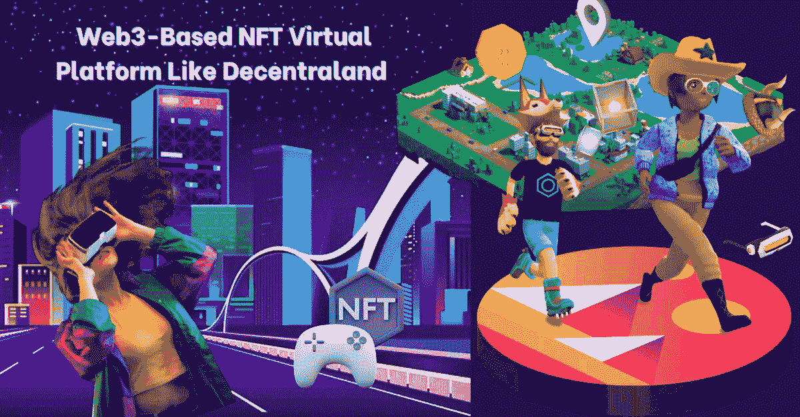
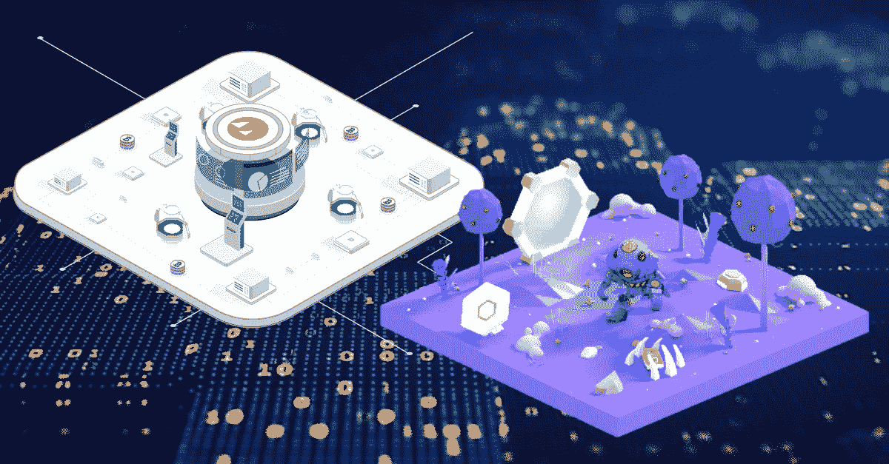
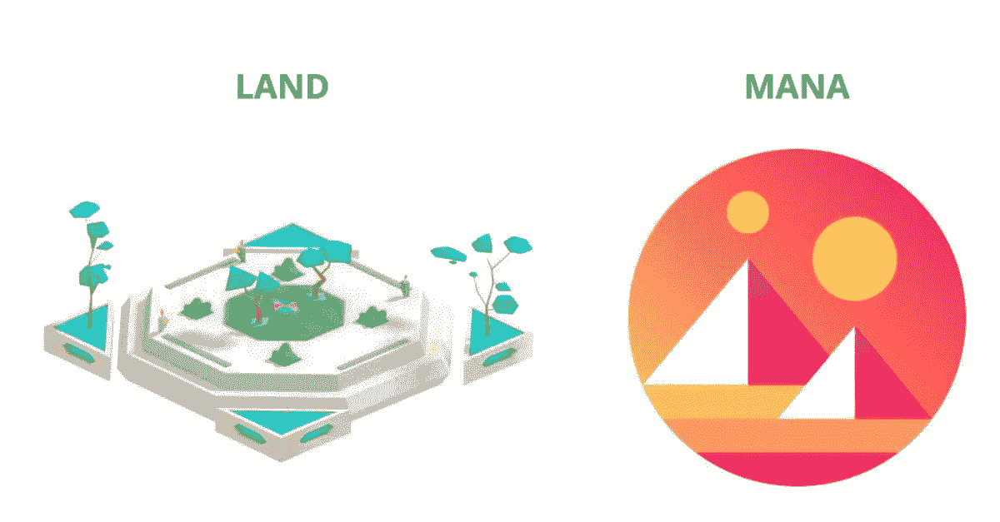

# 如何创建一个基于 Web3 的 NFT 虚拟平台，比如分散的土地？

> 原文：<https://medium.com/geekculture/how-to-create-a-web3-based-nft-virtual-platform-like-decentraland-dc9b42513985?source=collection_archive---------15----------------------->

Web3-Based NFT Virtual Platform Like Decentraland

这个世界充满了惊喜和虚拟现实，这使得人们选择数字化环境，以未来的方式赚钱。然而，有一个 NFT 平台鼓励虚拟世界的概念。当然，这是分散的。它使用下一代技术，如 3D 和虚拟现实(VR)，并于 2020 年 2 月在区块链以太坊推出。用户可以使用该平台的法力令牌购买房地产。这些代币的价值增加了，因此它是未来的一个有希望的方面。一个基于以太坊的虚拟现实平台可以在创造一个充满数字人类的世界的公司的帮助下建立起来。成为这片土地上的企业家，拥有你想要的一切。

# **什么是像分散土地这样的 NFT 虚拟平台？**

第一个分散的 3D 虚拟现实平台，分散的土地，让用户参与互动游戏和其他活动。它使用户能够购买地块来创建他们的企业。

分散土地的测试版于 2017 年推出。在那个时候，只需 20 美元就可以买到虚拟地块。然而，NFT 的流行引起了参与者数量的上升。结果，现在每个包裹的售价超过了 10 万美元。

该平台改善的用户体验和吸引人的功能(为平台用户提供实时体验)是人数大幅增加的唯一原因。分散平台允许其他知名的 NFT 公司通过建立市场和举办活动和聚会来推广他们的 NFT。使用该平台的任何人都可以通过切换到公共模式来访问市场。具有进入密码的用户可以在私人托管场景中进入房间。该平台持续收到现金流。

# **如何进行分散的土地市场开发？**

Decentraland platform Development

在公司的帮助下，分散平台中的市场可以很容易地建立起来，这些公司用无穷的功能和好处创造出最好的市场。这个平台是根据你的需求建立的，帮助你交易所有的收藏品，这些收藏品是分散土地的一大部分，可能是未来的一个重要方面。平台的成本取决于您想要整合的功能。该平台运行效率高，没有任何麻烦。

然而，分析平台的独特卖点有助于您确定其重要性和目标受众。

# **NFT 分散市场的 USP**

毫无疑问，像分散的土地这样的虚拟世界的基础是由分散的自治组织(Dao)组成的。通过点击“开始投票”按钮，个人可以对各种提案进行投票。催化剂节点、兴趣点、授权请求、提议草案和治理提议是不同类别的几个例子。

用户还将收到结果的实时更新。通过选择活动、已完成、已通过、已拒绝和已实施等选项，他们可以看到建议的状态。还提供透明仪表板。它显示了锁定在 D [电子中心和 NFT 市场](https://bit.ly/3CjBzH8)的以太币(ETH)总量的统计数据，当前的魔法令牌余额，以及获得资助的提议数量。

拥有大量法力令牌的用户对有效的提案和法规拥有重要的投票权。因此，人们可以影响土地拍卖的计划和 NFT 合同的白名单。

Native token

此外，用户可以使用他们的投票来添加可穿戴设备，改变直销和市场费用，并建议新功能。它们也可以取代安全理事会成员。

一般来说，分散自治组织(DAO)的运作将由安全顾问委员会(SAB)提供支持。它服务于许多目的，包括确保智能合约的安全性和消除 bug。

有趣的是阿拉贡为分散的克隆人提供能量。它有助于 DAO、治理管理和投资者融资的快速部署。

用户通常可以使用他们的包装法力(wMANA)令牌投票。因此，他们可以完全控制谁加入和离开去中心化自治组织(DAO)。重要的是，安全顾问委员会(SAB)成员将最终确定投票日程。

 [## 7 大元宇宙商业理念助你实现抱负！

### 目前，这个世界充满了在十年或二十年前听起来不可能的进步。没有人会…

www.blockchainappfactory.com](https://www.blockchainappfactory.com/blog/top-7-metaverse-business-ideas-that-can-garner-global-attention-in-the-future/?utm_source=geekculture&utm_medium=09-30-2022&utm_campaign=Pavun) 

## **结论**

可以建立一个虚拟现实平台，为系统带来更大的牵引力。然而，选择正确的 [NFT 市场发展公司](https://bit.ly/3CjBzH8)有助于你建立一个平台，保存来自分散世界的高评级收藏品。你也可以用代币购物。获得一个基于 Web3 的平台来执行无止境的交易。