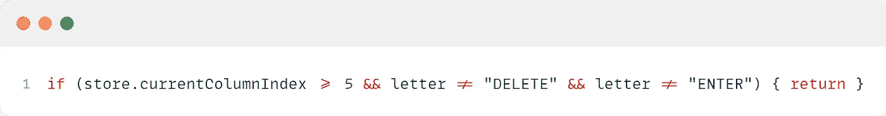
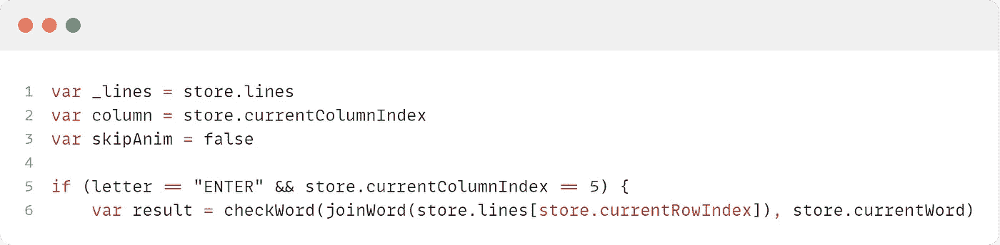
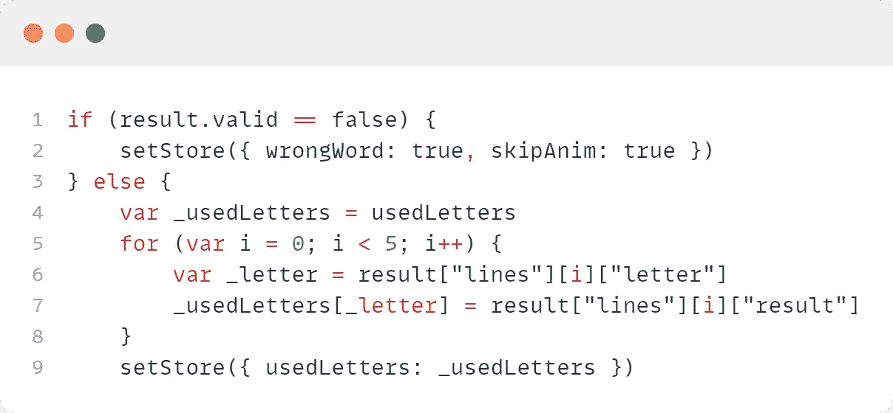
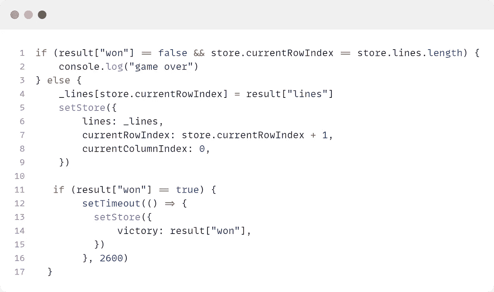
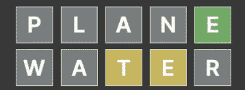
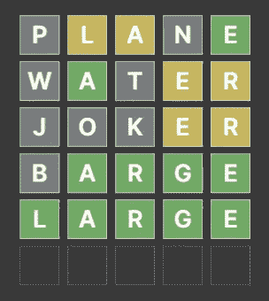

# 如何创建一个类似 Wordle 的游戏

> 原文：<https://medium.com/geekculture/how-to-create-a-wordle-like-game-add7f2794ed7?source=collection_archive---------1----------------------->

Photo by [Sincerely Media](https://unsplash.com/@sincerelymedia?utm_source=medium&utm_medium=referral) on [Unsplash](https://unsplash.com?utm_source=medium&utm_medium=referral)

首先，我要声明，这不是试图创造一个流行游戏的副本，而是探索游戏机制，激励其他创作者自己发明游戏。本指南也是我自己对这种游戏如何实现的看法(并不是试图对原游戏进行逆向工程)

> **最初的实现是有启发的，极大的执行力。
> 由**到[https://www.powerlanguage.co.uk/](https://www.powerlanguage.co.uk/)
> 
> 在这里玩原来的游戏:[https://www.powerlanguage.co.uk/wordle/](https://www.powerlanguage.co.uk/wordle/)

本指南将包括从 React 角度对游戏进行细分的以下部分:

*   字母块设置
*   键盘设置
*   主要机械师
*   将结果共享为颜色块

我将使用我最喜欢的工具 Framer(https://framer.com)构建这个原型，它在幕后使用 React。

# 字母块设置

为了创建块，我们需要为每个块配置一个 React 组件，然后为每一行配置一个。为了尽可能的动态，我们将通过一些外部数据结构来创建它们，这些数据结构在我们的游戏中会发生变化，从而确保我们的 UI 总是更新的。

我们的共享数据和模式保存在一个全局存储对象中，声明如下:

Our data and scheme for the blocks

为了创建一个块，我们使用一个 React 组件，它将包括动画、样式改变和单个字母显示的功能。

A single block we need 5x6 of these ;)

如你所见，我们使用了 Framer 的自定义组件`motion.div`，它只不过是一个`framer motion`组件。如果你愿意，你可以把它换成普通的`div`。除此之外，React 组件处理显示单词结果时的`flip`动画和背景变化，以及用字母填充块时的放大动画

接下来，让我们看看如何创建一行这样的块:

A single row of 5 blocks

如你所见，我们遍历了一个数组`rowData`参数，并为每个条目创建了一个`Block`。

这些`rowData`来自这个定义:

Blocks factory

在这里，我们使用`store.lines`集合来获取块的最新数据集，然后我们传递每个数组来创建一行块。

现在我们已经有了我们的阻塞机制，我们可以继续将数据像字母一样传递给数据集，以便让机制运行起来。

为此，我们需要创建一个虚拟键盘。

# 键盘设置

与之前相同的技术，我们实现了一个定制组件，它用字母呈现三行

A nice keyboard layout

*注意，当“键”是* `*DELETE*` *时，我们渲染一个 SVG 图标而不是文本。*

这里有趣的部分发生在`onTap`函数上，该函数然后开始检查游戏的状态，如果输入的单词完成了和/或如果单词是正确的，它就将结果作为状态变化发布到`globalStore`中，以便像`Block`组件这样的其他组件可以拾取它们并重建显示新的状态。

把条件句一个一个地分解开来:

guard against overflow

这里我们检查我们是否在最后一列(5)并且按下的字母不是`Enter`键或`Delete`键，如果是，我们就返回并且不做任何防止溢出的事情。

然后，我们将一些起始值赋给变量，并检查单词是否有效/正确:

checking if word is valid

然后我们用输入的字母填充`globalStore`当前行

if the word is a valid English word we store the letters

在最后一步中，我们检查是否在最后一行，以及所有字母是否正确并位于正确的位置:

if we are on the final row the user has either won or not

当然，如果我们没有核心机制来检查单词，以上的一切都是不可能的。

# 机械师

核心机制是这样的:

正如里面的评论所描述的，我们所做的是首先对照一个大的英语单词词典来检查我们的单词，如果这个单词是一个有效的英语单词，我们就继续对照我们选择的单词来检查它的单个字母。

首先，我们迭代并对照`i`定位的**目标字母**检查`i`定位的**用户提供的字母**，如果它们相同，我们将该位置保存为`correct`，并继续下一个`i`，因为该位置已经被覆盖。
如果它们不匹配，我们进入另一个循环，在那里我们用**目标单词**上的其他字母检查`i`，如果它至少匹配一个，我们将第二个循环位置`j`保存为`present`，因为该字母确实存在于我们的目标单词中，但它不在正确的位置上(在用户提供的单词上)。
如果这些都不成立，我们将`i`位置设置为`absent`。

根据`globalStore`数据和`lines`集合，设置所有位置并更新块后，我们得到如下结果。

trying our the mechanic

# 彩色积木

这款游戏之所以非常受欢迎，是因为它能够在社交媒体上以彩色盒子的形式分享每个玩家的试错“历史”。这是通过创建一串类似表情符号的字符放在一起作为字母的结果来实现的(⬜代表缺席，🟨代表出席，🟩代表正确)

为了创造这样的结果，我们再次依赖于存储在`globalStore.lines`下的核心数据

遍历我们的`globalStrore.lines`结果，并将每个结果的`box`字符存储在`text`字符串中。

对于像下面这样的游戏:

Gameplay result

给了我们这样一个结果:

⬜🟨🟨⬜🟩
⬜🟩⬜🟨🟨
⬜⬜⬜🟨🟨
⬜🟩🟩🟩🟩
🟩🟩🟩🟩🟩

# 最后的想法

我想再次表达我对这类社交游戏的极度迷恋，因为文字游戏是我最喜欢的游戏之一。所以真诚地祝贺 [**powerlanguage**](https://www.powerlanguage.co.uk/) 想出了它。

我希望你喜欢这个教程，如果你需要进一步的帮助，请随时给我写信。你也可以在框架不和谐(MDobs)上找到我

> 可以在这里播放/混音我的版本:[https://www . framer . com/showcase/project/538 EBR 3 itbxmcnk 7d 3 iw/](https://framer.com/projects/new?duplicate=ohWlDSwQiH9pXqGIbxfk&via=netgfx)

尽情享受吧！