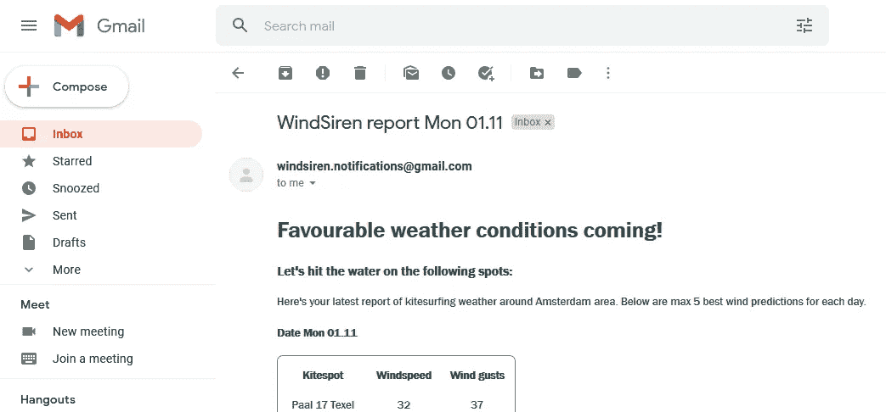
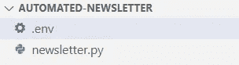
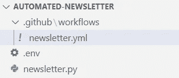
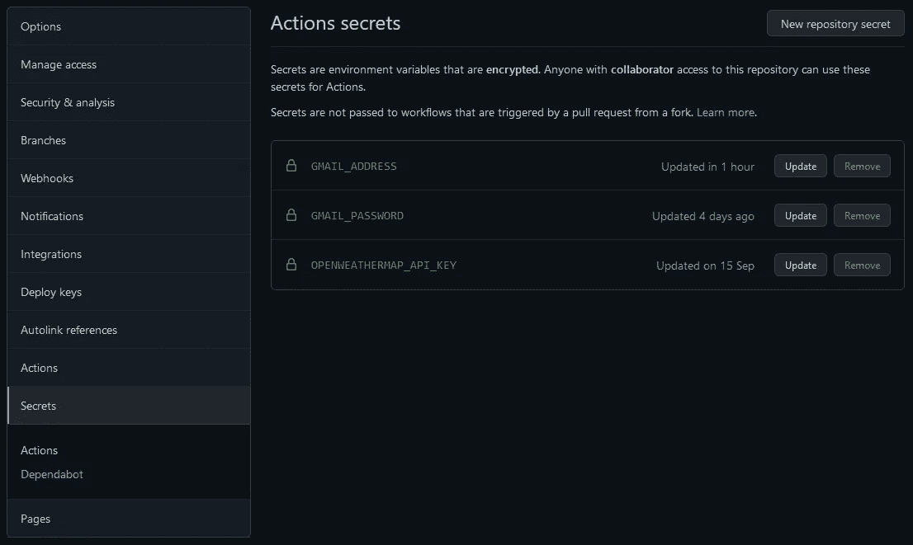
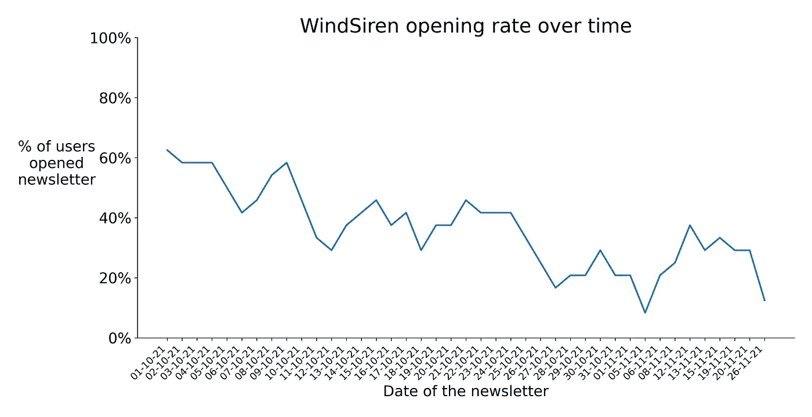

# 我们如何免费创建完全自动化的时事通讯

> 原文：<https://medium.com/geekculture/how-to-create-an-automated-newsletter-for-free-7522c5646b50?source=collection_archive---------8----------------------->

## 构建自动化时事通讯

## 你也可以

本教程涵盖了如何开始一个免费的自动化通讯。要继续下去，你需要一个 Github 帐户和 Python 和 Git 的基础知识。

我不想创建一个枯燥的代码列表，所以我把这个教程包装成一个真实的故事，是关于我和我的朋友 Joris 最近开始的一个风筝冲浪时事通讯。这也让我们对为什么这些特定的技术包含在本教程中有了一点了解。让我们开始吧。

This tutorial covers how Github Actions, Python, and Gmail can be combined to create a free automated newsletter.

“WindSiren”，Joris 开始说，“一个应用程序，当预报你附近有好的风筝冲浪天气时，它会给你一个通知。我想让我们建造它，你参加吗？”

我确实喜欢这个概念。它解决了一个特定的问题，很容易复制到其他运动中，很容易实现自动化，并且可以通过几种不同的方式实现货币化。

但是，构建一个移动应用程序需要大量的前期编码工作，发布一个需要很多麻烦。**没门。**我们需要更简单的东西。

# 选择创建简讯

基本上，我们只需要在天气条件好的时候向用户发送通知。没有手机应用我们也能做到这一点。

在考虑了几个不同的通知选项后，我们出于几个原因选择了电子邮件:基本上，每个人都有一个电子邮件帐户(然而，例如在 [WhatsApp 上，情况就不再是这样了](https://www.theguardian.com/technology/2021/jan/24/whatsapp-loses-millions-of-users-after-terms-update))。通过代码发送电子邮件很容易(短信不会这么简单)。此外，还可以跟踪有多少用户打开了我们的时事通讯(我们最终做到了——但这是为了以后的文章)。

要发送电子邮件，需要一个电子邮件提供商。我们选择了 Gmail，主要是因为我们熟悉它，但也因为它是免费的，允许我们每天在 T4 发送 500 封电子邮件。

自动访问 Gmail 需要 Gmail 网站以外的登录方式。为了快速测试，我们决定启用“[不太安全的应用程序](https://myaccount.google.com/u/2/lesssecureapps)”登录选项，允许我们的脚本使用电子邮件地址和密码登录 Gmail 帐户——但随着时间的推移，我们从未放弃这一选项。

如果你要开始一个时事通讯，**一定要创建一个新的电子邮件帐户**——你使用的电子邮件地址可能会出现在垃圾邮件列表中。我们不希望你的个人账户出现这种情况。

## 设置时事通讯就绪 Gmail 帐户的步骤

1 创建新的 Gmail 帐户。该帐户将成为您未来简讯的“发件人”。

2 点击[此链接](https://myaccount.google.com/u/2/lesssecureapps)为 Gmail 帐户启用“不太安全的应用程序”登录。

*此选项允许任何带有您的电子邮件地址和密码的脚本登录您的帐户。不过只要不跟任何人分享密码，应该是相对安全的。*

# 从 Python 发送电子邮件

对于我们的简讯，我们获取了阿姆斯特丹地区(我们位于荷兰)的天气预报，并在下周天气状况良好时发送电子邮件。

这个过程我们希望使用代码完全自动化。

因为 Python 是我的首选语言，它可以获取天气预报，发送电子邮件，并且受 *Github Actions* 支持(稍后会有更多介绍)，所以我们选择它作为我们的脚本语言。

简而言之，我们使用 Python 字符串生成了一封 HTML 电子邮件(让它看起来更像✨)和一封基于文本的后备电子邮件(并不是所有的电子邮件阅读器都显示 HTML)。然后，使用 Gmail 地址和密码，我们认证 Python 的 *smtplib-* 库来使用我们的 Gmail 帐户。最后，我们循环所有订户的电子邮件地址，并将新生成的电子邮件发送给每个人。

WindSiren newsletter delivered on 1st of November. Quite minimal, but functional.

用 Python 字符串编辑电子邮件很快就变得乏味了。我们改用[*jinja 2*](https://jinja.palletsprojects.com/en/3.0.x/)*模板，这大大改善了这种情况。但是使用 Python 字符串要容易得多，所以在这里我将坚持使用它们。*

## *使用 Python 发送电子邮件的步骤*

*1 创建一个新的 Python 脚本和名为*的文件。env* 在你的项目文件夹中。*

**

*Visual Studio Code’s view of the project folder (called automated-newsletter) after creating .env and newsletter.py files.*

*2 使用下面的格式，将新的 Gmail 电子邮件地址和密码添加到。环境文件。*

*Example content of the .env-file. Do change the address and password to match your new Gmail account.*

*拥有 Gmail 证书。env-file 允许您方便地从您的计算机上运行电子邮件脚本。但是 ***不要*** *将这个文件添加到 Git 中——任何有权访问您的存储库的人都可以读取它*。*

*3 运行`pip install python-dotenv`安装 *load_dotenv* 库*

*4 使用 load_dotenv 从加载您的 Gmail 凭据。env-file 到 Python 脚本。*

*Loading environmental variables to Python script.*

*很方便的是，os.getenv 也加载了 Github 秘密——我们很快就会用到它们。*

*5 创建(HTML)电子邮件。*

*6 将你的 Gmail 凭证传递给 smtplib，登录 Gmail 的 SMTP**(S**imple**M**ail**T**transfer**P**rotocol)服务器，发送邮件。*

**最好首先将电子邮件发送给自己，A:查看电子邮件看起来是否正常，B:查看电子邮件是否被标记为垃圾邮件——这种情况最初发生在我们身上，但单击“* ***【标记为非垃圾邮件】*** *”解决了这种情况，我们从此可以在收件箱中保持一致。**

*下面是完整的 Python 脚本**,它加载 Gmail 凭证，构造电子邮件，并向订阅者发送时事通讯。***

*Python script for constructing and sending the email. Change the email **alternative** and **content** to your content, and add subscriber emails to the ***subscriber_email_addresses*** list.*

# *自动发送电子邮件*

*因为我们希望项目造成的压力越小越好，所以我们希望我们的简讯脚本可以每天运行，而不用动一根手指。因此，我们求助于 *Github 行动*。*

*[Github Actions](https://github.com/features/actions) 是开发者自动测试和发布代码的工具。它们可以用来执行复杂且几乎任意的脚本，对我们来说重要的是，它们可以被配置成在设定的时间定期运行。该工具对公共存储库是免费的，私有存储库每月获得 2000 分钟的免费运行时间。这足以生成和发送每日简讯。*

*每天早上 7:15 左右，我们的 Github 动作工作流醒来，并从我们的 Github 库签出我们的最新代码。它安装必要的需求并运行一个 Python 脚本，获取天气预报并将其消化成一个风筝冲浪时事通讯。*

*留给我的唯一事情是检查我的个人电子邮件，看工作流程中是否有任何失败。但是，在初始设置后，没有任何。见鬼，当 Github Actions 管理我们的项目时，我甚至在没有笔记本电脑的情况下进行了为期 3 周的旅行。真的让我很欣赏自动化。*

## *新闻稿自动化的步骤*

*1 创建文件夹*。github* 在你的项目文件夹的根目录下。在里面。github-folder 创建另一个名为 *workflows* 的文件夹，在里面创建一个名为 *newsletter.yml* 的新文件。*

**

*Visual Studio Code’s view of the project folder after creating newsletter.yml.*

**这个。这个特定文件夹中的 yml 文件存储了运行 Github 操作的指令。**

*2 将下面的工作流复制到 newsletter.yml，或者按照 [Github 的文档](https://docs.github.com/en/actions/learn-github-actions/events-that-trigger-workflows#scheduled-events)创建一个 cron 触发的工作流。将 newsletter.yml 提交到您的 Git。*

*3 在 Github 存储库的设置中，进入“秘密”,将你的 Gmail 邮箱地址和密码添加为秘密。秘密的名称**需要与您在 Python 脚本中使用 *os.getenv*** 加载的变量名相匹配。*

**

*Here’s our secrets page. Yes, we use [OpenWeatherMap API](https://openweathermap.org/api) for fetching the weather reports. We had a good experience with their API.*

**将您的凭证存储在这里是安全的，因为您只能看到机密的名称，而不能看到存储在机密中的值。**

*4 将你的项目文件夹推送到你的 Github 库。*

*瞧，你已经设置好了一份自动化的时事通讯。*

# *我们的时事通讯怎么了？*

*我们希望在这个项目中实现数据驱动，所以我们决定跟踪有多少人打开了我们的时事通讯。我们创建了一个定制的解决方案来跟踪订阅者打开我们的时事通讯的频率。这就是我们开始积累一些“费用”的地方(嗯，谷歌云平台给你 300 美元的试用信用，所以不是真正的“费用”🤷‍♂️).*

**

*The percentage of users that opened the daily newsletter, with a rather clear downwards trend. Do people kitesurf in November? I don’t know, but I’d rather not spam the mailbox of our subscribers.*

*通过跟踪打开率，我们了解到越来越少的用户打开我们的简讯，由于我们的跟踪解决方案每月花费约 50 美元，被动收入的梦想并没有通过这个项目完全实现。所以至少在明年夏天之前，我们的时事通讯会处于冬眠状态。*