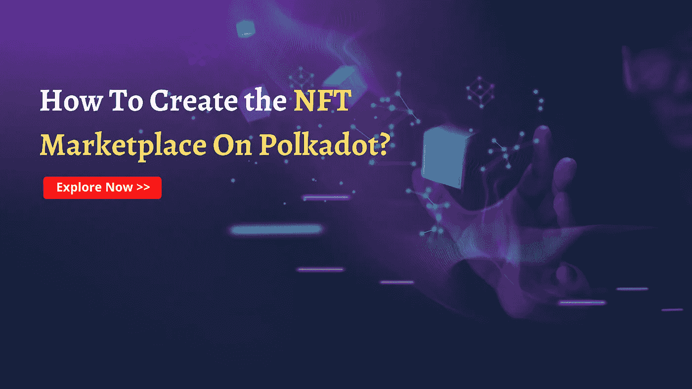

# 如何在 Polkadot 网络上创建 NFT 市场？

> 原文：<https://medium.com/geekculture/how-to-create-an-nft-marketplace-on-polkadot-network-9c761727e2c?source=collection_archive---------14----------------------->

## 看看这个……..！愉快的商业想法

你有办法提高你的商业收入吗？不用再等了！这是你的时间。你想每月赚几十亿美元吗？这篇文章应该有助于使你的 NFT 市场业务取得成功。

## 波尔卡多 NFT 市场开发

在波尔卡多特区块链创建 NFT 市场的整个技术过程，重点是跨链兼容性和大量高度安全和用户友好的功能，被称为 [**波尔卡多特 NFT 市场开发**](https://www.cryptocurrencyscript.com/nft-marketplace-development) 。

以太坊过度计算能量使用的可行替代品是 Polkadot。它是完全分散的、兼容的和可扩展的。让我们更详细地研究一下 NFT 市场如何帮助波尔卡多区块链网络。可以使用 Polkadot 协议在区块链系统之间传输数据，这也为构建用于异构分片、适应性和透明性的 DeFi 基础设施提供了环境。

得益于 Polkadot，早期网络中存在的一次处理一个交易的瓶颈不复存在，Polkadot 是一种分片的多链网络，可以管理许多链上的同时交易。Polkadot 鼓励可伸缩性，并为增加采用和未来扩展创造了理想的条件。因为它使用并行处理。连接到 Polkadot 的分片链被称为副链，因为它们在网络上并发运行。

## 波尔卡多 NFT 市场:

通过为 Polkadot 提供平台，NFT 正在连接到 Polkadot 网络，使数字内容供应商更容易完成他们的任务。它为数字艺术家提供了一个分散的平台来展示他们的稀有珠宝。对于那些在未来几年加入 NFT 市场的人，金恩已经宣布开发 Efinity，这是一个区块链的波尔卡多 NFT 市场，预计将提供增强的可扩展性。Polkadot 市场的区块链平台规范显示，每六秒钟处理一次交易。该平台的设计者将采用股权证明来支持每秒 1000 笔交易。

波尔卡多特区块链的 NFt 市场旨在充当波尔卡多特网络的副链，解决先前平台的一些最重要的缺点。

## 波尔卡多特的特点:

Polkadot 为平滑的 DeFi 基础设施事务提供了许多属性。

**异种切片**

异构分片方法允许 Polkadot 在单个网络中将多个链连接在一起。并行数据分离减少了链上的负载，使它们能够更快地执行交易，并在它们之间安全地发送数据。

**透明治理**

在由点持有者管理的 Polkadot 网络中，为了改进 Polkadot 协议，各种想法被提出并投票表决。

**可扩展性**

借助于并行处理方法，消除了顺序事务问题。这个网络试图结合一个嵌套的中继链，以增加网络中碎片的数量。更大的碎片数使网络能够并行处理数据。

**跨链兼容性**

跨链通信使碎片能够与外部网络进行交互、交换和共享功能。

**可升级性**

Polkadot 的透明链上治理机制管理和支持区块链系统的能力，无需链叉即可自我增长。基于结果算法，波尔卡多特系统随着技术进步而发展。

## 波尔卡多特区块链发展的特点

**多样化切割**

由于其分片功能，Polkadot 可以加入多个区块链网络。工作量的减少和数据处理链的支持使得更快的数据共享成为可能。

**可靠性**

典型事务的困难将在并行模型的帮助下得以克服。为了增强网络碎片，它的愿景需要分层中继链。

**前进**

由于平台开放的链上治理，没有链上人员的参与，网络可以前进。该项目根据不断发展的技术环境进行了调整。

**看透治理**

智能治理工具管理 Polkadot 的跨链通信。治理令牌的所有者提出想法，并通过投票决定如何推进系统。

## 为什么 Polkadot 是建立 NFT 白牌市场的伟大的 NFT 市场平台？

**顶级共识机制**

利害关系证明正在取代工作证明(POW)成为以太坊的共识算法(PoS)。Polkadot 以类似的方式利用基于 Ghost 的递归祖先派生前缀协议(爷爷)。现有的一致方法促进了新块的即时生产。现有的一致方法促进了新块的即时生产。因此，该系统更安全、更有弹性。

**链上治理选项**

分散的波尔卡多特区块链网络就是一个很好的例子。每个投资者都有投票和决策的能力。因此，它保证了争议的快速解决和平台的开放性。在波尔卡多特上，有许多副链导致了更大的独立性。对各种想法的投票可以用点原生令牌来完成。

**并行线程**

作为一个企业主，经济有效的商业实践可以使你受益。Parathreads 利用了现收现付的方法。链不需要总是连接到 Polkadot 网络。

**出现几条铁链**

公司的日常运营通过 Polkadot 平台成功管理。物联网、文件存储、投资组合管理、身份管理链、智能合约、零知识隐私链都包含在内。

Polkadot 的一些好处包括比特币和莱特币之间的直接桥梁，以太坊智能合约交互的简单选项，实时访问链外数据，以及快速通信。

**在波尔卡多经营的一些著名的 NFT 市场**

*   XENO NFT 中心提供多种交易服务
*   NFT 市场与跨链生态系统相结合
*   XPOP 是最好的去中心化娱乐平台之一

## 为什么 zodeak 要发展 NFT 市场？

许多总部设在区块链的公司都是在 NFT 市场发展公司 Zodeak 的帮助下成立的。由于经验和对区块链技术的热情，比特币行业增长的可靠解决方案现在已经成为可能。

波尔卡多特 NFT 市场开发只是我们可以开发的顶级区块链之一；在 Zodeak，我们还为区块链的**NFT 市场开发提供最佳解决方案，如 polygon、polkadot、币安智能链、以太坊、Flow Network。**